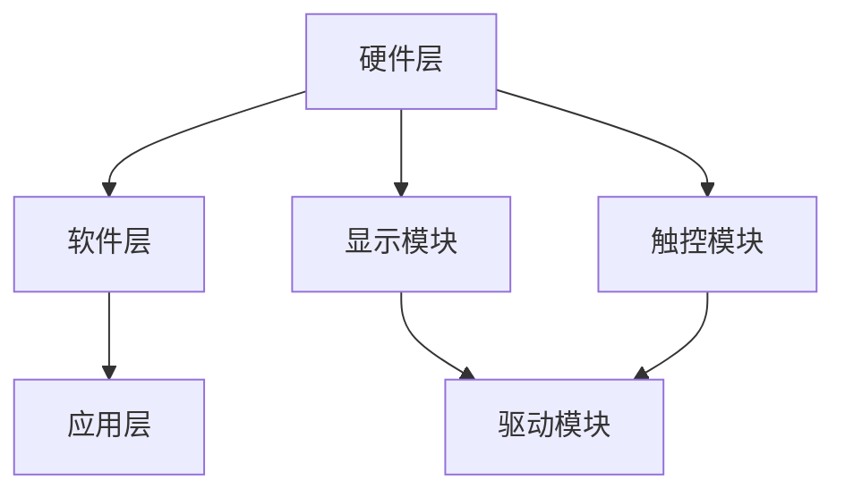
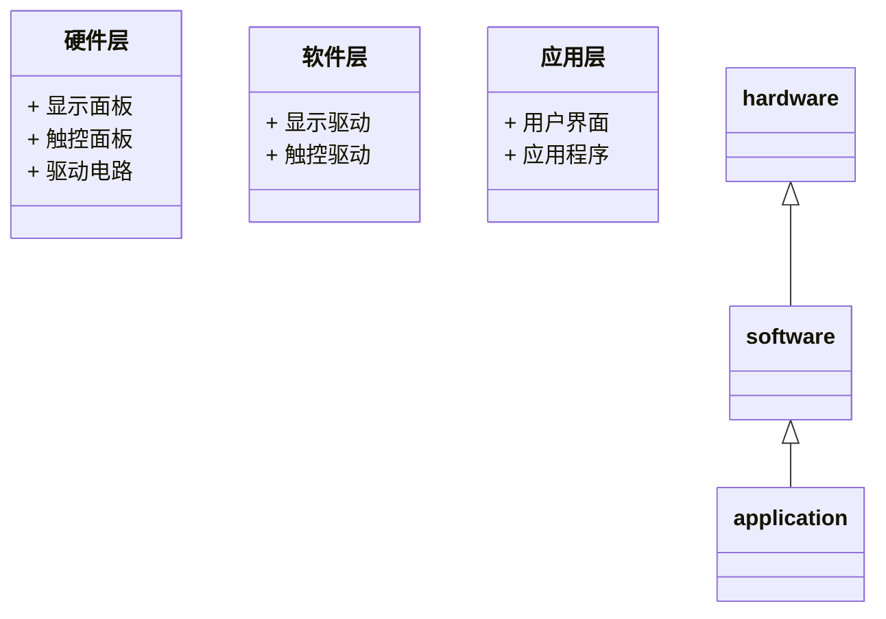
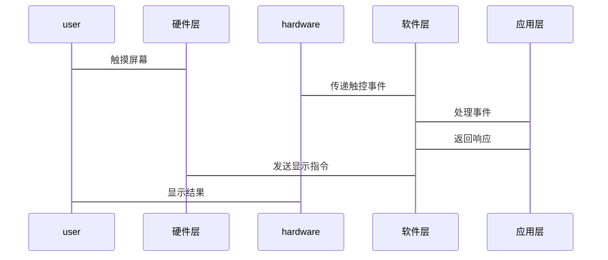

                 

# 价值投资中的下一代柔性显示技术前景

## 关键词：
- 价值投资
- 柔性显示技术
- 市场前景
- 技术分析
- 价值评估

## 摘要：
本文探讨了下一代柔性显示技术的市场前景及其在价值投资中的应用。通过分析柔性显示技术的核心原理、市场趋势和投资机会，结合价值投资的基本原理和方法，为投资者提供科学的决策依据。文章详细阐述了柔性显示技术的系统架构设计和投资分析方法，通过实际案例分析，帮助读者更好地理解如何在柔性显示技术领域进行价值投资。

---

## 第一部分: 背景介绍

### 第1章: 柔性显示技术的发展现状

#### 1.1 柔性显示技术的定义与特点
##### 1.1.1 柔性显示技术的定义
柔性显示技术是一种基于柔性基板的显示技术，能够实现弯曲、折叠甚至卷曲的显示效果。与传统的刚性显示技术相比，柔性显示技术具有更高的柔韧性和更低的成本。

##### 1.1.2 柔性显示技术的核心特点
- **柔韧性**：能够适应多种形状和尺寸。
- **轻薄性**：相比传统显示技术，柔性显示技术更轻薄，适合便携设备。
- **耐用性**：柔性材料更耐用，抗摔性能更强。
- **可扩展性**：可以应用于多种场景，如手机、平板、智能手表等。

##### 1.1.3 柔性显示技术的优缺点对比
| 特性         | 优点                 | 缺点                 |
|--------------|----------------------|----------------------|
| 柔韧性       | 可弯曲、折叠           | 易受物理损伤         |
| 轻薄性       | 适合便携设备         | 制造工艺复杂         |
| 耐用性       | 抗摔性能强           | 成本较高             |

#### 1.2 柔性显示技术的市场发展趋势
##### 1.2.1 全球柔性显示技术的市场规模
根据市场研究，2023年全球柔性显示技术市场规模约为1000亿美元，预计到2030年将增长至3000亿美元。

##### 1.2.2 主要应用领域分析
- **智能手机**：柔性OLED屏幕已成为高端智能手机的主流配置。
- **可穿戴设备**：柔性显示技术在智能手表、健康手环等设备中广泛应用。
- **折叠屏手机**：柔性显示技术是折叠屏手机的核心技术。
- **车载显示**：柔性显示技术在汽车仪表盘和中控屏中的应用逐渐增多。

##### 1.2.3 市场驱动因素与挑战
- **驱动因素**：
  - 技术进步：柔性显示技术的制造工艺不断优化。
  - 市场需求：消费者对轻薄、耐用设备的需求增加。
- **挑战**：
  - 技术瓶颈：柔性显示技术的制造成本较高。
  - 竞争激烈：主要厂商如三星、LG、京东方等竞争激烈。

### 第2章: 柔性显示技术的核心原理

#### 2.1 柔性显示技术的材料与工艺
##### 2.1.1 柔性显示材料的选择与特性
- **柔性基板**：通常采用聚酰亚胺（PI）材料，具有良好的柔韧性和耐高温性。
- **OLED材料**：包括有机发光层、阴极、阳极等，具有高亮度和低功耗的特点。

##### 2.1.2 柔性显示工艺流程详解
1. 柔性基板制备
2. OLED蒸镀
3. 金属导电层沉积
4. 封装层制备
5. 最终测试

##### 2.1.3 关键技术节点分析
- **蒸镀工艺**：OLED蒸镀是柔性显示技术的核心工艺，决定了屏幕的显示效果。
- **封装技术**：封装层的制备是保证屏幕耐用性的关键步骤。

#### 2.2 柔性显示技术的关键设备
##### 2.2.1 柔性显示设备的分类
- **蒸镀设备**：如Tokki、Applied Materials等。
- **封装设备**：如ASM、K&S等。
- **测试设备**：如KLA、泰瑞达等。

##### 2.2.2 主要设备的技术参数对比
| 设备类型   | 主要参数                   | 技术特点               |
|------------|---------------------------|-----------------------|
| 蒸镀设备   | 蒸镀精度：±1微米           | 高精度、高稳定性       |
| 封装设备   | 封装效率：90%以上          | 高自动化、高可靠性       |
| 测试设备   | 测试速度：每小时测试500片 | 高灵敏度、高准确性       |

##### 2.2.3 设备选型与成本分析
- 设备选型需考虑技术参数、成本和维护费用。
- 高端设备如Tokki蒸镀设备成本较高，但性能稳定，适合大规模生产。

---

## 第二部分: 价值投资的核心原理与方法

### 第3章: 价值投资的基本原理

#### 3.1 价值投资的定义与核心理念
##### 3.1.1 价值投资的定义
价值投资是一种投资策略，强调以低于内在价值的价格购买优质资产。

##### 3.1.2 价值投资的核心理念
- **安全边际**：买入价格低于内在价值。
- **长期持有**：选择具备持续竞争优势的企业长期持有。

##### 3.1.3 价值投资与其它投资策略的对比
| 策略类型   | 核心理念                     | 适用场景               |
|------------|------------------------------|------------------------|
| 价值投资   | 以低于内在价值的价格买入     | 稳定增长的成熟企业       |
| 技术分析   | 通过技术指标预测价格走势     | 短期价格波动分析         |
| 成长投资   | 投资于高成长性企业             | 高成长行业的新兴企业     |

#### 3.2 价值投资的基本方法
##### 3.2.1 财务分析法
- **市盈率（P/E）**：股价与每股收益的比率。
- **市净率（P/B）**：股价与每股净资产的比率。
- **股息率**：每股股息与股价的比率。

##### 3.2.2 市场分析法
- **行业分析**：分析柔性显示技术所处行业的市场规模、竞争格局。
- **宏观经济分析**：考虑宏观经济对行业的影响。

##### 3.2.3 行业分析法
- **行业生命周期**：柔性显示技术处于成长期，具备较大的增长潜力。
- **行业竞争格局**：主要厂商如三星、LG、京东方等竞争激烈。

### 第4章: 价值投资在柔性显示技术领域的应用

#### 4.1 柔性显示技术领域的投资机会
##### 4.1.1 上游材料的投资机会
- **OLED材料**：如发光材料、导电材料等，需求量大，技术门槛高。
- **柔性基板材料**：如聚酰亚胺，需求稳定。

##### 4.1.2 中游制造的投资机会
- **柔性显示面板制造**：如三星、LG等企业具备技术优势。
- **设备制造**：如Tokki、Applied Materials等设备供应商。

##### 4.1.3 下游应用的投资机会
- **智能手机**：如苹果、三星等品牌对柔性显示技术的需求持续增长。
- **可穿戴设备**：如智能手表、健康手环等设备对柔性显示技术的需求增加。

#### 4.2 柔性显示技术领域的投资风险
##### 4.2.1 技术风险
- **技术更新**：柔性显示技术更新换代快，企业需持续投入研发。
- **技术瓶颈**：部分关键工艺技术依赖进口，存在技术风险。

##### 4.2.2 市场风险
- **市场竞争**：柔性显示技术领域竞争激烈，价格压力大。
- **市场波动**：宏观经济波动可能影响市场需求。

##### 4.2.3 财务风险
- **成本控制**：柔性显示技术的制造成本较高，影响企业盈利。
- **财务稳定性**：企业需具备较强的财务实力应对市场波动。

---

## 第三部分: 柔性显示技术的系统分析与架构设计

### 第5章: 柔性显示技术的系统分析

#### 5.1 柔性显示技术的系统架构
##### 5.1.1 系统架构的层次划分
- **硬件层**：柔性显示面板、驱动电路等。
- **软件层**：显示驱动软件、控制系统等。
- **应用层**：用户界面、应用程序等。

##### 5.1.2 各层次之间的关系
- 硬件层为软件层提供显示支持。
- 软件层为应用层提供控制接口。
- 应用层为用户提供最终的显示效果。

##### 5.1.3 系统架构的优缺点
| 优点         | 缺点                     |
|--------------|--------------------------|
| 结构清晰       | 开发周期较长             |
| 维护方便       | 成本较高                 |

#### 5.2 柔性显示技术的系统功能设计
##### 5.2.1 系统功能模块划分
- **显示模块**：实现屏幕的显示功能。
- **触控模块**：实现屏幕的触控功能。
- **驱动模块**：控制屏幕的显示和触控功能。

##### 5.2.2 功能模块之间的交互关系
- 显示模块接收驱动模块的指令，实现屏幕显示。
- 触控模块接收用户的输入，反馈给驱动模块。

##### 5.2.3 功能模块的实现方式
- 显示模块采用OLED技术，实现高亮度和低功耗。
- 触控模块采用电容式触摸技术，实现高灵敏度。

### 第6章: 柔性显示技术的系统架构设计

#### 6.1 系统架构设计的原则
##### 6.1.1 可扩展性原则
- 系统架构应具备良好的扩展性，方便后续功能的增加。
##### 6.1.2 可维护性原则
- 系统架构应便于维护和升级。
##### 6.1.3 可测试性原则
- 系统架构应便于测试，确保系统的稳定性和可靠性。

#### 6.2 系统架构设计
##### 6.2.1 系统架构图

##### 6.2.2 系统功能模块类图

##### 6.2.3 系统交互序列图

---

## 第四部分: 项目实战

### 第7章: 系统分析与架构设计方案

#### 7.1 项目介绍
- **项目目标**：设计一款基于柔性显示技术的智能手表。
- **项目需求**：实现屏幕的弯曲、触控功能，具备长续航能力。

#### 7.2 系统功能设计
##### 7.2.1 功能模块划分
- **显示模块**：实现屏幕的弯曲显示。
- **触控模块**：实现屏幕的弯曲触控。
- **驱动模块**：控制屏幕的显示和触控功能。

##### 7.2.2 功能模块的实现方式
- **显示模块**：采用柔性OLED屏幕，实现弯曲显示。
- **触控模块**：采用柔性电容式触摸屏，实现弯曲触控。
- **驱动模块**：采用低功耗的微控制器，控制屏幕的显示和触控功能。

#### 7.3 系统架构设计
##### 7.3.1 系统架构图

##### 7.3.2 系统功能模块类图

#### 7.4 系统接口设计
##### 7.4.1 系统接口
- **显示接口**：如SPI、I2C等。
- **触控接口**：如I2C、GPIO等。

##### 7.4.2 接口协议
- **显示协议**：如MIPI、LVDS等。
- **触控协议**：如I2C、SPI等。

#### 7.5 系统交互设计
##### 7.5.1 系统交互序列图

---

## 第五部分: 最佳实践

### 第8章: 价值投资中的柔性显示技术投资策略

#### 8.1 投资策略
- **长期持有**：选择具有持续竞争优势的企业。
- **分散投资**：避免过度集中，降低风险。

#### 8.2 投资组合优化
- **资产配置**：根据风险承受能力配置不同资产。
- **定期 rebalancing**：定期调整投资组合，确保符合投资目标。

#### 8.3 风险管理
- **止损策略**：设置止损点，避免亏损过大。
- **分散投资**：通过投资不同类型的资产降低风险。

---

## 第六部分: 总结与展望

### 第9章: 总结

#### 9.1 文章总结
本文详细探讨了柔性显示技术的市场前景及其在价值投资中的应用。通过分析柔性显示技术的核心原理、市场趋势和投资机会，结合价值投资的基本原理和方法，为投资者提供了科学的决策依据。

#### 9.2 投资建议
- **关注技术创新**：投资具备技术优势的企业。
- **关注成本控制**：选择具备成本优势的企业。
- **关注市场需求**：投资符合市场需求的领域。

### 第10章: 展望

#### 10.1 柔性显示技术的未来发展趋势
- **技术进步**：柔性显示技术的制造工艺将不断优化。
- **市场需求**：随着可穿戴设备和折叠屏手机的普及，柔性显示技术的市场需求将不断增加。

#### 10.2 价值投资的未来发展方向
- **技术驱动投资**：投资者将更加关注技术创新对企业价值的影响。
- **长期投资**：价值投资将更加注重长期的可持续发展。

---

## 关键词：
- 价值投资
- 柔性显示技术
- 市场前景
- 技术分析
- 价值评估

## 摘要：
本文探讨了下一代柔性显示技术的市场前景及其在价值投资中的应用。通过分析柔性显示技术的核心原理、市场趋势和投资机会，结合价值投资的基本原理和方法，为投资者提供科学的决策依据。文章详细阐述了柔性显示技术的系统架构设计和投资分析方法，通过实际案例分析，帮助读者更好地理解如何在柔性显示技术领域进行价值投资。

---

以上是《价值投资中的下一代柔性显示技术前景》的详细内容，涵盖了从背景介绍到系统设计，再到投资策略的全面分析。希望对您有所帮助！

