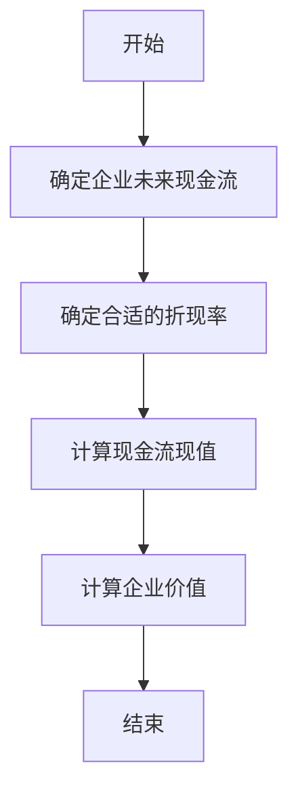
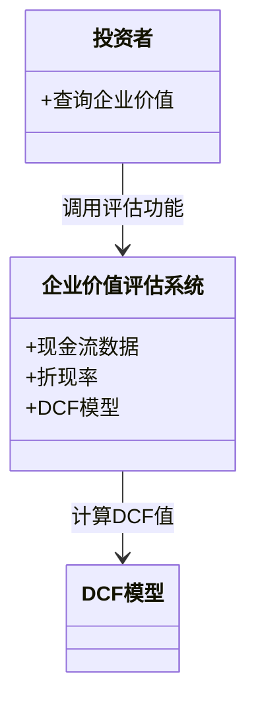
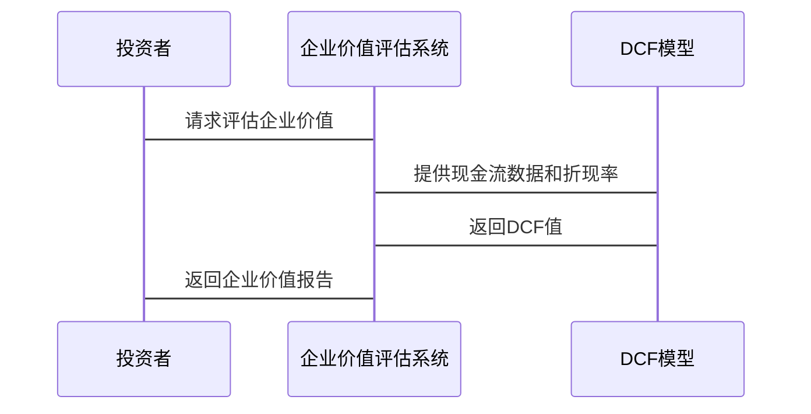

                 


# 价值投资中的产业互联网机遇

## 关键词：价值投资、产业互联网、商业模式、估值模型、DCF模型、系统架构

## 摘要：  
本文深入探讨了价值投资与产业互联网的结合，分析了产业互联网的商业模式、价值评估方法以及算法原理。通过DCF模型、系统架构设计和项目实战，详细解析了产业互联网的投资机遇，为投资者提供了科学的决策依据。

---

## 第1章：价值投资的基本理论

### 1.1 价值投资的核心概念

#### 1.1.1 价值投资的定义与起源  
价值投资是一种以企业内在价值为基础的投资策略，由本杰明·格雷厄姆和戴维·多德提出，强调以低于内在价值的价格买入优质企业。  

#### 1.1.2 价值投资的核心理念  
- 企业价值：企业未来现金流的现值。  
- 安全边际：买入价格低于内在价值，确保投资的安全性。  

#### 1.1.3 价值投资与产业互联网的结合  
产业互联网的崛起为价值投资提供了新的机遇，通过分析产业互联网企业的商业模式和财务数据，投资者可以找到具有长期增长潜力的企业。  

### 1.2 产业互联网的定义与现状

#### 1.2.1 产业互联网的定义  
产业互联网是指将互联网技术应用于传统产业，通过数字化改造提升产业效率和竞争力。  

#### 1.2.2 产业互联网的发展历程  
- 互联网+：传统产业与互联网的初步结合。  
- 产业数字化：互联网技术深入传统产业的各个环节。  

#### 1.2.3 产业互联网与传统互联网的区别  
| 属性        | 传统互联网          | 产业互联网          |  
|-------------|---------------------|---------------------|  
| 主要领域     | 信息、娱乐         | 制造、物流、金融     |  
| 用户群体     | 消费者             | 企业与消费者       |  
| 核心技术     | 信息传递           | 数据分析、自动化    |  

### 1.3 价值投资与产业互联网的结合

#### 1.3.1 产业互联网的商业模式  
- SaaS（软件即服务）：按月订阅收费。  
- 平台化：通过平台聚集供需，实现双边市场。  

#### 1.3.2 产业互联网的价值评估  
- 财务指标：收入增长率、利润率。  
- 市场地位：市场份额、竞争对手分析。  

---

## 第2章：产业互联网的商业模式与价值评估

### 2.1 产业互联网的商业模式分析

#### 2.1.1 SaaS模式  
- 优点：客户粘性高，收入稳定。  
- 缺点：初期投入大，回报周期长。  

#### 2.1.2 PaaS模式  
- 优点：灵活性高，适合个性化需求。  
- 缺点：技术门槛高，运维成本大。  

#### 2.1.3 IaaS模式  
- 优点：资源利用率高，成本可控。  
- 缺点：依赖第三方云服务，存在安全隐患。  

### 2.2 产业互联网的价值评估

#### 2.2.1 DCF模型  
DCF模型通过预测企业未来现金流，折现至现值，评估企业内在价值。  

#### 2.2.2 市盈率模型  
市盈率 = 股价 / 每股净利润，用于衡量企业估值是否合理。  

#### 2.2.3 市净率模型  
市净率 = 股价 / 每股净资产，适用于资产密集型行业。  

---

## 第3章：价值投资中的产业互联网分析

### 3.1 产业互联网的价值评估

#### 3.1.1 财务指标分析  
- 收入增长率：反映企业扩张能力。  
- 净利润率：衡量企业盈利能力。  

#### 3.1.2 DCF模型的应用  
- 预测未来现金流：假设企业未来5年的现金流分别为1000万、1200万、1400万、1600万、1800万。  
- 折现率：假设为8%。  
- 计算现值：PV = 1000/(1+0.08)^1 + 1200/(1+0.08)^2 + 1400/(1+0.08)^3 + 1600/(1+0.08)^4 + 1800/(1+0.08)^5 ≈ 4530万元。  

#### 3.1.3 企业价值公式  
$$ 企业价值 = 现金流现值 + 股权价值 $$  

---

## 第4章：产业互联网的算法与数学模型

### 4.1 现金流折现模型（DCF）的应用

#### 4.1.1 DCF模型的流程图  



#### 4.1.2 DCF模型的Python实现  

```python
def calculate_dcf(cash_flows, discount_rate):
    dcf = 0
    for year, cash_flow in enumerate(cash_flows):
        dcf += cash_flow / (1 + discount_rate) ** (year + 1)
    return dcf

cash_flows = [1000, 1200, 1400, 1600, 1800]
discount_rate = 0.08
dcf_value = calculate_dcf(cash_flows, discount_rate)
print(f"DCF Value: {dcf_value}")
```

---

## 第5章：系统架构与项目实战

### 5.1 系统架构设计

#### 5.1.1 系统功能设计  



#### 5.1.2 系统交互流程  



### 5.2 项目实战

#### 5.2.1 环境安装  
安装Python和相关库（如numpy、pandas）。  

#### 5.2.2 核心代码实现  

```python
import numpy as np

def calculate_dcf(cash_flows, discount_rate):
    return np.npv(discount_rate, cash_flows)

cash_flows = [1000, 1200, 1400, 1600, 1800]
discount_rate = 0.08
dcf_value = calculate_dcf(cash_flows, discount_rate)
print(f"DCF Value: {dcf_value}")
```

---

## 第6章：总结与最佳实践

### 6.1 总结  
价值投资与产业互联网的结合为投资者提供了新的机遇，通过科学的估值模型和系统架构设计，可以更准确地评估企业价值。  

### 6.2 最佳实践  
- 选择具有持续增长潜力的企业。  
- 保持安全边际，避免过度估值。  

### 6.3 注意事项  
- 数据质量：确保现金流数据准确。  
- 模型假设：合理假设折现率和增长预期。  

### 6.4 拓展阅读  
- 格雷厄姆的《证券分析》  
- 霍华德·马克斯的《投资心态》  

--- 

通过以上分析，我们可以看到，产业互联网为价值投资提供了丰富的机遇，而科学的估值方法和系统架构设计是抓住这些机遇的关键。

