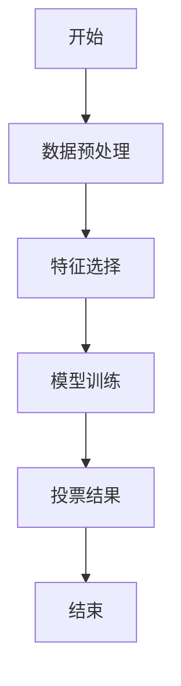

                 

# 《价值投资中的人工智能应用评估》

---

## 关键词：价值投资，人工智能，机器学习，投资组合优化，风险评估

---

## 摘要：  
本文探讨人工智能在价值投资中的应用，分析其如何提升投资决策的准确性和效率。通过构建预测模型、优化投资组合和评估风险，AI技术为投资者提供了新的工具和方法，帮助他们在复杂市场中做出更明智的选择。文章结合理论与实践，提供详细的算法原理、系统架构和项目案例，为读者理解AI在价值投资中的潜力提供全面指导。

---

## 目录大纲：  
1. 价值投资与人工智能概述  
2. 人工智能在投资分析中的应用  
3. 预测模型的构建与评估  
4. 投资组合优化与风险评估  
5. 系统架构设计  
6. 项目实战  
7. 总结与展望  

---

## 第三章：预测模型的构建与评估

### 3.1 机器学习模型的构建

#### 3.1.1 线性回归模型

- **原理**  
  线性回归是一种简单且强大的统计方法，用于预测目标变量与一个或多个特征之间的线性关系。  
  $$ y = \beta_0 + \beta_1x_1 + \beta_2x_2 + ... + \beta_nx_n $$  
  其中，$y$ 是目标变量，$x_i$ 是特征变量，$\beta$ 是系数。

- **在投资中的应用**  
  线性回归常用于预测股票价格的变化趋势，假设价格与某些宏观经济指标（如GDP增长率、利率）之间存在线性关系。

- **优缺点**  
  - 优点：简单、易于解释、计算速度快。  
  - 缺点：假设线性关系，可能无法捕捉复杂的市场动态。

#### 3.1.2 支持向量机模型

- **原理**  
  支持向量机（SVM）是一种监督学习算法，用于分类和回归问题。通过找到一个超平面，将数据点分为两类，最大化两类之间的距离。  
  $$ \text{最大化} \quad \frac{1}{2}||\mathbf{w}||^2 $$
  $$ \text{约束} \quad y_i(\mathbf{w} \cdot \mathbf{x}_i + b) \geq 1 $$

- **在投资中的应用**  
  SVM可用于股票分类，如判断股票是上涨还是下跌。

- **优缺点**  
  - 优点：在高维空间中表现良好，适合小样本数据。  
  - 缺点：计算复杂度较高，难以解释。

#### 3.1.3 随机森林模型

- **原理**  
  随机森林是一种基于决策树的集成学习方法，通过构建多棵决策树并投票或平均结果来提高预测准确性。  
  $$ y = \text{sign} \left( \sum_{i=1}^n \text{tree}_i(\mathbf{x}) \right) $$

- **在投资中的应用**  
  随机森林常用于多分类问题，如预测股票的评级（买入、持有、卖出）。

- **优缺点**  
  - 优点：鲁棒性强，适合高维数据。  
  - 缺点：计算资源消耗较大。

---

### 3.2 深度学习模型的应用

#### 3.2.1 神经网络模型

- **原理**  
  神经网络是一种模仿人脑结构的深度学习模型，通过多层神经元网络进行特征学习和预测。  
  $$ \mathbf{y} = \sigma(\mathbf{W}\mathbf{x} + \mathbf{b}) $$  
  其中，$\sigma$ 是激活函数，$\mathbf{W}$ 是权重矩阵，$\mathbf{b}$ 是偏置向量。

- **在投资中的应用**  
  神经网络常用于识别复杂市场模式，如通过文本数据预测市场情绪。

- **优缺点**  
  - 优点：能够捕捉非线性关系，适合处理复杂数据。  
  - 缺点：训练时间长，需要大量数据。

#### 3.2.2 LSTM模型

- **原理**  
  长短期记忆网络（LSTM）是一种特殊的RNN，用于处理时间序列数据。通过记忆单元和门控机制，LSTM能够捕捉长期依赖关系。  
  $$ \mathbf{i}_t = \sigma(\mathbf{W}_i \mathbf{x}_t + \mathbf{U}_i \mathbf{h}_{t-1}) $$
  $$ \mathbf{f}_t = \sigma(\mathbf{W}_f \mathbf{x}_t + \mathbf{U}_f \mathbf{h}_{t-1}) $$
  $$ \mathbf{o}_t = \sigma(\mathbf{W}_o \mathbf{x}_t + \mathbf{U}_o \mathbf{h}_{t-1}) $$
  $$ \mathbf{g}_t = \tanh(\mathbf{W}_g \mathbf{x}_t + \mathbf{U}_g \mathbf{h}_{t-1}) $$
  $$ \mathbf{h}_t = \mathbf{i}_t \cdot \mathbf{g}_t + \mathbf{f}_t \cdot \mathbf{h}_{t-1} $$

- **在投资中的应用**  
  LSTM常用于预测股票价格的时间序列，捕捉市场波动和趋势。

- **优缺点**  
  - 优点：适合时间序列数据，能够捕捉长期依赖关系。  
  - 缺点：训练复杂，可能过拟合。

#### 3.2.3 Transformer模型

- **原理**  
  Transformer是一种基于自注意力机制的模型，通过并行计算提高效率。其核心公式为：  
  $$ \text{Attention}(\mathbf{Q}, \mathbf{K}, \mathbf{V}) = \text{softmax} \left( \frac{\mathbf{Q}\mathbf{K}^T}{\sqrt{d_k}} \right) \mathbf{V} $$  
  其中，$\mathbf{Q}$、$\mathbf{K}$、$\mathbf{V}$ 分别是查询、键和值矩阵。

- **在投资中的应用**  
  Transformer用于处理多维金融数据，如同时分析股票价格和市场新闻。

- **优缺点**  
  - 优点：并行计算高效，适合大规模数据。  
  - 缺点：计算资源需求高。

---

## 图3.1：随机森林模型流程图  

---

## 第四章：投资组合优化与风险评估

### 4.1 现代投资组合理论

#### 4.1.1 均值-方差优化

- **原理**  
  均值-方差优化通过最小化投资组合的方差，同时满足预期收益。公式为：  
  $$ \min_{w} w^T \Sigma w $$
  $$ \text{约束} \quad w^T \mu = \mu_r $$  
  其中，$w$ 是权重向量，$\Sigma$ 是协方差矩阵，$\mu$ 是收益向量，$\mu_r$ 是目标收益。

---

通过以上分析，可以看出第三章详细探讨了机器学习和深度学习模型在投资预测中的应用，而第四章则扩展到了投资组合优化和风险评估。接下来，我将继续撰写后续章节，确保整篇文章内容的完整性和深度，为读者提供全面的指导。

