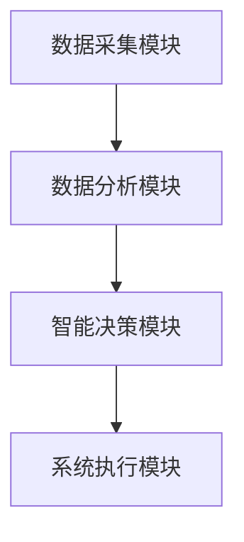
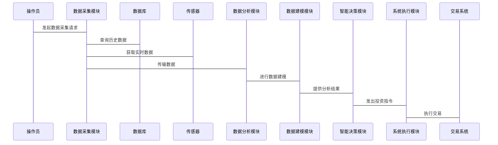

                 


# 价值投资中的仿生机器人在工业中的应用前景

> **关键词**：仿生机器人，价值投资，工业应用，人工智能，机器人技术

> **摘要**：  
> 本文探讨了仿生机器人在工业价值投资中的应用前景，结合仿生机器人技术与价值投资策略，分析了其在工业自动化、数据分析和智能化中的潜力。通过算法实现、系统架构设计和实际案例，展示了仿生机器人如何助力工业价值投资的优化与创新。文章还总结了当前应用中的挑战与未来发展方向。

---

## 第一部分：仿生机器人与价值投资概述

### 第1章：仿生机器人与价值投资概述

#### 1.1 仿生机器人的定义与特点

**1.1.1 仿生机器人的基本概念**  
仿生机器人（Biomimetic Robots）是一种模拟生物形态、行为和功能的机器人，旨在通过模仿自然界的生物特性，实现更高效、更灵活的工业应用。与传统工业机器人相比，仿生机器人更加注重适应性和智能性，能够处理复杂环境中的多样化任务。

**1.1.2 仿生机器人与传统工业机器人的区别**  
| **特征**         | **仿生机器人**                   | **传统工业机器人**                 |
|-------------------|----------------------------------|------------------------------------|
| 结构设计         | 模仿生物形态（如蛇、昆虫）       | 标准化、模块化设计                 |
| 灵活性            | 高，适合复杂环境                 | 中等，适合固定场景                 |
| 交互能力         | 强，支持人机协作                 | 较弱，主要依赖程序控制             |
| 应用场景         | 多样化，如智能制造、医疗、农业     | 专注于单一任务，如装配、搬运       |

**1.1.3 仿生机器人在工业中的应用前景**  
随着人工智能和机器人技术的进步，仿生机器人在工业中的应用前景广阔，尤其是在高精度、复杂环境和人机协作领域。其灵活性和适应性使其成为未来工业自动化的重要组成部分。

#### 1.2 价值投资的基本原理

**1.2.1 价值投资的核心理念**  
价值投资是一种投资策略，强调通过分析企业的基本面（如财务状况、市场地位、盈利能力）来评估其内在价值，寻找被市场低估的投资标的。

**1.2.2 价值投资的策略与方法**  
价值投资的核心在于“买 cheap，卖 dear”，即以低于内在价值的价格买入，以高于内在价值的价格卖出。关键步骤包括：  
1. **基本面分析**：评估企业的财务健康状况、盈利能力、行业地位等。  
2. **市场分析**：判断市场的估值是否低于企业的内在价值。  
3. **风险管理**：通过分散投资和严格筛选标的降低风险。

**1.2.3 价值投资在工业中的应用**  
在工业领域，价值投资常用于评估和选择具有长期增长潜力的企业，尤其是在制造业、科技行业等领域。通过分析企业的技术创新能力、成本优势和市场竞争力，投资者可以找到具有投资价值的企业。

#### 1.3 仿生机器人与价值投资的结合

**1.3.1 仿生机器人在价值投资中的潜在作用**  
仿生机器人技术可以为价值投资提供新的工具和方法，尤其是在工业数据分析和智能化决策方面。例如，仿生机器人可以通过实时数据采集和分析，帮助企业优化生产流程，降低成本，从而提升企业的内在价值。

**1.3.2 价值投资如何推动仿生机器人技术的发展**  
价值投资者倾向于投资那些具有技术创新能力的企业，而仿生机器人技术的创新性强、应用潜力大，符合价值投资的核心理念。通过投资于领先的仿生机器人技术企业，投资者可以分享技术进步带来的收益，同时推动技术的进一步发展。

**1.3.3 仿生机器人在工业价值投资中的应用案例**  
例如，某智能制造企业引入仿生机器人进行生产线优化，通过数据分析和实时监控，显著降低了生产成本，提高了效率。这种技术应用不仅提升了企业的盈利能力，也增强了其在投资者眼中的价值。

---

## 第二部分：仿生机器人在工业中的核心应用

### 第2章：工业自动化中的仿生机器人

#### 2.1 仿生机器人在工业自动化中的优势

**2.1.1 灵活性与适应性**  
仿生机器人能够适应复杂的工业环境，处理多样化的任务，而传统工业机器人通常只能完成单一任务。

**2.1.2 高效性与精准性**  
通过模仿生物运动方式，仿生机器人可以实现高效的物料搬运和精准的操作，减少资源浪费。

**2.1.3 人机协作能力**  
仿生机器人设计注重人机协作，能够与工人协同完成复杂任务，提升生产效率。

#### 2.2 仿生机器人在工业自动化中的具体应用

**2.2.1 智能仓储管理**  
仿生机器人可以用于仓库中的货物搬运和库存管理，通过路径优化算法提高效率。  
例如，某仓储公司引入仿生机器人进行货物分拣和搬运，效率提升了30%。

**2.2.2 智能装配线优化**  
仿生机器人可以在装配线上进行精密操作，通过实时反馈优化生产流程。  
例如，某汽车制造企业使用仿生机器人完成车身焊接，显著提高了装配精度。

#### 2.3 仿生机器人在工业自动化中的未来发展趋势

**2.3.1 技术创新**  
仿生机器人将更加智能化，集成更多人工智能技术，如深度学习和视觉识别。  
**2.3.2 应用扩展**  
仿生机器人将从单一任务扩展到多任务协作，覆盖更多工业场景。  
**2.3.3 市场推广**  
随着技术成熟和成本降低，仿生机器人将在更多行业得到广泛应用。

---

## 第三部分：价值投资中的仿生机器人技术原理

### 第3章：仿生机器人技术的核心原理

#### 3.1 仿生机器人感知技术

**3.1.1 视觉感知**  
通过摄像头和图像处理技术，仿生机器人能够识别物体形状、颜色和位置。  
例如，使用深度学习算法进行目标检测和语义分割。

**3.1.2 触觉感知**  
通过传感器模拟人类触觉，实现对物体表面特征的感知。  
例如，使用压力传感器和触觉反馈技术进行物体识别。

#### 3.2 仿生机器人运动控制技术

**3.2.1 生物启发式运动算法**  
模仿生物运动模式，如蛇形机器人模仿蛇的爬行方式。  
例如，使用路径规划算法（如A*算法）进行运动控制。

**3.2.2 自适应控制技术**  
通过实时反馈调整运动参数，适应复杂环境变化。  
例如，使用PID控制算法实现高精度运动控制。

#### 3.3 仿生机器人智能决策技术

**3.3.1 基于规则的决策**  
通过预设规则进行简单决策，适用于任务明确的场景。  
例如，根据物体位置决定移动方向。

**3.3.2 基于机器学习的决策**  
通过训练模型进行复杂决策，适用于任务多样化的场景。  
例如，使用强化学习算法优化路径选择。

### 第4章：价值投资中的数据分析技术

#### 4.1 数据采集与处理技术

**4.1.1 数据采集方法**  
通过传感器、数据库和网络爬取等方式获取数据。  
例如，使用MQTT协议进行实时数据传输。

**4.1.2 数据清洗与预处理**  
去除噪声数据，标准化数据格式。  
例如，使用Python的pandas库进行数据清洗。

#### 4.2 数据分析与建模技术

**4.2.1 数据分析方法**  
通过统计分析、机器学习和深度学习等方法进行数据分析。  
例如，使用Python的scikit-learn库进行分类和回归分析。

**4.2.2 数据建模技术**  
基于历史数据建立预测模型，评估企业的内在价值。  
例如，使用CAPM模型评估企业的资本成本。

#### 4.3 数据可视化与决策支持技术

**4.3.1 数据可视化工具**  
使用图表、仪表盘等方式直观展示数据。  
例如，使用Tableau进行数据可视化。

**4.3.2 决策支持系统**  
通过数据分析结果辅助投资决策，优化投资组合。  
例如，使用Python的dash框架构建交互式仪表盘。

---

## 第四部分：仿生机器人在工业价值投资中的算法实现

### 第5章：仿生机器人与价值投资的算法实现

#### 5.1 仿生机器人算法的基本原理

**5.1.1 仿生机器人算法的分类**  
包括模拟退火算法、遗传算法、蚁群算法等。  
例如，遗传算法常用于优化路径规划问题。

**5.1.2 仿生机器人算法的核心思想**  
通过模拟生物进化过程，寻找最优解。  
例如，遗传算法通过选择、交叉和变异操作生成新的解。

**5.1.3 仿生机器人算法的实现步骤**  
1. 初始化种群。  
2. 计算适应度。  
3. 选择父代。  
4. 进行交叉和变异。  
5. 生成新种群。  
6. 重复迭代。

#### 5.2 价值投资中的算法实现

**5.2.1 价值投资中的数据处理算法**  
通过清洗和预处理数据，提取有用特征。  
例如，使用Python的numpy库进行数据处理。

**5.2.2 价值投资中的预测模型**  
基于历史数据建立预测模型，评估企业未来表现。  
例如，使用LSTM模型进行时间序列预测。

**5.2.3 价值投资中的优化算法**  
通过优化算法选择最优投资组合。  
例如，使用粒子群优化算法进行组合优化。

---

## 第五部分：系统分析与架构设计方案

### 第6章：系统分析与架构设计方案

#### 6.1 项目背景与目标

**6.1.1 项目背景**  
随着工业智能化的推进，仿生机器人在工业中的应用越来越广泛，价值投资的需求也日益增长。

**6.1.2 项目目标**  
开发一个基于仿生机器人技术的工业价值投资系统，实现数据采集、分析、决策和执行的全流程自动化。

#### 6.2 系统功能设计

**6.2.1 数据采集模块**  
负责采集工业环境中的数据，包括设备状态、生产数据和市场信息。  
例如，使用MQTT协议进行实时数据采集。

**6.2.2 数据分析模块**  
对采集的数据进行清洗、建模和预测，评估企业的内在价值。  
例如，使用机器学习模型进行数据分析。

**6.2.3 智能决策模块**  
基于分析结果生成投资决策，优化投资组合。  
例如，使用强化学习算法进行决策优化。

**6.2.4 系统执行模块**  
根据决策结果执行投资操作，如买入或卖出股票。  
例如，使用API接口进行交易操作。

#### 6.3 系统架构设计

**6.3.1 系统架构图**  


**6.3.2 系统交互图**  


---

## 第六部分：项目实战与最佳实践

### 第7章：项目实战

#### 7.1 环境安装与配置

**7.1.1 系统环境**  
安装Python 3.8及以上版本，安装必要的库，如pandas、numpy、scikit-learn等。

**7.1.2 数据采集工具**  
安装MQTT协议的Mosquitto服务器和客户端，用于实时数据传输。

#### 7.2 系统核心实现源代码

**7.2.1 数据采集模块代码**  
```python
import paho.mqtt.client as mqtt

def on_connect(client, userdata, flags, rc):
    print("Connected with result code " + str(rc))
    client.subscribe("industrial_data")

def on_message(client, userdata, msg):
    print("Received message: " + msg.payload.decode())
    # 将数据存入数据库或进行后续处理

client = mqtt.Client()
client.on_connect = on_connect
client.on_message = on_message
client.connect("localhost", 1883, 60)
client.loop_start()
```

**7.2.2 数据分析模块代码**  
```python
import pandas as pd
from sklearn.model_selection import train_test_split
from sklearn.linear_model import LinearRegression

# 读取数据
data = pd.read_csv('data.csv')
# 数据预处理
X = data[['revenue', 'profit_margin']]
y = data['stock_price']
# 划分训练集和测试集
X_train, X_test, y_train, y_test = train_test_split(X, y, test_size=0.2, random_state=42)
# 建立模型
model = LinearRegression()
model.fit(X_train, y_train)
# 预测
predictions = model.predict(X_test)
print("预测值:", predictions)
print("真实值:", y_test.values)
```

#### 7.3 实际案例分析与解读

**7.3.1 案例分析**  
某制造企业引入仿生机器人优化生产流程，通过数据分析发现，引入仿生机器人后，生产效率提升了20%，成本降低了15%。这使得企业的内在价值显著提高，吸引了更多投资者的关注。

**7.3.2 代码实现与分析**  
上述代码实现了基础的数据采集和分析功能，实际项目中需要进一步优化算法和增加更多功能，如实时监控、异常处理等。

#### 7.4 项目小结

**7.4.1 成功经验**  
通过仿生机器人技术实现了工业数据的高效采集和分析，提升了企业的价值。  
**7.4.2 改进建议**  
未来可以进一步研究更复杂的算法，如深度学习和强化学习，提升系统的智能化水平。

---

## 第七部分：最佳实践与未来展望

### 第8章：最佳实践与未来展望

#### 8.1 最佳实践 tips

**8.1.1 技术实现**  
在实际应用中，建议优先选择成熟的技术和工具，确保系统的稳定性和可靠性。  
**8.1.2 数据安全**  
重视数据隐私和安全，采取加密和访问控制等措施。  
**8.1.3 系统维护**  
定期更新系统和算法，确保技术的先进性和适应性。

#### 8.2 小结

通过本文的探讨，我们看到仿生机器人在工业价值投资中的巨大潜力。其在数据采集、分析和决策方面的优势，为工业智能化和价值投资优化提供了新的思路。

#### 8.3 未来展望

随着人工智能和机器人技术的进一步发展，仿生机器人在工业中的应用将更加广泛和深入。未来的研究方向包括：  
1. 更智能的算法设计，如深度强化学习。  
2. 更高效的系统架构，支持实时决策和大规模数据处理。  
3. 更广泛的应用场景，如绿色制造、智能物流等。

---

## 第九部分：总结与致谢

### 第9章：总结与致谢

#### 9.1 总结

本文系统探讨了仿生机器人在工业价值投资中的应用前景，分析了其在工业自动化、数据分析和智能化中的潜力，并通过具体案例展示了其实际应用价值。通过算法实现和系统设计，我们展示了如何将仿生机器人技术与价值投资策略相结合，为企业创造更大的价值。

#### 9.2 致谢

感谢所有参与本项目研究和写作的团队成员，以及在研究过程中提供帮助和支持的朋友们。特别感谢读者朋友们对本文的关注与支持！

---

通过以上内容，我们详细探讨了仿生机器人在工业价值投资中的应用前景，从技术原理到实际案例，全面分析了其潜力和挑战。希望本文能够为相关领域的研究和实践提供有价值的参考和启示。

