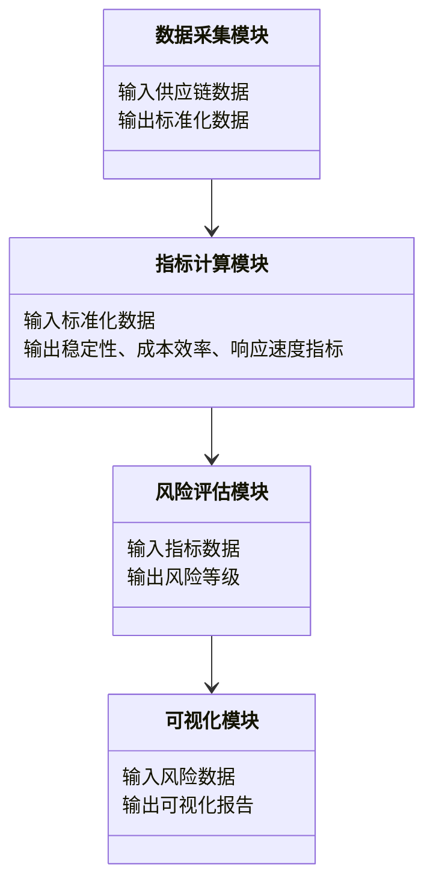
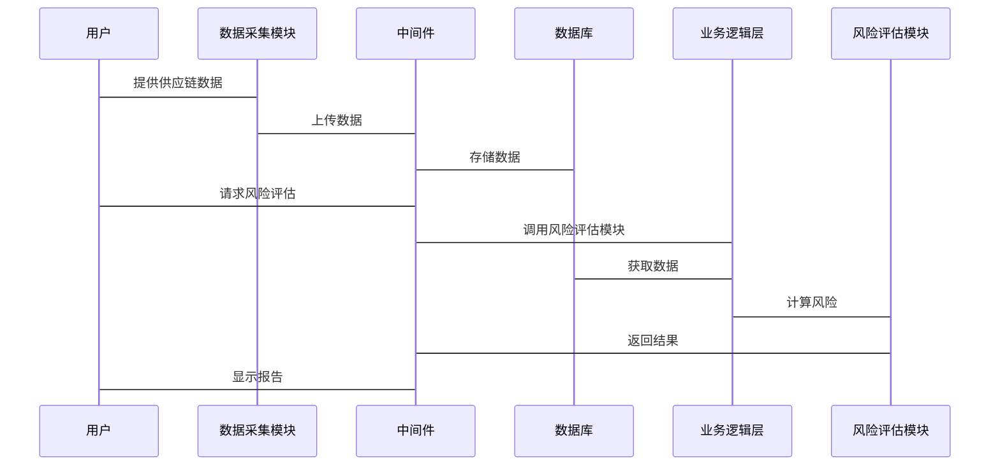

                 


# 目录大纲：《价值投资中的供应链分析》

## 第一部分：供应链分析的背景与重要性

### 第1章：供应链分析的背景与重要性

#### 1.1 供应链的基本概念
- 1.1.1 供应链的定义与组成部分
  - 供应链是指从原材料采购到产品交付给最终用户的整个过程，包括供应商、制造商、分销商和零售商等多个环节。
  - 关键部分：供应商、制造商、分销商、零售商、客户。
- 1.1.2 供应链在企业运营中的作用
  - 确保产品按时交付，减少库存成本，提高效率。
- 1.1.3 供应链分析在价值投资中的意义
  - 评估企业的运营效率和风险管理能力，影响投资决策。

#### 1.2 供应链分析在价值投资中的作用
- 1.2.1 供应链对企业竞争力的影响
  - 供应链效率高，企业成本低，竞争力强。
- 1.2.2 供应链风险对投资决策的影响
  - 供应链中断可能导致成本上升或收入下降，增加投资风险。
- 1.2.3 供应链效率与企业财务表现的关系
  - 高效供应链通常意味着更高的利润率和更强的市场响应能力。

#### 1.3 供应链分析的基本框架
- 1.3.1 供应链分析的维度
  - 稳定性、成本效率、响应速度。
- 1.3.2 供应链分析的关键指标
  - 库存周转率、交货时间、供应商可靠性。
- 1.3.3 供应链分析的步骤与方法
  - 数据收集、指标计算、风险评估、优化建议。

## 第二部分：供应链结构与评估指标

### 第2章：供应链结构与评估指标

#### 2.1 供应链的结构分析
- 2.1.1 供应链的层级结构
  - 分为上游供应商、制造商、分销商和零售商。
- 2.1.2 供应链的节点与关系
  - 各个节点之间的合作关系和依赖关系。
- 2.1.3 供应链的网络特征
  - 网络的复杂性、集中度和冗余度。

#### 2.2 供应链评估的核心指标
- 2.2.1 供应链的稳定性指标
  - 供应商的可靠性、生产过程的连续性。
- 2.2.2 供应链的成本效率指标
  - 总成本、库存水平、运输成本。
- 2.2.3 供应链的响应速度指标
  - 交货时间、订单处理时间、客户满意度。

#### 2.3 供应链评估指标的计算方法
- 2.3.1 稳定性指标的计算
  - 供应商交付准时率 = （按时交付的订单数量 / 总订单数量）× 100%。
- 2.3.2 成本效率指标的计算
  - 总成本 = 原材料成本 + 生产成本 + 运输成本 + 存储成本。
- 2.3.3 响应速度指标的计算
  - 交货时间 = 订单处理时间 + 运输时间。

## 第三部分：供应链风险评估的算法与模型

### 第3章：供应链风险评估的算法与模型

#### 3.1 供应链风险评估的基本原理
- 3.1.1 风险的定义与分类
  - 供应链风险包括供应中断、成本超支、交付延迟等。
- 3.1.2 供应链风险的来源与影响
  - 自然灾害、供应商问题、物流中断、需求波动。
- 3.1.3 风险评估的目标与方法
  - 识别潜在风险、量化风险影响、制定应对策略。

#### 3.2 基于网络分析的供应链风险评估
- 3.2.1 网络分析的基本概念
  - 网络分析用于评估供应链中各节点的连接性和重要性。
- 3.2.2 供应链网络的脆弱性分析
  - 脆弱性高的节点可能导致整体网络中断。
- 3.2.3 基于网络分析的风险评估模型
  - 使用节点重要性指标（如度数、介数）评估风险。

#### 3.3 供应链风险评估的数学模型
- 3.3.1 线性回归模型
  - 预测供应链中断对企业利润的影响。
  - 公式：利润 = β0 + β1 × 中断时间 + ε。
- 3.3.2 网络分析模型
  - 使用网络流模型确定关键路径和瓶颈。
  - 关键路径：最长时间路径，决定项目完成时间。

#### 3.4 供应链风险评估算法的实现
- 3.4.1 算法步骤
  1. 收集供应链数据。
  2. 构建供应链网络模型。
  3. 计算节点重要性指标。
  4. 识别高风险节点。
  5. 评估整体风险等级。

## 第四部分：系统分析与架构设计方案

### 第4章：系统分析与架构设计方案

#### 4.1 问题场景介绍
- 评估企业供应链的稳定性、成本效率和响应速度，以支持价值投资决策。

#### 4.2 项目介绍
- 开发一个供应链分析系统，帮助投资者评估企业的供应链表现。

#### 4.3 系统功能设计
- 功能模块：数据采集、指标计算、风险评估、可视化报告。
- 领域模型类图


#### 4.4 系统架构设计
- 架构类型：分层架构。
- 组件：数据层、业务逻辑层、表现层。
- 系统架构图


#### 4.5 系统接口设计
- 数据采集接口：用于接收供应链数据。
- 风险评估接口：用于调用风险评估算法。
- 可视化接口：用于生成报告。

#### 4.6 系统交互设计
- 序列图展示用户与系统交互流程。


## 第五部分：项目实战

### 第5章：项目实战

#### 5.1 环境安装
- 安装Python、Pandas、NumPy、Matplotlib、Scikit-learn。
- 安装Jupyter Notebook用于数据处理和分析。

#### 5.2 系统核心实现源代码
- 数据处理代码：
```python
import pandas as pd
import numpy as np

# 数据加载
data = pd.read_csv('supply_chain.csv')

# 数据清洗
data.dropna()
data = data[~data.duplicated()]
```
- 风险评估代码：
```python
from sklearn.linear_model import LinearRegression

# 创建模型
model = LinearRegression()

# 训练模型
model.fit(X_train, y_train)

# 预测
y_pred = model.predict(X_test)
```

#### 5.3 代码应用解读与分析
- 数据清洗：处理缺失值和重复值。
- 风险评估：使用线性回归模型预测中断对企业利润的影响。

#### 5.4 实际案例分析和详细讲解剖析
- 案例：某制造企业供应链分析。
- 分析步骤：数据收集、指标计算、风险评估、结果解读。

#### 5.5 项目小结
- 项目目标：帮助企业识别供应链风险，支持投资决策。
- 成果展示：生成可视化报告，提供优化建议。

## 第六部分：最佳实践、小结、注意事项、拓展阅读

### 第6章：最佳实践与小结

#### 6.1 最佳实践
- 定期监控供应链指标，及时调整策略。
- 与供应商建立长期合作关系，提高供应链稳定性。

#### 6.2 小结
- 供应链分析是价值投资中的关键工具，帮助投资者评估企业的竞争力和风险管理能力。
- 通过系统化的分析和建模，可以有效降低投资风险，提高投资回报。

#### 6.3 注意事项
- 数据质量：确保数据准确、完整。
- 模型选择：根据实际情况选择合适的模型。
- 风险监控：持续监控供应链风险，及时应对变化。

#### 6.4 拓展阅读
- 推荐书籍：《供应链管理：操作与战略》。
- 推荐文章：供应链优化的最新研究和应用。

---

通过以上目录大纲，可以系统地学习供应链分析在价值投资中的应用，从理论到实践，帮助投资者做出更明智的投资决策。

