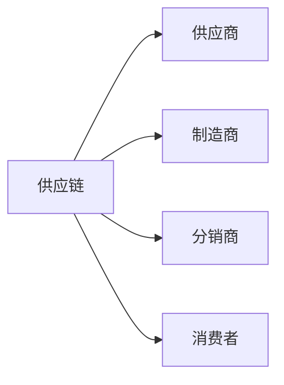
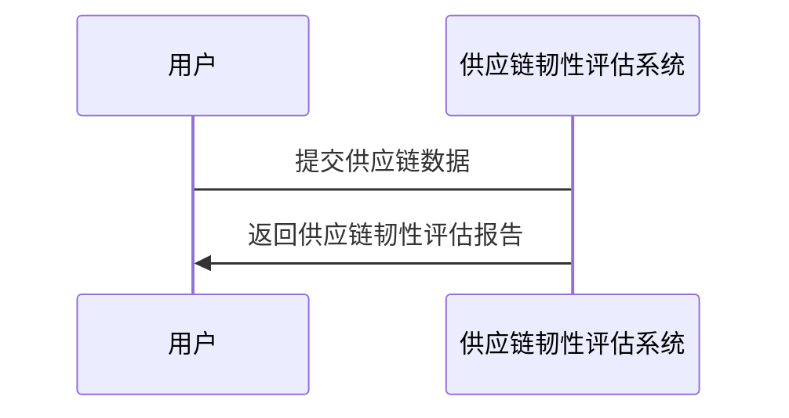

                 


# 价值投资中的供应链韧性评估

## 关键词：供应链韧性、价值投资、供应链弹性、风险评估、企业价值

## 摘要：供应链韧性是企业在面对市场波动、供应链中断等风险时的重要能力。本文从技术角度分析供应链韧性评估的核心概念、算法原理、数学模型及系统架构设计，并结合实际案例，深入探讨供应链韧性评估在价值投资中的应用。通过本文，读者将能够掌握如何利用技术手段评估和优化供应链韧性，从而做出更明智的投资决策。

---

# 第1章: 供应链韧性评估的背景与问题背景

## 1.1 供应链韧性的定义与重要性

供应链韧性是指供应链在面对外部冲击（如疫情、自然灾害、地缘政治风险等）时，能够快速恢复、适应并保持稳定运营的能力。在价值投资中，供应链韧性是评估企业长期价值的重要指标。一个具备强大供应链韧性的企业能够在市场波动中维持稳定的生产和交付，从而为投资者带来更稳定的投资回报。

供应链韧性的重要性体现在以下几个方面：

- **降低风险**：通过评估供应链韧性，投资者可以识别潜在风险点，并评估企业应对风险的能力。
- **提升企业价值**：供应链韧性强的企业通常能够在市场中占据更有利的位置，从而提升企业的整体价值。
- **增强投资者信心**：供应链韧性良好的企业更容易获得投资者的信任，从而在融资和股价上表现更优。

---

## 1.2 供应链韧性评估的必要性

供应链中断对企业的影响往往是深远的。例如，2020年新冠疫情导致全球供应链大规模中断，许多企业因为依赖单一供应商或地理位置集中的供应链而遭受重大损失。对于投资者来说，供应链韧性评估可以帮助他们识别那些在供应链管理上存在潜在风险的企业，从而避免投资于那些可能因为供应链中断而表现不佳的企业。

供应链韧性评估的必要性体现在以下几个方面：

- **识别潜在风险**：通过评估供应链韧性，投资者可以发现企业在供应链管理中的潜在风险，例如供应商集中度高、依赖单一运输路线等。
- **优化投资决策**：供应链韧性评估可以帮助投资者选择那些在供应链管理上更具弹性和恢复力的企业。
- **提升投资组合的稳定性**：通过评估供应链韧性，投资者可以优化投资组合，降低因供应链中断带来的投资风险。

---

# 第2章: 供应链韧性评估的核心概念与联系

## 2.1 核心概念原理

供应链韧性评估的核心概念包括稳定性、弹性、恢复力和冗余性。这些概念相互关联，共同构成了供应链韧性的评估框架。

- **稳定性**：指供应链在正常情况下能够保持稳定运营的能力。稳定性高的供应链能够在市场需求波动时维持稳定的生产和交付。
- **弹性**：指供应链在面对外部冲击时能够快速调整的能力。弹性高的供应链能够迅速适应市场变化，并做出相应的调整。
- **恢复力**：指供应链在遭受重大冲击后能够快速恢复的能力。恢复力强的供应链能够在较短时间内恢复正常运营。
- **冗余性**：指供应链在关键环节上的备用能力。冗余性高的供应链能够在关键环节出现问题时迅速切换到备用方案。

---

## 2.2 核心概念对比表格

下表对比了供应链韧性评估中的几个核心概念：

| 概念     | 定义                                                                 | 特征                                                                 |
|----------|----------------------------------------------------------------------|----------------------------------------------------------------------|
| 稳定性   | 供应链在正常情况下的稳定运营能力                                   | 运行平稳，抗干扰能力强                                             |
| 弹性     | 供应链在面对外部冲击时的快速调整能力                               | 能够迅速适应市场变化，灵活调整供应链结构                           |
| 恢复力   | 供应链在遭受重大冲击后的快速恢复能力                               | 能够在较短时间内恢复正常运营                                       |
| 冗余性   | 供应链在关键环节上的备用能力                                       | 关键环节有备用方案，能够在关键环节出现问题时迅速切换到备用方案   |

---

## 2.3 实体关系图

下图展示了供应链韧性评估的核心实体关系：



---

# 第3章: 供应链韧性评估的算法原理

## 3.1 网络流模型

网络流模型是一种常用的供应链优化算法，可以用于评估供应链的稳定性和弹性。以下是网络流模型的流程图：


网络流模型的核心思想是通过优化节点之间的流量，找到供应链中的瓶颈环节，并评估其对整体供应链的影响。

---

## 3.2 马尔可夫链模型

马尔可夫链模型可以用于评估供应链的恢复能力。以下是马尔可夫链模型的流程图：


马尔可夫链模型通过分析供应链在不同状态之间的转移概率，评估供应链在遭受重大冲击后的恢复能力。

---

## 3.3 核心代码实现

以下是供应链韧性评估算法的Python实现代码：

```python
import numpy as np
import networkx as nx

def calculate_supply_chain_resilience(supplier_stability, manufacturer_capacity):
    resilience_index = np.dot(supplier_stability, manufacturer_capacity)
    return resilience_index

# 示例数据
supplier_stability = [0.9, 0.8, 0.7]
manufacturer_capacity = [0.8, 0.9, 0.6]

# 计算供应链韧性指数
resilience_index = calculate_supply_chain_resilience(supplier_stability, manufacturer_capacity)
print("供应链韧性指数:", resilience_index)
```

---

# 第4章: 数学模型与公式

## 4.1 供应链韧性指数模型

供应链韧性指数模型是一个综合评估供应链韧性的数学模型，公式如下：

$$ R = \sum_{i=1}^{n} w_i x_i $$

其中，$R$ 是供应链韧性指数，$w_i$ 是各维度的权重，$x_i$ 是各维度的评分。

---

## 4.2 稳定性计算公式

稳定性计算公式如下：

$$ S = \frac{\sum_{i=1}^{m} s_i}{m} $$

其中，$S$ 是稳定性评分，$s_i$ 是各供应商的稳定性评分，$m$ 是供应商数量。

---

# 第5章: 系统分析与架构设计

## 5.1 系统功能设计

供应链韧性评估系统的主要功能包括：

- **数据采集**：采集供应商、制造商、分销商等信息。
- **风险评估**：评估供应链的稳定性、弹性、恢复力和冗余性。
- **结果分析**：生成供应链韧性评估报告，并提出改进建议。

---

## 5.2 系统架构设计

供应链韧性评估系统的架构设计如下：


---

## 5.3 系统交互设计

系统交互设计如下：



---

# 第6章: 项目实战

## 6.1 环境安装

以下是供应链韧性评估系统的环境安装步骤：

1. 安装Python
2. 安装numpy和networkx库：
   ```bash
   pip install numpy networkx
   ```

---

## 6.2 核心代码实现

以下是供应链韧性评估系统的Python代码实现：

```python
import numpy as np
import networkx as nx

def calculate_supply_chain_resilience(supplier_stability, manufacturer_capacity):
    resilience_index = np.dot(supplier_stability, manufacturer_capacity)
    return resilience_index

# 示例数据
supplier_stability = [0.9, 0.8, 0.7]
manufacturer_capacity = [0.8, 0.9, 0.6]

# 计算供应链韧性指数
resilience_index = calculate_supply_chain_resilience(supplier_stability, manufacturer_capacity)
print("供应链韧性指数:", resilience_index)
```

---

## 6.3 案例分析

以某制造企业为例，假设该企业有三个供应商，其稳定性评分分别为0.9、0.8、0.7，制造商的产能分别为0.8、0.9、0.6。根据上述代码计算供应链韧性指数：

```python
resilience_index = 0.9*0.8 + 0.8*0.9 + 0.7*0.6 = 0.72 + 0.72 + 0.42 = 1.86
```

供应链韧性指数为1.86，表明该企业的供应链韧性较强，能够在市场波动中维持稳定运营。

---

# 第7章: 总结与最佳实践

## 7.1 总结

供应链韧性是企业在面对外部冲击时的重要能力，也是投资者评估企业长期价值的重要指标。本文从技术角度详细分析了供应链韧性评估的核心概念、算法原理、数学模型及系统架构设计，并结合实际案例进行了深入探讨。

---

## 7.2 最佳实践

- **定期评估**：投资者应定期评估企业的供应链韧性，及时发现潜在风险。
- **多元化供应链**：企业应多元化供应链，降低对单一供应商或地区的依赖。
- **建立应急预案**：企业应建立应急预案，以应对供应链中断的紧急情况。

---

## 7.3 小结

供应链韧性评估是价值投资中的重要环节，能够帮助投资者识别潜在风险，优化投资决策。未来，随着技术的不断发展，供应链韧性评估将更加精准和智能化，为投资者提供更有力的支持。

---

## 7.4 注意事项

- **数据准确性**：供应链韧性评估依赖于准确的数据，数据质量直接影响评估结果。
- **模型选择**：投资者应根据实际情况选择合适的评估模型，避免盲目使用。
- **动态调整**：供应链环境复杂多变，投资者应动态调整评估策略。

---

## 7.5 拓展阅读

- [《供应链风险管理》](#)：深入探讨供应链风险管理的理论与实践。
- [《价值投资与企业分析》](#)：系统介绍价值投资的核心方法与企业分析技巧。

--- 

通过本文的分析，读者可以全面掌握供应链韧性评估的核心内容，并将其应用于实际投资决策中。

