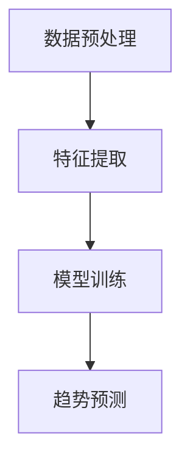
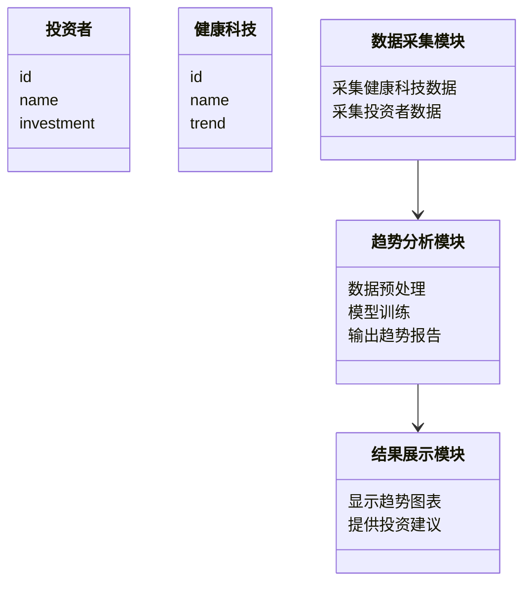
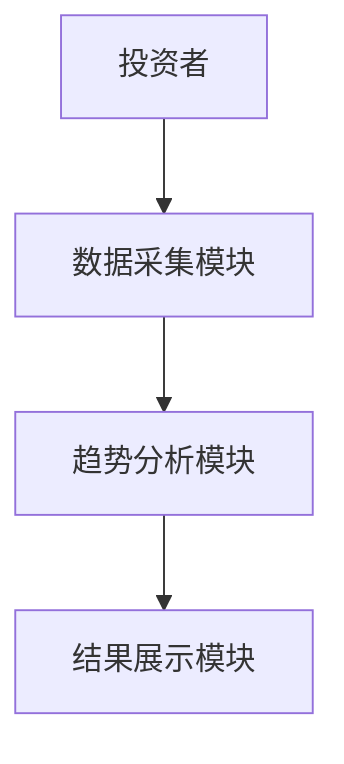
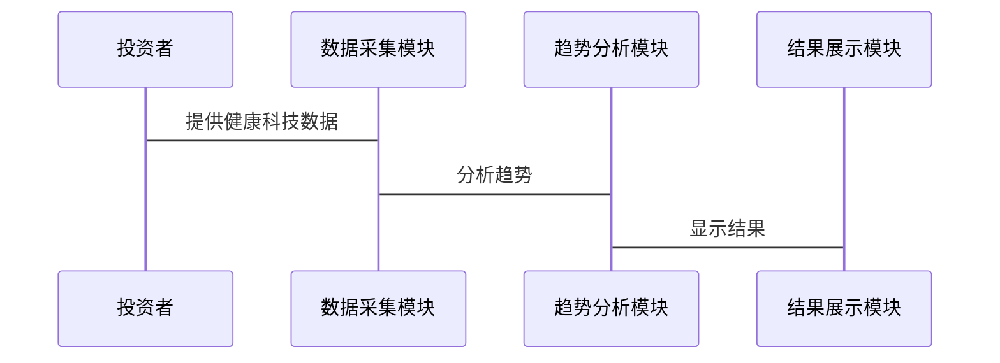

                 


```markdown
# 价值投资中的健康科技趋势分析

> 关键词：价值投资、健康科技、趋势分析、健康医疗、投资策略

> 摘要：本文探讨健康科技领域的投资机会，分析其发展趋势，并结合价值投资的原理，提供具体的分析方法和策略建议。通过数据驱动的方法和系统架构设计，帮助投资者在健康科技领域做出明智决策。

---

# 第1章: 背景介绍与核心概念

## 1.1 健康科技的定义与背景

### 1.1.1 健康科技的定义
健康科技（Health Technology）是指利用信息技术、生物技术等手段，用于改善医疗服务、健康管理及疾病预防的创新解决方案。其核心目标是提高医疗效率、降低医疗成本并提升患者生活质量。

### 1.1.2 健康科技的发展历程
健康科技的发展经历了多个阶段，从最初的电子健康记录（EHR）到现在的智能医疗设备、远程医疗和人工智能辅助诊断，技术的进步推动了健康科技的快速发展。

### 1.1.3 健康科技与价值投资的结合
健康科技的创新和市场规模的扩大为投资者提供了新的机会。通过分析健康科技企业的市场地位、盈利能力和技术壁垒，投资者可以找到具有长期增长潜力的投资标的。

## 1.2 价值投资的背景与核心理念

### 1.2.1 价值投资的起源与核心思想
价值投资由本杰明·格雷厄姆提出，强调以低于内在价值的价格买入优质资产。其核心思想是寻找市场低估的公司，长期持有，分享其成长收益。

### 1.2.2 价值投资的基本原则
- **安全边际**：买入价格低于内在价值。
- **长期视角**：关注企业的长期增长潜力。
- **基本面分析**：重视企业的财务状况、行业地位和竞争优势。

### 1.2.3 价值投资在健康科技领域的应用
健康科技领域的投资需要结合技术发展趋势和市场需求，选择具有持续创新能力且财务稳健的企业。

## 1.3 健康科技趋势分析的意义

### 1.3.1 健康科技趋势分析的目的
通过分析行业趋势，识别具有成长潜力的细分领域，为投资决策提供依据。

### 1.3.2 健康科技趋势分析的方法
结合定量分析（如市场规模增长）和定性分析（如技术进步），评估企业的投资价值。

### 1.3.3 健康科技趋势分析对投资决策的影响
帮助投资者准确把握行业动向，规避投资风险，抓住投资机会。

## 1.4 本章小结
本章介绍了健康科技的定义、发展历程及其与价值投资的结合，阐述了健康科技趋势分析的重要性和方法。

---

# 第2章: 健康科技的核心概念与联系

## 2.1 健康科技的核心概念

### 2.1.1 健康科技的核心要素
健康科技的核心要素包括：
- **技术创新**：如人工智能、大数据分析。
- **商业模式**：如订阅制、按需付费。
- **政策支持**：如政府补贴、税收优惠。

### 2.1.2 健康科技的关键技术
- **人工智能（AI）**：用于疾病诊断和药物研发。
- **物联网（IoT）**：支持远程医疗和健康管理。
- **区块链**：用于医疗数据的安全存储和共享。

### 2.1.3 健康科技的商业模式
- **SaaS模式**：软件即服务。
- **医疗设备销售**：销售智能医疗设备。
- **数据服务**：提供健康数据分析服务。

## 2.2 健康科技趋势分析的核心原理

### 2.2.1 数据驱动的分析方法
通过收集和分析行业数据，识别市场趋势和企业竞争态势。

### 2.2.2 技术进步对健康科技的影响
技术创新推动行业变革，如AI在医疗影像识别中的应用提升诊断效率。

### 2.2.3 市场需求与供给的平衡
分析患者需求、医生需求和政策需求，判断市场容量和企业竞争力。

## 2.3 健康科技趋势分析的ER实体关系图

```mermaid
erDiagram
    customer[投资者] {
        <属性>
        id : 整数
        name : 字符串
        investment : 数值
    }
    technology[健康科技] {
        <属性>
        id : 整数
        name : 字符串
        trend : 字符串
    }
    relation[投资关系] {
        <属性>
        id : 整数
        customer_id : 整数
        technology_id : 整数
        investment_amount : 数值
    }
    customer -[> relation] : 投资
    technology -[> relation] : 被投资
```

## 2.4 本章小结
本章详细阐述了健康科技的核心概念及其与价值投资的联系，通过ER图展示了投资者与健康科技之间的关系。

---

# 第3章: 健康科技趋势分析的算法原理

## 3.1 数据预处理与特征提取

### 3.1.1 数据清洗
- 处理缺失值、异常值。
- 标准化和归一化处理。

### 3.1.2 特征选择
- 使用相关性分析和主成分分析（PCA）提取关键特征。

## 3.2 趋势预测模型

### 3.2.1 时间序列分析
使用ARIMA模型预测健康科技企业的营收增长趋势。



### 3.2.2 Python代码实现

```python
from statsmodels.tsa.arima.model import ARIMA
import pandas as pd

# 数据加载与预处理
data = pd.read_csv('health_tech_trend.csv')
data = data['revenue'].diff().dropna()

# 模型训练
model = ARIMA(data, order=(5,1,0))
model_fit = model.fit()

# 预测
forecast = model_fit.forecast(steps=5)
print(forecast)
```

## 3.3 基于机器学习的健康科技趋势分析

### 3.3.1 特征工程
- 划分训练集和测试集。
- 使用Lasso回归或随机森林进行特征重要性分析。

### 3.3.2 模型训练
- 使用XGBoost或LightGBM进行分类或回归任务。

### 3.3.3 模型评估
- 使用准确率、召回率和F1分数评估模型性能。

## 3.4 本章小结
本章介绍了健康科技趋势分析的算法原理，包括数据预处理、特征提取和模型训练的全过程。

---

# 第4章: 健康科技趋势分析的系统架构设计

## 4.1 系统功能设计

### 4.1.1 需求分析
- 用户需求：投资者需要实时数据分析和趋势预测。
- 系统功能模块：数据采集、趋势分析、结果展示。

### 4.1.2 系统功能设计类图



## 4.2 系统架构设计

### 4.2.1 微服务架构



## 4.3 系统接口与交互设计

### 4.3.1 系统内部接口
- 数据采集模块与趋势分析模块之间的接口。
- 趋势分析模块与结果展示模块之间的接口。

### 4.3.2 用户交互流程
- 用户输入查询条件。
- 系统返回趋势分析结果。

### 4.3.3 序列图



## 4.4 本章小结
本章详细设计了健康科技趋势分析系统的功能模块和架构，并展示了系统的交互流程。

---

# 第5章: 健康科技趋势分析的项目实战

## 5.1 环境安装与数据准备

### 5.1.1 环境配置
- 安装Python、Jupyter Notebook、Pandas、Scikit-learn、XGBoost。

### 5.1.2 数据准备
- 下载健康科技领域的公开数据集，如股票价格、行业报告等。

## 5.2 核心代码实现

### 5.2.1 数据预处理代码

```python
import pandas as pd

# 数据加载
data = pd.read_csv('health_tech.csv')

# 数据清洗
data.dropna(inplace=True)
data['date'] = pd.to_datetime(data['date'])
data.set_index('date', inplace=True)
```

### 5.2.2 趋势分析代码

```python
from sklearn.ensemble import RandomForestRegressor
import numpy as np

# 特征选择
features = data.columns.drop('target')
X = data[features]
y = data['target']

# 模型训练
model = RandomForestRegressor(n_estimators=100)
model.fit(X, y)

# 预测
predictions = model.predict(X)
print(np.mean(abs(predictions - y) / y * 100))
```

## 5.3 实战案例分析

### 5.3.1 案例背景
选择一家健康科技公司，分析其过去三年的财务数据和市场表现。

### 5.3.2 数据分析与结论
- 该公司在过去三年中收入增长稳定，研发投入占比逐年增加，显示出良好的发展潜力。

## 5.4 本章小结
本章通过实际案例展示了健康科技趋势分析的全过程，从数据准备到模型训练，再到结果分析。

---

# 第6章: 总结与展望

## 6.1 内容总结
本文详细探讨了健康科技领域的投资机会，分析了健康科技的趋势，并结合价值投资的原理，提供了系统的分析方法和策略建议。

## 6.2 投资策略建议
- 关注具有技术创新和市场领先地位的企业。
- 结合宏观政策和市场需求，选择具有长期增长潜力的领域。

## 6.3 展望未来
随着人工智能和大数据技术的进一步发展，健康科技将迎来更多的创新机遇。投资者需要持续关注行业动态，调整投资策略。

## 6.4 注意事项与最佳实践
- **风险管理**：分散投资，避免过度集中。
- **持续学习**：关注行业和技术的发展动态。
- **专业咨询**：必要时寻求专业投资顾问的帮助。

## 6.5 拓展阅读
- 格雷厄姆的《 Intelligent Investor》。
- 《Health Technology and Its Impact on Investment Strategies》。

---

# 结语

通过本文的分析，读者可以更好地理解健康科技的趋势，并结合价值投资的策略，做出明智的投资决策。希望本文的内容对您在健康科技领域的投资有所帮助！
```

