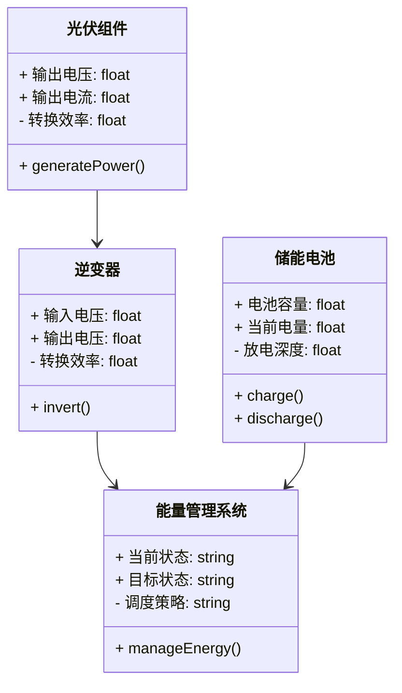
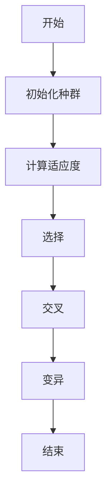
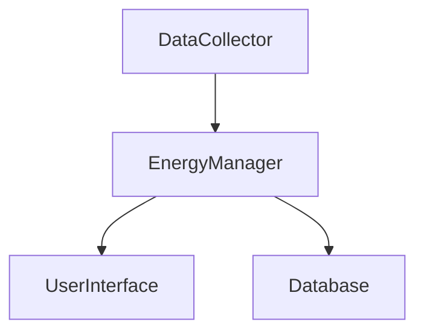
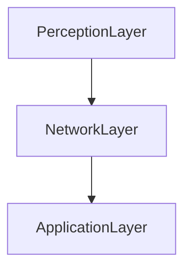
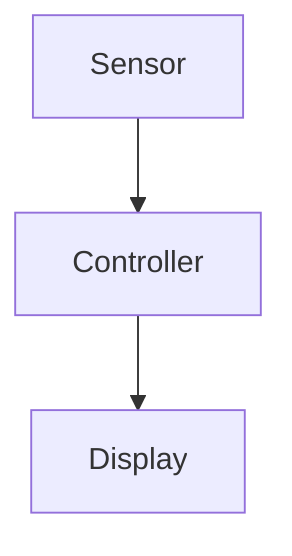
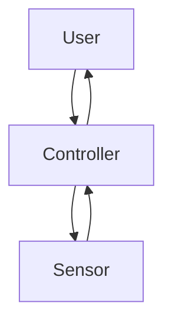

                 


# 价值投资中的光伏储能技术分析

## 关键词：
光伏技术、储能技术、价值投资、经济模型、系统架构

## 摘要：
本文深入分析光伏储能技术在价值投资中的应用，探讨其技术原理、经济价值、数学模型和系统架构，结合实际案例，为投资者提供科学决策依据。

---

# 第1章: 光伏储能技术基础

## 1.1 光伏技术的基本概念

### 1.1.1 光伏技术的定义与原理
光伏技术是指利用半导体材料将太阳光转化为电能的技术。其核心原理基于光生伏特效应，通过光电转换实现能量捕获。

**核心概念术语说明**：
- **光伏效应**：半导体材料在光照下产生电势差的现象。
- **光伏组件**：由太阳能电池组成的发电单元，包括单晶硅、多晶硅等类型。

**问题背景**：
随着全球能源需求的增长和化石能源的枯竭，可再生能源成为未来发展的重要方向。光伏技术作为主要的可再生能源技术之一，具有广阔的应用前景。

**问题解决**：
光伏技术通过高效捕获太阳能，为能源结构转型提供解决方案，减少对化石能源的依赖，降低碳排放。

**边界与外延**：
光伏技术的外延包括储能技术、智能电网等领域，共同构成现代能源系统。

**概念结构与核心要素组成**：
光伏系统由光伏组件、逆变器、支架、电缆等部分组成，各部分协同工作实现能量转换。

---

## 1.2 储能技术的基本概念

### 1.2.1 储能技术的定义与分类
储能技术指通过技术手段将能量存储并在需要时释放的技术。常见的储能技术包括电池储能、超级电容器储能等。

**核心概念术语说明**：
- **储能系统**：用于存储电能的设备或装置，通常由电池、管理系统等组成。
- **能量密度**：单位体积或质量的储能容量。

**问题背景**：
能源需求的波动性和不稳定性使得储能技术成为解决能源供应问题的关键技术。

**问题解决**：
储能技术能够有效调节能源供需矛盾，提高能源利用效率，保障能源供应的稳定性。

**边界与外延**：
储能技术的外延包括能量转换技术、智能管理技术等，共同构建高效的能源管理系统。

**概念结构与核心要素组成**：
储能系统包括电池单元、电池管理系统（BMS）、能量管理模块（EMS）等核心组件。

---

## 1.3 光伏储能系统的组成与工作原理

### 1.3.1 光伏储能系统的整体架构
光伏储能系统由光伏组件、储能电池、逆变器、能量管理系统等部分组成，形成一个完整的能源转换和存储系统。

**领域模型（Mermaid类图）**：


### 1.3.2 光伏储能系统的能量流动过程
系统通过光伏组件捕获太阳能，经逆变器转换为交流电，部分用于负载，部分存储在电池中以备不时之需。

**系统架构图（Mermaid）**：
```mermaid
graph TD
    PV -> Inverter
    Inverter -> EMS
    EMS -> Battery
    Battery -> Inverter
```

### 1.3.3 光伏储能系统的关键性能指标
- **能量转换效率**：系统整体的能量转换效率。
- **循环寿命**：储能电池的充放电次数。
- **响应时间**：系统对负载变化的响应速度。

---

# 第2章: 光伏储能技术的经济价值分析

## 2.1 光伏储能技术的市场现状

### 2.1.1 全球光伏储能市场的规模与增长趋势
近年来，全球光伏储能市场呈现快速增长态势，年复合增长率超过20%，市场容量预计在2030年达到数千亿美元。

**问题背景**：
随着技术进步和成本下降，光伏储能技术的市场竞争力日益增强。

**问题解决**：
通过技术创新和规模化生产，光伏储能技术的成本逐渐降低，市场应用范围不断扩大。

## 2.2 光伏储能技术的经济价值评估

### 2.2.1 光伏储能技术的成本构成与成本分析
光伏储能系统的成本主要包括光伏组件、储能电池、逆变器等设备的投资，以及安装、维护等费用。

**数学模型**：
$$ \text{总成本} = C_{\text{光伏}} + C_{\text{储能}} + C_{\text{其他}} $$

### 2.2.2 光伏储能技术的收益来源与收益预测
收益主要来自出售多余电量和节省电网电费。

**数学公式**：
$$ \text{年收益} = R_{\text{售电}} + R_{\text{节电}} $$

### 2.2.3 光伏储能技术的净现值（NPV）与内部收益率（IRR）分析
通过NPV和IRR指标评估项目的经济可行性。

**公式**：
$$ \text{NPV} = \sum_{t=0}^{n} \frac{C_t}{(1+r)^t} $$
其中，\( r \) 为贴现率，\( C_t \) 为第 \( t \) 年的现金流。

---

## 2.3 光伏储能技术的竞争力分析

### 2.3.1 光伏储能技术的市场竞争格局
目前，市场主要由几大厂商主导，竞争格局相对稳定，但新兴企业也在快速崛起。

**问题背景**：
市场竞争加剧，技术创新成为企业核心竞争力的关键。

**问题解决**：
通过持续的技术创新和成本优化，提升市场竞争力。

---

# 第3章: 光伏储能技术的数学模型与算法分析

## 3.1 光伏储能技术的数学模型

### 3.1.1 光伏组件的I-V特性曲线模型
光伏组件的I-V特性曲线可以通过数学模型描述，常用指数函数进行拟合。

**数学公式**：
$$ I = I_0 + \frac{I_{\text{L}}}{1 + \exp\left(-\frac{V}{V_t}\right)} $$

### 3.1.2 储能系统的充放电模型
储能系统的充放电过程可以用动态方程描述。

**公式**：
$$ \frac{dS}{dt} = \begin{cases} 
\frac{C}{T_c} & \text{充电时} \\
-\frac{S}{T_d} & \text{放电时}
\end{cases} $$

## 3.2 光伏储能技术的优化算法

### 3.2.1 基于线性规划的能量调度优化算法
通过线性规划模型优化能量调度策略。

**数学公式**：
$$ \min \sum_{t} C_t $$
$$ \text{subject to} \quad \sum_{t} P_t = D_t $$

### 3.2.2 基于遗传算法的系统参数优化算法
利用遗传算法优化系统参数，如电池容量、逆变器效率等。

**流程图（Mermaid）**：


---

## 3.3 光伏储能技术的数学公式与案例分析

### 3.3.1 光伏组件的功率计算公式
$$ P = V \times I $$

### 3.3.2 储能系统的容量计算公式
$$ C = \frac{D \times V}{\eta} $$

### 3.3.3 光伏储能系统的经济效益计算公式
$$ \text{经济效益} = \text{总收入} - \text{总成本} $$

---

# 第4章: 光伏储能技术的系统分析与架构设计

## 4.1 光伏储能系统的功能需求分析

### 4.1.1 系统的功能模块划分
系统功能模块包括数据采集、能量管理、用户交互等。

**功能模块划分图（Mermaid）**：


### 4.1.2 系统的输入输出分析
输入包括光照强度、负载需求等，输出包括电能输出、系统状态等。

## 4.2 光伏储能系统的架构设计

### 4.2.1 系统的分层架构设计
系统分为感知层、网络层、应用层。

**系统架构图（Mermaid）**：


### 4.2.2 系统的模块化设计与接口定义
各模块通过标准接口进行通信，确保系统的灵活性和可扩展性。

### 4.2.3 系统的可扩展性与灵活性设计
系统设计预留扩展接口，便于未来功能升级和技术更新。

## 4.3 光伏储能系统的数据流与交互分析

### 4.3.1 系统的数据流图
数据流从传感器流向控制系统，再流向用户界面。

**数据流图（Mermaid）**：


### 4.3.2 系统的交互流程图
用户通过界面进行操作，系统根据反馈调整运行状态。

**交互流程图（Mermaid）**：


---

# 第5章: 项目实战

## 5.1 项目介绍
本项目旨在设计一个小型光伏储能系统，用于家庭能源供应。

## 5.2 环境安装
- 安装位置：屋顶或庭院
- 环境条件：光照充足，通风良好

## 5.3 系统核心实现源代码

### 5.3.1 数据采集模块
```python
import numpy as np

def read_sensor():
    # 模拟传感器数据
    return np.random.normal(100, 10)
```

### 5.3.2 能量管理模块
```python
class EnergyManager:
    def __init__(self):
        self.battery_level = 50  # 初始电量百分比
        self.current_power = 0    # 当前输出功率

    def charge(self):
        self.battery_level = min(100, self.battery_level + 5)
    
    def discharge(self):
        self.battery_level = max(0, self.battery_level - 5)
        self.current_power += 1
```

### 5.3.3 用户交互模块
```python
def user_interaction():
    while True:
        command = input("请输入命令：")
        if command == 'charge':
            manager.charge()
        elif command == 'discharge':
            manager.discharge()
        elif command == 'exit':
            break
```

## 5.4 代码应用解读与分析
通过上述代码实现光伏储能系统的数据采集、能量管理与用户交互功能，系统能够根据用户指令调整运行状态。

## 5.5 实际案例分析
以某家庭光伏储能系统为例，分析其运行效率和经济效益。

---

# 第6章: 总结与展望

## 6.1 总结
本文详细分析了光伏储能技术在价值投资中的应用，从技术原理、经济模型到系统架构，为投资者提供了全面的分析框架。

## 6.2 最佳实践 tips
- 关注技术发展，选择具有竞争力的技术方案。
- 优化系统设计，降低运行成本。
- 加强数据分析，提升决策精准度。

## 6.3 注意事项
- 项目实施前需进行充分的技术验证和经济评估。
- 注重系统维护，确保长期稳定运行。

## 6.4 拓展阅读
推荐阅读相关领域的最新研究报告和技术文献，以获取更深入的行业洞察。

---

# 结语
光伏储能技术作为未来能源系统的核心技术，其投资价值和应用前景广阔。通过本文的系统分析和实际案例，投资者可以更好地把握市场机遇，制定科学的投资策略。

