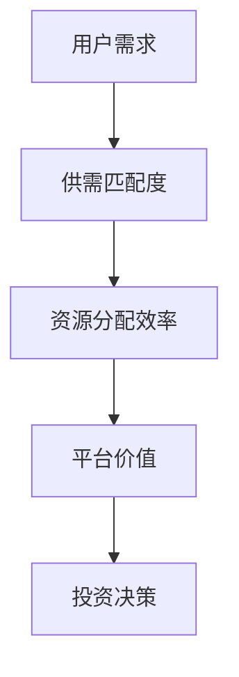
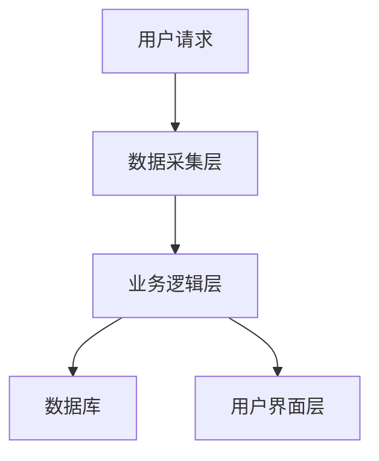
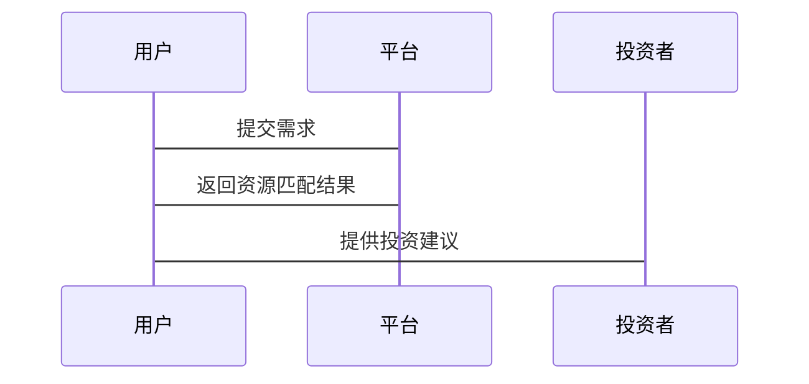

                 


# 《价值投资中的共享经济机会》

---

## 关键词：
共享经济、价值投资、投资机会、商业模式、市场分析、风险评估、案例分析

---

## 摘要：
本文探讨了共享经济与价值投资的结合，分析了共享经济的市场规模、投资机会以及价值投资在其中的应用。通过数学模型和系统架构设计，提出了共享经济中的价值评估方法，并结合实际案例，给出了最佳投资策略。

---

## 正文：

---

### 第一部分: 共享经济与价值投资的背景与概念

#### 第1章: 共享经济的起源与发展

##### 1.1 共享经济的定义与核心特征
共享经济是一种基于资源共享的经济模式，通过技术平台将闲置资源与需求者匹配，降低资源浪费并提高利用效率。其核心特征包括去中心化、灵活性和高效性。

| 共享经济模式 | 描述 |
|--------------|------|
| P2P平台      | 个人对个人的资源共享模式，如Airbnb、滴滴出行 |
| B2C平台      | 企业对个人的资源共享模式，如共享办公空间 |

##### 1.2 价值投资的基本概念
价值投资是一种长期投资策略，强调以低于内在价值的价格买入优质资产。其核心理念是寻找市场低估的公司，并长期持有。

| 价值投资原则 | 描述 |
|----------------|------|
| 买入便宜的 | 以低于内在价值的价格买入 |
| 长期持有 | 避免短期市场波动的影响 |
| 高质量企业 | 选择具有竞争优势的企业 |

##### 1.3 共享经济与价值投资的结合点
共享经济的商业模式与价值投资的长期增值理念高度契合。通过价值投资的方法，可以在共享经济中发现具有持续增长潜力的企业。

---

#### 第2章: 共享经济的市场分析与投资机会

##### 2.1 共享经济的市场规模与发展趋势
共享经济市场规模庞大，涵盖交通、住宿、办公空间等多个领域。随着技术进步和用户需求的增加，共享经济将持续增长。

##### 2.2 共享经济中的投资机会
共享经济平台的投资价值主要体现在其用户规模、市场占有率和盈利能力。例如，滴滴出行通过规模效应实现了快速扩张。

##### 2.3 价值投资在共享经济中的策略
价值投资者应关注共享经济企业的盈利能力、竞争优势和市场前景。例如，通过分析企业的成本结构和用户粘性，判断其投资价值。

---

### 第二部分: 共享经济的核心概念与联系

#### 第3章: 共享经济的核心概念与联系

##### 3.1 共享经济的核心概念
共享经济的参与者包括资源提供者、需求者和技术平台。资源分配和交易机制是其运作的核心。

##### 3.2 价值投资的核心概念
价值投资的评估标准包括企业的盈利能力、财务健康状况和行业地位。通过分析这些因素，判断企业的投资价值。

##### 3.3 共享经济与价值投资的关系
共享经济的商业模式为价值投资者提供了新的投资机会，而价值投资的长期视角有助于共享经济企业的稳定发展。

---

### 第三部分: 共享经济中的价值评估模型

#### 第4章: 共享经济中的价值评估模型

##### 4.1 共享经济平台的价值评估
共享经济平台的价值可以通过用户规模、收入和利润率等指标进行评估。数学模型如下：

$$
V = \frac{R}{r - g}
$$

其中，\( V \) 为平台价值，\( R \) 为年收入，\( r \) 为贴现率，\( g \) 为收入增长率。

##### 4.2 综合价值评估模型
综合评估模型包括供需匹配度、成本结构和用户粘性等因素。模型结构如下：



---

### 第四部分: 系统架构与实现方案

#### 第5章: 系统架构与实现方案

##### 5.1 项目背景与目标
本系统旨在通过技术手段评估共享经济平台的价值，为投资者提供科学依据。

##### 5.2 系统功能设计
系统功能模块包括数据采集、价值评估和风险预警。

##### 5.3 系统架构设计
系统架构采用分层设计，包括数据层、业务逻辑层和用户界面层。



##### 5.4 系统接口设计
系统接口采用RESTful API设计，支持数据交互和功能调用。

##### 5.5 系统交互设计
系统交互流程如下：



---

### 第五部分: 项目实战

#### 第6章: 项目实战

##### 6.1 环境安装
安装Python和相关库，如numpy和pandas。

##### 6.2 核心实现
共享经济价值评估算法的Python代码如下：

```python
import numpy as np

def calculate_value(income, discount_rate, growth_rate):
    return income / (discount_rate - growth_rate)

income = 10000000
discount_rate = 0.1
growth_rate = 0.05

value = calculate_value(income, discount_rate, growth_rate)
print(f"平台价值：{value}")
```

##### 6.3 案例分析
以某共享经济平台为例，分析其盈利能力、用户规模和市场前景，给出投资建议。

---

### 总结与展望

#### 总结
本文详细探讨了共享经济与价值投资的结合，提出了数学模型和系统架构设计，为投资者提供了科学依据。

#### 展望
未来，随着技术进步和市场发展，共享经济中的投资机会将更加丰富。

#### 最佳实践 Tips
1. 关注企业的长期盈利能力。
2. 选择具有竞争优势的共享经济平台。
3. 风险控制是投资成功的关键。

---

希望这篇文章能够为您提供清晰的思路和实用的方法，帮助您在共享经济中找到投资机会。

