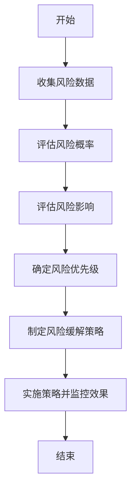

                 

# 价值投资中的可持续供应链管理分析

---

## 关键词：
价值投资、供应链管理、可持续性、风险管理、数学模型

---

## 摘要：
价值投资强调长期稳定的投资回报，而可持续供应链管理则是企业实现长期价值的重要手段。本文通过分析可持续供应链管理的核心概念、风险评估模型和优化策略，探讨其在价值投资中的应用，为企业优化供应链管理、提升投资价值提供理论和实践指导。

---

# 第1章: 可持续供应链管理与价值投资概述

## 1.1 价值投资的基本概念

### 1.1.1 价值投资的定义与核心原则

价值投资是一种以长期视角为基础的投资策略，核心在于识别市场低估的企业，投资其内在价值高于市场价格的证券。其核心原则包括：

- **安全边际**：购买价格低于内在价值，以降低风险。
- **长期视角**：关注企业的长期盈利能力，而非短期波动。
- **基本面分析**：通过分析企业的财务状况、行业地位和竞争优势来评估其价值。

### 1.1.2 价值投资与可持续发展的关系

可持续发展强调经济、社会和环境的平衡，而价值投资 increasingly incorporates environmental, social, and governance (ESG) factors into its analysis. Companies with strong ESG performance often exhibit better governance, lower risk exposure, and higher long-term profitability, making them attractive to value investors.

### 1.1.3 供应链管理在价值投资中的重要性

供应链管理是企业运营的核心，其效率和可持续性直接影响企业的成本、风险和盈利能力。对于价值投资者而言，一个高效且可持续的供应链能够降低企业的运营风险，提高其长期竞争优势。

---

## 1.2 可持续供应链管理的定义与特点

### 1.2.1 可持续供应链管理的定义

可持续供应链管理是一种通过优化供应链的环境、社会和经济影响，实现长期价值最大化的管理方式。它强调在供应链的各个环节中，减少资源消耗、降低污染、提高社会福祉，并确保供应链的透明性和道德性。

### 1.2.2 可持续供应链管理的核心特点

- **环境友好**：减少碳排放、资源浪费和污染。
- **社会责任**：确保供应链中的劳动条件符合道德标准。
- **经济高效**：通过优化流程降低成本，提高效率。
- **风险管理**：识别和缓解供应链中的潜在风险，提高供应链的韧性。

### 1.2.3 可持续供应链管理与传统供应链管理的区别

| 方面 | 可持续供应链管理 | 传统供应链管理 |
|------|------------------|----------------|
| 目标 | 长期可持续发展    | 最低成本交付    |
| 关注点 | 环境、社会、治理 | 成本、效率、时间 |
| 风险管理 | 主动识别与缓解   | 反应式处理      |
| 透明度 | 高               | 低或有限       |

---

## 1.3 价值投资与可持续供应链管理的结合

### 1.3.1 供应链可持续性对投资价值的影响

供应链的可持续性直接影响企业的长期盈利能力。例如，一个拥有高效、环保供应链的企业，能够降低生产成本，减少环境风险，并提升品牌形象，从而吸引更多客户和投资者。

### 1.3.2 可持续供应链管理在价值投资中的应用

- **识别投资机会**：投资者可以通过分析企业的供应链管理实践，发现那些在可持续供应链管理方面表现优异的企业。
- **评估企业风险**：供应链的不透明性或不可持续性可能带来运营风险，进而影响企业的长期价值。
- **提高投资组合的韧性**：选择那些在供应链管理中具备较高可持续性的企业，可以降低投资组合的整体风险。

### 1.3.3 可持续供应链管理对企业的长期价值

- **成本优势**：通过优化供应链流程，降低材料浪费和运输成本。
- **风险管理能力**：能够更快地响应供应链中断，减少损失。
- **品牌价值**：消费者越来越重视企业的社会责任，具备可持续供应链管理能力的企业更容易赢得消费者的信任。

---

## 1.4 本章小结

本章介绍了价值投资和可持续供应链管理的基本概念，并分析了两者的结合。可持续供应链管理不仅是企业运营的重要组成部分，也是价值投资者评估企业价值的重要因素。通过优化供应链的可持续性，企业能够实现长期的经济利益和社会价值。

---

# 第2章: 供应链管理的核心要素

## 2.1 供应链管理的基本框架

### 2.1.1 供应链的组成要素

供应链由多个环节组成，包括供应商、制造商、分销商、零售商和消费者。每个环节之间的协同合作是供应链高效运作的关键。

### 2.1.2 供应链的关键流程

- **采购与供应商管理**：选择可靠的供应商，建立长期合作关系。
- **生产与物流管理**：优化生产流程，确保物流高效、低成本。
- **库存管理**：通过精确的需求预测，降低库存成本。
- **质量管理**：确保产品符合质量标准，减少退货和浪费。

### 2.1.3 供应链的优化目标

- **降低成本**：通过消除浪费和优化流程，降低整体成本。
- **提高效率**：缩短交货时间，提高客户满意度。
- **增强韧性**：建立灵活的供应链，应对突发事件。

---

## 2.2 可持续供应链管理的核心要素

### 2.2.1 环境因素在供应链管理中的作用

- **减少碳排放**：通过使用绿色物流和可再生能源，降低碳足迹。
- **减少资源浪费**：采用循环经济模式，提高资源利用率。
- **减少污染**：通过环保技术，减少生产过程中的污染物排放。

### 2.2.2 社会责任在供应链管理中的体现

- **劳动权益**：确保供应链中的工人享有公平的工资和良好的工作条件。
- **道德采购**：避免与不道德的供应商合作，确保供应链的透明性。
- **社区支持**：通过供应链为当地社区创造就业机会，促进社会发展。

### 2.2.3 经济利益与可持续性的平衡

企业需要在追求经济利益的同时，兼顾供应链的可持续性。例如，选择稍微贵一些的环保材料，可以减少长期的环境成本和风险。

---

## 2.3 供应链管理中的风险与挑战

### 2.3.1 供应链中断的风险

- **自然灾害**：如地震、洪水等可能导致供应链中断。
- **政治风险**：如战争、贸易限制等可能影响供应链的稳定性。
- **供应商问题**：如供应商破产或罢工可能导致供应链中断。

### 2.3.2 可持续性带来的额外成本

- **绿色认证**：获得环保认证可能需要额外的成本。
- **技术升级**：采用环保技术可能需要投入更多资金。
- **员工培训**：培训员工遵守可持续供应链管理的要求可能需要额外的时间和资源。

### 2.3.3 供应链透明度的提升需求

- **消费者压力**：消费者越来越关注企业的社会责任，要求企业公开供应链信息。
- **监管要求**：政府可能出台新的法规，要求企业披露供应链中的环境和社会表现。

---

## 2.4 本章小结

本章详细介绍了供应链管理的核心要素，分析了可持续供应链管理中的环境、社会和经济因素。企业需要在追求经济利益的同时，兼顾供应链的可持续性，以实现长期的竞争力和价值。

---

# 第3章: 价值投资中的供应链风险管理

## 3.1 供应链风险管理的理论基础

### 3.1.1 供应链风险管理的定义

供应链风险管理是指识别、评估和缓解供应链中的潜在风险，以确保供应链的稳定性和韧性。这些风险可能来自自然灾害、供应商问题、政策变化等多个方面。

### 3.1.2 供应链风险管理的核心原则

- **全面性**：覆盖供应链的各个环节，识别所有潜在风险。
- **预防性**：通过制定应急预案，减少风险的影响。
- **动态性**：根据环境的变化，及时调整风险管理策略。

---

## 3.2 供应链风险管理的数学模型

### 3.2.1 风险评估模型

风险评估模型可以帮助投资者量化供应链中的潜在风险。常用的模型包括：

- **风险概率-影响矩阵**：根据风险发生的概率和影响程度，将风险分为高、中、低三类。
- **风险成本模型**：计算风险可能带来的直接和间接成本。

### 3.2.2 风险概率与影响的量化方法

- **风险概率**：通过历史数据和专家意见，评估风险发生的可能性。
- **影响程度**：通过财务损失、声誉损失等因素，评估风险的影响。

### 3.2.3 风险缓解策略的优化模型

优化模型可以通过数学方法，找到最优的风险缓解策略。例如，使用线性规划模型，确定在不同风险下的最优供应链布局。

---

## 3.3 供应链风险管理的算法原理

### 3.3.1 风险评估算法的流程图

### 3.3.2 风险缓解策略的优化模型

以下是一个简单的风险缓解策略优化模型：

$$
\text{最小化 } \sum_{i=1}^{n} (概率_i \times 影响_i)
$$

其中，$n$ 是风险的数量，$概率_i$ 是风险 $i$ 的概率，$影响_i$ 是风险 $i$ 的影响。

---

## 3.4 本章小结

本章介绍了供应链风险管理的理论基础和数学模型，强调了在价值投资中对供应链风险的评估和缓解的重要性。通过科学的风险管理，投资者可以更好地识别和应对供应链中的潜在风险，确保投资的长期稳定性。

---

# 第4章: 可持续供应链管理的实现路径

## 4.1 可持续供应链管理的实施步骤

### 4.1.1 确定可持续目标

企业需要明确供应链可持续管理的目标，例如减少碳排放、提高社会责任等。

### 4.1.2 评估现状与差距

通过审计和评估，了解当前供应链在可持续性方面的现状，并识别与目标之间的差距。

### 4.1.3 制定行动计划

根据评估结果，制定具体的行动计划，包括技术升级、供应商合作、员工培训等。

### 4.1.4 实施与监控

实施行动计划，并通过监控和反馈机制，不断优化供应链的可持续性。

---

## 4.2 可持续供应链管理的关键成功因素

### 4.2.1 高层支持

企业高层的支持是实现可持续供应链管理的关键，他们需要提供资源和决策支持。

### 4.2.2 供应商合作

与供应商建立长期合作关系，共同推动供应链的可持续发展。

### 4.2.3 技术创新

采用新技术，如区块链、物联网等，提高供应链的透明度和效率。

---

## 4.3 本章小结

本章总结了可持续供应链管理的实现路径和关键成功因素，强调了企业内部和外部合作的重要性，以及技术创新在实现可持续供应链管理中的作用。

---

# 第5章: 案例分析：价值投资中的可持续供应链管理实践

## 5.1 案例背景介绍

以某跨国制造企业为例，分析其在可持续供应链管理中的实践。

## 5.2 案例分析与启示

### 5.2.1 供应链优化的具体措施

- 采用绿色物流，减少碳排放。
- 与供应商签订可持续合作协议，确保原材料的来源符合道德标准。

### 5.2.2 投资回报分析

通过优化供应链管理，企业降低了成本，提升了品牌形象，吸引了更多的投资者。

---

## 5.3 本章小结

本章通过具体案例分析，展示了可持续供应链管理在价值投资中的实际应用，为企业提供了可借鉴的经验。

---

# 第6章: 结论与展望

## 6.1 本研究的主要结论

可持续供应链管理是价值投资的重要组成部分，通过优化供应链的可持续性，企业能够实现长期的经济利益和社会价值。

## 6.2 未来研究方向

未来的研究可以进一步探讨供应链风险管理的数学模型，以及如何通过技术创新进一步提升供应链的可持续性。

---

## 参考文献

（此处列出相关的书籍、期刊文章和其他参考文献）

---

## 致谢

感谢在撰写本文过程中提供帮助和支持的机构和个人。

---

通过以上结构，您可以逐步完成文章的撰写。每个章节和小节都需要详细展开，确保内容丰富、逻辑清晰。

