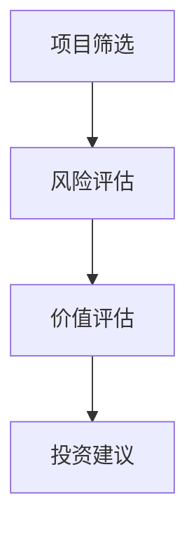

                 

# 价值投资中的合成生物学产业化前景

**关键词**：合成生物学、价值投资、产业化、经济模型、投资策略

**摘要**：本文探讨了合成生物学在产业化中的价值投资前景，分析了合成生物学的核心原理、产业化现状、经济模型及价值投资策略。通过技术分析、系统设计和案例研究，本文揭示了合成生物学如何为投资者带来长期回报，并提供了实际的投资建议。

---

## 第1章 合成生物学与价值投资的概述

### 1.1 合成生物学的基本概念

#### 1.1.1 合成生物学的定义与核心原理

合成生物学是结合生物学、工程学和信息科学的新兴学科，旨在通过设计和构建新的生物系统来解决实际问题。其核心原理包括：

- **模块化设计**：将生物系统分解为功能模块，便于组合和优化。
- **工程化方法**：采用工程化思路，从设计、测试到迭代优化。
- **多学科交叉**：结合基因组学、代谢工程和系统生物学等技术。

#### 1.1.2 合成生物学的主要应用领域

- **医疗健康**：生产药物、开发基因治疗。
- **能源与环境**：生产生物燃料、分解污染物。
- **工业生产**：优化工业流程、生产高附加值产品。

#### 1.1.3 合成生物学与传统生物技术的对比

| 对比维度 | 合成生物学 | 传统生物技术 |
|----------|------------|--------------|
| 设计方法 | 模块化设计，高度可控 | 依赖自然演化，难以预测 |
| 应用范围 | 广泛，解决复杂问题 | 有限，主要用于已知领域 |
| 技术复杂度 | 高，涉及多学科 | 较低，技术相对成熟 |

### 1.2 价值投资的基本概念

#### 1.2.1 价值投资的定义与核心理念

价值投资是一种长期投资策略，强调以低于内在价值的价格买入优质资产。其核心理念包括：

- **基本面分析**：研究公司的财务状况、行业地位和管理团队。
- **安全边际**：买入价格低于内在价值，以降低风险。
- **长期视角**：关注企业的长期增长潜力，而非短期波动。

#### 1.2.2 价值投资的主要策略与方法

- **选股标准**：选择具有强大护城河、良好财务状况和竞争优势的公司。
- **分散投资**：通过投资组合降低风险。
- **长期持有**：避免频繁交易，减少成本。

#### 1.2.3 价值投资在不同领域的应用

- **传统行业**：如金融、房地产等。
- **新兴行业**：如科技、生物技术等领域。

### 1.3 合成生物学与价值投资的结合点

#### 1.3.1 合成生物学产业化中的投资机会

- **技术创新**：合成生物学技术的突破可能带来颠覆性创新。
- **市场潜力**：合成生物学在医疗、能源等领域的应用前景广阔。
- **成本优势**：通过优化生产流程降低成本，提高效率。

#### 1.3.2 价值投资在合成生物学领域的独特优势

- **长期视角**：合成生物学项目的回报周期较长，适合价值投资。
- **深度分析**：通过基本面分析筛选出具有潜力的公司。
- **风险控制**：通过安全边际降低投资风险。

#### 1.3.3 合成生物学与价值投资的未来发展趋势

- **技术进步**：合成生物学技术的进一步成熟将带来更多投资机会。
- **政策支持**：政府对生物技术的支持将推动产业发展。
- **资本流入**：随着合成生物学应用的扩展，吸引更多资本进入。

---

## 第2章 合成生物学的产业化现状与挑战

### 2.1 合成生物学的产业化现状

#### 2.1.1 合成生物学在医疗领域的应用

- **基因治疗**：通过合成基因模块治疗遗传病。
- **生物制药**：生产重组蛋白药物。

#### 2.1.2 合成生物学在能源领域的应用

- **生物燃料**：生产乙醇、生物柴油等可再生能源。
- **二氧化碳利用**：将二氧化碳转化为有用物质。

#### 2.1.3 合成生物学在工业领域的应用

- **化学品生产**：生产塑料、纤维等材料。
- **环境保护**：分解工业污染物。

### 2.2 合成生物学产业化的主要挑战

#### 2.2.1 技术成熟度

- **技术瓶颈**：部分技术尚未成熟，存在不确定性。
- **研发投入**：需要大量资金和时间投入。

#### 2.2.2 市场接受度

- **消费者认知**：合成生物产品可能面临消费者接受度问题。
- **法规限制**：不同国家对合成生物学的监管政策不同。

#### 2.2.3 伦理问题

- **伦理争议**：合成生物学涉及生命伦理问题。
- **社会责任**：企业需承担社会责任，避免技术滥用。

### 2.3 合成生物学产业化中的经济模型

#### 2.3.1 成本结构分析

合成生物学项目的成本主要包括：

- **研发成本**：包括实验室费用、技术人员工资等。
- **生产成本**：包括原料、设备、人工等。
- **市场推广成本**：包括广告、渠道建设等。

#### 2.3.2 市场潜力分析

- **市场规模**：合成生物学在医疗、能源等领域的市场规模潜力巨大。
- **增长率预测**：预计未来几年合成生物学市场规模将快速增长。

#### 2.3.3 投资回报率预测

通过财务模型估算合成生物学项目的投资回报率：

$$ ROI = \frac{净收益}{初始投资} \times 100\% $$

其中，净收益可以通过收入减去成本得到，收入预测基于市场规模和价格。

---

## 第3章 合成生物学技术成熟度与投资决策

### 3.1 技术成熟度评估

#### 3.1.1 技术成熟度的评估标准

- **技术可行性**：技术是否成熟，能否大规模生产。
- **经济可行性**：生产成本是否低于传统方法。
- **市场可行性**：市场需求是否充足。

#### 3.1.2 技术成熟度评估方法

- **阶段划分**：从实验室研究到商业化分为多个阶段。
- **评分系统**：通过专家评分确定技术成熟度。

### 3.2 投资决策模型

#### 3.2.1 投资决策模型的设计

投资决策模型包括以下几个步骤：

1. **项目筛选**：根据技术成熟度、市场潜力等因素筛选项目。
2. **风险评估**：评估项目可能面临的技术、市场和财务风险。
3. **价值评估**：通过财务模型估算项目的投资回报率。
4. **决策建议**：根据评估结果给出投资建议。

#### 3.2.2 投资决策模型的实现

使用mermaid绘制投资决策模型的流程图：

---

## 第4章 合成生物学产业化中的价值投资策略

### 4.1 价值投资策略的设计

#### 4.1.1 核心要素分析

- **技术优势**：公司是否拥有独特的技术。
- **市场定位**：公司是否处于高增长市场。
- **财务状况**：公司是否具有健康的财务状况。

#### 4.1.2 投资策略框架

- **精选个股**：选择具有强大技术优势和竞争优势的公司。
- **分散投资**：通过投资组合降低风险。
- **长期持有**：避免短期波动，获得长期收益。

### 4.2 价值投资策略的实施

#### 4.2.1 项目选择标准

- **技术壁垒**：公司是否拥有难以复制的技术。
- **管理团队**：团队是否具有丰富的经验和良好的声誉。
- **财务健康度**：公司是否具有健康的财务状况和增长潜力。

#### 4.2.2 投资组合管理

- **资产配置**：根据市场变化调整资产配置。
- **定期评估**：定期评估投资组合的表现，及时调整。

---

## 第5章 合成生物学产业化中的风险与应对

### 5.1 产业化中的主要风险

#### 5.1.1 技术风险

- **技术失败**：技术开发失败导致项目失败。
- **技术替代**：新技术的出现可能导致原有技术被淘汰。

#### 5.1.2 市场风险

- **需求不足**：市场需求低于预期。
- **竞争加剧**：行业竞争加剧导致利润下降。

#### 5.1.3 政策风险

- **政策变化**：政策变化可能影响行业的发展。
- **监管风险**：严格的监管可能增加企业的运营成本。

### 5.2 风险应对策略

#### 5.2.1 技术风险管理

- **研发投入**：加大研发投入，提高技术成熟度。
- **技术储备**：储备多种技术，降低技术失败的风险。

#### 5.2.2 市场风险管理

- **市场调研**：深入了解市场需求，制定灵活的市场策略。
- **多元化发展**：拓展多个市场，降低单一市场风险。

#### 5.2.3 政策风险管理

- **政策跟踪**：密切关注政策变化，及时调整经营策略。
- **行业合作**：与行业协会和政府机构合作，争取政策支持。

---

## 第6章 合成生物学产业化中的价值投资案例分析

### 6.1 案例背景介绍

#### 6.1.1 案例选择标准

- **技术领先**：选择技术领先、市场潜力大的公司。
- **财务健康**：选择财务状况健康、增长潜力大的公司。

#### 6.1.2 案例分析步骤

- **公司基本面分析**：分析公司的财务状况、管理团队、行业地位等。
- **技术评估**：评估公司技术的成熟度和市场竞争力。
- **投资价值评估**：通过财务模型估算公司的投资价值。

### 6.2 案例分析与解读

#### 6.2.1 案例一：某合成生物技术公司

- **公司概况**：介绍公司的基本情况、技术优势等。
- **财务分析**：分析公司的财务状况，包括收入、利润、现金流等。
- **投资价值评估**：估算公司的内在价值，判断是否低估。

#### 6.2.2 案例二：某合成生物制药公司

- **公司概况**：介绍公司的基本情况、技术优势等。
- **财务分析**：分析公司的财务状况，包括收入、利润、现金流等。
- **投资价值评估**：估算公司的内在价值，判断是否低估。

### 6.3 案例总结与启示

- **投资启示**：通过案例分析，总结合成生物学领域的投资机会和风险。
- **经验教训**：总结投资过程中的经验教训，为未来投资提供参考。

---

## 第7章 合成生物学产业化中的未来展望

### 7.1 合成生物学的未来发展趋势

#### 7.1.1 技术进步

- **人工智能的应用**：利用AI技术加速合成生物学的研发。
- **合成细胞的开发**：开发更高效、更稳定的合成细胞。

#### 7.1.2 市场扩展

- **新应用领域的开拓**：合成生物学在更多领域的应用。
- **全球市场的扩展**：通过国际化布局扩大市场。

### 7.2 价值投资的未来机遇

#### 7.2.1 新兴技术的崛起

- **技术创新带来的投资机会**：新技术的出现可能带来新的投资机会。
- **行业整合**：行业整合可能带来投资机会。

#### 7.2.2 可持续发展

- **绿色投资**：合成生物学在可持续发展中的作用。
- **社会责任投资**：投资者 increasingly consider ESG factors.

### 7.3 合成生物学与价值投资的协同发展

- **技术创新与投资需求的结合**：技术创新满足投资需求，投资推动技术创新。
- **长期价值的实现**：通过长期投资实现合成生物学的产业化，创造长期价值。

---

## 第8章 合成生物学产业化中的最佳实践与注意事项

### 8.1 最佳实践

#### 8.1.1 技术与市场的结合

- **技术驱动**：以技术创新驱动企业发展。
- **市场导向**：以市场需求为导向，调整产品和策略。

#### 8.1.2 风险管理

- **分散投资**：通过多元化投资降低风险。
- **风险评估**：定期评估风险，及时调整策略。

#### 8.1.3 长期视角

- **长期投资**：保持长期视角，避免短期波动干扰。
- **持续学习**：持续学习和更新知识，保持竞争优势。

### 8.2 注意事项

#### 8.2.1 技术风险

- **技术可行性**：确保技术的可行性和成熟度。
- **技术替代**：关注新技术的发展，避免技术过时。

#### 8.2.2 市场风险

- **市场需求**：准确评估市场需求，避免过度乐观。
- **竞争分析**：深入分析竞争对手，制定应对策略。

#### 8.2.3 政策风险

- **政策变化**：密切关注政策变化，及时调整策略。
- **法规合规**：确保企业行为符合相关法规。

---

## 第9章 总结与展望

### 9.1 总结

- **核心观点**：合成生物学作为一项革命性技术，具有广阔的应用前景和投资潜力。
- **投资策略**：通过价值投资的方法，选择具有技术优势和竞争优势的公司，实现长期稳健的回报。

### 9.2 展望

- **技术创新**：合成生物学技术的进一步发展将带来更多投资机会。
- **市场扩展**：合成生物学将在更多领域得到应用，市场潜力巨大。
- **投资趋势**：价值投资将继续在合成生物学领域发挥重要作用，推动产业的快速发展。

---

## 附录

### 附录A 合成生物学相关术语解释

- **合成生物学**：一门结合生物学、工程学和信息科学的学科，旨在通过设计和构建新的生物系统来解决实际问题。
- **价值投资**：一种长期投资策略，强调以低于内在价值的价格买入优质资产。

### 附录B 价值投资中的关键指标

- **内在价值**：资产的真正价值，与市场价格可能不同。
- **安全边际**：买入价格低于内在价值，以降低投资风险。
- **净现值（NPV）**：投资项目的预期收益减去初始投资的现值。

### 附录C 参考文献

- [1] 理查德·费曼. 《物理学讲义》
- [2] 本杰明·格雷厄姆. 《价值投资》
- [3] 合成生物学相关学术论文和研究报告

---

通过以上结构和内容，文章系统地探讨了合成生物学在产业化中的价值投资前景，分析了技术、市场、经济等多个维度，并结合实际案例和最佳实践，为投资者提供了有益的参考和指导。

