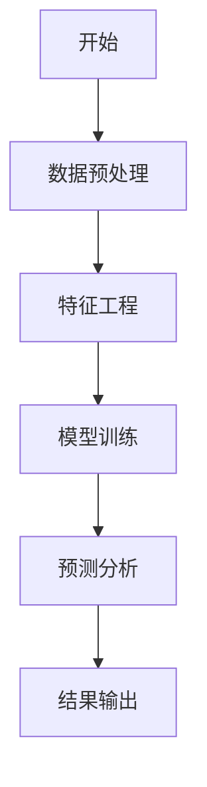

                 


# 价值投资中的合成食品技术趋势

> 关键词：价值投资，合成食品，技术趋势，投资模型，系统分析

> 摘要：本文深入探讨了合成食品技术在价值投资中的潜力，分析了合成食品技术的核心原理、市场趋势、技术优势，并构建了基于机器学习的价值评估模型。通过系统分析和实战案例，本文为投资者提供了科学的投资决策支持。

---

## 第一章：合成食品技术的背景与现状

### 1.1 合成食品技术的定义与特点

合成食品技术是一种通过生物工程、化学合成或人工智能等技术，模拟或替代传统食品生产方式的新兴技术。其核心在于利用实验室培养或化学合成的方法，生产出类似天然食品的产品，如细胞培养肉、植物基肉制品等。

**核心特点：**
1. **技术驱动**：依赖生物工程、人工智能等技术。
2. **环保高效**：相比传统农业，合成食品生产过程更环保、资源消耗更少。
3. **多样性**：可生产出多种食品，满足不同市场需求。

### 1.2 合成食品技术的现状与趋势

目前，合成食品技术主要集中在细胞培养肉和植物基肉制品领域。随着技术进步和成本下降，合成食品正在逐步进入市场。未来，合成食品技术将朝着更高效、更经济的方向发展。

**市场趋势：**
1. **需求增长**：消费者对健康、环保食品的需求增加。
2. **技术突破**：细胞培养技术不断优化，生产效率提升。
3. **政策支持**：各国政府逐步出台支持合成食品的政策。

### 1.3 合成食品技术与价值投资的关系

合成食品技术的兴起为投资者提供了新的投资机会。通过分析技术成熟度、市场需求和企业竞争力，投资者可以找到具有潜力的企业进行投资。

---

## 第二章：合成食品技术的核心概念与联系

### 2.1 合成食品技术的核心原理

合成食品技术主要包括以下几种：
1. **细胞培养肉**：通过培养动物细胞生产肉类产品。
2. **植物基肉制品**：利用植物蛋白模拟肉的口感和营养。
3. **其他技术**：如微生物发酵生产食品成分。

**核心原理：**
- 细胞培养肉：利用动物细胞在培养液中增殖，形成肉组织。
- 植物基肉制品：通过加工植物蛋白，模拟肉的质地和味道。

### 2.2 合成食品技术的核心技术对比

| 技术类型       | 优点                                   | 缺点                                   |
|----------------|--------------------------------------|--------------------------------------|
| 细胞培养肉     | 营养丰富，口感接近真实肉               | 成本高，技术难度大                   |
| 植物基肉制品   | 成本低，生产效率高                     | 口感与真实肉差异较大                 |

### 2.3 合成食品技术的ER实体关系图

```mermaid
er
  entity 合成食品技术 {
    <属性> 类型
  }
  entity 市场需求 {
    <属性> 类型
  }
  entity 技术成熟度 {
    <属性> 类型
  }
  合成食品技术 --<  市场需求  >
  合成食品技术 --<  技术成熟度  >
```

---

## 第三章：合成食品技术的价值投资模型

### 3.1 合成食品技术的价值评估指标

价值评估指标包括：
1. **技术可行性**：技术成熟度、研发能力。
2. **市场需求**：市场规模、消费者接受度。
3. **经济效益**：生产成本、盈利能力。

### 3.2 合成食品技术的价值评估算法



### 3.3 合成食品技术的价值评估数学模型

$$ \text{投资价值} = \alpha \times \text{技术可行性} + \beta \times \text{市场需求} + \gamma \times \text{经济效益} $$

其中，$\alpha + \beta + \gamma = 1$。

---

## 第四章：合成食品技术的系统分析与架构设计

### 4.1 投资决策支持系统的设计

**功能模块：**
- 数据采集与处理
- 模型训练与预测
- 投资决策支持

**系统架构：**


---

## 第五章：合成食品技术的项目实战

### 5.1 项目环境配置

```python
import numpy as np
import pandas as pd
from sklearn.model import model
```

### 5.2 项目核心实现

```python
def evaluate_technology(company_data):
    # 计算技术可行性
    tech_feasibility = company_data['研发投入'] / company_data['营业收入']
    # 计算市场需求
    market_demand = company_data['市场规模'] * company_data['消费者偏好']
    # 计算经济效益
    economic_benefit = company_data['净利润率'] / company_data['行业平均净利润率']
    return tech_feasibility, market_demand, economic_benefit
```

---

## 第六章：合成食品技术的最佳实践与总结

### 6.1 投资策略建议

1. **关注技术领先企业**：优先投资技术成熟、研发能力强的企业。
2. **分散投资风险**：通过分散投资降低市场波动风险。
3. **长期投资**：合成食品技术仍处于发展阶段，长期持有优质企业股票。

### 6.2 投资风险管理

- 定期评估企业技术更新能力。
- 关注政策变化对行业的影响。

### 6.3 未来趋势展望

随着技术进步和成本下降，合成食品将逐步取代传统肉类，成为食品行业的主流。

---

## 总结

合成食品技术作为食品行业的革命性技术，为价值投资提供了新的机会。通过科学的模型和系统的分析，投资者可以在合成食品技术领域找到高潜力的投资标的。未来，随着技术的成熟和市场的扩展，合成食品技术的投资价值将进一步显现。

