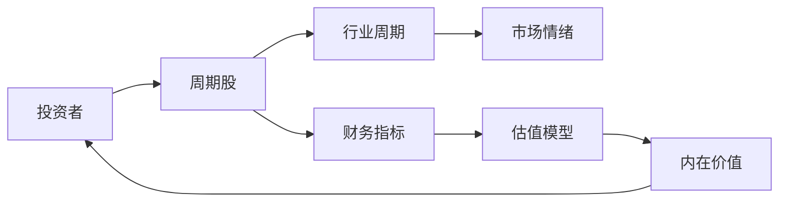
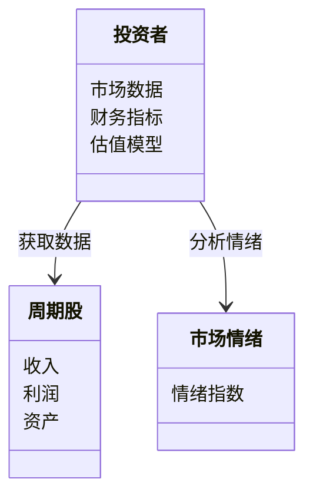
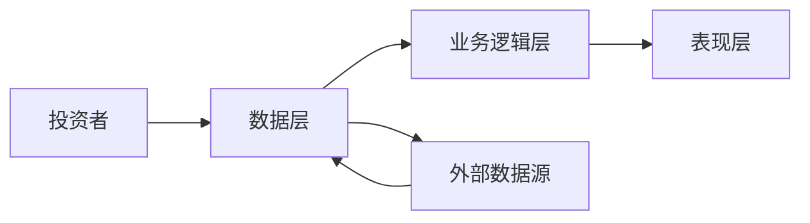

                 


# 价值投资中的周期股估值策略

> 关键词：价值投资，周期股，估值策略，DCF模型，PE指标，PB指标

> 摘要：本文深入探讨了价值投资中周期股的估值策略，结合理论与实践，详细讲解了如何利用DCF模型、PE、PB等指标进行周期性股票的估值，并通过实例分析帮助投资者做出明智决策。

---

# 第1章: 价值投资与周期股概述

## 1.1 价值投资的基本概念

### 1.1.1 价值投资的定义与核心理念

价值投资是一种投资策略，强调以低于内在价值的价格购买优质资产。其核心理念是寻找市场先生的错误定价，通过深入分析企业的基本面，寻找那些被市场低估的投资标的。

**价值投资的关键点**：
- 买入价格低于内在价值。
- 长期持有优质资产。
- 着重于企业的基本面分析。

### 1.1.2 周期股的定义与特点

周期股是指那些受到经济周期波动显著影响的行业股票。这些行业通常包括钢铁、能源、汽车制造和建筑材料等。

**周期股的特点**：
- 周期性明显：在经济繁荣时增长迅速，在衰退时大幅下降。
- 受行业供需关系影响较大。
- 财务指标波动性大，尤其是收入和利润。

### 1.1.3 价值投资与周期股的结合意义

价值投资与周期股的结合可以帮助投资者在经济低谷时发现被低估的股票，利用周期性波动带来的投资机会，实现长期收益。

---

## 1.2 周期性行业的特点

### 1.2.1 周期性行业的分类

周期性行业可以分为强周期性和弱周期性行业。强周期性行业受经济波动影响较大，如钢铁和能源；弱周期性行业则相对稳定，如部分科技行业。

### 1.2.2 行业周期波动的影响因素

行业周期波动受宏观经济政策、市场需求、供给能力、技术进步等因素影响。例如，能源行业的波动可能受到油价和政府政策的影响。

### 1.2.3 周期股在经济周期中的表现

在经济繁荣期，周期股表现优异；在衰退期，周期股往往被低估，为投资者提供了买入机会。

---

## 1.3 价值投资中的周期股投资策略

### 1.3.1 周期股投资的基本原则

- **长期视角**：关注企业的长期价值，而非短期波动。
- **安全边际**：买入价格低于内在价值。
- **行业分析**：深入了解行业周期，选择具有竞争优势的企业。

### 1.3.2 周期股投资的长期视角

周期股的波动性较大，但长期来看，优质周期股能够为投资者带来稳定回报。投资者应关注企业的盈利能力和财务健康状况。

### 1.3.3 周期股投资的风险与机会

- **风险**：经济衰退可能导致周期股大幅下跌。
- **机会**：经济复苏时，周期股可能迎来反弹。

---

# 第2章: 周期股估值的核心概念与联系

## 2.1 周期股估值的核心概念

### 2.1.1 市盈率（PE）与市净率（PB）的定义

- **市盈率（PE）**：股票价格与每股收益的比率，反映市场对股票的估值。
- **市净率（PB）**：股票价格与每股净资产的比率，适用于资产密集型行业。

### 2.1.2 周期股估值的关键指标对比

| 指标 | 优点 | 缺点 |
|------|------|------|
| PE   | 反映盈利能力 | 易受周期性影响 |
| PB   | 反映资产价值 | 适用于资产密集型行业 |

### 2.1.3 周期股估值的行业特性

周期股的估值需要结合行业周期和市场环境。例如，在经济衰退时，PB可能比PE更有效。

---

## 2.2 周期股估值的核心模型

### 2.2.1 现金流折现模型（DCF）的原理

DCF模型通过将未来现金流折现，估算企业的内在价值。公式如下：

$$
\text{内在价值} = \sum_{t=1}^{n} \frac{\text{现金流}}{(1 + r)^t} + \frac{\text{终值}}{(1 + r)^n}
$$

其中，$r$ 是折现率。

### 2.2.2 周期股估值的行业调整方法

在DCF模型中，需考虑行业周期因素。例如，在经济衰退期，现金流可能下降，需调整预测。

### 2.2.3 市场情绪与周期股估值的关系

市场情绪影响周期股的估值，特别是在市场恐慌时，周期股可能被过度低估。

---

## 2.3 周期股估值的实体关系图



---

# 第3章: 周期股估值的算法原理与数学模型

## 3.1 算法原理讲解

### 3.1.1 算法流程图


### 3.1.2 核心算法实现

```python
def calculate_intrinsic_value(revenue, cost, growth_rate, discount_rate):
    # 计算自由现金流
    free_cash_flow = revenue - cost
    # 计算未来现金流
    future_flows = []
    for i in range(5):
        future_flows.append(free_cash_flow * (1 + growth_rate))
    # 计算终值
    terminal_value = future_flows[-1] * (1 + growth_rate) / (discount_rate - growth_rate)
    # 计算折现现金流
    discounted_flows = [flow / (1 + discount_rate)**i for i, flow in enumerate(future_flows)]
    # 总计现值
    total_discounted_flows = sum(discounted_flows)
    # 内在价值
    intrinsic_value = (total_discounted_flows + terminal_value) / (1 + discount_rate)**5
    return intrinsic_value
```

---

## 3.2 数学模型与公式

### 3.2.1 现金流折现模型的数学推导

$$
\text{内在价值} = \frac{\text{现金流}}{(1 + r)^1} + \frac{\text{现金流}}{(1 + r)^2} + \dots + \frac{\text{现金流}}{(1 + r)^n} + \frac{\text{终值}}{(1 + r)^n}
$$

### 3.2.2 市盈率与市净率的比较

$$
\text{PE} = \frac{\text{股价}}{\text{每股收益}}
$$

$$
\text{PB} = \frac{\text{股价}}{\text{每股净资产}}
$$

---

# 第4章: 系统分析与架构设计方案

## 4.1 问题场景介绍

投资者需要一个系统来分析周期股的估值，考虑财务指标、行业周期和市场情绪。

## 4.2 系统功能设计

### 4.2.1 领域模型



### 4.2.2 系统架构



### 4.2.3 接口设计

投资者与系统交互，获取数据和分析结果。

---

# 第5章: 项目实战

## 5.1 环境安装

安装Python和相关库（如Pandas、NumPy）。

## 5.2 核心代码实现

```python
import pandas as pd
import numpy as np

def calculate_intrinsic_value(future_flows, discount_rate, terminal_value):
    discounted_flows = [flow / (1 + discount_rate)**i for i, flow in enumerate(future_flows)]
    total_discounted_flows = sum(discounted_flows)
    intrinsic_value = (total_discounted_flows + terminal_value) / (1 + discount_rate)**len(future_flows)
    return intrinsic_value

# 示例数据
future_flows = [100, 120, 140, 160, 180]
discount_rate = 0.1
terminal_value = 200

iv = calculate_intrinsic_value(future_flows, discount_rate, terminal_value)
print(f"内在价值: {iv}")
```

---

## 5.3 实际案例分析

以某周期性公司为例，分析其估值。

---

# 第6章: 最佳实践与总结

## 6.1 最佳实践

- **选择优质企业**：关注具有竞争优势的周期性企业。
- **动态调整估值**：根据市场变化和企业基本面调整估值模型。
- **风险管理**：合理控制仓位，分散投资。

## 6.2 小结

价值投资中的周期股估值需要结合多种指标和模型，注重长期视角和安全边际。

---

# 附录

## 附录A: 扩展阅读

推荐书籍和文章，供进一步学习。

## 附录B: 工具与资源

推荐的投资工具和数据源。

---

通过以上结构，您可以系统地学习周期股的估值策略，并在实际投资中应用这些方法。

