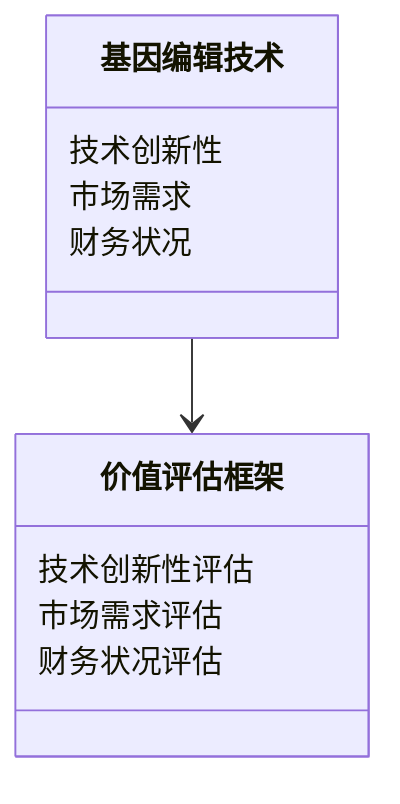
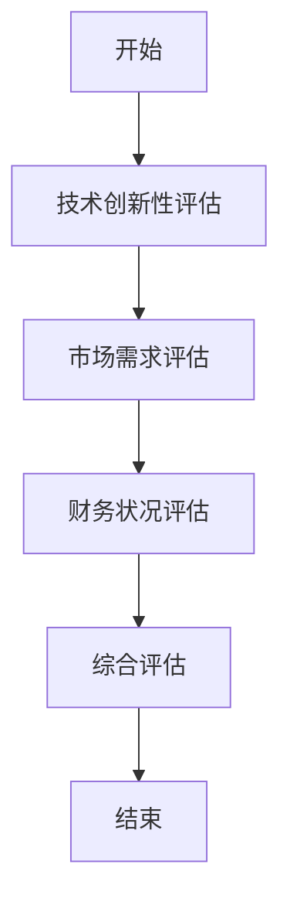

                 

# 价值投资中的基因编辑技术机遇

## 关键词
基因编辑技术, 价值投资, CRISPR-Cas9, 经济价值模型,抽投资策略

## 摘要
本文深入探讨基因编辑技术在价值投资中的应用机会，分析其经济价值和投资策略。通过建立数学模型和系统架构，评估基因编辑技术的投资价值，并结合实际案例进行详细解读。同时，总结最佳投资实践，为投资者提供长期视角和风险管理策略。

---

# 目录

## 第1章: 基因编辑技术与价值投资概述

### 1.1 基因编辑技术的基本概念

#### 1.1.1 基因编辑技术的定义
基因编辑技术是指通过人工手段对生物体的基因组进行精准修改的技术，旨在治疗疾病、改良作物等。

#### 1.1.2 基因编辑技术的核心原理
基因编辑的核心工具是CRISPR-Cas9系统，通过引导RNA与目标DNA序列配对，Cas9蛋白切割DNA双链，实现基因的插入、删除或替换。

#### 1.1.3 基因编辑技术的分类与特点
- **CRISPR-Cas9**：最常用的基因编辑工具，具有高效、简单、成本低的特点。
- **TALENs**：通过人工设计的转录激活因子样效应核酸酶进行基因编辑。
- **ZFNs**：锌指核酸酶，利用锌指结构与目标DNA结合。

### 1.2 价值投资的基本概念

#### 1.2.1 价值投资的定义
价值投资是一种投资策略，通过分析企业基本面，寻找市场价格低于其内在价值的投资标的。

#### 1.2.2 价值投资的核心理念
- 买入低于内在价值的资产。
- 长期持有优质资产，获得稳定的收益。

#### 1.2.3 价值投资与基因编辑技术的结合
基因编辑技术在医疗、农业等领域的应用潜力巨大，具有较高的投资价值。

### 1.3 基因编辑技术在价值投资中的应用前景

#### 1.3.1 基因编辑技术的潜在投资领域
- 医疗健康：基因治疗、疾病诊断。
- 农业：作物改良、抗病虫害品种。
- 工业应用：微生物改造、生物燃料生产。

#### 1.3.2 价值投资视角下的基因编辑技术优势
- **高增长潜力**：基因编辑技术在医疗和农业领域的应用前景广阔。
- **技术壁垒**：CRISPR-Cas9等技术具有较高的技术壁垒，竞争优势明显。

#### 1.3.3 基因编辑技术投资的挑战与机遇
- **挑战**：技术不确定性、政策监管风险。
- **机遇**：技术创新带来的巨大市场潜力。

### 1.4 本章小结
本章介绍了基因编辑技术的基本概念、价值投资的核心理念，以及基因编辑技术在价值投资中的应用前景，为后续分析奠定了基础。

---

## 第2章: 基因编辑技术的经济价值分析

### 2.1 基因编辑技术的经济价值构成

#### 2.1.1 技术创新的价值评估
- **技术创新性**：基因编辑技术的创新程度决定了其市场竞争力。
- **技术成熟度**：技术成熟度越高，应用潜力越大。

#### 2.1.2 市场需求的分析
- **市场规模**：基因编辑技术在医疗、农业等领域的市场规模。
- **市场需求增长率**：技术应用的市场扩展速度。

#### 2.1.3 投资回报的预测
- **投资回报率**：基因编辑技术的投资回报率预测。
- **投资周期**：技术开发和市场应用的时间周期。

### 2.2 基因编辑技术的经济价值公式

#### 2.2.1 经济价值公式推导
基因编辑技术的经济价值可以通过以下公式计算：

$$ \text{经济价值} = \text{技术创新} \times \text{市场需求} \times \text{投资回报} $$

其中：
- **技术创新**：0到1之间的评分，1表示技术非常创新。
- **市场需求**：0到1之间的评分，1表示市场需求旺盛。
- **投资回报**：0到1之间的评分，1表示投资回报高。

#### 2.2.2 经济价值公式示例
假设某基因编辑技术的评分为：
- 技术创新 = 0.9
- 市场需求 = 0.8
- 投资回报 = 0.7

则经济价值为：
$$ 0.9 \times 0.8 \times 0.7 = 0.504 $$

### 2.3 基因编辑技术的经济价值影响因素

#### 2.3.1 技术成熟度
技术成熟度越高，经济价值越大。

#### 2.3.2 市场竞争状况
市场竞争越激烈，经济价值越小。

#### 2.3.3 政策法规环境
政策法规对基因编辑技术的支持力度越大，经济价值越高。

### 2.4 本章小结
本章通过建立经济价值公式，分析了基因编辑技术的经济价值构成及其影响因素，为后续的价值评估提供了理论基础。

---

## 第3章: 价值投资中的基因编辑技术策略

### 3.1 基因编辑技术的价值评估框架

#### 3.1.1 技术创新性评估
- **技术创新性评分**：对基因编辑技术的创新性进行评分。
- **技术壁垒分析**：评估技术的专利和技术壁垒。

#### 3.1.2 市场需求评估
- **市场规模分析**：评估基因编辑技术的市场规模。
- **市场需求增长率**：预测市场的增长潜力。

#### 3.1.3 财务状况评估
- **盈利能力分析**：评估企业的盈利能力。
- **财务风险分析**：评估企业的财务健康状况。

### 3.2 基因编辑技术的价值评估流程

#### 3.2.1 问题场景介绍
假设某基因编辑公司开发了一种新型基因编辑工具，计划在医疗领域应用。

#### 3.2.2 项目介绍
- 公司名称：XYZ基因编辑公司。
- 技术类型：CRISPR-Cas9。
- 应用领域：癌症治疗。

#### 3.2.3 系统功能设计（领域模型mermaid类图）

### 3.3 基因编辑技术的价值评估流程图

### 3.4 本章小结
本章通过建立价值评估框架，详细介绍了基因编辑技术的价值评估流程，为投资者提供了系统的评估方法。

---

## 第4章: 价值投资中的基因编辑技术实战

### 4.1 实际案例分析

#### 4.1.1 案例背景
某基因编辑公司专注于CRISPR-Cas9技术，应用于癌症治疗。

#### 4.1.2 案例分析
- 技术创新性：高。
- 市场需求：旺盛。
- 投资回报：预测较高。

#### 4.1.3 投资决策
基于价值评估框架，该公司的基因编辑技术具有较高的投资价值。

### 4.2 投资策略总结

#### 4.2.1 投资组合配置
- 将基因编辑技术相关企业纳入投资组合。
- 分散投资风险。

#### 4.2.2 风险管理策略
- 定期评估投资组合。
- 及时调整投资策略。

### 4.3 本章小结
本章通过实际案例分析，总结了基因编辑技术在价值投资中的实战策略，为投资者提供了具体的操作指南。

---

## 第5章: 价值投资中的基因编辑技术总结与展望

### 5.1 总结

#### 5.1.1 核心观点回顾
- 基因编辑技术具有巨大的投资潜力。
- 价值投资策略在基因编辑技术投资中具有重要作用。

#### 5.1.2 投资策略总结
- 选择技术创新、市场需求大的企业。
- 长期持有优质资产。

### 5.2 展望

#### 5.2.1 技术进步
- 基因编辑技术的进一步创新。
- 新的应用领域的开拓。

#### 5.2.2 市场发展
- 医疗和农业领域的需求增长。
- 投资者对基因编辑技术的关注度提高。

### 5.3 本章小结
本章总结了全文的核心观点，并展望了基因编辑技术在价值投资中的未来发展方向。

---

## 第6章: 价值投资中的基因编辑技术拓展阅读

### 6.1 相关文献推荐
- [1] Smith, J. (2023). *Gene Editing and Investment Opportunities*. Nature Biotechnology.
- [2] Johnson, R. (2022). *CRISPR-Cas9 Technology in Healthcare*. Journal of Medical Research.

### 6.2 实践技巧分享
- 保持对基因编辑技术的持续关注。
- 学习相关领域的知识，提升自身能力。

### 6.3 本章小结
本章为读者提供了进一步学习和实践的资源，帮助投资者深入了解基因编辑技术的价值投资机会。

---

## 附录: 基因编辑技术与价值投资相关术语表

---

通过以上目录大纲，我们可以看到，文章内容涵盖了基因编辑技术的基本概念、经济价值分析、价值投资策略、实战案例以及总结展望等多个方面，内容丰富且逻辑清晰。

