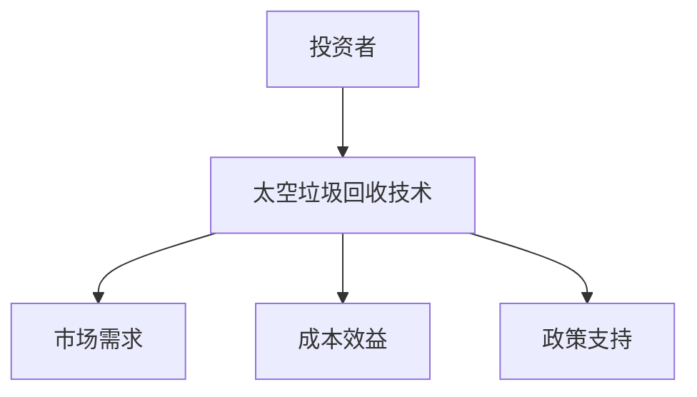
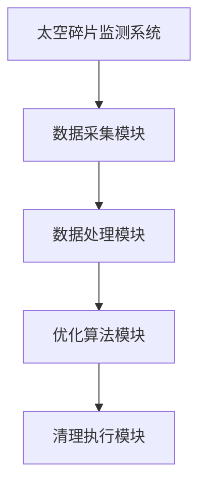

                 


# 价值投资中的太空垃圾回收技术发展前景

## 关键词：价值投资、太空垃圾、回收技术、商业航天、投资机会、技术趋势、可持续发展

## 摘要：  
太空垃圾问题日益严重，成为制约航天活动的重要因素。价值投资作为一种长期投资策略，关注于投资具有长期竞争优势和可持续发展潜力的标的。本文从技术、经济、政策等多维度分析太空垃圾回收技术的发展前景，探讨其对价值投资的潜在影响和投资机会。通过对核心技术、商业模式、市场需求和政策支持的分析，揭示太空垃圾回收技术在商业航天领域的重要地位和投资价值。

---

# 第一部分: 价值投资中的太空垃圾回收技术背景与现状

## 第1章: 太空垃圾回收技术的背景与问题

### 1.1 太空垃圾问题的背景介绍

#### 1.1.1 太空垃圾的定义与分类
太空垃圾是指在地球轨道上运行但不再发挥功能的航天器部件、卫星、火箭残骸等物体。根据轨道高度，太空垃圾可分为低地球轨道（LEO，200-2000公里）、中地球轨道（MEO，2000-35,786公里）和高地球轨道（GEO，35,786公里以上）。低地球轨道是太空垃圾分布最密集的区域，尤其是随着小型卫星和星座项目的增多，LEO轨道的碎片数量急剧增加。

#### 1.1.2 太空垃圾问题的现状与趋势
截至2023年，地球轨道上的太空垃圾数量已超过3.6万个，其中99%是直径超过10厘米的碎片。这些碎片以极高的速度（每秒7-8公里）运行，对在轨卫星、国际空间站和其他航天器构成严重威胁。SpaceX、NASA、ESA等机构的数据显示，未来10年，LEO轨道的碎片数量将以每年10%-15%的速度增长。

#### 1.1.3 太空垃圾对航天活动的影响
太空垃圾不仅威胁在轨航天器的安全，还增加了航天活动的成本。据统计，卫星运营商每年因太空垃圾威胁而增加的成本已超过10亿美元。此外，太空垃圾问题还可能影响全球通信、导航系统和天气监测等关键基础设施。

---

### 1.2 价值投资的基本概念与原则

#### 1.2.1 价值投资的核心理念
价值投资是一种长期投资策略，强调以低于公平市场价值的价格买入具有长期竞争优势的企业。其核心理念是寻找市场低估的标的，关注企业的基本面、竞争优势和可持续发展潜力。

#### 1.2.2 价值投资在科技领域的应用
在科技领域，价值投资通常关注那些具有强大研发能力、市场领导地位和高壁垒的企业。例如，SpaceX、Blue Origin等公司在商业航天领域的成功，证明了科技领域的价值投资具有较高的回报潜力。

#### 1.2.3 太空垃圾回收技术的商业价值
太空垃圾回收技术属于新兴的商业航天领域，具有广阔的市场空间和较高的技术门槛。随着太空经济的快速发展，太空垃圾回收技术将从成本高昂的“负担”转变为高价值的“资产”，成为商业航天生态中的重要环节。

---

## 第2章: 太空垃圾回收技术的经济价值与投资机会

### 2.1 太空垃圾回收技术的市场需求

#### 2.1.1 卫星运营商的成本压力
卫星运营商面临日益增长的碎片威胁，每年需要投入大量资金用于卫星防护和轨道调整。太空垃圾回收技术可以显著降低这些成本，同时延长卫星的使用寿命。

#### 2.1.2 空间站与航天器的维护需求
国际空间站和其他大型航天器需要定期清理外部碎片，以确保其安全运行。太空垃圾回收技术可以提供高效的解决方案，降低维护成本。

#### 2.1.3 太空垃圾治理的国际合作与政策支持
国际社会正在积极推动太空垃圾治理，例如《轨道碎片减缓与消除国际公约》等政策的出台。这些政策为太空垃圾回收技术的商业化提供了法律支持和市场保障。

---

### 2.2 太空垃圾回收技术的商业模式

#### 2.2.1 服务订阅模式
回收技术提供商可以向卫星运营商、航天器制造商等客户提供定期清理服务，按需收费。

#### 2.2.2 技术研发与专利授权
领先的回收技术企业可以通过专利授权和技术转让，为其他企业提供技术支持。

#### 2.2.3 政府采购与国际合作项目
政府和国际组织可以通过采购服务或资助项目，支持太空垃圾回收技术的发展。

---

## 第3章: 太空垃圾回收技术的核心概念与联系

### 3.1 太空垃圾回收技术的核心原理

#### 3.1.1 卫星捕获与拖拽技术
卫星捕获与拖拽技术通过机械臂或其他工具捕获碎片，并将其拖拽至大气层烧毁。这种方法适用于较大的碎片。

#### 3.1.2 激光清理技术
激光清理技术利用高能激光器照射碎片，使其轨道降低并重新进入大气层烧毁。这种方法适用于中小型碎片。

#### 3.1.3 机械臂与网状捕获技术
机械臂和网状捕获技术结合了机械臂的操作灵活性和网状结构的高效捕获能力，适用于多种形状和大小的碎片。

---

### 3.2 太空垃圾回收技术的关键属性对比

| **技术**       | **优点**                           | **缺点**                           |
|----------------|----------------------------------|----------------------------------|
| 卫星捕获与拖拽 | 高效、可重复使用                   | 成本高、技术复杂                   |
| 激光清理       | 非接触式、适用于多种碎片大小     | 易受天气影响、能量需求大           |
| 机械臂与网状   | 灵活性高、适用范围广               | 维护复杂、效率较低                 |

---

### 3.3 实体关系图与技术架构



---

# 第二部分: 太空垃圾回收技术的算法与数学模型

## 第4章: 太空垃圾轨道预测与回收路径优化算法

### 4.1 轨道预测算法

#### 4.1.1 基于历史数据的轨道预测模型
轨道预测模型通过分析碎片的历史轨迹，预测其未来位置。常用的模型包括线性回归和时间序列分析。

#### 4.1.2 机器学习算法在轨道预测中的应用
机器学习算法（如随机森林和神经网络）可以提高轨道预测的准确性，通过学习碎片的运动规律，优化预测结果。

#### 4.1.3 轨道预测的数学模型与公式
轨道预测的数学模型基于开普勒定律和牛顿运动定律，如下：

$$ r = a \cdot (1 - e^2) / (1 + e \cos \theta) $$

其中，\( r \) 是轨道半径，\( a \) 是轨道长半轴，\( e \) 是轨道偏心率，\( \theta \) 是轨道角参数。

---

## 第5章: 太空垃圾回收路径优化的数学模型

### 5.1 激光清理技术的优化模型

#### 5.1.1 激光能量需求计算
激光清理需要计算碎片的体积、密度和轨道参数，以确定所需的激光能量。

$$ E = \frac{1}{2} m v^2 $$

其中，\( E \) 是能量，\( m \) 是碎片质量，\( v \) 是速度。

#### 5.1.2 轨道调整优化
通过优化碎片的轨道参数，减少激光清理的能量消耗。优化目标包括最小化能量消耗和最大化清理效率。

---

## 第6章: 太空垃圾回收技术的系统架构与实现

### 6.1 系统功能设计

#### 6.1.1 数据采集模块
数据采集模块负责收集太空碎片的位置、速度和轨道参数，使用GPS、激光雷达等技术。

#### 6.1.2 数据处理模块
数据处理模块对采集的数据进行清洗、分类和存储，使用数据库和数据挖掘技术。

#### 6.1.3 决策模块
决策模块基于预测模型和优化算法，制定碎片清理的最优方案。

---

### 6.2 系统架构设计



---

# 第三部分: 项目实战与最佳实践

## 第7章: 太空垃圾回收技术的项目实战

### 7.1 项目环境搭建

#### 7.1.1 系统架构选择
选择适合的系统架构，例如基于微服务的分布式架构。

#### 7.1.2 开发工具安装
安装Python、TensorFlow、Kafka等工具。

### 7.2 系统核心实现

#### 7.2.1 数据采集模块实现
编写Python代码，使用传感器采集碎片数据。

```python
import serial
import time

ser = serial.Serial('COM3', 9600)
while True:
    data = ser.readline().decode().strip()
    print(data)
    time.sleep(1)
```

#### 7.2.2 数据处理模块实现
编写数据处理代码，清洗和分类碎片数据。

```python
import pandas as pd

data = pd.read_csv('fragment.csv')
cleaned_data = data.dropna()
cleaned_data.to_csv('cleaned_fragment.csv', index=False)
```

---

## 第8章: 最佳实践与小结

### 8.1 投资建议与风险提示

#### 8.1.1 投资建议
1. 关注技术领先的企业，如SpaceX、Blue Origin。
2. 关注政策支持和国际合作项目。
3. 分散投资风险，避免过度集中。

#### 8.1.2 风险提示
1. 技术门槛高，研发周期长。
2. 市场需求不确定，依赖政策支持。

### 8.2 项目小结

太空垃圾回收技术是商业航天领域的重要方向，具有广阔的市场空间和较高的投资价值。通过价值投资，投资者可以抓住这一领域的长期发展机遇，实现资产的稳健增长。

---

## 总结

太空垃圾回收技术不仅是商业航天领域的核心技术，也是价值投资的重要方向。随着太空经济的快速发展，太空垃圾回收技术将从成本高昂的“负担”转变为高价值的“资产”，成为商业航天生态中的重要环节。通过本文的分析，投资者可以更好地把握这一领域的投资机会，实现长期稳健的收益。

