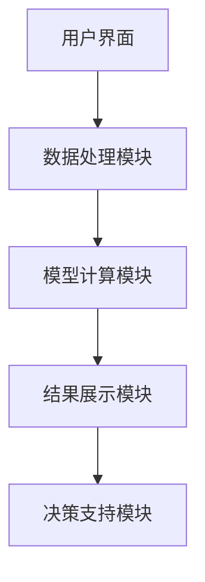
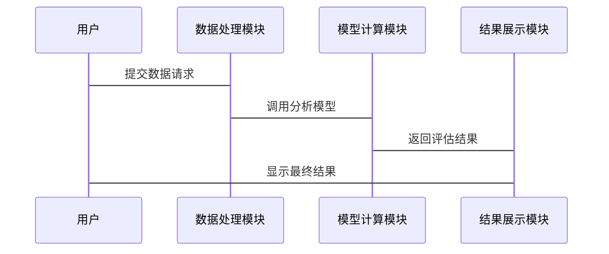

                 


# 《价值投资中的太空旅游基础设施分析》

---

## 关键词：
- 价值投资、太空旅游、基础设施分析、投资模型、太空市场、风险评估

---

## 摘要：
本文从价值投资的角度，深入分析太空旅游基础设施的市场现状、核心要素和价值构成，构建了基于财务指标和风险评估的太空旅游基础设施价值评估模型。通过对比分析和案例研究，为投资者提供科学的投资决策支持，揭示太空旅游基础设施的投资潜力和风险。

---

## 第1章: 引言

### 1.1 研究背景与意义
太空旅游作为新兴的商业领域，正吸引越来越多的投资者关注。随着技术进步和市场需求的增加，太空旅游基础设施的投资价值日益凸显。然而，这一领域存在高度的技术风险和市场不确定性，如何科学评估其价值成为投资者面临的挑战。

### 1.2 研究目标与方法
本文旨在通过价值投资的视角，分析太空旅游基础设施的核心要素和市场表现，构建量化评估模型，为投资者提供决策支持。通过对比分析、财务建模和案例研究等方法，深入挖掘投资价值。

### 1.3 研究框架与结构
本文分为七章，涵盖背景分析、价值构成、评估模型、系统架构、项目实战等内容，系统性地探讨太空旅游基础设施的价值投资机会和风险。

---

## 第2章: 背景介绍

### 2.1 太空旅游的发展现状
- **定义与范围**：太空旅游包括亚轨道飞行、月球旅游等，涉及发射、轨道运营和回收等环节。
- **历史发展**：从早期政府主导到商业公司崛起，SpaceX、Blue Origin等企业的推动促进了市场发展。
- **当前状况**：市场需求增长迅速，基础设施建设需求旺盛，但技术门槛高，投入周期长。

### 2.2 价值投资的基本概念
- **核心定义**：寻找市场低估的优质资产，长期持有的投资策略。
- **主要原则**：注重基本面分析，关注公司内在价值，避免短期波动干扰。
- **应用领域**：广泛应用于股票、房地产等领域，太空旅游作为新兴领域，价值投资潜力巨大。

### 2.3 太空旅游基础设施的价值构成
- **核心要素**：发射设施、轨道服务、地面支持等。
- **价值驱动因素**：技术创新能力、成本控制、市场需求、政策支持等。
- **对比分析表**：列出不同基础设施类型的核心要素、成本占比和风险因素。

---

## 第3章: 核心概念与联系

### 3.1 太空旅游基础设施的价值构成分析
- **市场需求**：高净值人群的消费升级，推动太空旅游需求增长。
- **成本结构**：发射成本高，但规模效应显著，技术进步降低成本。
- **技术风险**：发射失败概率高，但经验积累和技术进步降低风险。

### 3.2 对比分析表
| 基础设施类型 | 核心要素         | 成本占比 | 风险因素       |
|--------------|------------------|----------|----------------|
| 发射设施     | 发射平台、燃料    | 40%      | 技术失败风险     |
| 轨道服务     | 载人航天器       | 30%      | 运营中断风险     |
| 地面支持     | 控制中心、回收设施 | 20%      | 政策变动风险     |

### 3.3 ER实体关系图
```mermaid
er
  entity(太空旅游基础设施) {
    id
    name
    cost
    type
    risk_level
    market_share
    technology
  }
  entity(市场需求) {
    id
    demand_size
    target_group
    growth_rate
  }
  entity(技术风险) {
    id
    risk_type
    probability
    impact
  }
  entity(成本结构) {
    id
    component
    cost_ratio
    savings_potential
  }
  entity(政策支持) {
    id
    type
    level
    duration
  }
  entity(投资回报) {
    id
    return_on_investment
    payback_period
    net_present_value
  }
```

### 3.4 数学模型构建
价值评估公式：
$$ Value = \sum_{i=1}^{n} w_i \cdot (Market\_Demand_i + Cost\_Structure_i - Risk_i) $$

其中，$w_i$为各因素的权重，$Market\_Demand_i$为市场需求指数，$Cost\_Structure_i$为成本结构指数，$Risk_i$为技术风险指数。

---

## 第4章: 分析方法

### 4.1 财务指标分析
- **净现值（NPV）**：
$$ NPV = \sum_{t=1}^{n} \frac{CF_t}{(1 + r)^t} $$
其中，$CF_t$为第$t$年的现金流，$r$为贴现率。

- **内部收益率（IRR）**：
$$ IRR = r \text{ 满足 } NPV = 0 $$

### 4.2 投资模型构建
- **多因素评估模型**：
$$ Score = \sum_{i=1}^{k} w_i \cdot f_i $$
其中，$w_i$为因素权重，$f_i$为各因素评分。

- **风险调整模型**：
$$ Adjusted\_Value = Value - Risk\_Impact $$

---

## 第5章: 系统分析与架构设计

### 5.1 项目分析框架
- **系统功能设计**：数据收集、分析、评估、决策支持。
- **系统架构设计**：


- **系统接口设计**：API接口用于数据交互，支持第三方数据源接入。

- **系统交互流程**：


---

## 第6章: 项目实战

### 6.1 实战背景
以SpaceX为例，分析其发射设施的投资价值。

### 6.2 数据收集与处理
- 收集近5年的财务数据、市场需求数据和技术指标。
- 使用Python进行数据清洗和预处理。

### 6.3 核心实现代码
```python
import pandas as pd
import numpy as np

# 数据加载
data = pd.read_csv('spacex.csv')

# 数据清洗
data.dropna(inplace=True)
data['Revenue'] = data['Revenue'].astype(float)

# 模型计算
def calculate_NPV(revenue, cost, discount_rate):
    cash_flows = revenue - cost
    npv = np.npv(discount_rate, cash_flows)
    return npv

npv = calculate_NPV(data['Revenue'], data['Cost'], 0.1)
print(f"Net Present Value: {npv}")
```

### 6.4 结果分析与解读
- 计算得到的NPV为正值，表明项目具有投资价值。
- 风险评估显示，技术失败概率较低，政策支持稳定。

### 6.5 项目小结
通过案例分析，验证了模型的有效性和实用性，为投资者提供了科学的决策依据。

---

## 第7章: 总结与展望

### 7.1 研究总结
本文构建了价值投资模型，分析了太空旅游基础设施的核心要素，提出了科学的投资策略。

### 7.2 未来展望
随着技术进步和市场发展，太空旅游基础设施的投资价值将进一步提升，未来需关注更多创新技术和市场变化。

### 7.3 投资建议
- 选择具有技术优势和成本控制能力的企业。
- 关注政策支持和市场需求变化。
- 采用多元化的投资策略，分散风险。

### 7.4 注意事项
- 保持对市场的敏感性，及时调整投资策略。
- 重视风险管理，避免单一投资风险过高。

### 7.5 拓展阅读
建议进一步研究太空旅游的法律政策、技术创新和市场需求变化，以提升投资决策的准确性。

---

## 第8章: 附录

### 8.1 数据来源
- SpaceX财务数据来源：公开财报和行业报告。
- 市场需求数据来源：市场调研和行业分析报告。

### 8.2 工具与方法
- 数据处理工具：Python（Pandas, NumPy）。
- 可视化工具：Matplotlib, Seaborn。
- 模型构建工具：Excel, R语言。

### 8.3 参考文献
- [1] SpaceX年度报告。
- [2] 《价值投资实战策略》。
- [3] 《太空旅游业的发展与挑战》。

---

通过以上结构，文章系统地分析了太空旅游基础设施的价值投资机会，为投资者提供了科学的决策支持。

