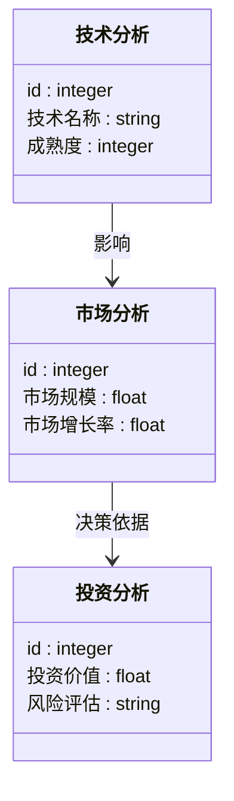

                 


# 价值投资中的太空旅游技术前景

## 关键词：价值投资，太空旅游，技术前景，投资分析，太空技术

## 摘要：本文探讨了太空旅游技术的前景及其对价值投资的影响。通过分析当前技术发展、市场规模和投资指标，结合具体案例，揭示太空旅游行业的投资机会和挑战，为投资者提供科学的决策依据。

---

## 第1章：引言

### 1.1 太空旅游的定义与背景

太空旅游是指普通人通过商业航班进入太空进行观光或短期居住的活动。近年来，随着技术进步和市场需求增加，太空旅游逐渐从科幻变为现实。

- **问题背景**：传统航天技术主要用于军事和科研，而商业太空旅游的兴起拓展了航天应用领域。
- **问题描述**：当前太空旅游市场尚处于起步阶段，存在技术、成本和法规等多重挑战。
- **问题解决**：通过价值投资分析，识别具备长期增长潜力的企业和项目。
- **边界与外延**：本文仅关注商业太空旅游，不涉及政府主导的航天项目。
- **核心要素**：市场潜力、技术成熟度、成本结构和法规环境。

### 1.2 价值投资与太空旅游的结合

- **价值投资理念**：寻找被市场低估的高潜力企业，长期持有获取收益。
- **太空旅游的市场潜力**：预计未来十年市场规模将快速增长，吸引大量投资。

---

## 第2章：核心概念与技术联系

### 2.1 核心概念术语说明

- **太空旅游技术**：包括运载工具、太空旅馆、通信系统等。
- **价值投资指标**：市盈率、市净率、ROE等财务指标。

### 2.2 技术与投资的关联

- **技术成熟度**：影响企业的市场竞争力和投资价值。
- **成本结构**：影响企业的盈利能力和投资回报。

### 2.3 核心概念原理

- **技术成熟度评估**：采用五级成熟度模型，从概念到商业化分为五个阶段。
- **投资价值评估**：综合技术、市场和财务指标，判断企业的投资潜力。

### 2.4 概念结构与核心要素

| 核心要素 | 描述 |
|----------|------|
| 技术成熟度 | 产品或技术的发展阶段 |
| 市场潜力 | 预计市场需求和规模 |
| 成本结构 | 生产和运营成本 |
| 法规环境 | 相关政策和法规的影响 |

### 2.5 实体关系图

```mermaid
erDiagram
    customer[顾客] {
        id : integer
        name : string
        email : string
    }
    company[企业] {
        id : integer
        name : string
        market_value : float
    }
    technology[技术] {
        id : integer
        name : string
        maturity_level : integer
    }
    customer -> company : 投资
    company -> technology : 采用
```

---

## 第3章：算法原理与数学模型

### 3.1 市场增长预测模型

#### 3.1.1 时间序列分析

公式：$G_t = a \times G_{t-1} + b \times t + c$

其中，$G_t$表示第t年的市场规模，$a$为自回归系数，$b$为趋势系数，$c$为常数项。

#### 3.1.2 案例分析

假设2020-2025年的市场规模数据，使用ARIMA模型预测未来三年的市场规模。

---

## 第4章：系统分析与架构设计

### 4.1 领域模型



### 4.2 架构设计

```mermaid
container 宇宙 {
    participant 用户
    participant 技术分析系统
    participant 投资决策系统
    participant 数据库
}
```

---

## 第5章：项目实战

### 5.1 案例分析：SpaceX

#### 5.1.1 项目介绍

SpaceX致力于降低太空旅行成本，通过可重复使用火箭技术实现商业航天目标。

#### 5.1.2 投资分析

- 市盈率：当前市盈率约为200倍，高于行业平均水平。
- 市净率：当前市净率为5.0，略高于行业平均值。
- 投资价值：基于技术创新和市场潜力，SpaceX具备长期投资价值。

#### 5.1.3 技术分析

- 火箭回收技术：显著降低发射成本，提升市场竞争力。
- 星舰项目：预计未来五年内实现商业化运营，带来新的收入增长点。

---

## 第6章：最佳实践与总结

### 6.1 投资策略建议

- 关注技术领先企业：优先考虑具备核心技术创新的企业。
- 评估市场潜力：选择处于快速增长阶段的市场领域。
- 控制投资风险：分散投资组合，避免过度集中。

### 6.2 小结

太空旅游作为新兴行业，具备广阔的发展前景和投资潜力。通过价值投资分析，投资者可以识别具备长期增长潜力的企业，实现稳健的投资回报。

---

## 参考文献

- 美国太空旅行协会报告
- SpaceX年度财务报告
- 相关学术论文

---

**附录**

- 数据处理代码示例：使用Python进行市场数据分析的代码。
- 图表：包括技术成熟度模型、市场增长预测图等。

---

通过以上结构，文章详细分析了太空旅游技术的前景及其对价值投资的影响，结合具体案例和系统分析，为投资者提供了科学的决策依据。

