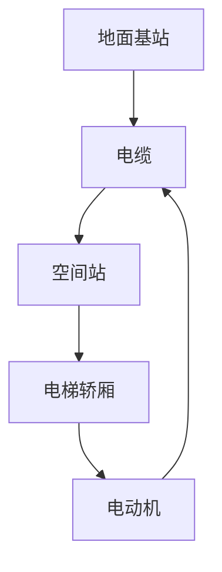
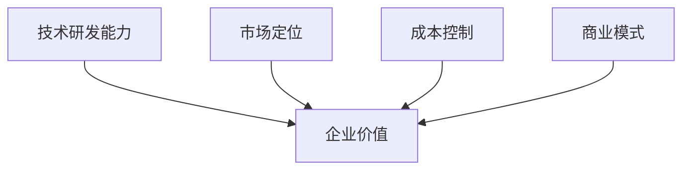

                 

# 价值投资中的太空电梯技术发展前景

> **关键词**：价值投资，太空电梯，技术发展，市场分析，投资策略，风险管理，实际案例

> **摘要**：太空电梯技术作为一项革命性的科技创新，正在吸引越来越多投资者的关注。本文从价值投资的角度，深入分析太空电梯技术的发展前景，探讨其技术原理、市场潜力、投资策略及风险管理。通过实际案例分析，为投资者提供科学的决策依据。

---

## 第一部分: 背景介绍

### 第1章: 太空电梯技术的基本概念

#### 1.1 太空电梯的定义与基本原理

太空电梯是一种通过超长电缆连接地面基站和空间站的设施，旨在提供一种高效、低成本的太空运输方式。其基本原理是利用地球自转产生的离心力，将电梯吊运至地球同步轨道，从而实现货物和人员的运输。这一技术的核心在于材料科学的进步，尤其是高强度碳纤维的应用，使得超长电缆的制造成为可能。

#### 1.2 价值投资的基本概念

价值投资是一种以低于内在价值的价格购买优质资产的投资策略。其核心在于寻找被市场低估的企业，长期持有以实现资本增值。与太空电梯技术的结合，意味着投资者需要评估技术的市场潜力和企业的竞争优势，寻找具有长期增长潜力的投资标的。

---

### 第2章: 太空电梯技术的发展背景

#### 2.1 太空电梯技术的历史发展

太空电梯的概念最早可以追溯到19世纪末，但真正的发展始于20世纪末。随着材料科学的进步，尤其是碳纳米管和石墨烯的应用，太空电梯技术逐渐从理论走向实践。近年来，全球多个企业和研究机构在太空电梯的研发上取得了显著进展，商业化进程加速。

#### 2.2 价值投资在科技领域的应用

科技领域的价值投资强调对技术创新和市场潜力的深入分析。投资者需要关注企业的技术研发能力、市场定位和商业模式，寻找那些具有持续增长潜力的企业。太空电梯技术作为一项颠覆性创新，具有巨大的市场潜力，吸引了众多投资者的关注。

---

## 第二部分: 核心概念与联系

### 第3章: 太空电梯技术的核心原理

#### 3.1 太空电梯的技术架构

太空电梯系统由地面基站、电缆、空间站和电梯轿厢组成。其中，电缆是系统的核心，需要具备超高的强度和耐久性。电梯轿厢通过电动机驱动，在电缆上移动，实现货物和人员的运输。

图1：太空电梯的技术架构

#### 3.2 价值投资的分析框架

价值投资者需要从多个维度分析太空电梯企业的价值，包括技术研发能力、市场定位、成本控制和商业模式。以下是一个分析框架：

- **技术研发能力**：企业的技术储备和研发团队实力。
- **市场定位**：企业在全球市场中的地位和竞争优势。
- **成本控制**：企业的生产效率和成本优势。
- **商业模式**：企业的盈利模式和市场拓展策略。

图2：价值投资分析框架

---

### 第4章: 太空电梯技术与价值投资的联系

#### 4.1 太空电梯技术的经济价值

太空电梯技术的经济价值体现在其降低太空运输成本的能力。传统火箭发射成本高昂，而太空电梯可以大幅降低运输费用，从而扩大太空经济的规模。

#### 4.2 价值投资在太空电梯技术中的应用

投资者需要关注太空电梯技术的市场潜力和企业的竞争优势。以下是价值投资的关键点：

- **市场需求**：太空电梯技术的应用场景包括卫星发射、太空旅游和资源开发。
- **技术门槛**：企业是否拥有核心技术，如电缆材料和控制系统。
- **竞争格局**：全球主要企业的布局和竞争态势。

---

## 第三部分: 技术发展现状与趋势

### 第5章: 太空电梯技术的现状分析

#### 5.1 当前太空电梯技术的进展

近年来，全球多个企业和研究机构在太空电梯技术上取得了显著进展。例如，美国的**公司和日本的**公司都在进行相关研发，部分项目已经进入试验阶段。

#### 5.2 价值投资在太空电梯技术中的现状

越来越多的投资者开始关注太空电梯技术的市场潜力，尤其是在私募股权和风险投资领域。一些科技投资基金已经开始布局相关企业，寻找具有长期增长潜力的投资标的。

---

### 第6章: 太空电梯技术的未来发展趋势

#### 6.1 太空电梯技术的未来发展方向

未来，太空电梯技术将朝着更高效率、更低成本和更广泛应用的方向发展。新材料的应用和人工智能技术的融入将推动系统性能的提升。

#### 6.2 价值投资的未来趋势

随着太空电梯技术的成熟，价值投资将更加注重企业的技术积累和市场布局。投资者需要关注企业的长期盈利能力和发展潜力，寻找具有持续增长能力的企业。

---

## 第四部分: 市场分析与投资机会

### 第7章: 太空电梯技术的市场潜力

#### 7.1 太空电梯技术的市场需求

太空电梯技术的市场需求主要集中在以下几个方面：

- **卫星发射**：降低发射成本，提高发射效率。
- **太空旅游**：满足个人和企业的太空探索需求。
- **资源开发**：支持月球和火星资源的开发。

#### 7.2 市场竞争格局

当前，全球主要的太空电梯研发企业包括**公司、**公司和**公司。这些企业在技术研发、市场布局和资金投入上各有优势。

---

### 第8章: 投资策略与风险管理

#### 8.1 投资策略

投资者需要制定科学的投资策略，包括：

- **长期持有**：关注企业的长期发展潜力。
- **分散投资**：降低投资风险。
- **动态调整**：根据市场变化及时调整投资组合。

#### 8.2 风险管理

太空电梯技术的发展面临诸多风险，包括技术失败、成本超支和市场接受度问题。投资者需要通过多元化投资和风险控制来降低风险。

---

## 第五部分: 实际案例分析

### 第9章: 典型案例分析

#### 9.1 公司案例

以**公司为例，分析其在太空电梯技术中的布局和投资价值。公司拥有一流的研发团队和强大的资金支持，具有较高的市场竞争力。

---

## 第六部分: 结论与展望

### 第10章: 结论与展望

#### 10.1 研究结论

太空电梯技术具有巨大的市场潜力，是价值投资的理想标的。投资者需要关注企业的技术研发能力和市场定位，寻找具有长期增长潜力的企业。

#### 10.2 未来展望

随着技术的成熟和市场的扩展，太空电梯技术将在未来发挥更大的作用。价值投资也将更加注重企业的技术积累和市场布局，为投资者带来丰厚的回报。

---

通过以上分析，我们可以看到太空电梯技术的发展前景广阔，价值投资在其中具有重要的作用。投资者需要深入分析技术和市场，寻找具有长期增长潜力的企业，实现投资收益的最大化。

