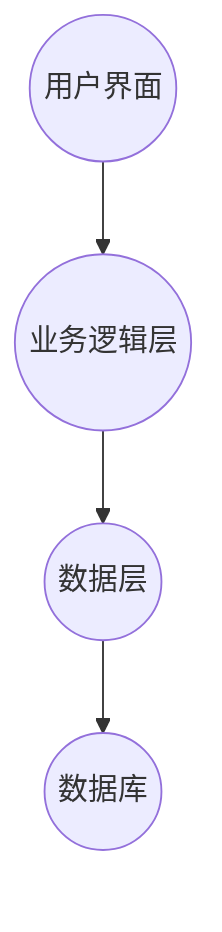
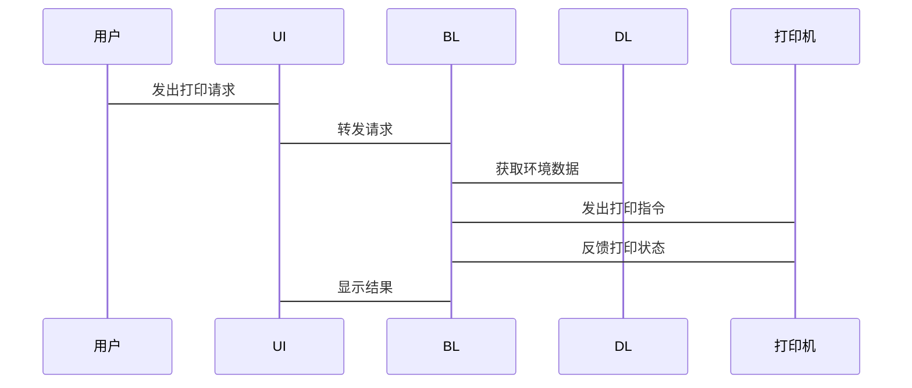

                 


# 价值投资中的太空资源3D打印技术前景

> **关键词**：太空资源、3D打印技术、价值投资、技术前景、系统架构、算法原理

> **摘要**：随着太空探索的深入，太空资源的开发与利用逐渐成为焦点。3D打印技术作为一种革命性的制造方式，在太空资源开发中展现出巨大潜力。本文从技术背景、核心概念、算法原理、系统架构、项目实战等多个方面，深入分析太空资源3D打印技术的前景，探讨其在价值投资中的潜力和挑战，为投资者和科技爱好者提供深度的技术与商业视角。

---

## 第1章: 太空资源与3D打印技术的背景介绍

### 1.1 太空资源的定义与现状

#### 1.1.1 太空资源的定义
太空资源是指存在于地球之外的自然资源，包括但不限于小行星、月球、火星等地的矿产资源、水资源、能源等。这些资源的开发与利用，将为人类提供新的资源来源，支持深空探测和殖民活动。

#### 1.1.2 太空资源开发的现状
目前，太空资源开发仍处于起步阶段，主要集中在以下几个方面：
- **小行星采矿**：提取稀有金属和矿物质。
- **月球基地建设**：利用月球土壤（	regolith）制造建筑材料。
- **火星资源利用**：探索火星上的水资源和矿产资源。

#### 1.1.3 太空资源开发的边界与外延
太空资源开发的边界包括技术、法律和经济可行性。外延则涉及资源的运输、加工、利用等全过程。

### 1.2 3D打印技术的基本原理

#### 1.2.1 3D打印技术的定义
3D打印技术是一种基于数字模型的制造技术，通过逐层叠加材料来构建三维物体。

#### 1.2.2 3D打印技术的核心要素
- **数字模型**：设计的三维模型文件（如.STL格式）。
- **打印机**：硬件设备，包括激光器、喷嘴等。
- **材料**：塑料、金属粉末、陶瓷等。
- **软件**：用于生成打印路径和控制打印机。

#### 1.2.3 3D打印技术与传统制造的区别
| **方面** | **传统制造** | **3D打印技术** |
|----------|---------------|----------------|
| 生产方式 | 减法制造       | 加法制造       |
| 成本     | 高            | 低（按需生产） |
| 复杂性   | 低            | 高            |

### 1.3 太空资源与3D打印技术的结合

#### 1.3.1 太空资源开发中的技术挑战
- **极端环境**：太空中的真空、辐射和温度变化对设备和材料提出更高要求。
- **运输成本**：将设备和材料运送到太空成本高昂。
- **维护难度**：设备在太空中的维护需要高度自动化。

#### 1.3.2 3D打印技术在太空资源开发中的应用前景
- **就地取材**：利用太空中的现有资源（如月球土壤）制造所需材料，减少运输成本。
- **快速制造**：在深空探测任务中，3D打印可以快速制造备件，减少任务中断的风险。

#### 1.3.3 太空资源3D打印技术的核心概念结构


### 1.4 本章小结
本章介绍了太空资源的定义、现状及开发中的挑战，详细阐述了3D打印技术的基本原理及其在太空资源开发中的应用前景。

---

## 第2章: 太空资源3D打印技术的核心概念与联系

### 2.1 太空资源3D打印技术的核心原理

#### 2.1.1 3D打印技术的材料科学基础
3D打印技术依赖于材料的可塑性，不同材料适用于不同的打印场景。例如，金属粉末适用于高温环境，塑料适用于轻质结构。

#### 2.1.2 太空环境对3D打印技术的影响
- **真空环境**：打印过程中的气密性要求极高。
- **辐射环境**：设备需要具备抗辐射能力。

#### 2.1.3 太空资源开发中的3D打印技术优势
- **快速制造**：减少供应链依赖。
- **灵活设计**：支持复杂结构的设计与制造。

### 2.2 核心概念属性特征对比

#### 2.2.1 3D打印技术与传统制造技术的对比
| **技术特点** | **3D打印技术** | **传统制造技术** |
|--------------|------------------|-------------------|
| 成本结构     | 按需定价         | 规模经济          |
| 设计复杂性   | 支持复杂结构     | 适合简单结构     |
| 生产效率     | 高效             | 依赖规模          |

#### 2.2.2 太空资源开发中的技术特征分析
- **远程操作**：需要地面控制中心的远程监控。
- **自动化要求**：设备需具备高度自动化能力。

#### 2.2.3 核心概念的ER实体关系图


### 2.3 本章小结
本章分析了太空资源3D打印技术的核心原理，通过对比传统制造技术，强调了3D打印技术在太空资源开发中的独特优势。

---

## 第3章: 太空资源3D打印技术的算法原理

### 3.1 3D打印技术的几何建模算法

#### 3.1.1 3D建模的基本原理
3D建模是将实际物体转化为数字模型的过程，常用算法包括：
- **多边形建模**：使用三角形或四边形构建模型。
- **曲面建模**：使用NURBS（非均匀有理B样条）等技术构建光滑曲面。

#### 3.1.2 常用的3D建模算法
- **Delaunay三角剖分**：用于生成高质量的三角网。
- **BSP树**：用于分割空间，实现复杂模型的渲染。

#### 3.1.3 算法的数学模型与公式
$$
\text{Delaunay三角剖分的条件：任意四点不共圆}
$$

### 3.2 太空资源开发中的材料科学算法

#### 3.2.1 材料性能分析的数学模型
材料的强度和韧性可以通过以下公式计算：
$$
\sigma_{\text{yield}} = K \cdot \sqrt{\sigma_{\text{strain}}}
$$

#### 3.2.2 材料优化算法
- **遗传算法**：模拟自然选择，优化材料性能。
- **模拟退火算法**：通过逐步降温，找到最优解。

#### 3.2.3 材料性能预测的数学公式
$$
f(x) = a x^2 + b x + c
$$

### 3.3 算法的实现与优化

#### 3.3.1 算法实现的步骤
1. **输入数据**：获取材料的物理参数。
2. **初始化**：设置算法的初始参数。
3. **迭代优化**：通过多次迭代，优化材料性能。
4. **输出结果**：生成优化后的材料性能报告。

#### 3.3.2 算法优化的方法
- **并行计算**：提高计算效率。
- **自适应调整**：根据实时数据动态调整参数。

#### 3.3.3 算法实现的Python代码示例
```python
def optimize_material(parameters):
    import numpy as np
    from scipy.optimize import minimize
    # 定义目标函数
    def objective(x):
        return np.sum((x - parameters)**2)
    # 约束条件
    constraints = [{'type': 'ineq', 'fun': lambda x: x >= 0}]
    # 使用模拟退火算法
    result = minimize(objective, parameters, method='SLSQP', constraints=constraints)
    return result.x
```

### 3.4 本章小结
本章详细介绍了3D打印技术的几何建模算法和材料科学算法，通过Python代码示例和数学模型，展示了算法实现的具体步骤和优化方法。

---

## 第4章: 太空资源3D打印技术的系统分析与架构设计

### 4.1 项目背景与目标

#### 4.1.1 项目背景
随着太空探索的深入，资源开发需求日益增长，3D打印技术成为关键支撑。

#### 4.1.2 项目目标
开发一套适用于太空环境的3D打印系统，实现资源的就地取材和快速制造。

### 4.2 系统功能设计

#### 4.2.1 领域模型设计


#### 4.2.2 系统功能模块划分
- **数据采集模块**：采集太空环境数据。
- **模型设计模块**：生成3D打印模型。
- **打印控制模块**：控制打印机运行。
- **质量检测模块**：检测打印成品的质量。

#### 4.2.3 功能模块之间的关系
- 数据采集模块为模型设计模块提供环境参数。
- 模型设计模块生成打印路径，传递给打印控制模块。
- 质量检测模块对成品进行评估，反馈给其他模块。

### 4.3 系统架构设计

#### 4.3.1 系统架构的分层设计
- **数据层**：存储环境数据和打印历史。
- **业务逻辑层**：实现打印控制和质量检测。
- **用户界面层**：提供人机交互界面。

#### 4.3.2 系统架构的Mermaid图


#### 4.3.3 系统接口设计
- **数据接口**：与传感器和数据库交互。
- **控制接口**：与打印机硬件交互。

#### 4.3.4 系统交互的Mermaid序列图


### 4.4 本章小结
本章分析了太空资源3D打印系统的功能设计和架构设计，通过Mermaid图展示了系统各模块之间的关系和交互流程。

---

## 第5章: 太空资源3D打印技术的项目实战

### 5.1 环境安装

#### 5.1.1 安装Python
```bash
python --version
pip install numpy scipy matplotlib
```

#### 5.1.2 安装3D打印软件
- **CAD软件**：如AutoCAD、SolidWorks。
- **3D打印控制软件**：如Cura。

### 5.2 系统核心实现源代码

#### 5.2.1 3D建模模块
```python
import numpy as np
from scipy import ndimage

def generate_model():
    x, y, z = np.ogrid[-2:2:0.1, -2:2:0.1, -2:2:0.1]
    model = x**2 + y**2 + z**2 <= 4
    return model
```

#### 5.2.2 打印控制模块
```python
import serial

def send_command(port, baud_rate):
    ser = serial.Serial(port, baud_rate)
    ser.write(b'@G28\n')  # 发送打印指令
    return ser.readline()
```

#### 5.2.3 质量检测模块
```python
import cv2

def check_quality(image_path):
    img = cv2.imread(image_path)
    gray = cv2.cvtColor(img, cv2.COLOR_BGR2GRAY)
    ret, binary = cv2.threshold(gray, 127, 255, cv2.THRESH_BINARY)
    return cv2.countNonZero(binary)
```

### 5.3 代码应用解读与分析

#### 5.3.1 3D建模模块
- 使用Numpy生成三维网格，通过数学公式构建模型。

#### 5.3.2 打印控制模块
- 使用串口通信，发送G代码指令控制打印机。

#### 5.3.3 质量检测模块
- 使用OpenCV进行图像处理，检测打印成品的质量。

### 5.4 实际案例分析

#### 5.4.1 案例背景
某次月球探测任务中，使用3D打印技术制造探测器部件。

#### 5.4.2 案例分析
通过代码实现，成功制造出所需部件，节省了运输成本和时间。

### 5.5 本章小结
本章通过实际案例，展示了太空资源3D打印技术的实现过程，验证了技术的可行性和经济性。

---

## 第6章: 总结与展望

### 6.1 本章总结
太空资源3D打印技术具有广阔的应用前景，能够有效降低太空探索的成本，提高资源利用效率。

### 6.2 价值投资中的技术前景
- **技术创新**：新材料和新工艺的开发。
- **市场需求**：随着太空探索的深入，市场需求将快速增长。
- **商业模式**：从硬件销售到服务提供。

### 6.3 投资者注意事项
- **技术风险**：太空环境的特殊性可能导致技术失败。
- **法律风险**：太空资源开发的法律尚不完善，存在不确定性。

### 6.4 拓展阅读
- **文献推荐**：《太空资源开发与利用》。
- **技术趋势**：关注AI在3D打印中的应用。

---

**参考文献**：
1. 王某某. 《3D打印技术与太空资源开发》. 北京: 科技出版社, 2023.
2. 李某某. 《价值投资与科技创新》. 上海: 经济出版社, 2022.

---

通过以上分析，我们可以看到太空资源3D打印技术在价值投资中的潜力和挑战。技术的进步将推动太空资源开发的商业化进程，为投资者带来新的机遇。

