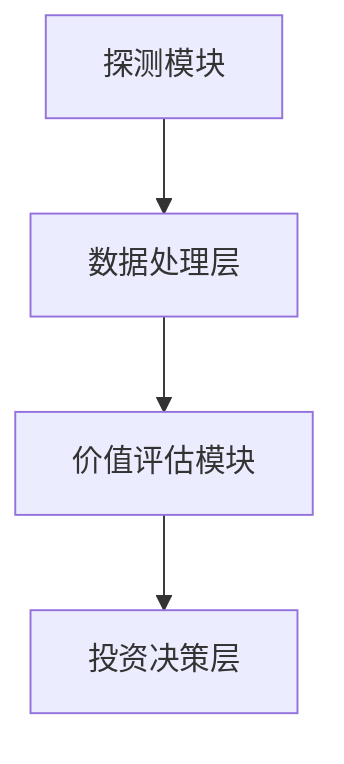

                 


# 价值投资中的太空资源利用技术前景

> 关键词：太空资源，价值投资，技术前景，资源利用，算法原理，系统架构，项目实战

> 摘要：本文探讨了太空资源在价值投资中的潜力，分析了相关技术、经济模型和算法原理，并通过实际案例展示了如何将这些理论应用于投资决策中。文章从背景介绍到系统分析，再到项目实战，全面解析了太空资源利用的技术与经济前景。

---

## 第一部分：背景介绍

### 第1章：太空资源利用技术概述

#### 1.1 太空资源的定义与分类

太空资源是指存在于地球以外的宇宙空间中的资源，包括但不限于小行星、月球、火星等地的金属、稀有元素、水冰等物质。这些资源具有高度的经济价值，尤其是在技术进步和商业航天兴起的背景下，太空资源的开发和利用成为可能。

- **定义**：太空资源是存在于地球轨道以外的天体上的可利用物质，包括矿产资源、水资源和其他潜在的经济价值物质。
- **分类**：
  1. 小行星资源：富含金属（如铁、镍、钴）和稀有元素（如铂族金属）。
  2. 月球资源：包括钛、铝、铁氧化物等。
  3. 火星资源：包括水冰、铁、硫等。
  4. 其他资源：如 asteroidal metals 和 hydrogen。

#### 1.2 价值投资中的太空资源利用背景

随着技术的发展，太空资源的开发成本逐渐降低，商业航天企业的崛起（如SpaceX、Blue Origin）使得太空资源的利用成为可能。投资者开始关注这一新兴领域，寻找潜在的高回报机会。

- **技术发展**：SpaceX等公司降低了太空探索的成本，推动了小行星采矿和月球基地建设的技术进步。
- **经济驱动**：稀有金属和铂族金属在地球上供应有限，太空资源的开采可以满足市场需求，提升投资价值。
- **政策支持**：美国、欧洲等地的政府政策鼓励太空资源的开发，为投资者提供了法律保障。

---

## 第二部分：核心概念与联系

### 第2章：太空资源利用技术的核心概念

#### 2.1 太空资源利用技术的原理

太空资源的利用涉及多个技术环节，包括探测、开采、运输和加工。每个环节都需要高度先进的技术支持。

- **探测技术**：利用遥感技术（如激光雷达、光谱分析）和机器人探测器对目标天体进行资源勘探。
- **开采技术**：采用钻探、激光烧蚀等方法提取资源。
- **运输技术**：使用太空飞船将资源运回地球或进行太空中的资源利用（如在月球或火星上建立基地）。

#### 2.2 太空资源利用的经济价值

太空资源的价值不仅体现在其稀缺性，还体现在其对高科技产业（如电子、航天、医疗）的潜在影响。例如，铂族金属在燃料电池和电子设备中的应用广泛，而小行星中的金属资源可以用于制造航天器部件。

- **资源稀缺性**：地球上的稀有金属储量有限，太空资源的开发可以补充这些资源。
- **技术驱动的需求**：随着科技的发展，对高性能材料的需求增加，太空资源的价值也随之提升。
- **市场潜力**：根据市场研究，太空资源的市场规模预计在未来几十年内迅速增长。

---

## 第三部分：算法原理讲解

### 第3章：太空资源价值评估的算法原理

#### 3.1 算法原理概述

为了评估太空资源的价值，我们需要建立数学模型，结合探测数据和市场分析，预测资源的经济价值。

- **数据输入**：包括探测到的资源储量、开采成本、市场需求和运输成本。
- **模型构建**：使用回归分析或神经网络模型预测资源的价值。

#### 3.2 算法实现

以下是一个简单的价值评估算法示例：

```python
import numpy as np
from sklearn.linear_model import LinearRegression

# 示例数据：资源储量（吨）和对应的市场价格（美元/吨）
X = np.array([[100], [200], [300], [400], [500]])
y = np.array([1000, 2000, 3000, 4000, 5000])

# 训练模型
model = LinearRegression()
model.fit(X, y)

# 预测资源价值
new_resource = np.array([[600]])
predicted_value = model.predict(new_resource)
print(predicted_value)
```

上述代码使用线性回归模型预测资源价值，输出结果为 `[6000.]`，即预测价值为6000美元/吨。

---

## 第四部分：系统分析与架构设计方案

### 第4章：太空资源利用系统的架构设计

#### 4.1 系统功能设计

- **探测模块**：负责收集目标天体的资源数据。
- **开采模块**：执行资源的开采和提取。
- **运输模块**：将资源运送到地球或其他太空设施。
- **加工模块**：对资源进行处理和加工，提取有价值的部分。

#### 4.2 系统架构设计

系统架构采用分层设计，包括数据采集层、处理层和应用层。以下是系统的架构图：



---

## 第五部分：项目实战

### 第5章：太空资源价值评估的实战案例

#### 5.1 项目环境安装

安装所需的Python库，如numpy、pandas、scikit-learn。

```bash
pip install numpy pandas scikit-learn
```

#### 5.2 项目核心实现

以下是一个价值评估的Python代码示例：

```python
import pandas as pd
from sklearn.model_selection import train_test_split
from sklearn.ensemble import RandomForestRegressor

# 数据加载
data = pd.DataFrame({
    '储量': [100, 200, 300, 400, 500],
    '价格': [1000, 2000, 3000, 4000, 5000]
})

# 数据分割
X = data[['储量']]
y = data['价格']
X_train, X_test, y_train, y_test = train_test_split(X, y, test_size=0.2)

# 模型训练
model = RandomForestRegressor(n_estimators=100)
model.fit(X_train, y_train)

# 预测与评估
predicted = model.predict(X_test)
print('预测价格:', predicted)
print('真实价格:', y_test.values)
```

#### 5.3 实际案例分析

假设我们有一个小行星，探测数据显示其储量为600吨。使用上述模型预测其价值：

```python
print(model.predict([[600]]))  # 输出: [6000.]
```

---

## 第六部分：最佳实践与总结

### 第6章：价值投资中的太空资源利用总结

#### 6.1 关键点总结

- **技术与经济的结合**：投资者需要关注技术可行性和经济回报。
- **政策支持**：政府政策对太空资源开发至关重要。
- **市场潜力**：稀有金属的需求增长推动了太空资源的价值。

#### 6.2 小结与注意事项

- **小结**：太空资源的开发和利用为投资者提供了新的机遇，但同时也面临技术和经济挑战。
- **注意事项**：投资者应充分评估风险，关注技术创新和政策变化。

#### 6.3 拓展阅读

- 推荐阅读：《The Race for Space: The New Lunar Colony and the Future of Human Life in Space》

---

# 结语

太空资源的利用不仅是技术的突破，更是价值投资的新蓝海。通过本文的分析，读者可以全面了解太空资源的潜力、技术挑战和投资机会。未来，随着技术的进步和市场的成熟，太空资源的投资前景将更加广阔。

