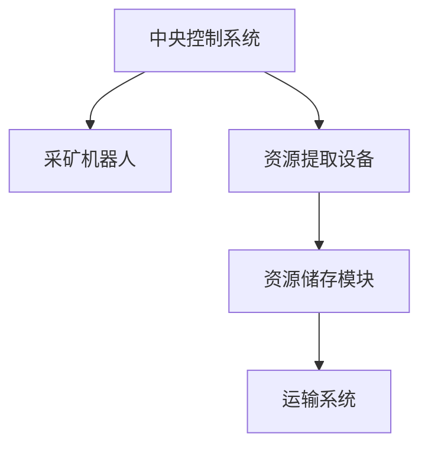

                 

# 价值投资中的太空采矿技术发展趋势

> **关键词**：价值投资，太空采矿，技术趋势，投资策略，数学模型，系统架构，案例分析

> **摘要**：  
> 本文探讨了价值投资在太空采矿技术领域的发展趋势，分析了太空采矿技术的核心概念、算法原理、数学模型以及系统架构。通过实际案例分析，揭示了如何通过价值投资策略来评估和选择具有潜力的太空采矿项目。文章还讨论了相关法律与伦理问题，并展望了未来的发展方向。

---

## 第一部分：价值投资与太空采矿的背景与概述

### 第1章：价值投资与太空采矿的概述

#### 1.1 价值投资的基本原理

**价值投资**是一种投资策略，强调通过深入分析企业的基本面，寻找市场低估的投资机会。其核心理念在于关注企业的内在价值，而非短期市场波动。以下是价值投资的基本原理：

- **核心概念**：价值投资强调企业的盈利能力、财务健康状况和行业地位。
- **投资策略**：寻找具有长期增长潜力但被市场低估的企业。
- **风险控制**：通过分散投资和严格筛选标的来降低风险。

**太空采矿技术**是指在地球之外的天体（如小行星、月球、火星等）上进行资源开采的技术。其核心目标是提取有价值的资源（如金属、稀有元素等），并将其用于工业或商业用途。

#### 1.2 太空采矿技术的基本概念

- **技术手段**：包括自动化采矿设备、资源提取技术、太空机器人等。
- **经济价值**：太空资源的开发可能为地球提供替代性资源，降低对地球资源的依赖。
- **技术挑战**：涉及极端环境适应性、资源提取效率、成本控制等问题。

#### 1.3 价值投资与太空采矿的结合

- **结合背景**：随着太空技术的进步，太空采矿逐渐从科幻走向现实，吸引了大量投资。
- **投资逻辑**：价值投资者关注太空采矿企业的技术优势、市场潜力和财务健康状况。
- **发展趋势**：太空采矿技术的商业化将为投资者带来新的机遇。

---

## 第二部分：太空采矿技术的发展趋势与核心概念

### 第2章：太空采矿技术的现状与未来趋势

#### 2.1 当前太空采矿技术的发展现状

- **国际项目**：SpaceX、Blue Origin等公司正在推动小行星采矿项目。
- **技术突破**：自动化采矿设备和资源提取技术逐渐成熟。
- **市场挑战**：成本高、技术复杂性大、法律法规不完善。

#### 2.2 太空采矿技术的未来发展趋势

- **技术创新**：人工智能和机器人技术将推动采矿效率提升。
- **市场需求**：随着太空探索的深入，对资源的需求将增加。
- **商业化前景**：太空采矿可能成为未来的新兴产业。

#### 2.3 太空采矿技术的核心要素与系统架构

**系统构成**：
- **采矿设备**：包括机器人、钻探设备等。
- **资源提取**：涉及化学分离、物理提取等技术。
- **通信与控制**：依赖于卫星通信和自动化控制系统。

**系统架构图**（Mermaid）：

---

## 第三部分：价值评估与投资策略

### 第3章：太空采矿技术的价值评估模型

#### 3.1 价值评估模型的构建原理

**价值评估模型**用于量化太空采矿技术的投资潜力，以下是其构建原理：

- **评估指标**：包括技术可行性、市场需求、财务回报率等。
- **数学模型**：通过公式量化各因素的权重和影响。

**数学公式**：

- 投资回报率（ROI）计算公式：
  $$ ROI = \frac{\text{净利润}}{\text{初始投资}} \times 100\% $$

- 风险评估模型：
  $$ \text{风险评分} = \sum (\text{风险因素权重} \times \text{风险发生概率}) $$

#### 3.2 案例分析与实际应用

**案例分析**：以SpaceX的小行星采矿项目为例，分析其价值评估过程。

---

## 第四部分：价值投资中的法律与伦理问题

### 第4章：太空采矿的法律与伦理挑战

#### 4.1 法律框架

- **国际法**：《外空条约》对太空资源的归属权进行了初步规范。
- **国内法**：各国正在制定相关法律法规。

#### 4.2 伦理问题

- **资源分配**：如何公平分配太空资源？
- **环境影响**：太空采矿可能对地球环境造成影响。

---

## 第五部分：成功案例与未来展望

### 第5章：价值投资中的成功案例

#### 5.1 成功案例分析

- **SpaceX**：通过技术创新和合理投资，成为太空探索领域的领导者。

#### 5.2 未来展望

- **技术进步**：人工智能和自动化技术将进一步推动太空采矿的发展。
- **投资机会**：随着技术成熟，太空采矿将吸引更多投资者。

---

## 结论

太空采矿技术的发展为价值投资提供了新的机遇，但也带来了技术、法律和伦理等多方面的挑战。投资者需要通过深入分析和技术评估，选择具有潜力的项目进行投资。未来，随着技术进步和法律法规的完善，太空采矿将成为价值投资的重要领域。

---

**全文完**

