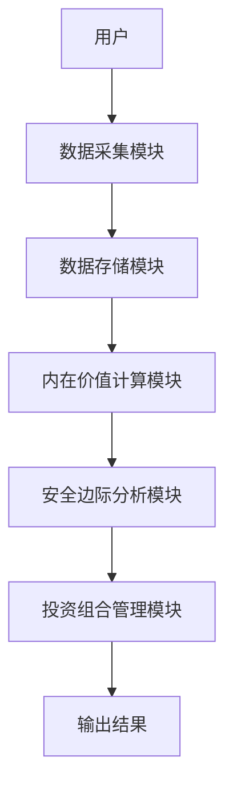

                 


# 《价值投资中的安全边际如何确定》

---

## 关键词：
- 价值投资
- 安全边际
- 内在价值
- 投资策略
- 风险控制

---

## 摘要：
价值投资是一种长期有效的投资策略，其核心在于通过购买低于内在价值的资产来实现超额收益。而安全边际是价值投资中至关重要的一个概念，它通过在价格与内在价值之间建立一个“安全空间”来降低投资风险。本文将从安全边际的定义、计算方法、实际应用以及系统化投资策略等多个方面，详细探讨如何在价值投资中确定和运用安全边际，帮助投资者在复杂多变的市场环境中实现稳健收益。

---

# 正文

## 第一部分: 价值投资与安全边际基础

### 第1章: 价值投资的核心概念

#### 1.1 价值投资的起源与发展

##### 1.1.1 价值投资的定义与特点
- **定义**：价值投资是一种基于对公司基本面分析的投资策略，旨在以低于公司内在价值的价格买入并长期持有优质资产。
- **特点**：
  - 长期导向：关注企业的长期价值，而非短期价格波动。
  - 逆向思维：在市场恐慌时买入，在市场狂热时卖出。
  - 安全边际：通过价格与价值的差异来降低投资风险。

##### 1.1.2 巴菲特与本·格雷厄姆的价值投资理论
- **本·格雷厄姆**：提出“安全边际”概念，强调以低于内在价值的价格买入资产，以确保投资的安全性。
- **巴菲特**：继承并发展了格雷厄姆的理论，强调投资优质企业，同时关注安全边际。

##### 1.1.3 安全边际在价值投资中的重要性
- 安全边际是价值投资的核心原则之一，它通过提供一个“缓冲区”来应对市场的不确定性和短期波动。

#### 1.2 安全边际的定义与作用

##### 1.2.1 安全边际的定义
- 安全边际 = 内在价值 - 市场价格
- 通俗来说，安全边际是投资者在买入价格与公司真实价值之间的差距，这个差距越大，投资的安全性越高。

##### 1.2.2 安全边际在投资中的作用
- **降低风险**：通过确保买入价格低于内在价值，减少因市场价格波动带来的损失。
- **提高收益潜力**：当市场价格回归内在价值时，投资者能够获得超额收益。

##### 1.2.3 安全边际与风险控制的关系
- 安全边际是风险控制的核心工具，通过量化价格与价值的差异，投资者可以更好地管理投资组合的风险。

#### 1.3 价值投资的核心要素

##### 1.3.1 内在价值的计算方法
- 内在价值是企业未来现金流的现值，常用的计算模型包括：
  - 股权自由现金流模型（DCF）。
  - 市盈率（P/E）和市净率（P/B）模型。

##### 1.3.2 市场价格与内在价值的差异
- 价格波动是市场的常态，内在价值是企业的“真实价值”，而市场价格受情绪影响，常常偏离内在价值。

##### 1.3.3 安全边际的量化标准
- 通常以内在价值的20%~30%作为安全边际，即买入价格为内在价值的70%~80%。

#### 1.4 价值投资与成长投资的对比

##### 1.4.1 价值投资与成长投资的异同
- **异**：
  - 价值投资关注低估资产，成长投资关注高增长企业。
  - 价值投资注重安全边际，成长投资注重长期增长潜力。
- **同**：
  - 都以基本面分析为基础，追求超额收益。

##### 1.4.2 安全边际在不同投资策略中的应用
- 价值投资强调安全边际，而成长投资则更关注企业的成长性和创新能力。

##### 1.4.3 价值投资的适用场景与局限性
- **适用场景**：市场低迷、资产价格被低估时。
- **局限性**：在高增长行业或新兴市场中，价值投资可能表现不佳。

---

### 第2章: 安全边际的计算方法

#### 2.1 内在价值的评估模型

##### 2.1.1 股权自由现金流模型
- **定义**：通过预测企业未来自由现金流，并将其折现为现值，计算内在价值。
- **公式**：
  $$ \text{内在价值} = \sum_{t=1}^{n} \frac{\text{自由现金流}_t}{(1+r)^t} + \frac{\text{终值}}{(1+r)^n} $$
  其中，\( r \)为折现率，\( n \)为预测期数。

##### 2.1.2 市盈率与市净率模型
- **市盈率（P/E）**：
  $$ \text{内在价值} = \text{每股收益} \times \text{合理市盈率} $$
- **市净率（P/B）**：
  $$ \text{内在价值} = \text{每股净资产} \times \text{合理市净率} $$

##### 2.1.3 综合评估模型
- 结合多种模型进行综合评估，减少单一模型的偏差。

#### 2.2 安全边际的量化标准

##### 2.2.1 市场价格与内在价值的折扣率
- **公式**：
  $$ \text{安全边际} = \text{内在价值} - \text{市场价格} $$
  安全边际率 = \( \frac{\text{安全边际}}{\text{内在价值}} \times 100\% \)

##### 2.2.2 市盈率与市净率的安全边际
- **市盈率法**：
  $$ \text{安全边际} = \text{内在价值} \times (1 - \frac{\text{当前市盈率}}{\text{合理市盈率}}) $$
- **市净率法**：
  $$ \text{安全边际} = \text{内在价值} \times (1 - \frac{\text{当前市净率}}{\text{合理市净率}}) $$

#### 2.3 安全边际的动态调整

##### 2.3.1 不同市场环境下的安全边际调整
- **牛市**：适当降低安全边际要求。
- **熊市**：提高安全边际要求。

##### 2.3.2 企业基本面变化对安全边际的影响
- **收入增长**：提高安全边际。
- **利润率下降**：降低安全边际。

##### 2.3.3 通货膨胀与安全边际的调整
- 通货膨胀会侵蚀购买力，因此需要适当调整安全边际。

---

### 第3章: 安全边际在投资组合中的应用

#### 3.1 投资组合的构建原则

##### 3.1.1 分散投资与集中投资的平衡
- 分散投资降低风险，集中投资提高收益潜力。

##### 3.1.2 安全边际在投资组合中的权重分配
- 根据资产的安全边际和内在价值，合理分配投资比例。

#### 3.2 安全边际与风险控制

##### 3.2.1 风险的定义与分类
- **系统性风险**：市场整体波动带来的风险。
- **非系统性风险**：特定资产或行业带来的风险。

##### 3.2.2 投资组合的风险控制
- 通过多样化投资和安全边际筛选，降低组合的整体风险。

---

## 第二部分: 安全边际的系统化投资策略

### 第4章: 系统分析与架构设计

#### 4.1 问题场景介绍
- **目标**：构建一个基于安全边际的价值投资系统。
- **用户需求**：投资者需要一个自动化、可扩展的工具来筛选和管理投资标的。

#### 4.2 系统功能设计
- **功能模块**：
  - 数据采集：获取公司财务数据、市场价格等。
  - 内在价值计算：基于多种模型评估公司价值。
  - 安全边际分析：计算安全边际并筛选优质资产。
  - 投资组合管理：根据安全边际构建投资组合。

#### 4.3 系统架构设计
- **架构图**（使用 Mermaid）：


#### 4.4 系统接口设计
- **输入接口**：
  - 用户输入投资目标和参数。
- **输出接口**：
  - 投资组合建议和实时监控数据。

#### 4.5 系统交互设计
- **交互流程**：
  1. 用户输入投资需求。
  2. 系统采集数据并进行分析。
  3. 系统生成投资组合建议。
  4. 用户根据建议进行投资操作。

---

### 第5章: 项目实战

#### 5.1 环境安装
- **工具**：Python、Pandas、NumPy、Matplotlib。
- **数据源**：Yahoo Finance API。

#### 5.2 核心实现源代码

##### 5.2.1 内在价值计算
```python
import pandas as pd
import numpy as np

def calculate_intrinsic_value(revenue, expense, cash_flow, discount_rate, years):
    # 计算自由现金流
    fcf = revenue - expense - cash_flow
    # 计算终值
    terminal_value = fcf * (1 + discount_rate) ** years
    # 计算现值
    pv = 0
    for i in range(years):
        pv += fcf * (1 + discount_rate) ** i
    # 计算终值现值
    pv += terminal_value / (1 + discount_rate) ** years
    return pv

# 示例计算
revenue = 10000000
expense = 6000000
cash_flow = 2000000
discount_rate = 0.08
years = 5

iv = calculate_intrinsic_value(revenue, expense, cash_flow, discount_rate, years)
print("内在价值：", iv)
```

##### 5.2.2 安全边际分析
```python
def calculate_margin_of_safety(iv, price):
    mos = iv - price
    mos_ratio = mos / iv * 100
    return mos, mos_ratio

iv = 50000000
price = 40000000

mos, mos_ratio = calculate_margin_of_safety(iv, price)
print("安全边际：", mos)
print("安全边际率：", mos_ratio)
```

#### 5.3 案例分析与详细解读
- **案例**：假设某公司内在价值为50元，市场价格为40元，安全边际为10元，安全边际率为20%。此时，买入该股票具有较高的安全边际。

---

## 第三部分: 最佳实践与总结

### 第6章: 最佳实践与总结

#### 6.1 本章小结
- 安全边际是价值投资的核心原则，通过量化价格与价值的差异，帮助投资者降低风险并实现超额收益。

#### 6.2 投资注意事项
- **持续学习**：市场环境不断变化，需持续更新知识和策略。
- **纪律性**：严格遵守安全边际的原则，避免情绪化投资。
- **分散投资**：降低单一投资的风险。

#### 6.3 拓展阅读
- 《The Intelligent Investor》——本·格雷厄姆
- 《巴菲特致股东的信》——巴菲特

#### 6.4 附录
- **公式汇总**
  - 内在价值计算公式。
  - 安全边际计算公式。
- **代码示例**
  - 内在价值计算代码。
  - 安全边际分析代码。

---

通过本文的系统化分析和实战案例，读者可以更好地理解如何在价值投资中确定和应用安全边际，从而在复杂的市场环境中实现稳健的投资收益。

