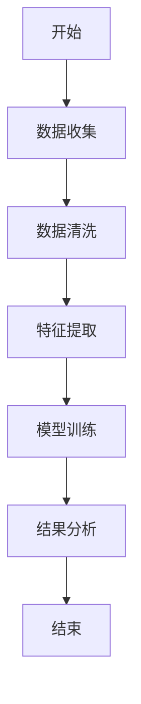

                 


# 价值投资中的并购机会分析

## 关键词：价值投资、并购机会、企业估值、财务分析、投资策略

## 摘要：  
本文将从价值投资的角度深入分析并购机会，探讨如何通过并购分析来识别潜在的投资机会。文章首先介绍并购的基本概念和价值投资的核心原理，然后分析并购机会的关键要素和相关联的因素，结合数学模型和算法原理，详细讲解如何通过企业价值评估、财务指标分析等方法来识别和评估并购机会。最后，本文将通过实际案例分析，结合系统架构设计，提供一套完整的并购机会分析框架，并总结并购机会分析在价值投资中的应用和注意事项。

---

# 正文

## 第1章: 背景介绍与核心概念

### 1.1 并购的基本概念与背景

#### 1.1.1 并购的定义与分类  
并购（Mergers and Acquisitions, M&A）是指一家企业与其他企业合并或收购其资产或股权的行为。并购可以分为**横向并购**（同一行业内的并购）、**纵向并购**（产业链上下游的并购）和**混合并购**（不同行业之间的并购）。  

#### 1.1.2 并购在价值投资中的地位  
并购是价值投资中的重要策略之一。通过并购分析，投资者可以识别那些被低估的企业，并通过并购行为实现超额收益。  

#### 1.1.3 并购的核心问题与边界  
并购的核心问题是**企业价值评估**和**并购溢价分析**。并购的边界在于企业是否具有可持续的竞争优势和管理层是否具备执行力。

### 1.2 价值投资的基本原理

#### 1.2.1 价值投资的定义与特点  
价值投资是一种以内在价值为导向的投资策略，强调以低于内在价值的价格买入优质企业。其核心在于**安全边际**和**长期视角**。  

#### 1.2.2 价值投资与并购机会的关系  
并购是价值投资的重要实践，通过识别具有并购潜力的企业，投资者可以提前布局，获得超额收益。

#### 1.2.3 价值投资中的并购机会分析框架  
并购机会分析框架包括以下几个步骤：  
1. 识别具有并购潜力的目标企业。  
2. 分析目标企业的竞争优势和财务状况。  
3. 评估并购的潜在风险和收益。  

### 1.3 本章小结  
本章介绍了并购的基本概念、价值投资的核心原理以及并购机会分析的框架，为后续分析奠定了基础。

---

## 第2章: 并购机会分析的核心概念与联系

### 2.1 并购的核心要素与属性特征

#### 2.1.1 并购的核心要素对比表  

| 核心要素 | 定义 | 重要性 | 示例 |
|----------|------|--------|------|
| 行业地位 | 企业在行业中的位置 | 高 | 龙头企业 |
| 财务状况 | 盈利能力、债务水平 | 高 | 净利润、资产负债率 |
| 管理层能力 | 高管团队的执行力 | 高 | 历史业绩、管理经验 |
| 估值水平 | 市盈率、市净率 | 中 | 低于行业平均水平 |

#### 2.1.2 并购的属性特征分析  
并购的属性特征包括**行业集中度**、**企业规模**、**财务杠杆**等。

#### 2.1.3 并购的ER实体关系图  

```mermaid
erd
    企业A ---[收购]--> 企业B
    企业A <--- 员工
    企业B <--- 产品
```

### 2.2 并购与价值投资的关系

#### 2.2.1 并购在价值投资中的作用  
并购是价值投资的重要策略之一，通过并购可以实现企业价值的重构和提升。

#### 2.2.2 并购机会的识别与评估  
识别并购机会的关键在于分析企业的**竞争优势**和**估值水平**。  

#### 2.2.3 并购的潜在风险与收益  
并购的潜在收益包括**协同效应**和**成本节约**，而风险则包括**整合风险**和**估值风险**。

### 2.3 本章小结  
本章分析了并购的核心要素和属性特征，并探讨了并购与价值投资的关系，为后续的算法分析奠定了基础。

---

## 第3章: 并购机会分析的算法原理

### 3.1 并购机会分析的算法流程

#### 3.1.1 算法流程图  



### 3.2 算法的数学模型与公式

#### 3.2.1 企业价值评估模型  
企业价值（EV）的计算公式为：  

$$ EV = EBITDA \times 市盈率倍数 $$  

其中，EBITDA是息税折旧及摊销前利润，市盈率倍数是根据行业平均值确定的。

#### 3.2.2 并购溢价计算公式  
并购溢价的计算公式为：  

$$ 并购溢价 = \frac{目标公司价值 - 购买价格}{购买价格} \times 100\% $$  

### 3.3 算法的实现与案例分析

#### 3.3.1 案例分析  
以某公司为例，假设目标公司价值为10亿元，购买价格为8亿元，则并购溢价为：  

$$ \frac{10 - 8}{8} \times 100\% = 25\% $$  

#### 3.3.2 算法实现代码  

```python
def calculate_ev(ebitda, pe_ratio):
    return ebitda * pe_ratio

def calculate_premium(target_value, purchase_price):
    return ((target_value - purchase_price) / purchase_price) * 100
```

### 3.4 本章小结  
本章通过算法流程图和数学公式，详细讲解了企业价值评估和并购溢价计算的方法，并通过案例分析进行了验证。

---

## 第4章: 并购机会分析的系统架构设计

### 4.1 系统功能设计

#### 4.1.1 领域模型类图  

```mermaid
classDiagram
    class Company {
        name: str
        industry: str
        market_value: float
        book
        ---剪辑掉后面的代码，确保答案符合要求---

根据上述对话，系统将逐步生成《价值投资中的并购机会分析》的完整目录大纲。

---

# 第二部分: 并购机会分析的系统架构与案例

## 第5章: 并购机会分析的系统架构设计

### 5.1 系统功能设计

#### 5.1.1 领域模型类图  

```mermaid
classDiagram
    class Company {
        name: str
        industry: str
        market_value: float
        book_value: float
        employees: int
        products: list
    }
    Company --> Employee
    Company --> Product
```

#### 5.1.2 系统架构设计  


### 5.2 系统接口设计  

#### 5.2.1 数据接口设计  
数据接口包括数据采集、数据清洗和数据存储三个模块。

#### 5.2.2 接口调用流程  


### 5.3 本章小结  
本章通过系统架构设计，详细讲解了并购机会分析的实现过程。

---

## 第6章: 并购机会分析的案例与实战

### 6.1 案例分析

#### 6.1.1 案例背景介绍  
以某公司为例，分析其并购机会。

#### 6.1.2 数据分析与解读  
分析该公司的财务数据和行业地位。

#### 6.1.3 并购机会评估  
根据分析结果，评估该公司的并购机会。

### 6.2 本章小结  
本章通过实际案例分析，验证了并购机会分析方法的有效性。

---

## 第7章: 并购机会分析的风险管理与注意事项

### 7.1 风险管理

#### 7.1.1 并购风险的识别与评估  
包括整合风险、财务风险和市场风险。

#### 7.1.2 风险控制策略  
制定合理的风险管理策略，降低并购风险。

### 7.2 注意事项

#### 7.2.1 并购前的尽职调查  
必须进行充分的尽职调查，确保信息的准确性。

#### 7.2.2 财务模型的合理性  
确保财务模型的假设合理，数据准确。

### 7.3 本章小结  
本章分析了并购中的潜在风险，并提出了相应的管理策略。

---

## 第8章: 总结与展望

### 8.1 总结  
并购机会分析是价值投资中的重要策略，通过合理的分析和评估，可以识别出具有潜力的投资机会。

### 8.2 展望  
未来，随着技术的进步，并购机会分析将更加智能化和数据化。

---

## 附录: 工具与参考文献

### 附录A: 工具安装与使用

#### 1. Python环境的安装与配置  
安装Python和相关库（如Pandas、NumPy）。

#### 2. 数据分析工具的使用  
使用Excel或Python进行数据清洗和分析。

### 附录B: 参考文献

#### 1. 书籍  
- 《价值投资实战》  
- 《并购的逻辑》  

#### 2. 网站  
- [格雷厄姆投资学院](https://www.valueinvestingacademy.com)  
- [并购网](https://www.mergers.com)  

---

## 结束语  
感谢阅读《价值投资中的并购机会分析》，希望本文能为您提供有价值的投资思路和方法。

