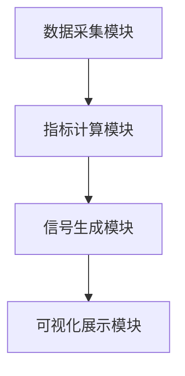
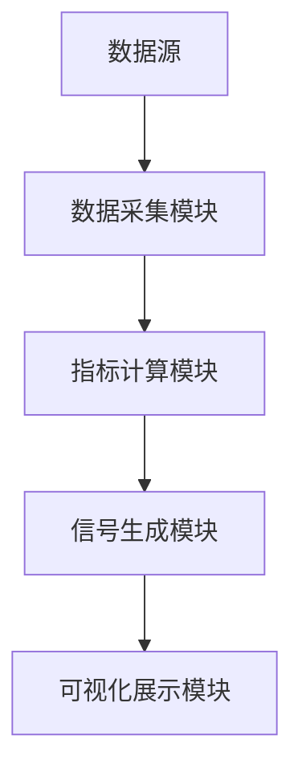
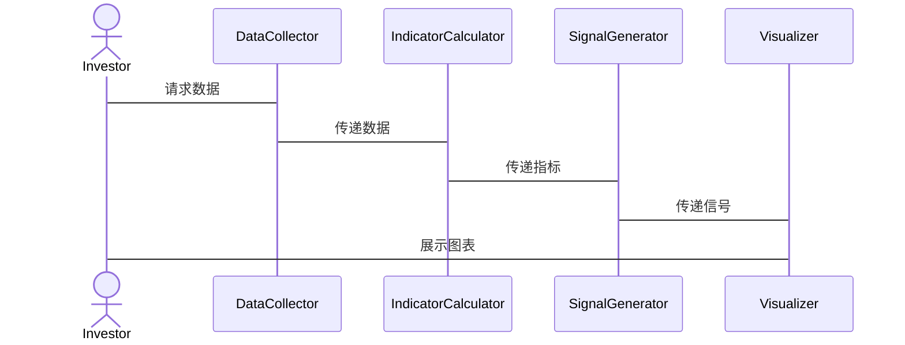

                 


# 价值投资中的技术分析辅助

---

## 关键词：
- 价值投资
- 技术分析
- 股票投资
- 技术指标
- 投资策略
- 系统架构
- 数据分析

---

## 摘要：
本文详细探讨了技术分析在价值投资中的应用，结合技术分析的核心概念、数学模型、系统架构和实际案例，展示了如何利用技术分析工具辅助价值投资决策。文章从背景介绍、核心概念、算法原理、系统设计到项目实战，层层深入，旨在帮助投资者更好地理解和应用技术分析。

---

# 第一部分: 背景介绍

## 第1章: 价值投资与技术分析的结合

### 1.1 价值投资的基本概念
- **1.1.1 价值投资的定义与核心理念**
  - 价值投资是通过分析企业的内在价值，寻找市场价格低于内在价值的投资机会。
  - 核心理念包括安全边际、长期投资和价值发现。

- **1.1.2 价值投资与技术分析的对比**
  - 价值投资注重基本面分析，技术分析则关注价格走势和市场情绪。
  - 两者的结合可以互补，提高投资决策的准确性。

- **1.1.3 技术分析在价值投资中的作用**
  - 技术分析可以帮助投资者识别市场趋势和潜在的买卖信号。
  - 通过技术分析，投资者可以更好地把握入场和退出时机。

### 1.2 技术分析的基本原理
- **1.2.1 技术分析的定义与特点**
  - 技术分析是通过分析历史价格数据，预测未来价格走势的方法。
  - 技术分析的特点包括直观性、可操作性和概率性。

- **1.2.2 技术分析的核心假设**
  - 市场价格反映所有信息。
  - 历史价格走势具有重复性。
  - 市场参与者具有趋同性。

- **1.2.3 技术分析与价值投资的结合点**
  - 价值投资注重内在价值，技术分析关注市场情绪和趋势。
  - 结合两者可以找到价格合理且趋势向上的投资标的。

### 1.3 价值投资中的技术分析应用前景
- **1.3.1 价值投资中的技术分析优势**
  - 技术分析可以帮助投资者识别市场趋势，降低投资风险。
  - 技术分析工具可以提高投资决策的效率和准确性。

- **1.3.2 技术分析在价值投资中的局限性**
  - 技术分析仅关注价格走势，忽略了企业的基本面。
  - 技术分析存在一定的主观性和不确定性。

- **1.3.3 技术分析与基本面分析的结合**
  - 结合基本面分析和技术分析，可以更好地判断投资标的的价值和趋势。
  - 通过基本面分析筛选出具有潜力的企业，再通过技术分析确定入场和退出时机。

### 1.4 本章小结
- 本章介绍了价值投资和技术分析的基本概念，分析了两者结合的必要性和可能性。
- 强调了技术分析在价值投资中的辅助作用，以及两者结合的优势和局限性。

---

# 第二部分: 核心概念与工具

## 第2章: 技术分析的核心概念与工具

### 2.1 技术分析的核心概念
- **2.1.1 K线图的定义与解读**
  - K线图是将价格走势用蜡烛图的形式展示，包含开盘价、收盘价、最高价和最低价。
  - 通过K线图可以识别趋势、支撑位和阻力位。

- **2.1.2 技术指标的分类与特点**
  - 技术指标分为动量类指标（如RSI、MACD）和 volatility类指标（如Bollinger Bands）。
  - 不同的指标适用于不同的市场环境和投资策略。

- **2.1.3 趋势线与支撑阻力的概念**
  - 趋势线是价格走势的支撑线或阻力线，用于判断价格的涨跌方向。
  - 支撑位是价格下跌时的支撑点，阻力位是价格上涨时的阻力点。

### 2.2 常用技术分析工具
- **2.2.1 移动平均线（MA）**
  - MA是将一定周期内的平均价格作为指标，用于判断价格趋势。
  - 常用的MA包括简单移动平均线（SMA）和指数移动平均线（EMA）。

- **2.2.2 相对强弱指数（RSI）**
  - RSI是衡量资产在特定时间段内超买或超卖状态的指标。
  - RSI的范围在0到100之间，通常认为RSI高于70为超买，低于30为超卖。

- **2.2.3 麦克劳林指标（MACD）**
  - MACD是将短期和长期移动平均线的差值作为指标，用于判断价格趋势。
  - MACD由两条线（MACD线和信号线）和一个柱状图组成。

- **2.2.4 布林格带（Bollinger Bands）**
  - Bollinger Bands是用于衡量资产价格波动范围的指标。
  - 由三条线组成，分别是中间线（MA）、上限线（MA + nσ）和下限线（MA - nσ）。

### 2.3 技术分析工具的优缺点对比
- **2.3.1 不同技术指标的对比分析**
  - MA适用于趋势跟踪，RSI适用于超买超卖判断，MACD适用于趋势和信号识别，Bollinger Bands适用于波动率判断。

- **2.3.2 技术指标的适用场景**
  - MA适用于长期趋势分析，RSI适用于短期超买超卖判断，MACD适用于中期趋势分析，Bollinger Bands适用于波动率较大的市场环境。

- **2.3.3 技术指标的局限性**
  - 技术指标是基于历史价格数据计算的，无法预测突发事件的影响。
  - 技术指标在不同市场环境下表现不同，需要结合市场环境进行调整。

### 2.4 本章小结
- 本章详细介绍了技术分析的核心概念和常用工具，分析了不同技术指标的优缺点及适用场景。
- 强调了技术分析工具在价值投资中的辅助作用，以及合理使用技术指标的重要性。

---

# 第三部分: 技术分析的数学模型与算法原理

## 第3章: 技术指标的数学公式与算法实现

### 3.1 移动平均线（MA）的计算公式
$$ MA_n = \frac{1}{n} \sum_{i=1}^{n} P_i $$
- 其中，$P_i$是第i天的价格，$n$是计算的天数。
- 示例代码：
```python
import pandas as pd
prices = pd.Series([100, 105, 103, 108, 110])
n = 4
ma = prices.rolling(n).mean()
print(ma)
```

### 3.2 相对强弱指数（RSI）的计算公式
$$ RSI = \frac{100}{1 + \frac{D}{S}} $$
- 其中，$D$是上涨幅度的平均值，$S$是下跌幅度的平均值。
- 示例代码：
```python
import pandas as pd
prices = pd.Series([100, 105, 103, 108, 110])
n = 2
rsi = 100 / (1 + (prices.diff().abs().mean() / prices.diff().mean().abs()))
print(rsi)
```

### 3.3 麦克劳林指标（MACD）的计算公式
$$ MACD = EMA_{12} - EMA_{26} $$
$$ Signal = EMA_{9}(MACD) $$
$$ Histogram = MACD - Signal $$
- 示例代码：
```python
import pandas as pd
import numpy as np
prices = pd.Series([100, 105, 103, 108, 110])
ema_12 = prices.ewm(span=12, min_periods=12).mean()
ema_26 = prices.ewm(span=26, min_periods=26).mean()
macd = ema_12 - ema_26
signal = macd.ewm(span=9, min_periods=9).mean()
histogram = macd - signal
print(macd, signal, histogram)
```

### 3.4 布林格带（Bollinger Bands）的计算公式
$$ BB_{middle} = MA_n(P) $$
$$ BB_{upper} = BB_{middle} + n \times \sigma_n(P) $$
$$ BB_{lower} = BB_{middle} - n \times \sigma_n(P) $$
- 其中，$\sigma_n(P)$是第n天的价格波动标准差。
- 示例代码：
```python
import pandas as pd
import numpy as np
prices = pd.Series([100, 105, 103, 108, 110])
n = 4
std = prices.rolling(n).std()
bb_middle = prices.rolling(n).mean()
bb_upper = bb_middle + n * std
bb_lower = bb_middle - n * std
print(bb_middle, bb_upper, bb_lower)
```

### 3.5 技术指标的交叉验证与信号识别
- **3.5.1 交叉验证方法**
  - 使用回测数据验证技术指标的有效性。
  - 通过统计方法分析技术指标的胜率和盈亏比。

- **3.5.2 信号识别策略**
  - 结合多个技术指标，制定综合的买卖信号规则。
  - 例如，RSI和MACD同时发出买入信号时，确认买入机会。

### 3.6 本章小结
- 本章详细介绍了技术指标的数学公式和算法实现，通过Python代码展示了如何计算这些指标。
- 强调了技术指标的交叉验证和信号识别的重要性，以及如何通过统计方法验证技术指标的有效性。

---

# 第四部分: 系统架构与设计

## 第4章: 价值投资中的技术分析系统架构

### 4.1 技术分析辅助系统的总体架构
- **4.1.1 系统功能模块**
  - 数据采集模块：从数据源获取价格数据。
  - 指标计算模块：计算各种技术指标。
  - 信号生成模块：根据技术指标生成买卖信号。
  - 可视化展示模块：将数据和技术指标以图表形式展示。

- **4.1.2 系统架构图**


### 4.2 系统功能设计
- **4.2.1 数据采集模块**
  - 从Yahoo Finance或Bloomberg等数据源获取股票价格数据。
  - 数据清洗和预处理，确保数据的完整性和准确性。

- **4.2.2 指标计算模块**
  - 使用Pandas库计算各种技术指标。
  - 示例代码：
  ```python
  import pandas as pd
  prices = pd.read_csv('data.csv', index_col='Date')
  ma = prices['Close'].rolling(20).mean()
  rsi = prices['Close'].ewm(span=14).mean()
  ```

- **4.2.3 信号生成模块**
  - 根据技术指标的交叉和背离生成买卖信号。
  - 示例代码：
  ```python
  import pandas as pd
  def generate_signals(df):
      df['Signal'] = 0
      df['Signal'][df['RSI'] > 70] = 1
      df['Signal'][df['RSI'] < 30] = -1
      return df
  ```

- **4.2.4 可视化展示模块**
  - 使用Matplotlib或Plotly绘制K线图和指标图表。
  - 示例代码：
  ```python
  import matplotlib.pyplot as plt
  plt.plot(prices['Close'], label='Price')
  plt.plot(ma, label='MA')
  plt.legend()
  plt.show()
  ```

### 4.3 系统架构图


### 4.4 系统接口设计
- **4.4.1 数据接口**
  - 数据采集模块通过API接口获取数据。
  - 数据清洗和预处理后，传递给指标计算模块。

- **4.4.2 指标接口**
  - 指标计算模块通过函数调用传递指标结果给信号生成模块。

### 4.5 系统交互流程


### 4.6 本章小结
- 本章详细介绍了技术分析辅助系统的总体架构和功能设计。
- 通过Mermaid图表展示了系统的模块划分和交互流程。
- 强调了系统各模块之间的协作和数据流的重要性。

---

# 第五部分: 项目实战

## 第5章: 价值投资中的技术分析实战

### 5.1 环境安装与配置
- **5.1.1 安装Python环境**
  - 使用Anaconda或PyCharm安装Python 3.8及以上版本。
- **5.1.2 安装必要的库**
  - 使用pip安装pandas、numpy、matplotlib、backtrader等库。
  - 示例代码：
  ```bash
  pip install pandas numpy matplotlib backtrader
  ```

### 5.2 系统核心实现
- **5.2.1 数据采集**
  - 从Yahoo Finance获取股票数据。
  - 示例代码：
  ```python
  import yfinance as yf
  data = yf.download('AAPL', start='2020-01-01', end='2023-12-31')
  ```

- **5.2.2 指标计算**
  - 计算移动平均线、RSI、MACD等指标。
  - 示例代码：
  ```python
  import pandas as pd
  import numpy as np
  # 计算移动平均线
  data['MA'] = data['Close'].rolling(20).mean()
  # 计算RSI
  data['RSI'] = data['Close'].ewm(span=14).mean()
  ```

- **5.2.3 信号生成**
  - 根据指标交叉和背离生成买卖信号。
  - 示例代码：
  ```python
  def generate_signals(data):
      data['Signal'] = 0
      data['Signal'][data['RSI'] > 70] = 1
      data['Signal'][data['RSI'] < 30] = -1
      return data
  ```

- **5.2.4 可视化展示**
  - 使用Matplotlib绘制图表。
  - 示例代码：
  ```python
  import matplotlib.pyplot as plt
  plt.plot(data['Close'], label='Price')
  plt.plot(data['MA'], label='MA')
  plt.legend()
  plt.show()
  ```

### 5.3 实际案例分析
- **5.3.1 策略制定**
  - 确定投资目标和策略。
  - 例如，选择具有长期上涨趋势且RSI低于30的股票作为买入信号。

- **5.3.2 数据回测**
  - 使用历史数据回测策略的有效性。
  - 示例代码：
  ```python
  def backtest(data, strategy):
      returns = []
      for i in range(len(data)):
          if strategy[i] == 1:
              returns.append(data['Close'][i+1]/data['Close'][i] - 1)
          elif strategy[i] == -1:
              returns.append(-data['Close'][i+1]/data['Close'][i] + 1)
          else:
              returns.append(0)
      return returns
  ```

- **5.3.3 策略优化**
  - 根据回测结果优化策略参数。
  - 例如，调整RSI的计算周期或移动平均线的天数。

### 5.4 本章小结
- 本章通过实际案例展示了如何利用技术分析工具进行投资决策。
- 介绍了系统实现的每个步骤，包括数据采集、指标计算、信号生成和可视化展示。
- 强调了策略制定和回测的重要性，以及如何通过优化策略参数提高投资收益。

---

# 第六部分: 总结与展望

## 第6章: 总结与展望

### 6.1 技术分析在价值投资中的优势
- **优势1**：技术分析可以帮助投资者识别市场趋势和潜在的买卖信号。
- **优势2**：技术分析工具简单易用，可以帮助投资者快速做出决策。
- **优势3**：技术分析可以结合基本面分析，提高投资决策的准确性。

### 6.2 技术分析在价值投资中的局限性
- **局限性1**：技术分析仅关注价格走势，忽略了企业的基本面。
- **局限性2**：技术分析存在一定的主观性和不确定性。
- **局限性3**：技术分析无法预测突发事件对市场的影响。

### 6.3 投资策略的制定与风险管理
- **6.3.1 投资策略的制定**
  - 结合技术分析和基本面分析，制定综合的投资策略。
  - 例如，选择具有长期上涨趋势且内在价值较高的股票进行投资。

- **6.3.2 风险管理**
  - 设定止损和止盈点，控制投资风险。
  - 通过分散投资降低特定资产的风险。

### 6.4 展望
- **6.4.1 技术分析的未来发展**
  - 随着人工智能和大数据技术的发展，技术分析将更加智能化和自动化。
  - 例如，使用机器学习算法预测价格走势，优化投资策略。

- **6.4.2 价值投资与技术分析的结合**
  - 未来，价值投资和技术分析将更加紧密地结合，帮助投资者更好地把握市场机会。
  - 例如，通过大数据分析和人工智能技术，提高技术分析的准确性和效率。

### 6.5 本章小结
- 本章总结了技术分析在价值投资中的优势和局限性，强调了投资策略的制定和风险管理的重要性。
- 展望了技术分析的未来发展，以及价值投资与技术分析的结合前景。

---

# 参考文献
1. [1] 葛兰维的《股票投资的秘诀》
2. [2] 弗拉基米尔·斯托利扎尔的《技术分析实战技巧》
3. [3] 艾德温·费尔根鲍格的《期货交易的技巧》
4. [4] 《Python for Data Analysis》
5. [5] 《机器学习在金融中的应用》

---

# 附录
## 附录A: 常用技术指标的总结表
| 指标名称 | 定义 | 计算公式 | 适用场景 |
|--------|--------|---------|----------|
| MA     | 移动平均线 | $$ MA_n = \frac{1}{n} \sum_{i=1}^{n} P_i $$ | 趋势跟踪 |
| RSI    | 相对强弱指数 | $$ RSI = \frac{100}{1 + \frac{D}{S}} $$ | 超买超卖判断 |
| MACD   | 麦克劳林指标 | $$ MACD = EMA_{12} - EMA_{26} $$ | 趋势和信号识别 |
| Bollinger Bands | 布林格带 | $$ BB_{middle} = MA_n(P) $$ <br> $$ BB_{upper} = BB_{middle} + n \times \sigma_n(P) $$ <br> $$ BB_{lower} = BB_{middle} - n \times \sigma_n(P) $$ | 波动率判断 |

## 附录B: 技术分析工具的安装与使用指南
- **安装指南**
  - 安装Python和必要的库（pandas、numpy、matplotlib）。
  - 安装yfinance库以获取实时数据。

- **使用指南**
  - 使用Pandas库进行数据处理。
  - 使用Matplotlib库进行数据可视化。
  - 使用backtrader库进行回测和策略开发。

## 附录C: 技术分析的代码库与资源
- **代码库**
  - [GitHub代码库](https://github.com/username/stock-analysis)
  - [Trading-Tool](https://trading-tool.com)

- **资源推荐**
  - [QuantInstinct](https://www.quantinstinct.com)
  - [Backtrader](https://www.backtrader.com)

---

# 结语
技术分析作为价值投资的重要辅助工具，可以帮助投资者更好地把握市场机会，降低投资风险。通过结合技术分析和基本面分析，投资者可以制定更加科学的投资策略，实现长期稳定的收益。未来，随着技术的进步，技术分析在价值投资中的应用将更加广泛和深入，为投资者提供更多的工具和方法。

