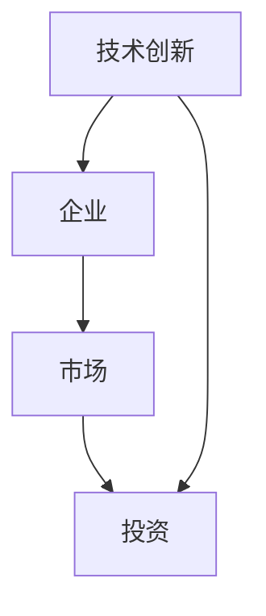
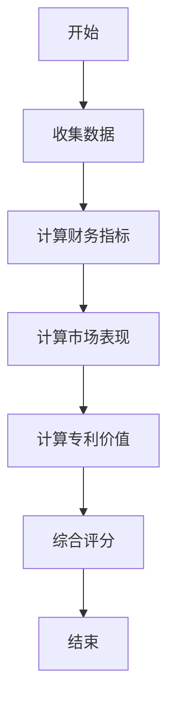
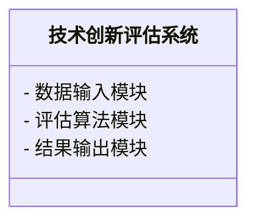
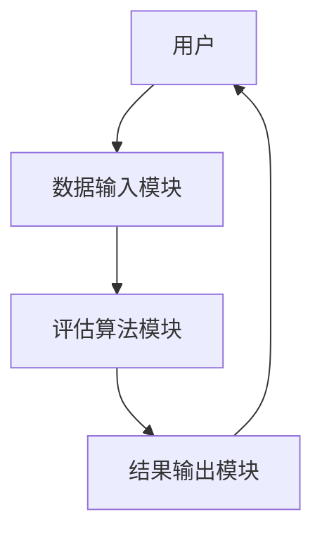
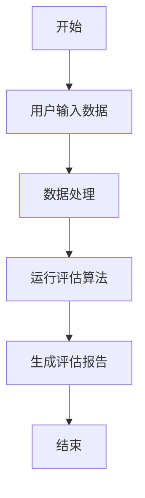

                 


# 价值投资中的技术创新评估

> 关键词：价值投资、技术创新、评估体系、算法原理、系统架构

> 摘要：技术创新是价值投资中不可忽视的重要因素。本文从技术创新评估的基本概念出发，详细探讨了技术创新评估的核心原理、算法模型、系统架构设计以及实际应用案例，帮助投资者更好地理解和应用技术创新评估。

---

## 第一部分: 技术创新评估的背景与意义

### 第1章: 技术创新评估的背景与意义

#### 1.1 价值投资的核心概念

##### 1.1.1 价值投资的定义与特点
- 价值投资是一种以低于公平价值的价格购买优质资产的投资策略。
- 核心思想：寻找市场低估的优质企业，长期持有，获得超额收益。
- 特点：注重基本面分析、长期投资、逆向思维。

##### 1.1.2 技术创新在价值投资中的重要性
- 技术创新是企业核心竞争力的源泉。
- 技术创新决定企业的长期增长潜力。
- 技术创新是价值评估的重要考量因素。

##### 1.1.3 技术创新评估的必要性与应用场景
- 技术创新评估是企业估值的重要组成部分。
- 技术创新评估可以帮助投资者识别具有长期竞争优势的企业。
- 应用于企业筛选、投资决策、风险控制等领域。

#### 1.2 技术创新的定义与分类

##### 1.2.1 技术创新的定义
- 技术创新是指将新技术应用于产品或服务，以创造新的价值或提高效率的过程。

##### 1.2.2 技术创新的分类与特征
- 技术创新可以分为产品创新、工艺创新、管理创新等类型。
- 特征包括创新性、实用性、经济性、可扩展性。

#### 1.3 技术创新评估的边界与外延

##### 1.3.1 技术创新评估的边界
- 评估范围：技术创新的经济价值、市场适应性、生命周期。
- 评估对象：企业核心技术、产品、专利。

##### 1.3.2 技术创新评估的外延
- 技术创新评估不仅仅是技术本身的评估，还包括其对市场、竞争环境的影响。
- 技术创新评估需要结合企业战略、财务状况等因素。

#### 1.4 技术创新评估的核心要素

##### 1.4.1 技术创新的生命周期
- 技术创新的生命周期包括：萌芽期、发展期、成熟期、衰退期。
- 不同阶段的技术创新对企业的价值贡献不同。

##### 1.4.2 技术创新与企业竞争力的关系
- 技术创新是企业核心竞争力的来源。
- 技术创新能力强的企业更容易在市场竞争中占据优势。

##### 1.4.3 技术创新的经济价值
- 技术创新的经济价值体现在企业的盈利能力、市场份额和长期增长潜力。

#### 1.5 本章小结
本章从价值投资的核心概念出发，探讨了技术创新在价值投资中的重要性，分析了技术创新的定义、分类及其与企业竞争力的关系，为后续的评估方法和体系构建奠定了基础。

---

## 第二部分: 技术创新评估的核心概念与联系

### 第2章: 技术创新评估的核心概念与联系

#### 2.1 技术创新评估的核心原理

##### 2.1.1 技术创新评估的理论基础
- 技术创新评估基于技术创新经济学和投资学的理论基础。
- 强调技术创新的经济价值、市场适应性和可持续性。

##### 2.1.2 技术创新评估的逻辑框架
- 技术创新评估需要考虑技术创新的可行性、经济性、市场潜力。
- 通过定性分析和定量分析相结合的方法进行评估。

##### 2.1.3 技术创新评估的关键指标
- 技术创新的市场适应性：包括市场需求、竞争环境、技术成熟度。
- 技术创新的经济价值：包括成本优势、收益潜力、投资回报率。
- 技术创新的生命周期：包括技术创新的阶段、未来增长潜力。

#### 2.2 技术创新评估的核心概念对比

##### 2.2.1 技术创新与市场需求的关系
- 技术创新必须满足市场需求才能具有经济价值。
- 技术创新的成功与否取决于市场需求的匹配度。

##### 2.2.2 技术创新与企业战略的关系
- 技术创新是企业战略的重要组成部分。
- 技术创新战略需要与企业整体战略协调一致。

##### 2.2.3 技术创新与投资回报的关系
- 技术创新是实现投资回报的重要途径。
- 技术创新的经济价值直接影响投资回报。

#### 2.3 技术创新评估的ER实体关系图



- 技术创新（A）与企业（B）之间的关系：技术创新是企业的核心资产。
- 企业（B）与市场（C）之间的关系：市场需求驱动技术创新。
- 市场（C）与投资（D）之间的关系：市场表现影响投资决策。
- 技术创新（A）与投资（D）之间的关系：技术创新是投资决策的重要依据。

#### 2.4 本章小结
本章从技术创新评估的核心原理出发，分析了技术创新与市场需求、企业战略、投资回报的关系，并通过ER实体关系图展示了技术创新评估的主要构成要素。

---

## 第三部分: 技术创新评估的算法原理

### 第3章: 技术创新评估的算法原理

#### 3.1 技术创新评估的算法概述

##### 3.1.1 基于财务指标的评估算法
- 主要指标：净利润率、研发投入占比、技术专利数量。
- 计算公式：$$ ROI = \frac{净利润}{投入成本} $$

##### 3.1.2 基于市场表现的评估算法
- 主要指标：市场份额、产品生命周期、竞争对手分析。
- 计算公式：$$ Market\ Value = P \times Q $$

##### 3.1.3 基于专利分析的评估算法
- 主要指标：专利数量、专利质量、专利布局。
- 计算公式：$$ Innovation\ Score = \sum_{i=1}^{n} (Patent\ Value_i) $$

#### 3.2 技术创新评估的数学模型

##### 3.2.1 财务指标评估模型
$$ ROI = \frac{净利润}{投入成本} $$
- 示例：某企业研发投入100万元，净利润50万元，$$ ROI = 0.5 $$

##### 3.2.2 市场表现评估模型
$$ Market\ Value = P \times Q $$
- 示例：某产品单价100元，销量10万件，$$ Market\ Value = 100 \times 10 = 1000 $$

##### 3.2.3 专利分析评估模型
$$ Innovation\ Score = \sum_{i=1}^{n} (Patent\ Value_i) $$
- 示例：某企业有3项高价值专利，$$ Innovation\ Score = 3 \times 100 = 300 $$

#### 3.3 技术创新评估算法的流程图



- 流程说明：从数据收集开始，分别计算财务指标、市场表现和专利价值，最后综合评分得出技术创新评估结果。

#### 3.4 本章小结
本章从算法原理的角度，详细介绍了技术创新评估的三种主要方法，包括财务指标评估、市场表现评估和专利分析评估，并通过数学公式和流程图展示了评估过程。

---

## 第四部分: 技术创新评估的系统分析与架构设计

### 第4章: 技术创新评估的系统分析与架构设计

#### 4.1 技术创新评估的系统分析

##### 4.1.1 问题场景介绍
- 系统目标：构建一个技术创新评估系统，帮助投资者快速评估企业的技术创新能力。
- 项目背景：随着技术的重要性日益增加，投资者需要更精准的技术评估工具。
- 项目目标：开发一个高效、准确的技术创新评估系统。

##### 4.1.2 系统功能设计
- 数据输入模块：收集企业的财务数据、市场数据、专利数据。
- 评估算法模块：运行各种评估算法，计算技术创新评分。
- 结果输出模块：展示评估结果，提供投资建议。

#### 4.2 技术创新评估的架构设计

##### 4.2.1 系统架构设计


##### 4.2.2 系统交互设计


##### 4.2.3 系统功能流程图


#### 4.3 本章小结
本章从系统分析的角度，探讨了技术创新评估系统的功能设计和架构设计，为后续的系统实现奠定了基础。

---

## 第五部分: 项目实战与最佳实践

### 第5章: 技术创新评估的项目实战

#### 5.1 项目环境安装与配置

##### 5.1.1 环境要求
- 操作系统：Windows、Linux或macOS。
- 开发工具：Python、Jupyter Notebook、Git。
- 依赖库：pandas、numpy、scikit-learn、mermaid。

##### 5.1.2 数据准备
- 数据来源：企业财务数据、市场数据、专利数据。
- 数据格式：CSV、Excel、JSON。

#### 5.2 系统核心实现源代码

##### 5.2.1 数据输入模块
```python
import pandas as pd

def load_data(file_path):
    data = pd.read_csv(file_path)
    return data
```

##### 5.2.2 评估算法模块
```python
def calculate_ROI(net_profit, cost):
    return net_profit / cost

def calculate_market_value(price, quantity):
    return price * quantity

def calculate_innovation_score(patents):
    return sum(patents)
```

##### 5.2.3 结果输出模块
```python
def generate_report(score):
    if score > 80:
        return "技术创新能力强，值得投资"
    elif score > 60:
        return "技术创新能力一般，需进一步观察"
    else:
        return "技术创新能力较弱，不建议投资"
```

#### 5.3 代码应用解读与分析

##### 5.3.1 代码实现说明
- 数据输入模块：从CSV文件中读取数据。
- 评估算法模块：分别计算ROI、市场价值和创新评分。
- 结果输出模块：根据评分生成投资建议。

##### 5.3.2 代码运行示例
```python
# 加载数据
data = load_data("企业数据.csv")

# 计算ROI
roi = calculate_ROI(data["净利润"].mean(), data["研发投入"].mean())
print("ROI:", roi)

# 计算市场价值
market_value = calculate_market_value(data["产品单价"].mean(), data["销量"].mean())
print("Market Value:", market_value)

# 计算创新评分
innovation_score = calculate_innovation_score(data["专利数量"])
print("Innovation Score:", innovation_score)

# 生成报告
report = generate_report(innovation_score)
print("投资建议:", report)
```

#### 5.4 实际案例分析与详细讲解

##### 5.4.1 案例背景
- 某科技公司：研发投入高，专利数量多，市场表现稳定。

##### 5.4.2 数据分析
- 净利润：1000万元
- 投入成本：500万元
- 产品单价：100元
- 销量：10万件
- 专利数量：20项

##### 5.4.3 评估结果
- ROI：$$ ROI = \frac{1000}{500} = 2 $$
- 市场价值：$$ Market\ Value = 100 \times 10 = 1000 $$
- 创新评分：$$ Innovation\ Score = 20 \times 10 = 200 $$

##### 5.4.4 投资建议
- 创新评分200分，高于80分，建议投资。

#### 5.5 本章小结
本章通过一个实际案例，详细展示了技术创新评估系统的实现过程，包括数据输入、算法计算和结果输出，并给出了投资建议。

---

## 第六部分: 最佳实践与总结

### 第6章: 最佳实践与总结

#### 6.1 最佳实践 tips

##### 6.1.1 数据收集与处理
- 确保数据的准确性和完整性。
- 使用多种数据源进行交叉验证。

##### 6.1.2 算法选择与优化
- 根据实际情况选择合适的算法。
- 不断优化算法模型，提高评估精度。

##### 6.1.3 系统设计与维护
- 系统设计要注重模块化和可扩展性。
- 定期更新数据和算法，保持系统的先进性。

#### 6.2 小结

##### 6.2.1 核心内容回顾
- 技术创新是价值投资的重要因素。
- 技术创新评估需要综合考虑经济价值、市场潜力和生命周期。
- 通过算法和系统实现技术创新评估的自动化和精准化。

#### 6.3 注意事项

##### 6.3.1 数据偏差
- 数据偏差可能影响评估结果，需注意数据来源的多样性和准确性。

##### 6.3.2 模型局限性
- 模型有一定的局限性，需结合实际情况进行调整和优化。

##### 6.3.3 投资风险
- 技术创新评估只能作为参考，投资决策需综合考虑其他因素。

#### 6.4 拓展阅读

##### 6.4.1 推荐书籍
- 《价值投资实战策略》
- 《技术创新与企业成长》

##### 6.4.2 推荐博客
- 技术创新与投资博客
- 价值投资策略博客

##### 6.4.3 推荐工具
- 技术创新评估工具
- 数据分析工具

#### 6.5 本章小结
本章总结了技术创新评估的核心内容，提出了最佳实践建议，并为读者提供了进一步学习和实践的方向。

---

## 附录: 参考文献与工具

### 附录A: 参考文献

1. 技术创新评估相关文献
2. 价值投资相关文献
3. 数据分析与机器学习相关文献

### 附录B: 工具与资源

1. 数据分析工具：Python、R、Excel
2. 机器学习框架：scikit-learn、TensorFlow
3. 数据可视化工具：Matplotlib、Seaborn
4. 技术创新评估工具：专利数据库、市场分析工具

---

## 结语

技术创新评估是价值投资中不可或缺的重要环节。通过本文的系统讲解，读者可以全面了解技术创新评估的核心概念、算法原理和系统架构设计，并通过实际案例掌握技术创新评估的实现方法。希望本文能够为投资者提供有价值的参考，帮助他们在价值投资中更好地识别和评估技术创新。

---

**感谢您的耐心阅读，如需进一步探讨或实践，欢迎随时联系！**

