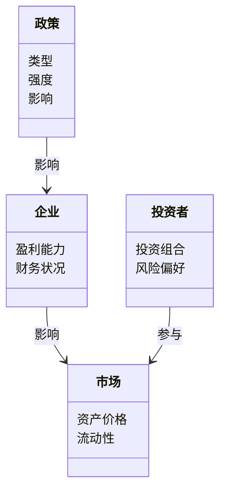
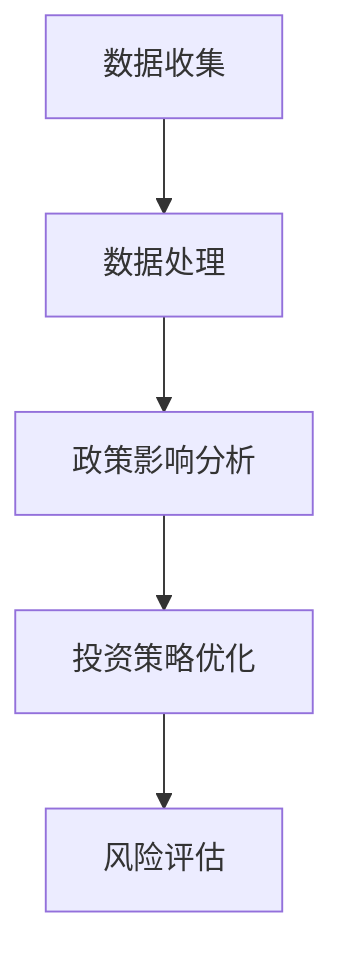

                 

# 价值投资中的政策影响分析

> 关键词：价值投资，政策影响，风险管理，投资策略，经济政策，数据分析，投资组合优化

> 摘要：本文旨在探讨政策对价值投资的影响，分析政策变化如何影响市场、企业和投资者行为。通过构建政策影响的分析框架，提出量化政策影响的方法，并结合实际案例，探讨如何在政策变化中优化投资策略。本文还结合系统分析和架构设计，提出了一套完整的政策影响分析方法论，并通过项目实战展示了如何将理论应用于实际投资决策。

---

# 第一部分：价值投资与政策影响的背景与概念

## 第1章：价值投资概述

### 1.1 价值投资的基本概念

#### 1.1.1 价值投资的定义
价值投资是一种以长期视角为基础的投资策略，强调以低于内在价值的价格购买优质资产。其核心理念是通过深入分析企业的基本面，寻找具有持续竞争优势和良好管理的公司，以实现长期的超额收益。

#### 1.1.2 价值投资的核心理念
价值投资的核心理念包括：
- **安全边际**：以低于内在价值的价格买入资产，以降低投资风险。
- **长期视角**：关注企业的长期盈利能力，而非短期市场波动。
- **基本面分析**：通过对企业的财务状况、行业地位、竞争优势等进行深入分析，评估其内在价值。

#### 1.1.3 价值投资的历史与发展
价值投资的理念可以追溯到本杰明·格雷厄姆和戴维·多德的工作。他们的理论强调安全边际和内在价值的计算，为后来的价值投资策略奠定了基础。现代价值投资在实践中不断发展，结合了更多的量化方法和风险管理策略。

### 1.2 政策影响的基本概念

#### 1.2.1 政策的定义与分类
政策是指政府或监管机构为实现特定目标而制定的规则、法规或行动计划。在价值投资中，政策主要包括：
- **经济政策**：如货币政策、财政政策、贸易政策等。
- **行业政策**：如行业准入、补贴、税收政策等。
- **监管政策**：如环保法规、金融监管等。

#### 1.2.2 政策对经济和市场的影响
政策的变化可以直接或间接影响经济和市场。例如：
- **货币政策**：影响市场流动性，进而影响资产价格。
- **财政政策**：通过政府支出和税收影响经济活动和企业盈利能力。
- **行业政策**：影响特定行业的竞争格局和企业盈利能力。

#### 1.2.3 政策的不确定性与风险
政策的不确定性是价值投资中的一个重要风险来源。政策变化可能带来市场波动、企业盈利调整或投资环境的变化，这些都可能影响投资收益。

### 1.3 价值投资与政策影响的关联

#### 1.3.1 政策对价值投资的影响
政策变化可以直接影响企业的盈利能力、行业竞争格局以及市场的整体表现。例如，环保政策的变化可能影响高污染行业的企业，而税收政策的变化可能影响企业的盈利能力和股息支付能力。

#### 1.3.2 价值投资视角下的政策分析
在价值投资中，政策分析是评估企业内在价值的重要组成部分。投资者需要分析政策对企业未来盈利能力的影响，以及政策变化可能带来的市场机会或风险。

#### 1.3.3 政策风险的识别与管理
政策风险是价值投资中的重要风险来源。投资者需要识别政策风险的来源，并通过合理的投资组合管理和风险对冲策略来降低政策风险的影响。

## 第2章：政策影响的分析框架

### 2.1 政策影响的分析维度

#### 2.1.1 经济政策的影响
经济政策的变化对市场和企业的影响是最直接的。例如，货币政策的变化会影响市场流动性，进而影响资产价格；财政政策的变化会影响政府支出和税收，进而影响企业盈利能力。

#### 2.1.2 财政政策的影响
财政政策包括政府支出和税收政策。例如，政府增加基础设施投资可能刺激相关行业的需求，而税收政策的变化可能影响企业的盈利能力和股息支付能力。

#### 2.1.3 货币政策的影响
货币政策通过调节市场流动性来影响资产价格。例如，央行降低利率可能刺激市场流动性增加，从而推高资产价格；反之，提高利率可能抑制市场流动性，从而降低资产价格。

### 2.2 政策影响的传导机制

#### 2.2.1 政策对市场供需的影响
政策变化可能通过影响市场供需关系来影响资产价格。例如，行业政策的放松可能增加市场的供给，从而降低市场价格；反之，行业政策的收紧可能减少供给，从而提高市场价格。

#### 2.2.2 政策对企业盈利的影响
政策变化直接影响企业的盈利能力。例如，环保政策的收紧可能增加企业的环保成本，从而影响其净利润率；税收政策的调整可能影响企业的税后利润。

#### 2.2.3 政策对投资者行为的影响
政策变化可能通过影响投资者预期和行为来影响市场。例如，政策的不确定性可能增加投资者的观望情绪，从而影响市场的流动性。

### 2.3 政策影响的量化方法

#### 2.3.1 政策影响的指标体系
为了量化政策影响，可以建立一套指标体系，包括：
- **政策强度**：衡量政策的力度，例如货币政策的宽松程度。
- **政策相关性**：衡量政策对企业或行业的直接影响程度。
- **政策风险**：衡量政策变化可能带来的风险。

#### 2.3.2 政策影响的度量模型
可以使用回归分析等方法来量化政策影响。例如，建立资产价格与政策变量的回归模型，分析政策变量对资产价格的影响程度。

#### 2.3.3 政策影响的预测方法
通过分析历史政策数据和市场反应，可以建立政策影响的预测模型。例如，使用时间序列分析来预测政策变化对市场的影响。

---

## 第二部分：价值投资中的政策影响分析

## 第3章：政策风险的识别与评估

### 3.1 政策风险的识别方法

#### 3.1.1 政策环境的分析
政策环境的分析包括对当前政策的解读和未来政策变化的预测。例如，分析政府的财政政策、货币政策和行业政策，评估其对企业的影响。

#### 3.1.2 政策变化的敏感性分析
敏感性分析用于评估政策变化对企业或投资组合的影响程度。例如，分析利率变化对企业利润的影响，或分析税收政策变化对资产价格的影响。

#### 3.1.3 政策风险的预警机制
建立政策风险的预警机制，例如通过监测政策变化的信号，及时发现潜在的风险。

### 3.2 政策风险的评估模型

#### 3.2.1 风险评估的指标体系
政策风险评估的指标体系包括：
- **政策变动的可能性**：评估政策变化的可能性。
- **政策变动的影响程度**：评估政策变化对企业或投资组合的影响程度。

#### 3.2.2 风险评估的数学模型
可以使用概率加权模型来评估政策风险。例如，将政策变化的可能性和影响程度进行加权，得到总体的政策风险。

#### 3.2.3 风险评估的案例分析
通过具体案例分析，展示如何应用风险评估模型。例如，分析某行业政策变化对企业盈利的影响。

### 3.3 政策风险的管理策略

#### 3.3.1 风险规避策略
通过选择低政策风险的行业或资产，降低政策风险的影响。

#### 3.3.2 风险对冲策略
通过投资于相关性较低的资产或使用金融工具对冲政策风险。

#### 3.3.3 风险分散策略
通过分散投资于不同行业或资产，降低政策风险对投资组合的影响。

## 第4章：政策影响下的投资策略优化

### 4.1 投资策略的调整方法

#### 4.1.1 基于政策变化的资产配置调整
根据政策变化调整资产配置，例如在货币政策收紧时增加防御性资产的配置。

#### 4.1.2 政策变化对行业选择的影响
分析政策变化对行业的影响，选择受益于政策变化的行业进行投资。

#### 4.1.3 政策变化对个股选择的影响
分析政策变化对个股的影响，选择那些能够抵御政策风险的个股进行投资。

### 4.2 投资组合的优化方法

#### 4.2.1 投资组合的风险收益优化
通过优化投资组合的风险和收益，降低政策风险对投资组合的影响。

#### 4.2.2 投资组合的动态调整
根据政策变化动态调整投资组合，以适应不断变化的政策环境。

#### 4.2.3 投资组合的分散化策略
通过分散化策略降低政策风险对投资组合的影响。

## 第5章：政策影响的系统分析与架构设计

### 5.1 系统功能设计

#### 5.1.1 领域模型
领域模型展示了系统的主要实体及其关系。例如，政策、企业、市场和投资者之间的关系。

#### 5.1.2 系统架构设计
系统架构设计展示了系统的各个模块和它们之间的交互。例如，数据收集、分析、预测和优化模块。

#### 5.1.3 系统接口设计
系统接口设计展示了系统与其他系统的交互。例如，与外部数据库、API接口和用户界面的交互。

#### 5.1.4 系统交互设计
系统交互设计展示了系统内部各模块之间的交互。例如，数据处理模块与政策影响分析模块的交互。

---

## 第6章：项目实战

### 6.1 环境安装

#### 6.1.1 数据源
需要安装的数据源包括：
- 政策数据：包括政府发布的政策文件、法规变化等。
- 市场数据：包括资产价格、成交量、市场指数等。
- 企业数据：包括企业的财务数据、行业地位等。

#### 6.1.2 工具安装
需要安装的工具包括：
- 数据处理工具：Python、Pandas、NumPy。
- 数据可视化工具：Matplotlib、Seaborn。
- 系统建模工具：Mermaid、PlantUML。

### 6.2 核心实现

#### 6.2.1 数据收集与处理
通过爬虫或其他数据接口获取政策数据和市场数据，进行清洗和预处理。

#### 6.2.2 政策影响分析
使用回归分析等方法，分析政策变量对资产价格的影响。

#### 6.2.3 投资策略优化
根据政策影响分析结果，优化投资组合，降低政策风险。

### 6.3 案例分析

#### 6.3.1 案例背景
分析某行业政策变化对市场的影响，例如环保政策对新能源行业的投资影响。

#### 6.3.2 数据分析
展示如何通过数据分析识别政策变化对企业或行业的潜在影响。

#### 6.3.3 投资策略优化
基于数据分析结果，制定优化的投资策略。

### 6.4 项目总结

#### 6.4.1 核心发现
总结项目中的核心发现，例如政策变化对企业盈利能力的具体影响。

#### 6.4.2 项目经验
总结项目实施过程中的经验教训，例如数据获取的难度、模型的准确性等。

---

## 第7章：最佳实践与小结

### 7.1 最佳实践

#### 7.1.1 关注政策变化
投资者应密切关注政策变化，特别是与投资相关的经济政策、行业政策和监管政策。

#### 7.1.2 结合基本面分析
在政策分析的基础上，结合企业的基本面分析，评估企业的内在价值和投资潜力。

#### 7.1.3 建立风险管理机制
通过建立风险管理机制，降低政策风险对投资组合的影响。

### 7.2 小结

政策变化对价值投资有着重要影响。通过建立系统的政策影响分析框架，投资者可以更好地识别和评估政策风险，并通过优化投资策略降低政策风险的影响。

### 7.3 注意事项

- 政策分析需要结合具体的投资环境和市场情况。
- 投资策略的制定需要综合考虑政策影响和其他因素。
- 风险管理是价值投资中不可忽视的重要环节。

### 7.4 拓展阅读

- 《价值投资实战策略》
- 《政策分析与投资决策》
- 《金融风险管理》

---

# 结语

政策变化是价值投资中不可忽视的重要因素。通过系统地分析政策影响，投资者可以更好地识别和评估政策风险，并通过优化投资策略降低政策风险的影响。希望本文能为投资者提供有价值的参考和启发。

---

