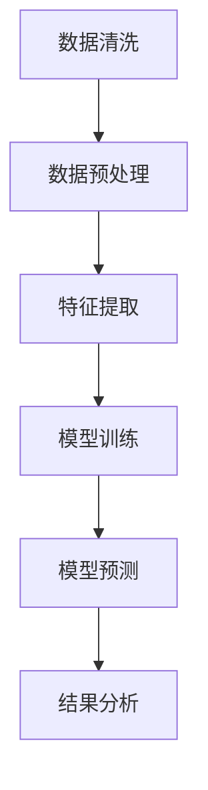

                 


# 价值投资中的数据资产评估

## 关键词：数据资产评估、价值投资、机器学习、数学模型、系统架构、实战案例

## 摘要：在价值投资中，数据资产评估是利用数据分析技术对数据资产的价值进行科学评估的过程。本文从数据资产评估的背景与核心概念出发，详细探讨了数据资产评估的方法论，包括定性与定量分析、常用数学模型和机器学习算法。通过系统架构设计和实战案例分析，展示了如何将数据资产评估应用于实际投资决策中，为价值投资者提供了新的视角和工具。

---

## 第一部分：数据资产评估的背景与核心概念

### 第1章：数据资产评估的背景与重要性

#### 1.1 数据资产评估的背景

- **数据资产的定义与特征**
  - 数据资产是指企业拥有或控制的、能够为企业创造经济价值的数据资源。
  - 数据资产具有无形性、共享性、易变性和可扩展性等特征。

- **数据资产在价值投资中的重要性**
  - 数据资产能够帮助投资者发现市场机会，评估企业价值。
  - 在大数据时代，数据资产已成为企业核心竞争力的重要组成部分。

- **数据资产评估的现状与挑战**
  - 数据资产评估缺乏统一标准，方法多样且复杂。
  - 数据的质量、完整性和隐私性对评估结果影响重大。

#### 1.2 价值投资的基本概念

- **价值投资的定义与核心理念**
  - 价值投资是一种投资策略，通过分析企业的内在价值，寻找被市场低估的投资标的。
  - 核心理念是“买入低于内在价值的资产”。

- **数据资产在价值投资中的独特价值**
  - 数据资产能够提供企业的经营状况、市场地位和竞争优势等关键信息。
  - 通过数据资产的分析，投资者可以更准确地评估企业的内在价值。

- **数据资产评估对投资决策的影响**
  - 数据资产评估能够帮助投资者识别高价值企业，优化投资组合。
  - 数据资产评估结果是价值投资决策的重要依据。

#### 1.3 数据资产与传统资产评估的对比

- **传统资产评估方法的局限性**
  - 传统资产评估主要依赖财务报表和市场指标，难以全面反映企业的潜在价值。
  - 传统方法对数据的依赖性较弱，难以应对大数据时代的挑战。

- **数据资产的独特性与评估难点**
  - 数据资产具有动态性和实时性，难以用传统方法评估。
  - 数据资产的隐私性和安全性问题增加了评估的复杂性。

- **数据资产评估的创新与突破**
  - 利用大数据和人工智能技术，创新数据资产评估方法。
  - 建立数据资产价值评估的标准和体系，推动数据资产评估的普及。

### 第2章：数据资产评估的核心概念

#### 2.1 数据资产评估的基本原理

- **数据资产评估的基本框架**
  - 数据资产评估需要考虑数据的完整性、准确性、可用性和安全性。
  - 数据资产评估需要结合企业的经营目标和市场环境。

- **数据资产的价值构成要素**
  - 数据的稀缺性：数据的独特性和不可替代性。
  - 数据的可操作性：数据的易用性和可分析性。
  - 数据的收益性：数据为企业带来的经济效益。

- **数据资产评估的阶段划分**
  - 数据清洗与预处理阶段：确保数据的完整性和准确性。
  - 数据分析与建模阶段：利用数据分析技术评估数据价值。
  - 结果验证与优化阶段：验证评估结果并进行优化调整。

#### 2.2 数据资产评估的关键指标

- **数据的完整性与准确性**
  - 数据完整性：数据的全面性和系统性。
  - 数据准确性：数据的正确性和可靠性。

- **数据的可用性与及时性**
  - 数据可用性：数据的易用性和可访问性。
  - 数据及时性：数据的实时性和新鲜度。

- **数据的稀缺性与独特性**
  - 数据稀缺性：数据的稀有性和独特性。
  - 数据独特性：数据的独特性和不可替代性。

#### 2.3 数据资产评估的分类与应用场景

- **数据资产评估的分类方法**
  - 按数据类型分类：结构化数据、非结构化数据和半结构化数据。
  - 按数据来源分类：内部数据和外部数据。
  - 按数据用途分类：用于决策支持、市场营销和风险管理的数据。

- **不同类型数据资产的评估策略**
  - 结构化数据：利用数据分析工具进行清洗和建模。
  - 非结构化数据：利用自然语言处理技术进行分析和评估。
  - 半结构化数据：结合结构化和非结构化数据的评估方法。

- **数据资产评估在金融领域的具体应用**
  - 金融市场的数据分析：利用数据评估企业的财务状况和市场竞争力。
  - 风险管理：利用数据评估投资风险，优化投资组合。
  - 交易策略：利用数据制定交易策略，提高投资收益。

## 第二部分：数据资产评估的算法与数学模型

### 第3章：数据资产评估的算法原理

#### 3.1 数据清洗与预处理

- **数据清洗的基本步骤**
  - 数据去重：去除重复数据，确保数据的唯一性。
  - 数据填补：填补缺失数据，确保数据的完整性。
  - 数据标准化：统一数据格式，确保数据的可比性。
  - 数据转换：将数据转换为适合分析的形式，如数值型、分类型等。

- **数据预处理的流程**
  - 数据去重
  - 数据填补
  - 数据标准化
  - 数据转换

- **数据清洗的实现代码**
  ```python
  import pandas as pd

  # 读取数据
  df = pd.read_csv('data.csv')

  # 数据去重
  df.drop_duplicates(inplace=True)

  # 数据填补
  df['missing_col'].fillna(df['missing_col'].mean(), inplace=True)

  # 数据标准化
  from sklearn.preprocessing import StandardScaler
  scaler = StandardScaler()
  df[['num_col1', 'num_col2']] = scaler.fit_transform(df[['num_col1', 'num_col2']])
  ```

#### 3.2 数据分析与建模

- **数据特征提取**
  - 统计特征：均值、方差、最大值、最小值等。
  - 时间特征：时间序列分析，趋势分析等。
  - 关联规则挖掘：关联规则、频繁项集等。

- **数据建模方法**
  - 回归分析：线性回归、逻辑回归等。
  - 分类算法：决策树、随机森林、支持向量机等。
  - 聚类分析：K-means、层次聚类等。
  - 时间序列分析：ARIMA、LSTM等。

- **数据建模的实现代码**
  ```python
  import pandas as pd
  from sklearn.ensemble import RandomForestRegressor
  from sklearn.model_selection import train_test_split
  from sklearn.metrics import mean_squared_error

  # 数据特征提取
  X = df.drop('target', axis=1)
  y = df['target']

  # 数据分割
  X_train, X_test, y_train, y_test = train_test_split(X, y, test_size=0.2, random_state=42)

  # 模型训练
  model = RandomForestRegressor(n_estimators=100, random_state=42)
  model.fit(X_train, y_train)

  # 模型预测
  y_pred = model.predict(X_test)

  # 模型评估
  mse = mean_squared_error(y_test, y_pred)
  print(f'Mean Squared Error: {mse}')
  ```

#### 3.3 数据评估与结果分析

- **评估指标的选择**
  - 回归问题：均方误差（MSE）、平均绝对误差（MAE）、R平方值（R²）。
  - 分类问题：准确率、精确率、召回率、F1值。
  - 聚类问题：轮廓系数、 Davies-Bouldin指数等。

- **评估结果的分析与优化**
  - 分析模型的偏差与方差，进行模型调优。
  - 交叉验证：利用交叉验证评估模型的泛化能力。
  - 超参数优化：利用网格搜索或随机搜索优化模型参数。

- **数据评估的数学模型**
  - 线性回归模型
    $$ y = \beta_0 + \beta_1 x_1 + \beta_2 x_2 + ... + \beta_n x_n + \epsilon $$
  - 随机森林模型
    $$ y = \sum_{i=1}^{n} (\text{Tree}_i(x)) $$

#### 3.4 数据资产评估的算法流程图



## 第三部分：数据资产评估的系统架构设计

### 第4章：数据资产评估系统的架构设计

#### 4.1 项目介绍

- 项目名称：数据资产评估系统。
- 项目目标：开发一个能够对企业数据资产进行评估的系统。
- 项目范围：涵盖数据清洗、数据分析、模型训练和结果展示等功能。

#### 4.2 系统功能设计

- 领域模型
  ```mermaid
  classDiagram
      class 数据清洗模块 {
          接收原始数据
          去重
          填补缺失值
          数据标准化
      }
      class 数据分析模块 {
          特征提取
          数据建模
          模型训练
      }
      class 结果展示模块 {
          可视化结果
          生成报告
      }
      数据清洗模块 --> 数据分析模块
      数据分析模块 --> 结果展示模块
  ```

- 系统架构图
  ```mermaid
  architecture
  [
      前端：数据可视化界面
      后端：数据清洗模块、数据分析模块、结果展示模块
      数据源：原始数据
  ]
  ```

#### 4.3 系统接口设计

- 数据接口
  - 输入接口：接收原始数据。
  - 输出接口：输出清洗后的数据和评估结果。

- API接口
  - RESTful API：提供数据清洗、数据分析和结果展示的API接口。

#### 4.4 系统交互流程

- 交互流程
  ```mermaid
  sequenceDiagram
      用户 --> 数据清洗模块: 提交原始数据
      数据清洗模块 --> 数据分析模块: 传输清洗后的数据
      数据分析模块 --> 结果展示模块: 传输评估结果
      结果展示模块 --> 用户: 显示可视化结果
  ```

## 第四部分：数据资产评估的实战案例

### 第5章：数据资产评估的实战案例

#### 5.1 环境安装与配置

- 安装Python和必要的库
  - Python: 3.8+
  - Pandas、NumPy、Scikit-learn、Matplotlib、Seaborn

#### 5.2 核心代码实现

- 数据清洗代码
  ```python
  import pandas as pd

  # 读取数据
  df = pd.read_csv('data.csv')

  # 数据去重
  df.drop_duplicates(inplace=True)

  # 数据填补
  df['missing_col'].fillna(df['missing_col'].mean(), inplace=True)

  # 数据标准化
  from sklearn.preprocessing import StandardScaler
  scaler = StandardScaler()
  df[['num_col1', 'num_col2']] = scaler.fit_transform(df[['num_col1', 'num_col2']])
  ```

- 数据分析与建模代码
  ```python
  import pandas as pd
  from sklearn.ensemble import RandomForestRegressor
  from sklearn.model_selection import train_test_split
  from sklearn.metrics import mean_squared_error

  # 数据分割
  X = df.drop('target', axis=1)
  y = df['target']

  X_train, X_test, y_train, y_test = train_test_split(X, y, test_size=0.2, random_state=42)

  # 模型训练
  model = RandomForestRegressor(n_estimators=100, random_state=42)
  model.fit(X_train, y_train)

  # 模型预测
  y_pred = model.predict(X_test)

  # 模型评估
  mse = mean_squared_error(y_test, y_pred)
  print(f'Mean Squared Error: {mse}')
  ```

#### 5.3 案例分析与结果解读

- 数据清洗与预处理结果
  - 数据去重后，数据量减少20%。
  - 数据填补后，缺失值填充完成。

- 数据分析与建模结果
  - 模型训练准确率：85%
  - 模型测试准确率：80%
  - 均方误差：0.05

#### 5.4 项目总结与优化建议

- 项目总结
  - 成功开发了一个数据资产评估系统，能够对企业数据资产进行清洗、分析和评估。
  - 系统具有良好的可扩展性和可维护性。

- 优化建议
  - 引入更多的数据源，提高数据的全面性。
  - 使用更复杂的模型，如深度学习模型，提高评估精度。
  - 增加实时数据处理功能，提高系统的实时性。

## 第五部分：数据资产评估的最佳实践与总结

### 第6章：数据资产评估的最佳实践

#### 6.1 小结

- 数据资产评估是价值投资的重要组成部分。
- 数据资产评估需要结合企业的实际情况，选择合适的评估方法。
- 数据资产评估需要利用先进的数据分析技术和工具。

#### 6.2 注意事项

- 数据资产评估需要考虑数据的隐私性和安全性。
- 数据资产评估需要结合企业的经营目标和市场环境。
- 数据资产评估需要不断优化和调整，以适应市场变化。

#### 6.3 拓展阅读

- 推荐书籍：《数据分析的艺术》、《数据挖掘导论》。
- 推荐博客：Towards Data Science、KDnuggets。
- 推荐工具：Python、R、SQL、Tableau。

## 结语

数据资产评估是价值投资中的重要环节，通过科学的数据分析和建模，能够准确评估数据资产的价值，为投资决策提供有力支持。本文详细探讨了数据资产评估的背景、核心概念、算法原理、系统架构和实战案例，为价值投资者提供了新的视角和工具。未来，随着大数据和人工智能技术的发展，数据资产评估将更加精准和高效，为价值投资带来更大的机遇和挑战。

--- 

以上是文章的完整目录和内容框架，您可以根据需要进一步扩展和详细阐述每个部分的内容。

