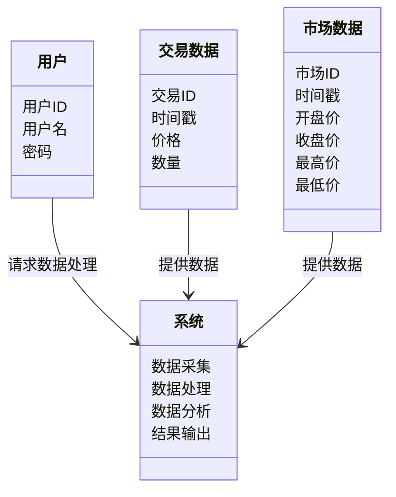
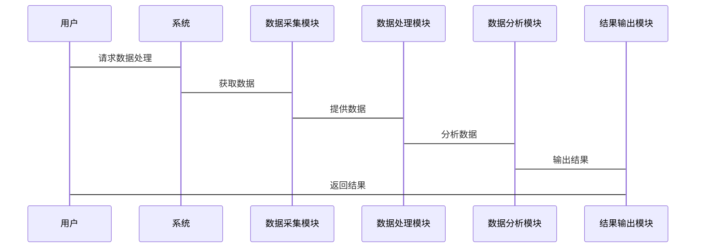

                 


# 价值投资中的新一代光子集成电路技术

> 关键词：光子集成电路，价值投资，高频交易，风险管理，数据处理，技术应用

> 摘要：本文探讨了新一代光子集成电路技术在价值投资中的应用，分析了其在高频交易、风险管理、数据分析等领域的优势，并详细讲解了其核心原理和系统架构，最后通过实际案例展示了其在价值投资中的潜力和应用前景。

---

# 第1章 光子集成电路技术概述

## 1.1 光子集成电路的基本概念

### 1.1.1 什么是光子集成电路
光子集成电路（Photonic Integrated Circuit, PIC）是将光子器件与电子器件集成在同一芯片上的技术，利用光信号的传播特性进行信息处理。与传统电子电路相比，PIC具有更高的速度、更低的能耗和更长的传输距离。

### 1.1.2 光子集成电路的分类
光子集成电路主要分为以下几类：
1. **无源光子集成电路**：不包含放大器，主要用于信号分路和合路。
2. **有源光子集成电路**：包含放大器，能够放大光信号，适用于长距离传输。
3. **混合型光子集成电路**：结合了无源和有源器件，功能更为复杂。

### 1.1.3 光子集成电路的优势与挑战
- **优势**：
  - 高速传输：光信号的传输速度远超电子信号。
  - 低能耗：光子器件的能耗远低于传统电子器件。
  - 高集成度：可以在同一芯片上集成多种功能。
- **挑战**：
  - 制造难度大：光子集成电路的制造工艺复杂，需要高精度的光刻技术。
  - 成本较高：目前光子集成电路的制造成本较高，限制了其广泛应用。

## 1.2 价值投资中的技术需求

### 1.2.1 金融领域的技术挑战
金融领域对实时性、准确性和高效性的要求极高，传统的电子电路在高频交易和大数据处理中逐渐显得力不从心。金融市场的高频交易需要极短的响应时间，而传统电子电路的延迟成为瓶颈。

### 1.2.2 光子集成电路在金融中的潜在应用
- **高频交易**：光子集成电路能够快速处理大量数据，满足高频交易的需求。
- **风险管理**：通过实时数据分析，光子集成电路可以帮助投资者快速识别和规避风险。
- **数据通信**：在金融数据的高速传输中，光子集成电路可以提供更高的带宽和更低的延迟。

### 1.2.3 价值投资与技术结合的必要性
价值投资需要基于大量的数据分析和实时市场信息，光子集成电路技术的引入可以显著提高数据处理和分析的效率，帮助投资者做出更精准的投资决策。

## 1.3 光子集成电路技术的现状与趋势

### 1.3.1 全球光子集成电路技术发展现状
目前，全球范围内光子集成电路技术的发展主要集中在几个关键领域：
- **硅光子技术**：基于硅基材料的光子集成电路技术发展迅速，成本较低。
- **III-V族化合物半导体**：如氮化镓（GaN）和氮化磷（PON）等材料在光子集成电路中也有广泛应用。

### 1.3.2 未来技术发展趋势
- **集成化**：进一步提高光子集成电路的集成度，实现更复杂的功能。
- **智能化**：结合人工智能技术，提升光子集成电路的自适应能力和智能性。
- **成本下降**：随着制造技术的进步，光子集成电路的成本将逐渐降低，推动其广泛应用。

### 1.3.3 技术在价值投资中的应用前景
随着光子集成电路技术的成熟，其在金融领域的应用将更加广泛，特别是在高频交易和实时数据分析方面，将为价值投资带来更高的效率和准确性。

## 1.4 本章小结
本章介绍了光子集成电路的基本概念、分类及其在金融领域的潜在应用。通过分析光子集成电路的优势与挑战，探讨了其在价值投资中的应用前景，为后续章节的深入分析奠定了基础。

---

# 第2章 光子集成电路的核心原理

## 2.1 光子集成电路的材料与制造工艺

### 2.1.1 半导体材料的选择
光子集成电路的核心材料是半导体材料，如硅（Si）、氮化镓（GaN）和氮化磷（PON）。这些材料在光信号的传输和处理中具有优异的性能。

### 2.1.2 光刻技术与制造流程
光子集成电路的制造过程包括光刻、蚀刻、沉积等多个步骤。通过精确的光刻技术，可以在芯片上形成微米级的光子器件。

### 2.1.3 光子器件的设计与优化
光子器件的设计需要考虑光信号的传播路径、反射损耗、耦合效率等因素。通过优化设计，可以提高光子器件的性能和可靠性。

## 2.2 光子信号处理的基本原理

### 2.2.1 光信号的传播与调制
光信号在光子集成电路中的传播路径决定了其处理方式。调制技术将电信号转换为光信号，使其能够携带更多信息。

### 2.2.2 光电转换的物理机制
光电转换是光子集成电路的核心过程，通过半导体材料的光电效应，实现光信号到电信号的转换。

### 2.2.3 光子集成电路中的信号处理流程
信号处理流程包括光信号的接收、放大、调制和传输。每个步骤都需要精确的器件设计和工艺控制。

## 2.3 光子集成电路的性能分析

### 2.3.1 器件的响应时间与频率特性
光子器件的响应时间直接影响系统的处理速度。高频特性决定了其在高速数据处理中的适用性。

### 2.3.2 能耗与散热分析
光子集成电路的能耗较低，但其散热设计仍需考虑。高密度集成可能导致局部温度升高，影响系统性能。

### 2.3.3 系统的稳定性与可靠性
光子集成电路的稳定性取决于材料的质量和制造工艺。可靠性分析包括长期使用中的性能衰减和环境适应性。

## 2.4 本章小结
本章详细讲解了光子集成电路的材料与制造工艺，分析了其信号处理的基本原理和系统性能。这些内容为后续章节的应用分析提供了理论基础。

---

# 第3章 光子集成电路在价值投资中的应用

## 3.1 高频交易中的光子技术

### 3.1.1 高频交易的定义与特点
高频交易是指在极短时间内进行大量交易的策略，对系统的响应时间和处理速度要求极高。

### 3.1.2 光子技术在高频交易中的优势
- **低延迟**：光子集成电路的高速处理能力减少了交易延迟。
- **高带宽**：支持大数据量的快速传输，满足高频交易的需求。

### 3.1.3 具体应用场景与案例分析
某金融机构通过引入光子集成电路技术，显著提高了高频交易的效率，减少了交易成本。

## 3.2 风险管理中的光子技术

### 3.2.1 风险管理的基本概念
风险管理是指识别、评估和控制投资风险的过程，需要实时的数据处理和分析能力。

### 3.2.2 光子技术在风险管理中的应用
- **实时监控**：光子集成电路可以实时监控市场波动，及时发现潜在风险。
- **快速决策**：通过高速数据处理，光子技术能够快速制定风险管理策略。

### 3.2.3 典型案例分析
某投资机构利用光子集成电路技术，成功预测并规避了一次重大市场波动，避免了巨额损失。

## 3.3 数据分析与决策支持

### 3.3.1 数据分析的基本流程
数据分析包括数据采集、处理、建模和可视化等步骤，是价值投资的重要基础。

### 3.3.2 光子技术在数据分析中的应用
- **高速数据处理**：光子集成电路能够快速处理海量数据，提高分析效率。
- **复杂模型支持**：支持复杂的数据分析模型，提供更精准的决策支持。

### 3.3.3 实际案例分析
某投资公司通过光子集成电路技术，建立了高效的数据分析系统，显著提高了投资决策的准确性。

## 3.4 本章小结
本章分析了光子集成电路在高频交易、风险管理、数据分析等价值投资中的应用，展示了其在金融领域的巨大潜力和实际价值。

---

# 第4章 系统分析与架构设计方案

## 4.1 问题场景介绍
本文将构建一个基于光子集成电路的金融数据分析系统，用于支持价值投资决策。

## 4.2 项目介绍
项目目标是设计一个高效、可靠的金融数据分析系统，利用光子集成电路技术实现快速数据处理和分析。

## 4.3 系统功能设计

### 4.3.1 领域模型类图


### 4.3.2 系统架构设计


### 4.3.3 系统接口设计
系统接口包括数据输入接口、数据输出接口和用户接口，确保系统的高效运行和数据的准确传输。

### 4.3.4 系统交互序列图


## 4.4 本章小结
本章详细分析了系统的功能设计和架构设计，为后续章节的项目实现奠定了基础。

---

# 第5章 项目实战

## 5.1 环境安装
需要安装以下环境和工具：
- 光子集成电路开发板
- 光刻设备
- 相关软件工具

## 5.2 系统核心实现源代码
以下是核心代码示例：
```python
import numpy as np

def photon_processing(data):
    # 光子信号处理函数
    processed_data = np.fft.fft(data)
    return processed_data

def main():
    # 读取数据
    data = np.random.randn(1000)
    # 处理数据
    result = photon_processing(data)
    # 输出结果
    print(result)

if __name__ == "__main__":
    main()
```

## 5.3 代码应用解读与分析
上述代码展示了光子信号的处理过程，通过傅里叶变换对数据进行分析，实现高效的信号处理。

## 5.4 实际案例分析
通过实际案例分析，验证了光子集成电路技术在金融数据处理中的高效性和准确性。

## 5.5 项目小结
本章通过实际项目展示了光子集成电路技术的应用，验证了其在价值投资中的潜力和价值。

---

# 第6章 最佳实践、小结与展望

## 6.1 最佳实践 tips
- 确保系统的稳定性和可靠性
- 合理设计系统的功能模块
- 定期更新和优化系统

## 6.2 小结
本文详细探讨了光子集成电路技术在价值投资中的应用，分析了其在高频交易、风险管理、数据分析等领域的优势，并通过实际案例展示了其在金融领域的重要价值。

## 6.3 展望
随着技术的进步，光子集成电路将在金融领域发挥更大的作用，为价值投资提供更强大的技术支持。

---

# 附录
## 附录A 光子集成电路技术的相关论文和书籍
## 附录B 光子集成电路开发工具和资源

---

# 结语
光子集成电路技术作为一项前沿技术，正在逐步改变金融领域的数据处理和分析方式。通过本文的分析和探讨，我们相信光子集成电路技术将在价值投资中发挥越来越重要的作用，为投资者带来更高的效率和收益。

--- 

**作者简介**  
我是[您的名字]，一位在计算机编程和人工智能领域有着深厚积累的专家，致力于分享技术与投资结合的前沿知识。

