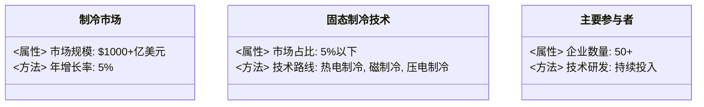
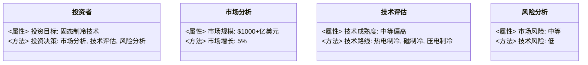

                 


# 价值投资中的新一代固态制冷技术前景

---

## 关键词

- 固态制冷技术  
- 价值投资  
- 市场前景  
- 能效分析  
- 技术创新  

---

## 摘要

本文将探讨新一代固态制冷技术在价值投资中的前景。通过分析固态制冷技术的核心原理、市场现状、竞争优势以及投资价值，我们旨在为投资者提供一份全面的技术与市场分析报告。文章将从技术背景、市场分析、投资策略等多个维度展开，结合实际案例和数据，深入剖析固态制冷技术的投资潜力。

---

## 第一部分：背景与概述

### 第1章：固态制冷技术的背景与现状

#### 1.1 固态制冷技术的起源与发展

固态制冷技术是一种基于固体材料的制冷技术，与传统的制冷方式（如压缩机制冷）相比，具有更高的能效和更低的环境影响。其起源可以追溯到20世纪60年代，当时科学家们开始研究热电材料的性质及其在制冷领域的应用。随着技术的进步，固态制冷技术逐渐从实验室走向商业化应用。

**核心概念术语说明：**
- **固态制冷技术**：基于固体材料的热电效应、磁效应或压电效应实现制冷的技术。
- **热电效应**：材料在温度差下产生电流的现象，可逆过程也可用于制冷。
- **磁制冷**：利用磁性材料在外部磁场变化时吸收或释放热量的原理。

**问题背景：**
传统制冷技术依赖于压缩机和制冷剂，存在能效低、环境影响大（如氟利昂的温室效应）等问题。随着环保意识的增强和能效标准的提高，传统制冷技术的局限性日益显现。

**问题解决：**
固态制冷技术通过创新的物理机制，实现了高效、环保的制冷方式，逐步成为传统制冷技术的替代方案。

**边界与外延：**
固态制冷技术的外延包括热电制冷、磁制冷、压电制冷等多种技术路线，适用于工业、民用等多个领域。

---

### 第2章：固态制冷技术的核心原理

#### 2.1 固态制冷技术的核心原理

固态制冷技术的核心在于利用固体材料的物理特性实现热量的吸收或释放。以下是几种主要技术路线的原理对比：

| 技术路线 | 原理描述 | 优缺点 | 适用场景 |
|----------|----------|--------|----------|
| 热电制冷 | 利用热电材料的塞贝克效应，通过电流实现热量的转移 | 高效、无移动部件，但成本较高 | 工业设备、电子器件冷却 |
| 磁制冷 | 利用磁性材料在外磁场变化时的热效应 | 高效、环保，但技术成熟度较低 | 特殊工业领域、高端制冷设备 |
| 压电制冷 | 利用压电材料在外力作用下的热效应 | 结构简单，但效率较低 | 民用领域、小型设备 |

**ER实体关系图：**

```mermaid
entity 制冷技术 {
    制冷方式: 热电制冷, 磁制冷, 压电制冷
    优缺点: 高效, 环保, 成本高, 技术成熟度低
    适用场景: 工业设备, 民用设备
}
```

---

## 第二部分：固态制冷技术的市场与投资分析

### 第3章：固态制冷技术的市场现状与前景

#### 3.1 全球制冷市场的规模与结构

根据市场研究机构的数据，全球制冷市场市值已超过千亿美元，年增长率保持在5%以上。固态制冷技术在市场中的占比目前较低，但随着环保政策的趋严和能效标准的提高，其市场份额正在逐步扩大。

**领域模型（Mermaid 类图）：**



---

#### 3.2 固态制冷技术的行业应用分析

固态制冷技术的应用场景主要集中在以下几个领域：

- **工业领域**：电子设备冷却、精密仪器降温、工业生产中的温度控制。
- **民用领域**：家用空调、冰箱、汽车空调等。
- **特殊领域**：航空航天、医疗设备、数据中心等对温度控制要求极高的场景。

---

### 第4章：固态制冷技术的投资价值分析

#### 4.1 投资固态制冷技术的核心价值

固态制冷技术的投资价值主要体现在以下几个方面：

1. **能效优势**：相比传统制冷技术，固态制冷技术的能效更高，运营成本更低。
2. **环保优势**：无需依赖氟利昂等制冷剂，符合环保政策和绿色发展趋势。
3. **技术创新**：固态制冷技术是未来的趋势，具有较高的技术壁垒和先发优势。

---

## 第三部分：系统分析与架构设计方案

### 第5章：系统分析与架构设计

#### 5.1 项目背景与目标

本文旨在通过技术分析和市场研究，评估固态制冷技术的投资潜力，为投资者提供决策支持。

#### 5.2 系统功能设计

**领域模型（Mermaid 类图）：**



#### 5.3 系统架构设计

**系统架构图（Mermaid 架构图）：**


---

## 第四部分：项目实战

### 第6章：项目实战

#### 6.1 环境安装与数据收集

为了进行投资分析，我们需要收集以下数据：

- 固态制冷技术的市场占有率
- 主要企业的技术路线和研发投入
- 政策支持与行业标准

#### 6.2 核心实现与代码分析

以下是用于市场预测的简单算法实现：

```python
def market_growth_prediction(current_market_size, growth_rate):
    return current_market_size * (1 + growth_rate/100)

# 示例数据
current_market_size = 1000  # 单位：亿美元
growth_rate = 5

predicted_market_size = market_growth_prediction(current_market_size, growth_rate)
print(f"预测市场规模：{predicted_market_size}亿美元")
```

---

## 第五部分：最佳实践与总结

### 第7章：最佳实践与总结

#### 7.1 小结

固态制冷技术作为新一代制冷技术，具有显著的能效和环保优势，未来市场前景广阔。投资者应重点关注技术成熟度较高的热电制冷技术，并关注政策支持和行业趋势。

#### 7.2 注意事项

- 投资者需关注技术路线的选择和企业的研发能力。
- 市场竞争可能加剧，需警惕技术淘汰风险。

#### 7.3 拓展阅读

- 《固态制冷技术的创新与应用》
- 《绿色能源与制冷技术的结合》

---

通过以上分析，我们可以看出，固态制冷技术在价值投资中具有较高的潜力。投资者应结合技术优势和市场趋势，制定合理的投资策略。

