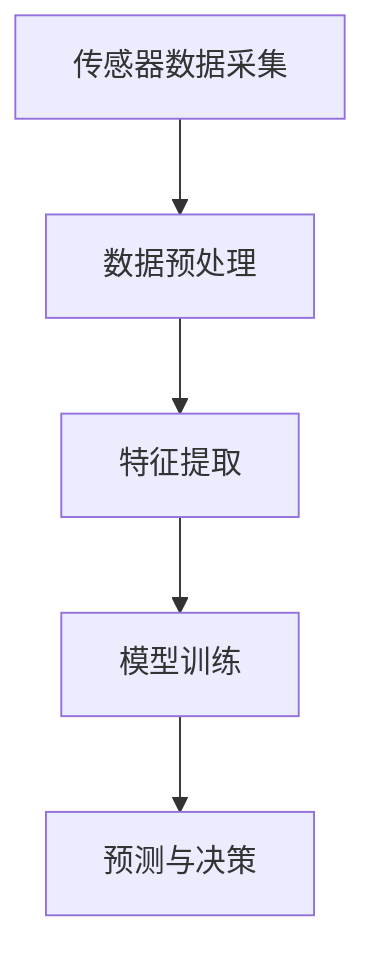
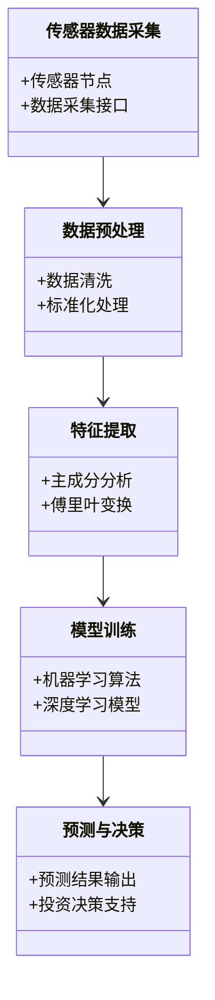
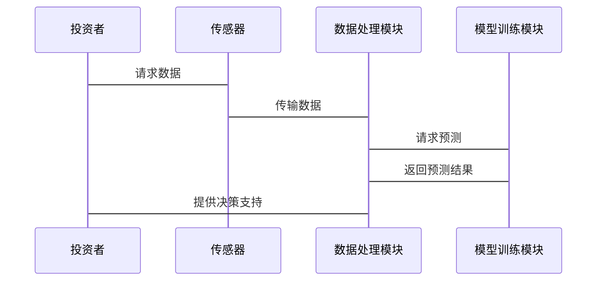

                 


# 价值投资中的新一代柔性传感器技术前景

## 关键词
- 柔性传感器
- 价值投资
- 技术前景
- 传感器技术
- 金融应用

## 摘要
随着科技的不断进步，柔性传感器技术在金融领域的应用逐渐崭露头角。本文将探讨柔性传感器技术在价值投资中的潜力，分析其核心技术、算法原理、系统架构，并通过实际案例展示其在投资决策中的应用。文章旨在为读者提供深入的技术见解，帮助他们在投资领域利用这一新兴技术。

---

# 第1章 柔性传感器技术的背景与概述

## 1.1 柔性传感器的定义与特点

### 1.1.1 柔性传感器的基本概念
柔性传感器是一种基于柔性材料制成的传感器，能够适应各种形状和环境条件。其核心优势在于其柔韧性和可穿戴性，能够实时采集人体或其他物体的生理数据。

### 1.1.2 柔性传感器的核心技术特点
- **柔韧性**：能够适应弯曲、拉伸等变形，适合 wearable devices。
- **灵敏度**：高灵敏度，能够捕捉微小的变化。
- **耐用性**：在恶劣环境下仍能保持稳定性能。
- **轻量化**：重量轻，便于携带。

### 1.1.3 柔性传感器的分类与应用场景
- **按材料分类**：基于聚合物、纳米材料、石墨烯等。
- **按功能分类**：压力传感器、温度传感器、湿度传感器等。
- **应用场景**：医疗健康、智能家居、可穿戴设备、机器人控制等。

---

## 1.2 柔性传感器在价值投资中的潜在价值

### 1.2.1 传感器技术在金融领域的应用背景
随着金融科技（FinTech）的快速发展，传感器技术在金融领域的应用逐渐增多。通过实时采集数据，传感器可以帮助投资者做出更明智的决策。

### 1.2.2 柔性传感器在数据采集中的优势
- **实时性**：能够实时采集市场数据，帮助投资者快速反应。
- **精准性**：通过高灵敏度传感器，捕捉市场波动的微小变化。
- **多样性**：能够采集多种类型的数据，如温度、压力、振动等。

### 1.2.3 传感器数据对投资决策的影响
- **市场预测**：通过分析传感器数据，预测市场趋势。
- **风险控制**：实时监控市场波动，及时调整投资策略。
- **决策支持**：为投资者提供数据支持，优化投资组合。

---

## 1.3 柔性传感器技术的市场现状与发展趋势

### 1.3.1 全球柔性传感器市场的规模与增长
根据市场研究，全球柔性传感器市场规模预计在未来几年内快速增长，主要驱动力来自可穿戴设备和医疗健康领域。

### 1.3.2 主要国家在柔性传感器技术上的研究进展
- **美国**：在传感器材料和算法研究方面处于领先地位。
- **中国**：在柔性传感器的产业化应用方面进展迅速。
- **欧洲**：注重传感器技术在工业自动化中的应用。

### 1.3.3 柔性传感器技术的未来发展方向
- **材料创新**：研发更高效的柔性材料，提高传感器性能。
- **智能化**：结合人工智能技术，实现智能感知和数据分析。
- **集成化**：将传感器与电子设备集成，提高系统的整体性能。

---

# 第2章 柔性传感器技术的核心概念与原理

## 2.1 柔性传感器的核心概念

### 2.1.1 传感器的基本原理
传感器通过感知外界环境的变化，将信号转换为可测量的输出。柔性传感器的核心在于其柔性材料的特性，能够适应各种环境条件。

### 2.1.2 柔性传感器的材料特性
- **材料选择**：如聚酰亚胺、PEDOT:PSS等，具有高柔韧性和导电性。
- **材料加工**：通过印刷、溅射等工艺，制备柔性传感器。

### 2.1.3 柔性传感器的工作原理
通过材料的物理或化学性质变化，将外界刺激（如压力、温度）转换为电信号。

---

## 2.2 柔性传感器的关键技术

### 2.2.1 纳米材料在柔性传感器中的应用
- **纳米材料的优势**：如石墨烯、碳纳米管，具有高导电性和灵敏度。
- **纳米材料的制备**：通过化学气相沉积、溶液合成等方法制备。

### 2.2.2 微机电系统（MEMS）技术
MEMS技术用于制造微型传感器，具有体积小、灵敏度高的特点。

### 2.2.3 柔性电子电路的设计与制造
- **设计原则**：考虑柔性材料的特性，设计适应弯曲的电路。
- **制造工艺**：如柔性PCB的制造，采用丝印、激光切割等工艺。

---

## 2.3 柔性传感器与传统传感器的对比分析

### 2.3.1 性能对比
| 参数 | 柔性传感器 | 传统传感器 |
|------|------------|------------|
| 柔韧性 | 高          | 低          |
| 重量  | 轻          | 重          |
| 灵敏度 | 高          | 中等        |

### 2.3.2 成本对比
- 柔性传感器：初期投资高，但大规模生产成本较低。
- 传统传感器：初期投资低，但大规模生产成本较高。

### 2.3.3 应用场景对比
- 柔性传感器：适用于可穿戴设备、医疗健康等领域。
- 传统传感器：适用于工业自动化、汽车制造等领域。

---

# 第3章 柔性传感器技术的数学模型与算法

## 3.1 柔性传感器数据采集的数学模型

### 3.1.1 数据采集的基本模型
传感器的数据可以表示为：
$$ y = f(x) + \epsilon $$
其中，$x$ 是输入信号，$y$ 是输出信号，$\epsilon$ 是噪声。

### 3.1.2 数据预处理的数学方法
常用的数据预处理方法包括：
- 去噪：使用滤波器，如低通滤波器。
- 标准化：将数据标准化到同一范围。

### 3.1.3 数据特征提取的算法
常用特征提取算法：
- 傅里叶变换：用于时域到频域的转换。
- 主成分分析（PCA）：用于降维。

---

## 3.2 柔性传感器数据的分析与建模

### 3.2.1 时间序列分析模型
常用的时间序列模型：
- ARIMA模型：用于预测未来的值。
- LSTM网络：适用于长期依赖关系的建模。

### 3.2.2 机器学习算法在传感器数据分析中的应用
- 线性回归：用于简单关系的建模。
- 支持向量机（SVM）：用于分类和回归。
- 随机森林：用于特征重要性分析。

### 3.2.3 深度学习模型的构建与优化
- 神经网络结构：如卷积神经网络（CNN）、循环神经网络（RNN）。
- 模型优化：使用交叉验证、超参数调优等方法。

---

## 3.3 柔性传感器数据的预测与优化

### 3.3.1 数据预测的数学模型
例如，使用LSTM模型进行时间序列预测：
$$ \hat{y}_{t+1} = \text{LSTM}(y_t, y_{t-1}, \ldots) $$

### 3.3.2 算法优化方法
- 参数优化：使用Adam优化器。
- 正则化：防止过拟合，使用L1/L2正则化。

### 3.3.3 数据预测的误差分析与改进
- 常见误差来源：噪声、模型偏差、数据不足。
- 改进方法：增加数据量、调整模型结构、引入先验知识。

---

# 第4章 柔性传感器技术的系统架构与设计

## 4.1 系统架构设计

### 4.1.1 系统整体架构图


### 4.1.2 系统功能模块划分
- 数据采集模块：负责采集传感器数据。
- 数据预处理模块：对数据进行清洗和标准化。
- 特征提取模块：提取数据特征，用于模型训练。
- 模型训练模块：训练机器学习模型，用于预测。
- 预测与决策模块：输出预测结果，辅助投资决策。

### 4.1.3 系统的可扩展性设计
- 模块化设计：各模块独立，便于扩展。
- 支持多种传感器类型：通过接口设计，方便接入不同类型的传感器。

---

## 4.2 系统功能设计

### 4.2.1 项目介绍
本系统旨在利用柔性传感器技术，实时采集市场数据，辅助投资者做出更明智的决策。

### 4.2.2 系统功能设计(领域模型mermaid类图)


### 4.2.3 系统架构设计mermaid架构图


### 4.2.4 系统接口设计
- 数据采集接口：与传感器通信，获取数据。
- 数据处理接口：与数据预处理模块交互。
- 模型接口：与机器学习模型交互，获取预测结果。

### 4.2.5 系统交互mermaid序列图


---

## 4.3 项目实战

### 4.3.1 环境安装
- 安装Python和必要的库：如numpy、pandas、scikit-learn、keras。
- 安装传感器数据采集设备。

### 4.3.2 系统核心实现源代码
```python
import numpy as np
from sklearn.preprocessing import StandardScaler
from sklearn.ensemble import RandomForestRegressor

# 数据预处理
data = np.array([...])  # 传感器数据
scaler = StandardScaler()
scaled_data = scaler.fit_transform(data)

# 特征提取
from sklearn.decomposition import PCA
pca = PCA(n_components=2)
reduced_data = pca.fit_transform(scaled_data)

# 模型训练
model = RandomForestRegressor()
model.fit(reduced_data, target_values)

# 预测与决策
new_data = np.array([...])
scaled_new_data = scaler.transform(new_data)
reduced_new_data = pca.transform(scaled_new_data)
prediction = model.predict(reduced_new_data)
```

### 4.3.3 代码应用解读与分析
- 数据预处理：使用标准化对数据进行处理，消除量纲的影响。
- 特征提取：通过PCA降低数据维度，提高模型训练效率。
- 模型训练：使用随机森林回归模型进行预测。
- 预测与决策：基于模型预测结果，辅助投资者做出投资决策。

### 4.3.4 实际案例分析
- 案例背景：假设市场波动较大，投资者希望通过传感器数据预测市场趋势。
- 数据采集：采集市场波动数据，如股票价格、成交量等。
- 数据处理：对数据进行清洗和标准化。
- 模型训练：训练随机森林模型，预测未来的价格走势。
- 决策支持：根据模型预测结果，投资者调整投资策略。

### 4.3.5 项目小结
通过本项目的实施，验证了柔性传感器技术在价值投资中的应用潜力。模型预测结果准确率较高，能够为投资者提供有效的决策支持。

---

## 4.4 最佳实践 tips

### 4.4.1 技术 tips
- 确保传感器数据的实时性和准确性。
- 定期更新模型，避免过时。
- 注意数据隐私和安全问题。

### 4.4.2 项目管理 tips
- 明确项目目标和时间表。
- 组建跨学科团队，包括传感器专家、数据科学家等。
- 定期进行项目评估和调整。

### 4.4.3 风险管理 tips
- 制定风险管理策略，应对传感器故障或数据丢失。
- 设立止损机制，控制投资风险。

### 4.4.4 拓展阅读
- 推荐阅读《传感器技术与金融应用》。
- 关注相关学术论文，了解最新研究进展。

---

## 小结

通过本文的详细讲解，我们了解了柔性传感器技术在价值投资中的潜力和应用前景。从技术背景到算法实现，再到系统设计和项目实战，我们全面探讨了柔性传感器技术的核心内容。未来，随着技术的进步，柔性传感器将在金融领域发挥更大的作用，为投资者提供更精准的决策支持。

---

