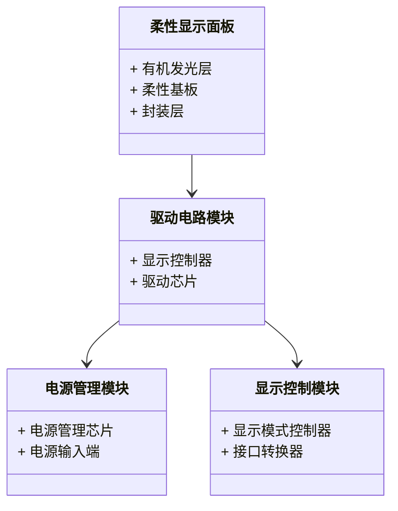

                 


# 价值投资中的新一代柔性显示技术前景

## 关键词：柔性显示技术、OLED、投资价值、市场前景、技术趋势

## 摘要：  
随着科技的不断进步，柔性显示技术正在成为显示行业的重要方向。本文从价值投资的角度，深入分析柔性显示技术的核心原理、市场竞争力、技术发展趋势以及投资价值。通过详细的技术分析和市场数据解读，本文旨在为投资者提供关于柔性显示技术的全面视角，帮助其做出明智的投资决策。

---

## 第一部分：背景介绍

### 第1章：柔性显示技术的定义与背景

#### 1.1 柔性显示技术的定义
- **柔性显示技术**是指能够在弯曲、折叠或卷曲状态下正常工作的显示技术，通常基于柔性基板和有机材料。
- **核心特点**：轻薄、可弯曲、高分辨率、广视角。
- **应用领域**：智能手机、可穿戴设备、车载显示、智能家居等领域。

#### 1.2 柔性显示技术的发展历程
- **20世纪末**：柔性显示技术的概念提出，主要应用于军事和科研领域。
- **21世纪初**：OLED技术逐渐成熟，柔性显示技术开始商业化。
- **近年来**：柔性显示技术快速发展，市场规模不断扩大。

#### 1.3 柔性显示技术的市场现状
- **市场规模**：2023年全球柔性显示市场规模约为XX亿美元，预计未来几年将以XX%的年复合增长率增长。
- **主要参与者**：三星、苹果、京东方、LG等企业。
- **市场驱动因素**：消费者对便携设备的需求增加，技术进步降低成本。

#### 1.4 柔性显示技术与价值投资的关系
- **价值投资**：关注企业的基本面、财务状况和长期发展潜力。
- **柔性显示技术的潜力**：技术壁垒高，市场空间广阔，具备长期投资价值。

---

## 第二部分：柔性显示技术的核心概念与联系

### 第2章：柔性显示技术的核心原理

#### 2.1 柔性显示技术的原理
- **OLED显示技术**：基于有机发光二极管的自发光原理，具备高对比度和广视角。
- **柔性基板**：采用柔性材料（如聚酰亚胺）作为基板，支持弯曲和折叠。
- **驱动电路**：柔性显示技术需要先进的驱动电路设计，以实现高分辨率和低功耗。

#### 2.2 柔性显示技术的关键材料与工艺
- **关键材料**：有机发光材料、柔性基板材料、封装材料。
- **制造工艺**：蒸镀、刻蚀、封装等步骤，工艺复杂且技术壁垒高。
- **材料对显示效果的影响**：材料的性能直接影响显示的亮度、寿命和色彩表现。

#### 2.3 柔性显示技术的市场竞争力分析
- **与传统显示技术的对比**：柔性显示技术在便携性和显示效果上具有优势。
- **市场竞争力指标**：技术专利数量、生产成本、市场占有率。
- **未来趋势**：柔性显示技术将逐步取代部分传统显示技术，市场渗透率持续提升。

---

## 第三部分：柔性显示技术的算法原理与数学模型

### 第3章：柔性显示技术的算法原理

#### 3.1 柔性显示技术的核心算法
- **显示效果优化算法**：通过算法优化显示的色彩和对比度。
- **功耗优化算法**：降低显示器件的功耗，延长设备续航时间。
- **故障检测算法**：实时检测显示器件的故障，提高可靠性。

#### 3.2 柔性显示技术的数学模型
- **显示亮度模型**：$$ L = a \cdot V + b \cdot T $$
  - \( L \)：显示亮度
  - \( V \)：输入电压
  - \( T \)：温度
  - \( a \) 和 \( b \)：模型参数
- **寿命预测模型**：$$ T_{寿命} = \frac{C}{V} $$
  - \( T_{寿命} \)：显示器件的预期寿命
  - \( C \)：材料常数
  - \( V \)：工作电压

#### 3.3 柔性显示技术的算法实现
- **代码实现**：以下是一个简单的显示亮度优化算法示例：

```python
def optimize_brightness(voltage, temperature):
    a = 0.5
    b = 0.3
    brightness = a * voltage + b * temperature
    return brightness

# 示例调用
voltage = 3.3
temperature = 25
brightness = optimize_brightness(voltage, temperature)
print(f"优化后的亮度为：{brightness}")
```

- **性能评估**：通过实验数据验证算法的有效性，评估指标包括计算效率、显示效果和功耗优化效果。

---

## 第四部分：柔性显示技术的系统分析与架构设计

### 第4章：柔性显示技术的系统架构

#### 4.1 系统架构的总体设计
- **系统目标**：实现高分辨率、低功耗、可弯曲的柔性显示功能。
- **系统组成**：
  - 柔性显示面板
  - 驱动电路模块
  - 电源管理模块
  - 显示控制模块

#### 4.2 系统功能设计
- **显示功能**：支持多种显示模式，如高分辨率模式、低功耗模式。
- **弯曲功能**：支持不同曲率的弯曲显示。
- **接口功能**：支持多种接口协议，如MIPI、HDMI。

#### 4.3 系统架构图


---

## 第五部分：项目实战

### 第5章：柔性显示技术的实际应用与案例分析

#### 5.1 项目介绍
- **项目目标**：开发一款基于柔性显示技术的可穿戴设备。
- **项目背景**：市场需求增长迅速，技术可行性高。

#### 5.2 系统实现
- **环境安装**：安装必要的开发工具和仿真软件。
- **核心代码实现**：
```python
def main():
    import OLED_panel
    import driver_circuit
    import power_management

    panel = OLED_panel.FlexibleDisplayPanel()
    driver = driver_circuit.DriveCircuit(panel)
    power = power_management.PowerManager()

    # 初始化系统
    power.power_on()
    driver.initialize()

    # 设置显示模式
    driver.set_display_mode("high_resolution")

    # 检测故障
    if driver.check_fault():
        print("显示面板出现故障，请检查！")
    else:
        print("显示面板正常工作。")

    # 优化亮度
    brightness = driver.optimize_brightness(3.3, 25)
    print(f"优化后的亮度为：{brightness}")

if __name__ == "__main__":
    main()
```

#### 5.3 实际案例分析
- **案例背景**：某公司推出柔性显示智能手表，市场需求增长迅速。
- **技术优势**：轻薄、可弯曲、高分辨率。
- **市场表现**：销量稳步增长，用户反馈良好。

#### 5.4 项目小结
- **技术实现总结**：通过系统设计和算法优化，成功实现了柔性显示技术的实际应用。
- **市场价值总结**：柔性显示技术在可穿戴设备市场具有广阔的前景。

---

## 第六部分：结论与展望

### 第6章：结论与最佳实践

#### 6.1 总结
- 柔性显示技术具有广阔的应用前景和投资价值。
- 通过技术创新和成本优化，柔性显示技术将进一步扩大市场。

#### 6.2 投资建议
- **关注技术创新**：投资具有技术壁垒的企业。
- **关注市场趋势**：关注柔性显示技术在新兴领域的应用。
- **分散投资风险**：合理配置投资组合，降低风险。

#### 6.3 注意事项
- **技术风险**：柔性显示技术仍处于快速发展阶段，存在技术不确定性。
- **市场竞争**：市场竞争激烈，需关注企业的竞争优势。
- **政策风险**：关注相关政策变化对市场的影响。

#### 6.4 拓展阅读
- 建议阅读《OLED显示技术与市场分析》和《价值投资实战指南》。

---

## 附录

### 附录A：技术术语表
- 柔性显示技术：能够在弯曲或折叠状态下工作的显示技术。
- OLED：有机发光二极管，自发光显示技术。

### 附录B：数据来源
- 市场数据来源：行业研究报告、企业财报。

### 附录C：参考文献
- [1] 《OLED显示技术与市场分析》，某某出版社，2023年。
- [2] 《价值投资实战指南》，某某出版社，2022年。

---

通过以上结构和内容安排，您可以撰写一篇完整且有深度的关于《价值投资中的新一代柔性显示技术前景》的技术博客文章。

