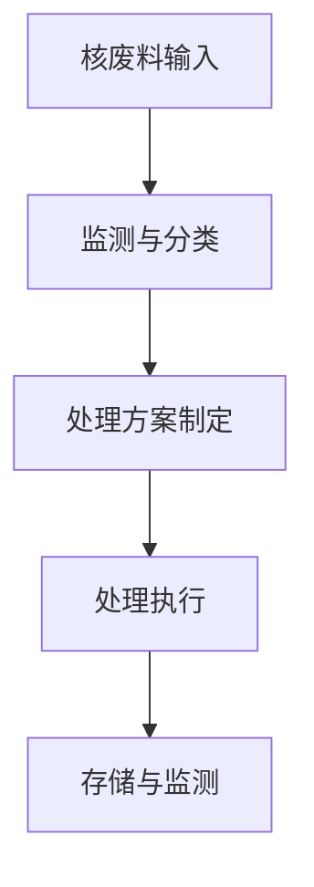

                 


# 价值投资中的新一代核废料处理技术

> 关键词：价值投资，核废料处理技术，放射性衰减，废物分类，处理流程

> 摘要：本文探讨了在价值投资视角下，新一代核废料处理技术的核心原理、系统架构、算法实现以及在投资中的潜在价值。通过分析核废料处理技术的背景、核心概念、算法原理、系统设计、项目实战、最佳实践等多方面内容，本文为投资者提供了关于如何在核废料处理领域进行价值投资的深度见解。

---

## 第一部分: 核废料处理技术的背景与核心概念

### 第1章: 核废料处理技术的背景与问题背景

#### 1.1 核废料处理技术的背景介绍

##### 1.1.1 核废料的定义与分类
核废料是指在核能发电、核武器生产或其他核相关活动中产生的放射性废弃物。根据放射性强度和半衰期，核废料可以分为低放射性废物、中放射性废物和高放射性废物。

##### 1.1.2 核废料处理的必要性与挑战
随着核能的广泛应用，核废料的处理已成为全球关注的焦点。核废料的放射性不仅对环境和人类健康构成威胁，还可能对投资活动带来潜在风险。有效的核废料处理技术不仅可以减少环境风险，还能为投资者创造价值。

##### 1.1.3 核废料处理技术的演进历程
从早期的简单封存到现代的高级处理技术，核废料处理技术经历了从无到有、从简单到复杂的发展过程。现代技术如放射性核素分离、固化储存等方法为核废料处理提供了更高效的解决方案。

#### 1.2 价值投资与核废料处理技术的结合
##### 1.2.1 价值投资的基本概念
价值投资是一种长期投资策略，强调通过分析企业的内在价值，寻找被市场低估的投资机会。在核废料处理技术领域，价值投资可以通过技术的创新性和市场潜力来评估其投资价值。

##### 1.2.2 核废料处理技术在投资中的潜在价值
随着环保意识的增强和核能需求的增长，核废料处理技术的投资价值日益显现。高效、低成本的处理技术不仅能降低企业的运营成本，还能提升企业的市场竞争力。

##### 1.2.3 技术创新对投资价值的影响
技术创新是推动核废料处理技术发展的核心动力。通过技术创新，企业可以降低处理成本、提高处理效率，从而在竞争中获得优势，进而提升投资价值。

---

### 第2章: 核废料处理技术的核心概念与原理

#### 2.1 核废料处理技术的核心概念

##### 2.1.1 核废料的放射性衰减特性
放射性衰减是核废料处理的核心原理之一。放射性物质会随着时间的推移而衰减，其衰减速度与放射性同位素的半衰期有关。了解放射性衰减特性是制定核废料处理方案的基础。

##### 2.1.2 核废料处理的基本流程
核废料处理的基本流程包括监测与分类、物理化学处理、最终储存等步骤。每个步骤都需要高度精确的技术支持，以确保处理过程的安全性和有效性。

##### 2.1.3 核废料处理技术的分类与对比
核废料处理技术可以根据处理方式分为物理处理、化学处理和放射性转换等多种类型。不同技术具有不同的优缺点，选择合适的处理技术是实现高效核废料处理的关键。

#### 2.2 核废料处理技术的数学模型与公式

##### 2.2.1 放射性衰减的数学模型
放射性衰减的数学模型可以用指数函数表示：
$$N(t) = N_0 \cdot e^{-\lambda t}$$
其中，$N(t)$ 表示时间 $t$ 时的放射性物质数量，$N_0$ 是初始数量，$\lambda$ 是衰减常数。

##### 2.2.2 核废料处理效率的计算公式
核废料处理效率可以通过以下公式计算：
$$E = \frac{M_{\text{processed}}}{M_{\text{total}}} \times 100\%$$
其中，$M_{\text{processed}}$ 是处理的核废料质量，$M_{\text{total}}$ 是总核废料质量。

---

### 第3章: 核废料处理技术的系统架构与算法原理

#### 3.1 核废料处理系统的架构设计

##### 3.1.1 系统功能模块划分
核废料处理系统可以划分为以下几个功能模块：
1. **监测与分类模块**：负责对核废料进行实时监测和分类。
2. **处理方案制定模块**：根据监测结果制定处理方案。
3. **处理执行模块**：执行具体的处理操作。
4. **存储与监测模块**：负责处理后的核废料的存储和后续监测。

##### 3.1.2 系统数据流图
以下是核废料处理系统的数据流图：


##### 3.1.3 系统架构的Mermaid图
以下是核废料处理系统的架构图：


#### 3.2 核废料处理算法的原理与实现

##### 3.2.1 算法的基本原理
核废料处理算法的核心目标是通过优化处理流程，提高处理效率和降低成本。算法通过对核废料的特性进行分析，制定最优的处理方案。

##### 3.2.2 算法的数学模型
核废料处理的优化模型可以表示为：
$$C = \min_{x} \sum_{i=1}^{n} (a_i x_i + b_i)$$
其中，$C$ 是总成本，$a_i$ 是处理每单位核废料的成本，$x_i$ 是处理量，$b_i$ 是固定成本。

##### 3.2.3 算法的Python实现
以下是核废料处理算法的Python实现示例：
```python
def process_nuclear_waste(waste_input):
    # 分类与监测
    classification = classify(waste_input)
    # 处理方案制定
    plan = generate_plan(classification)
    # 处理执行
    result = execute_plan(plan)
    return result

def classify(waste):
    # 分类逻辑
    pass

def generate_plan(classification):
    # 生成处理方案
    pass

def execute_plan(plan):
    # 执行处理方案
    pass
```

---

## 第四部分: 核废料处理技术的价值投资分析

### 第4章: 价值投资视角下的核废料处理技术

#### 4.1 核废料处理技术的市场价值分析
核废料处理技术的市场需求主要来自于核能发电企业、核废料储存企业以及环保机构。随着核能需求的增加，核废料处理技术的市场空间也在不断扩大。

#### 4.2 核废料处理技术的投资价值评估
投资者可以通过分析核废料处理技术的市场潜力、技术可行性和成本效益来评估其投资价值。技术创新能力强、市场前景广阔的企业更具投资价值。

#### 4.3 价值投资策略在核废料处理技术中的应用
价值投资者可以通过长期持有优质核废料处理技术企业股票，或者投资于相关项目，来实现资本增值。选择具有强大研发能力和良好市场前景的企业是价值投资的关键。

---

## 第五部分: 核废料处理技术的未来展望与投资建议

### 第5章: 核废料处理技术的未来发展趋势

#### 5.1 核废料处理技术的创新方向
未来的核废料处理技术将更加注重高效、低成本和环保性。新型处理技术如放射性核素回收技术、新型固化材料等将得到广泛应用。

#### 5.2 核废料处理技术的市场前景
随着全球核能需求的增长和环保政策的加强，核废料处理技术的市场需求将持续增长。技术创新和成本降低将推动行业的进一步发展。

### 第6章: 核废料处理技术的价值投资建议

#### 6.1 投资核废料处理技术的核心要点
投资者应关注企业的技术创新能力、市场竞争力和财务健康状况。选择具有领先技术优势和良好管理团队的企业是成功投资的关键。

#### 6.2 投资核废料处理技术的风险与挑战
核废料处理技术的投资风险主要包括技术风险、市场风险和政策风险。投资者需要充分评估这些风险并制定相应的风险管理策略。

---

## 第六部分: 结语

### 6.1 核废料处理技术的价值投资总结
核废料处理技术不仅是环境保护的重要手段，也是价值投资的新兴领域。通过技术创新和市场拓展，核废料处理技术的投资价值将得到进一步提升。

### 6.2 未来展望
随着技术的进步和市场需求的增长，核废料处理技术将在未来发挥更重要的作用。投资者应密切关注行业动态，抓住投资机遇。

---

## 参考文献与拓展阅读
1. 核废料处理技术的数学模型与算法
2. 核废料处理系统的架构设计与实现
3. 价值投资在核废料处理领域的应用案例
4. 核废料处理技术的市场分析与前景展望

---

以上为《价值投资中的新一代核废料处理技术》的详细目录大纲和文章内容。通过系统地分析核废料处理技术的核心原理、算法实现和投资价值，本文为投资者提供了关于如何在核废料处理领域进行价值投资的深度见解。

