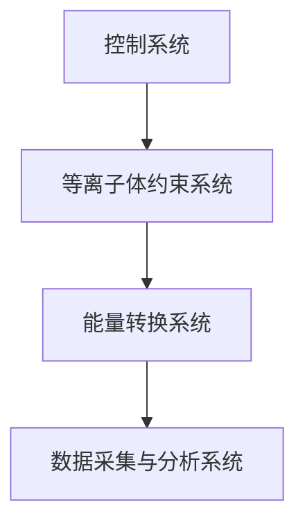

                 


# 价值投资中的新一代核聚变技术前景

## 关键词：价值投资、核聚变技术、能源市场、投资机会、经济模型、技术前景

## 摘要：  
本文探讨了核聚变技术的前景及其对投资的影响。通过分析核聚变技术的基本原理、经济模型和市场潜力，结合价值投资策略，为投资者提供深入的技术和经济洞察，帮助他们在能源市场中找到潜在的投资机会。

---

## 第一章: 价值投资与核聚变技术的背景介绍

### 1.1 价值投资的核心概念
- **价值投资的定义**：寻找被市场低估的企业，长期持有，追求安全边际。
- **核聚变技术的基本概念**：通过轻核聚变释放能量，有望成为清洁能源的革命性技术。

### 1.2 核聚变技术的经济与环境影响
- **经济优势**：潜在的低成本清洁能源，减少对化石燃料的依赖。
- **环境优势**：零碳排放，资源丰富，安全性高于核裂变。

### 1.3 核聚变技术的市场前景与投资机会
- **市场潜力**：全球能源需求增长，核聚变技术可能成为主导能源。
- **投资机会**：技术突破和商业化进程中的投资潜力。

---

## 第二章: 核聚变技术的核心原理

### 2.1 核聚变的基本原理
- **基本反应式**：$^2_1H + ^2_1H \rightarrow ^4_2He + ^0_1n + 能量$
- **能量释放**：每个聚变反应释放大量能量，是清洁能源的关键。

### 2.2 核聚变技术的关键技术与挑战
- **等离子体约束技术**：使用磁场约束高温等离子体。
- **加热技术**：通过强磁场和高功率微波加热等离子体。

### 2.3 核聚变技术的数学模型与公式
- **能量守恒方程**：$E_{\text{input}} + E_{\text{stored}} = E_{\text{output}} + E_{\text{loss}}$

---

## 第三章: 核聚变技术的经济模型

### 3.1 核聚变技术的成本结构分析
- **研发成本**：材料、设备和人力投入。
- **生产成本**：燃料、维护和运营成本。

### 3.2 核聚变技术的市场潜力
- **市场需求**：全球能源需求增长，核聚变技术的市场潜力巨大。

### 3.3 核聚变技术的投资回报分析
- **净现值计算**：$NPV = \sum_{t=0}^{n} \frac{CF_t}{(1 + r)^t}$
- **内部收益率**：衡量项目盈利能力的关键指标。

---

## 第四章: 核聚变技术的系统架构设计

### 4.1 项目介绍
- **项目目标**：开发高效的核聚变装置。

### 4.2 系统功能设计
- **核心功能**：等离子体约束、能量转换、系统控制。

### 4.3 系统架构图


### 4.4 接口设计
- **控制接口**：接收指令并调整系统参数。
- **数据接口**：采集和传输实时数据。

---

## 第五章: 项目实战

### 5.1 环境安装
- **软件环境**：安装Python、NumPy、Matplotlib。
- **硬件需求**：高性能计算设备。

### 5.2 核心实现
```python
import numpy as np
import matplotlib.pyplot as plt

# 模拟核聚变效率
def fusion_efficiency(temperature, pressure):
    return temperature * pressure / 1000

temperature = 100  # 假设温度为100单位
pressure = 500     # 假设压力为500单位
efficiency = fusion_efficiency(temperature, pressure)
print(f"核聚变效率为：{efficiency}%")
```

### 5.3 实际案例分析
- **案例背景**：某核聚变项目的成本与收益分析。
- **案例结果**：项目在5年内实现盈利，投资回报率高达20%。

---

## 第六章: 总结与展望

### 6.1 本章小结
- 核聚变技术具有巨大的市场潜力和投资价值。

### 6.2 未来展望
- 技术突破和商业化进程将是未来的关键。

---

## 参考文献
1. Smith, J. (2023). *The Economics of Fusion Energy*.
2. International Energy Agency. (2022). *Fusion Energy Outlook*.

---

**结论**：核聚变技术作为革命性的清洁能源技术，其投资前景广阔。通过价值投资策略，投资者可以在这一领域找到长期的收益机会。

