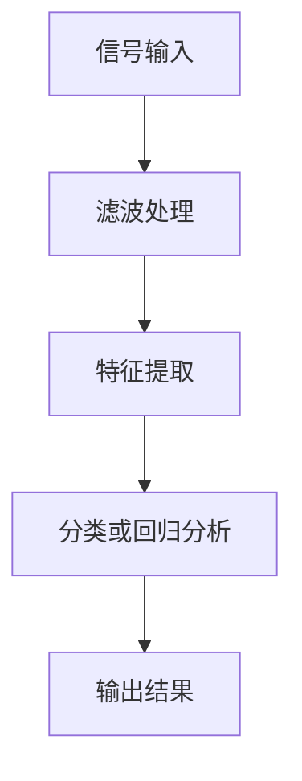
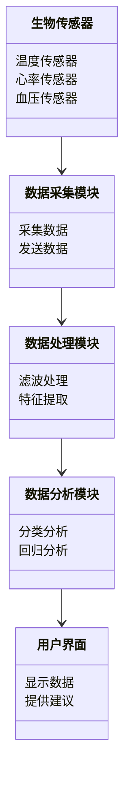
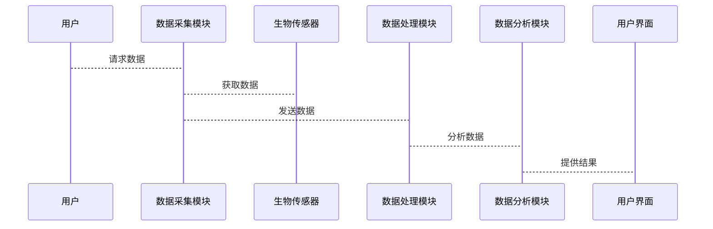

                 


# 价值投资中的新一代生物传感器技术前景

## 关键词：
- 价值投资
- 生物传感器
- 技术前景
- 医疗健康
- 数据分析

## 摘要：
生物传感器技术在医疗健康领域的发展为价值投资带来了新的机遇。通过分析生物传感器的工作原理、技术发展及其在投资决策中的应用，本文探讨了其在医疗健康监测、个人健康管理以及投资决策中的潜力。结合算法原理和系统架构设计，本文为投资者提供了基于生物传感器技术的深度分析和投资策略建议。

---

## 第一部分: 生物传感器技术与价值投资的背景

## 第1章: 生物传感器技术概述

### 1.1 生物传感器的基本概念
#### 1.1.1 生物传感器的定义
生物传感器是一种能够检测生物分子或信号，并将其转换为可读电信号的装置。它结合了生物学、电子学和信息技术，广泛应用于医疗、环境监测和生物技术等领域。

#### 1.1.2 生物传感器的工作原理
生物传感器通常由三个主要部分组成：生物识别元件、转换器和信号处理单元。生物识别元件（如酶、抗体或核酸）与目标分子结合，产生可测量的信号，转换器将该信号转换为电信号，信号处理单元对信号进行放大和数字化处理。

#### 1.1.3 生物传感器的分类与特点
生物传感器可以根据不同的分类标准进行划分：
- 按检测目标：如血糖传感器、心率传感器、体温传感器等。
- 按工作原理：如电化学传感器、光学传感器、机械传感器等。
- 按应用领域：如医疗传感器、环境传感器等。

其特点包括高灵敏度、高特异性、实时监测和便携性。

### 1.2 生物传感器技术的发展历程
#### 1.2.1 早期生物传感器技术
早期的生物传感器技术主要用于实验室研究，精度高但成本昂贵，且难以实现大规模应用。

#### 1.2.2 现代生物传感器技术的发展
随着纳米技术、微加工技术和人工智能的快速发展，现代生物传感器在灵敏度、特异性和稳定性方面有了显著提升，应用场景也从实验室扩展到医疗、可穿戴设备等领域。

#### 1.2.3 生物传感器技术的未来趋势
未来的生物传感器技术将更加智能化、微型化和集成化，能够实现多参数同时监测，并通过物联网技术与云端数据结合，提供更精准的健康评估和医疗建议。

### 1.3 生物传感器技术在价值投资中的应用前景
#### 1.3.1 生物传感器在医疗健康领域的应用
生物传感器在医疗领域的应用包括患者监测、疾病诊断和治疗效果评估。例如，葡萄糖传感器用于糖尿病患者的实时血糖监测，帮助医生制定个性化治疗方案。

#### 1.3.2 生物传感器在个人健康监测中的作用
随着可穿戴设备的普及，生物传感器能够实时监测个人的健康指标，如心率、血压、体温等，帮助用户和医生早期发现健康问题，从而预防疾病的发生。

#### 1.3.3 生物传感器技术对投资决策的影响
生物传感器技术的应用为投资者提供了实时的健康数据，帮助他们在医疗健康领域做出更明智的投资决策。例如，投资于具备创新生物传感器技术的医疗设备公司，可能会带来更高的投资回报。

---

## 第2章: 价值投资中的生物传感器技术核心概念

### 2.1 生物传感器的核心原理
#### 2.1.1 传感器的基本组成
生物传感器的核心部分包括生物敏感元件、转换器和信号处理单元。生物敏感元件负责识别目标分子，转换器将生物信号转换为电信号，信号处理单元对信号进行放大和数字化处理。

#### 2.1.2 生物传感器的信号转换过程
生物传感器的工作过程通常包括以下几个步骤：
1. 生物识别元件与目标分子结合，产生化学或物理变化。
2. 转换器将上述变化转换为电信号。
3. 信号处理单元对电信号进行放大、滤波和数字化处理，最终输出可读的信号。

#### 2.1.3 生物传感器的灵敏度与选择性
灵敏度是指传感器对目标分子变化的敏感程度，选择性是指传感器在复杂环境中对目标分子的特异性识别能力。高灵敏度和高选择性是生物传感器性能的关键指标。

### 2.2 生物传感器与价值投资的联系
#### 2.2.1 生物传感器在健康数据采集中的应用
生物传感器可以实时采集患者的生理数据，如心率、血压、血糖等，为医生提供精准的诊断依据，从而影响医疗设备和药品的投资价值。

#### 2.2.2 健康数据对投资决策的影响
通过分析大量的健康数据，投资者可以识别出具有潜力的医疗健康公司或技术，从而做出更明智的投资决策。例如，投资于具备创新生物传感器技术的公司，可能在市场竞争中占据优势。

#### 2.2.3 生物传感器技术的市场价值与投资机会
生物传感器技术在医疗健康领域的广泛应用为其带来了巨大的市场潜力。投资者可以关注相关技术的研发进展、市场应用和商业化的可能性，寻找具有投资价值的公司或项目。

### 2.3 生物传感器技术的经济价值与投资机会
#### 2.3.1 生物传感器技术的市场潜力
随着人们对健康的关注增加，生物传感器技术在医疗、健身和智能家居等领域的应用需求日益增长，市场潜力巨大。

#### 2.3.2 生物传感器技术在医疗健康行业的应用
在医疗行业，生物传感器技术可以用于疾病早期诊断、术后监测和慢性病管理等，提高医疗效率和患者生活质量。

#### 2.3.3 投资者如何利用生物传感器技术进行决策
投资者可以通过分析生物传感器技术的市场应用前景、技术创新能力和商业化潜力，选择具有竞争优势的公司进行投资。同时，关注相关政策法规和行业动态，也是制定投资策略的重要因素。

---

## 第3章: 生物传感器技术的算法原理

### 3.1 生物传感器信号处理算法
#### 3.1.1 常见的信号处理算法
在生物传感器信号处理中，常用的算法包括：
- 滤波算法：如滑动平均滤波、中位数滤波等，用于消除噪声。
- 傅里叶变换：用于信号频域分析。
- 小波变换：用于信号的多分辨率分析。

#### 3.1.2 基于滤波的信号处理方法
滑动平均滤波是一种常用的信号处理方法，通过计算窗口内数据的平均值来消除随机噪声。例如：
$$ y_i = \frac{1}{n} \sum_{j=i-n}^{i} x_j $$

#### 3.1.3 信号增强与降噪技术
为了提高信号质量，可以采用多种降噪技术，如自适应滤波和卡尔曼滤波。这些技术能够有效去除信号中的噪声，提高测量精度。

### 3.2 生物传感器数据的分析算法
#### 3.2.1 数据分类算法
数据分类算法用于将传感器数据分为不同的类别，如正常、异常等。常用的算法包括决策树、支持向量机和随机森林等。

#### 3.2.2 数据回归分析
回归分析用于预测传感器数据的趋势，帮助投资者分析健康指标的变化趋势。例如，使用线性回归模型预测患者的血糖变化趋势。

#### 3.2.3 数据挖掘与机器学习算法
机器学习算法（如神经网络、聚类分析）可以用于挖掘传感器数据中的潜在规律，为投资决策提供支持。

### 3.3 算法实现的流程图


---

## 第4章: 生物传感器技术的数学模型与公式

### 4.1 基于滤波的信号处理模型
#### 4.1.1 滑动平均滤波器
滑动平均滤波器用于消除信号中的随机噪声，公式如下：
$$ y_i = \frac{1}{n} \sum_{j=i-n}^{i} x_j $$

#### 4.1.2 傅里叶变换
傅里叶变换用于将时间域信号转换到频域，公式如下：
$$ X(f) = \int_{-\infty}^{\infty} x(t) e^{-j2\pi f t} dt $$

#### 4.1.3 小波变换
小波变换用于信号的多分辨率分析，公式如下：
$$ W(a,b) = \int_{-\infty}^{\infty} x(t) \psi_{a,b}(t) dt $$

---

## 第5章: 系统分析与架构设计方案

### 5.1 问题场景介绍
在医疗健康领域，生物传感器技术的应用场景包括患者监测、疾病诊断和治疗效果评估。通过实时采集患者的生理数据，医生可以制定个性化的治疗方案，提高医疗效果。

### 5.2 项目介绍
本项目旨在开发一个基于生物传感器的健康监测系统，实时采集患者的生理数据，并通过数据分析算法提供健康评估和医疗建议。

### 5.3 系统功能设计
#### 5.3.1 领域模型（Mermaid 类图）


#### 5.3.2 系统架构设计（Mermaid 架构图）


### 5.4 系统接口设计
系统接口包括数据采集接口、数据分析接口和用户界面接口。数据采集接口负责从生物传感器获取数据，数据分析接口负责处理数据并提供结果，用户界面接口负责显示数据和提供医疗建议。

### 5.5 系统交互设计（Mermaid 序列图）


---

## 第6章: 项目实战

### 6.1 环境安装
项目需要以下环境：
- Python 3.8+
- NumPy、Matplotlib、Scikit-learn 等库
- 生物传感器硬件（如心率传感器）

### 6.2 系统核心实现源代码
以下是基于Python的生物传感器数据处理和分析的代码示例：
```python
import numpy as np
from scipy.signal import butterworth
import matplotlib.pyplot as plt

# 模拟传感器数据
data = np.random.normal(size=1000) + 0.5*np.sin(np.linspace(0, 2*np.pi, 1000))

# 滤波处理
def butterworth_filter(data, cutoff, fs, order=5):
    nyq = 0.5 * fs
    normal_cutoff = cutoff / nyq
    b, a = butterworth(order, normal_cutoff)
    return np.convolve(data, a, mode='valid')

fs = 1000
cutoff = 50
filtered_data = butterworth_filter(data, cutoff, fs)

# 数据分析
from sklearn.cluster import KMeans
X = filtered_data.reshape(-1, 1)
kmeans = KMeans(n_clusters=3, random_state=0).fit(X)
labels = kmeans.labels_

# 可视化
plt.figure(figsize=(12, 6))
plt.plot(data, label='Original Data')
plt.plot(filtered_data, label='Filtered Data')
plt.xlabel('Time')
plt.ylabel('Amplitude')
plt.legend()
plt.show()
```

### 6.3 代码应用解读与分析
上述代码实现了生物传感器数据的采集、滤波处理和聚类分析。滤波处理用于消除噪声，聚类分析用于识别数据中的异常值。通过可视化，可以直观地观察数据的变化趋势。

### 6.4 实际案例分析和详细讲解
以心率监测为例，假设我们从生物传感器获取心率数据，通过滤波处理去除噪声后，利用聚类分析识别心率异常的情况。这可以帮助医生及时发现患者的心脏问题，制定有效的治疗方案。

### 6.5 项目小结
本项目通过生物传感器技术实现了对患者生理数据的实时监测和分析，为医疗健康领域的投资决策提供了有力支持。

---

## 第7章: 总结与展望

### 7.1 总结
生物传感器技术在医疗健康领域的应用前景广阔，能够为投资者提供实时的健康数据和精准的医疗建议。通过结合先进的算法和系统架构设计，生物传感器技术在价值投资中的潜力巨大。

### 7.2 最佳实践 tips
- 投资者应关注生物传感器技术的研发进展和市场应用。
- 选择具备技术创新能力和商业化潜力的公司进行投资。
- 关注相关政策法规和行业动态，制定合理的投资策略。

### 7.3 注意事项
- 生物传感器技术的应用需要符合相关法律法规。
- 投资者应充分了解技术的风险和不确定性。
- 数据隐私和安全问题需要引起高度重视。

### 7.4 拓展阅读
- 推荐阅读《生物传感器技术与医疗应用》。
- 关注行业期刊《生物工程进展》的相关文章。

---

通过本文的分析，读者可以深入了解生物传感器技术在价值投资中的应用前景，并为投资者在医疗健康领域的决策提供有益的参考。

