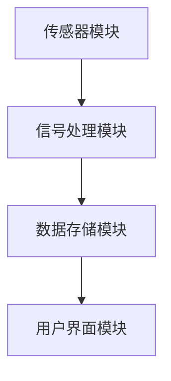
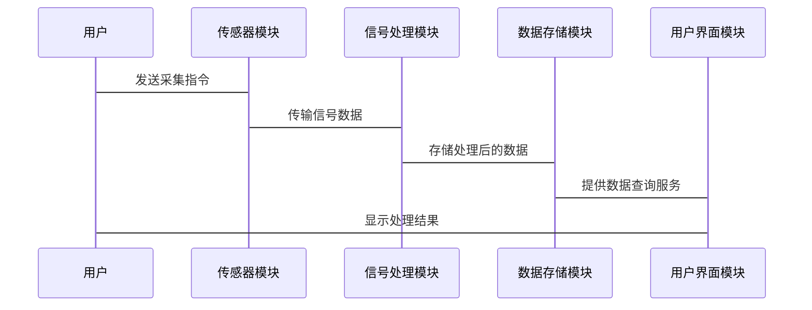

                 


# 价值投资中的新一代生物传感器阵列技术前景

> 关键词：生物传感器阵列技术、价值投资、投资前景、算法原理、系统架构

> 摘要：本文探讨了生物传感器阵列技术在价值投资中的应用前景，分析了其核心原理、算法模型以及在投资决策中的潜在价值。通过实际案例和系统架构设计，展示了生物传感器阵列技术如何为投资者提供更精准的决策支持。

---

# 第1章: 生物传感器阵列技术的背景与概念

## 1.1 生物传感器阵列技术的定义与原理

### 1.1.1 生物传感器的基本概念

生物传感器是一种能够检测生物分子（如蛋白质、DNA、酶等）并与特定的信号转换器结合的设备。其核心是将生物分子的反应转化为可测量的信号，如电化学信号、光信号或机械信号。

### 1.1.2 生物传感器阵列的定义

生物传感器阵列是由多个生物传感器组成的集合，通常用于同时检测多种生物分子。这种阵列结构能够提高检测的灵敏度和特异性，适用于复杂环境下的多目标检测。

### 1.1.3 生物传感器阵列的核心原理

生物传感器阵列通过多个传感器的协同工作，能够同时获取多种生物分子的信息。每个传感器负责检测特定的生物分子，而阵列的输出则是一个多维数据集，需要通过算法进行处理和分析。

## 1.2 价值投资的基本概念

### 1.2.1 价值投资的定义

价值投资是一种投资策略，旨在通过分析企业的基本面（如财务状况、市场地位、管理团队等）来判断其内在价值，并在市场价格低于内在价值时进行投资。

### 1.2.2 价值投资的核心理念

价值投资的核心理念是寻找被市场低估的企业，长期持有，等待其价值回归。这种方法强调对企业的深入研究和对市场的独立判断。

### 1.2.3 价值投资与生物传感器技术的结合

随着生物技术的发展，生物传感器阵列技术在医疗、农业、环境监测等领域展现出巨大潜力。这些技术可以提供实时、精准的数据支持，帮助投资者更准确地评估企业的基本面。

---

# 第2章: 生物传感器阵列技术的核心原理

## 2.1 生物传感器阵列的组成与结构

### 2.1.1 传感器的基本组成

生物传感器通常由敏感元件、信号转换器和读出电路组成。敏感元件负责识别目标生物分子，信号转换器将生物信号转换为可测量的电信号，读出电路则将信号放大并传输到后续处理系统。

### 2.1.2 阵列传感器的结构特点

生物传感器阵列由多个传感器组成，每个传感器针对特定的生物分子设计。阵列结构使得同时检测多种生物分子成为可能，适用于复杂环境下的多目标检测。

### 2.1.3 阵列传感器的信号处理方法

阵列传感器的信号处理通常包括信号采集、预处理和数据分析三个步骤。预处理包括滤波和放大，数据分析则涉及模式识别和分类。

---

## 2.2 生物传感器阵列的信号采集与处理

### 2.2.1 生物信号的采集原理

生物传感器阵列通过敏感元件捕获目标生物分子的信号，如电化学信号或光信号。这些信号通常较弱，需要进行放大和滤波处理。

### 2.2.2 信号处理的基本方法

信号处理方法包括时域和频域处理。时域处理如滑动平均和差分，频域处理如傅里叶变换和小波变换。这些方法能够提高信号的信噪比，便于后续分析。

### 2.2.3 阵列传感器的数据融合技术

数据融合技术将多个传感器的信号综合起来，利用算法提取有用信息。常用的方法包括加权平均和主成分分析。

---

## 2.3 生物传感器阵列的性能指标

### 2.3.1 灵敏度与选择性

灵敏度是指传感器对目标分子的最小检测能力，选择性则是指传感器对目标分子的特异性识别能力。

### 2.3.2 稳定性与可靠性

稳定性指传感器在长期使用中的性能变化，可靠性指传感器在不同环境下的表现。

### 2.3.3 响应时间与动态范围

响应时间是指传感器从接触到目标分子到输出稳定信号所需的时间，动态范围是指传感器能够检测的浓度范围。

---

# 第3章: 价值投资中的生物传感器阵列技术机会

## 3.1 生物传感器阵列技术的市场应用

### 3.1.1 医疗健康领域

生物传感器阵列技术在医疗领域的应用包括疾病诊断、药物筛选和个性化医疗。例如，用于检测癌症标志物的传感器阵列可以辅助医生进行早期诊断。

### 3.1.2 环境监测领域

在环境监测中，生物传感器阵列技术可以用于检测水体中的污染物、空气中的有害气体等。这些数据可以帮助投资者评估企业的环境风险。

### 3.1.3 农业与食品检测领域

生物传感器阵列技术在农业中的应用包括土壤检测、作物病害监测等。在食品检测中，可以用于检测食品中的有害物质。

---

## 3.2 生物传感器阵列技术的投资价值分析

### 3.2.1 技术成熟度分析

生物传感器阵列技术目前在实验室阶段已经取得了一定成果，但在大规模商业化应用方面仍需进一步发展。

### 3.2.2 市场需求分析

随着人们对健康和环境问题的重视，生物传感器阵列技术的需求将快速增长。特别是在医疗和农业领域，市场潜力巨大。

### 3.2.3 技术壁垒与竞争优势

生物传感器阵列技术的研发需要多学科的结合，技术壁垒较高。企业需要具备强大的研发能力和资金支持才能在竞争中占据优势。

---

## 3.3 价值投资中的技术驱动因素

### 3.3.1 技术创新对投资价值的影响

技术创新可以提高传感器的灵敏度和选择性，降低生产成本，从而提升企业的市场竞争力。

### 3.3.2 市场需求与技术供给的匹配

市场需求的快速增长与技术供给的匹配程度直接影响企业的投资价值。企业需要根据市场需求调整技术研发方向。

### 3.3.3 技术生命周期与投资策略

生物传感器阵列技术处于成长期，投资者需要关注技术的生命周期，合理制定投资策略。

---

# 第4章: 生物传感器阵列技术与价值投资的结合

## 4.1 生物传感器阵列技术在投资决策中的应用

### 4.1.1 技术驱动的投资机会识别

通过分析生物传感器阵列技术的市场应用前景，投资者可以发现潜在的投资机会。

### 4.1.2 技术风险评估与投资决策

生物传感器阵列技术的研发和商业化过程中存在技术风险和市场风险，投资者需要进行充分的风险评估。

### 4.1.3 技术创新对企业价值的影响

技术创新能够提升企业的核心竞争力，增强企业的市场地位，从而提升企业的内在价值。

---

## 4.2 生物传感器阵列技术的市场动态分析

### 4.2.1 市场趋势与技术发展

随着技术的进步，生物传感器阵列技术的应用领域不断扩展，市场需求也在快速增长。

### 4.2.2 竞争格局与企业分析

目前，生物传感器阵列技术的市场竞争较为激烈，企业需要在技术研发、成本控制和市场拓展方面进行综合考量。

### 4.2.3 技术创新对市场的影响

技术创新能够推动市场的发展，同时也会对现有市场格局产生重大影响。

---

## 4.3 价值投资中的技术驱动策略

### 4.3.1 技术领先企业的投资价值

技术领先的企业在市场竞争中具有优势，投资者可以关注这些企业的投资价值。

### 4.3.2 技术创新周期与投资时机

投资者需要关注技术的创新周期，合理把握投资时机，避免盲目跟风。

### 4.3.3 技术风险的控制与管理

投资者需要建立有效的风险控制机制，降低技术风险对投资的影响。

---

# 第5章: 生物传感器阵列技术的算法与数学模型

## 5.1 生物传感器阵列信号处理算法

### 5.1.1 基于小波变换的信号处理

小波变换是一种有效的信号处理方法，能够对生物传感器阵列的信号进行时频分析，提高信号的分辨率。

### 5.1.2 基于聚类分析的数据分类

聚类分析可以帮助投资者将传感器数据进行分类，识别出不同类型的信号特征，辅助投资决策。

---

## 5.2 生物传感器阵列的数学模型

### 5.2.1 传感器信号的数学表达

传感器信号可以用数学模型进行描述，例如：

$$
y(t) = A \sin(Bt + C) + D
$$

其中，\( y(t) \) 是传感器输出信号，\( t \) 是时间，\( A \) 是振幅，\( B \) 是频率，\( C \) 是相位，\( D \) 是偏移量。

### 5.2.2 传感器阵列的数据融合模型

数据融合模型可以将多个传感器的数据进行综合，例如：

$$
y_{\text{融合}} = \sum_{i=1}^{n} w_i y_i
$$

其中，\( w_i \) 是传感器 \( i \) 的权重，\( y_i \) 是传感器 \( i \) 的输出信号。

---

# 第6章: 生物传感器阵列技术的系统分析与架构设计

## 6.1 系统功能设计

### 6.1.1 系统需求分析

生物传感器阵列系统的功能需求包括信号采集、数据处理、结果输出等。

### 6.1.2 系统功能模块设计

系统功能模块包括传感器模块、信号处理模块、数据存储模块和用户界面模块。

---

## 6.2 系统架构设计

### 6.2.1 系统架构图



### 6.2.2 系统接口设计

系统接口包括传感器接口、数据接口和用户接口，确保各个模块之间的数据传输和交互。

---

## 6.3 系统交互设计

### 6.3.1 交互流程图



---

# 第7章: 生物传感器阵列技术的项目实战

## 7.1 项目环境安装

### 7.1.1 系统需求

安装生物传感器阵列系统需要满足以下条件：

- 操作系统：Linux/Windows/MacOS
- 开发工具：Python、MATLAB、C++
- 传感器硬件：生物传感器阵列模块

### 7.1.2 环境配置

安装必要的软件和库，例如：

- Python: 安装numpy、pandas、scipy等库。
- C++: 安装Visual Studio和相关开发库。

---

## 7.2 系统核心实现

### 7.2.1 传感器信号采集代码

```python
import numpy as np

def read_sensor_data():
    # 模拟传感器数据采集
    data = np.random.normal(0, 1, 100)
    return data

sensor_data = read_sensor_data()
print(sensor_data)
```

### 7.2.2 数据处理代码

```python
from scipy import signal

def process_data(data):
    # 使用小波变换进行信号处理
    cwt = signal.cwt(data, signal.ricker, widths=np.arange(1, 100))
    return cwt

processed_data = process_data(sensor_data)
print(processed_data)
```

---

## 7.3 项目实战案例分析

### 7.3.1 案例背景

假设我们开发了一个用于检测水质的生物传感器阵列系统，能够检测水中的多种污染物。

### 7.3.2 数据分析与结果展示

通过对采集的数据进行分析，我们可以识别出不同污染物的特征，辅助投资者评估相关企业的环境风险。

---

## 7.4 项目小结

通过本项目的实战，我们掌握了生物传感器阵列系统的开发流程，包括硬件设计、软件开发和数据处理。这些技能为我们未来在价值投资中的应用奠定了基础。

---

# 第8章: 生物传感器阵列技术的价值投资应用总结

## 8.1 投资机会与风险分析

生物传感器阵列技术的市场需求巨大，但技术研发和商业化过程中存在较高的风险。

## 8.2 投资策略与建议

投资者应关注技术领先的企业，合理评估技术风险，制定科学的投资策略。

## 8.3 未来展望

随着技术的不断进步，生物传感器阵列技术在价值投资中的应用前景广阔，有望成为投资决策的重要工具。

---

# 第9章: 生物传感器阵列技术的未来发展趋势

## 9.1 技术创新方向

未来，生物传感器阵列技术将朝着高灵敏度、高选择性、低成本和智能化方向发展。

## 9.2 市场应用扩展

技术的广泛应用将推动更多领域的市场扩展，例如智能医疗、智慧城市等。

## 9.3 投资机会与挑战

技术创新和市场扩展将带来更多的投资机会，但同时也伴随着新的挑战。

---

# 第10章: 结语

## 10.1 生物传感器阵列技术的重要性

生物传感器阵列技术在现代社会中的作用越来越重要，其在价值投资中的应用前景广阔。

## 10.2 未来研究方向

未来的研究应聚焦于技术创新、成本控制和市场拓展，推动生物传感器阵列技术的广泛应用。

---

通过以上章节的详细阐述，我们全面探讨了生物传感器阵列技术在价值投资中的应用前景，从技术原理到实际应用，从算法模型到系统设计，为投资者提供了丰富的理论和实践指导。

---

