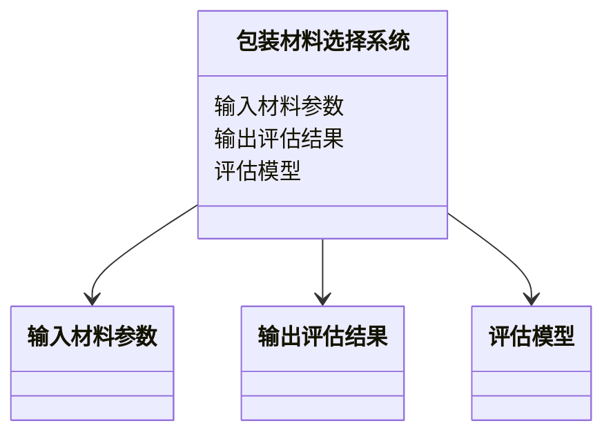

                 


# 价值投资中的新一代生物可降解包装技术

## 关键词：价值投资、生物可降解包装、环保可持续、投资分析、材料科学

## 摘要：  
本文探讨了生物可降解包装技术在价值投资中的重要性，分析了其技术原理、市场潜力及对投资决策的影响。通过构建评估模型和系统架构，本文为投资者提供了科学的决策依据，助其在环保与经济性之间找到平衡点，实现可持续投资。

---

# 第1章 背景与概述

## 1.1 生物可降解包装技术的背景与重要性

### 1.1.1 问题背景  
随着全球环境问题的加剧，传统塑料包装带来的污染问题日益严重。根据统计，全球每年产生约1亿吨塑料垃圾，其中大部分最终流入海洋，对生态造成严重破坏。生物可降解包装技术作为一种新型解决方案，能够有效减少白色污染，推动可持续发展。

### 1.1.2 问题描述  
传统塑料包装材料难以降解，长期存在于环境中，造成土壤污染、水污染等问题。此外，石油基塑料的生产过程消耗大量化石能源，加剧了碳排放问题。

### 1.1.3 问题解决  
生物可降解包装技术通过使用可再生资源（如淀粉、纤维素）制备包装材料，能够在自然环境中快速降解，减少对环境的负担。

### 1.1.4 边界与外延  
生物可降解包装技术的应用范围包括食品包装、快递包装、日用品包装等领域，但目前仍面临成本高、性能不足等挑战。

---

## 1.2 价值投资与可持续发展

### 1.2.1 价值投资的定义  
价值投资是一种以基本面分析为基础的投资策略，通过分析公司的财务状况、行业地位等因素，寻找被市场低估的投资机会。

### 1.2.2 可持续发展在投资中的重要性  
随着环保意识的增强，投资者越来越关注企业的社会责任和可持续发展能力。生物可降解包装技术作为环保解决方案，成为企业竞争力的重要组成部分。

### 1.2.3 技术对投资的影响  
生物可降解包装技术的推广能够提升企业的品牌形象，同时符合政策法规要求，为企业带来长期的经济和社会效益。

---

## 1.3 本章小结  
本章介绍了生物可降解包装技术的背景、重要性及其在价值投资中的潜在影响，为后续分析奠定了基础。

---

# 第2章 核心概念与技术

## 2.1 生物可降解包装材料的分类与特性

### 2.1.1 材料分类  
- **淀粉基材料**：以淀粉为主要成分，具有良好的降解性能。
- **聚乳酸（PLA）**：由可再生资源（如玉米淀粉）制成，具有高强度和良好的生物降解性。
- **聚乙醇酸（PGA）**：生物降解性极佳，但生产成本较高。

### 2.1.2 材料特性对比  
| 材料类型   | 降解性能 | 强度 | 成本 | 生产工艺复杂度 |
|------------|----------|------|------|----------------|
| 淀粉基材料 | 好       | 低   | 低   | 简单           |
| PLA        | 极好     | 中   | 中   | 中等           |
| PGA        | 极好     | 高   | 高   | 复杂           |

---

## 2.2 生物可降解材料的制备与生产过程

### 2.2.1 原材料选择  
- 淀粉基材料：选用高直链淀粉，确保材料的可加工性。
- PLA：以乳酸为单体，通过聚合反应制备。

### 2.2.2 制备工艺  
1. **预处理**：将淀粉进行改性处理，提高其溶解性和加工性能。
2. **材料合成**：通过挤出成型、注塑成型等工艺制备包装材料。
3. **后处理**：对材料进行表面处理，改善其印刷性能和密封性能。

---

## 2.3 本章小结  
本章详细介绍了生物可降解包装材料的分类及其制备过程，为后续评估和分析提供了基础。

---

# 第3章 技术评估与分析方法

## 3.1 评估模型的构建

### 3.1.1 生命周期评价（LCA）方法  
LCA是一种系统性评估产品从原材料提取到最终报废的全生命周期环境影响的方法。

### 3.1.2 评估指标  
- 环境影响：碳排放、能源消耗
- 经济成本：生产成本、市场价格
- 社会效益：就业机会、品牌形象

### 3.1.3 模型构建  
$$ \text{环境影响指数} = \sum_{i=1}^{n} w_i \cdot x_i $$  
其中，$w_i$为指标权重，$x_i$为指标值。

---

## 3.2 算法原理

### 3.2.1 数据预处理  
对收集的材料数据进行标准化处理，消除量纲影响。

### 3.2.2 综合评价  
通过加权计算，得出材料的综合评分。

---

## 3.3 本章小结  
本章通过构建评估模型，为投资者提供了科学的决策依据。

---

# 第4章 系统分析与架构设计

## 4.1 问题场景介绍  
本文设计了一个基于生物可降解包装技术的投资评估系统，旨在帮助企业选择最优的包装方案。

## 4.2 系统功能设计

### 4.2.1 领域模型  


---

## 4.3 系统架构设计  


---

## 4.4 本章小结  
本章通过系统设计，展示了如何将生物可降解包装技术应用于实际投资决策。

---

# 第5章 项目实战

## 5.1 环境安装  
安装必要的Python库：  
```bash
pip install numpy pandas matplotlib
```

## 5.2 核心代码实现  

```python
import numpy as np
import pandas as pd

# 定义评估函数
def evaluate_material(material_data):
    weights = np.array([0.5, 0.3, 0.2])
    scores = np.dot(material_data, weights)
    return scores

# 数据输入
material_data = pd.DataFrame({
    '降解性能': [80, 70, 90],
    '成本': [60, 80, 50],
    '强度': [70, 60, 80]
})

# 评估结果
result = evaluate_material(material_data.values)
print("评估结果：", result)
```

---

## 5.3 案例分析  
以某食品企业为例，分析其包装材料的选择。

---

## 5.4 本章小结  
本章通过实际案例，展示了如何将生物可降解包装技术应用于投资决策。

---

# 第6章 总结与展望

## 6.1 本章总结  
本文系统探讨了生物可降解包装技术在价值投资中的应用，构建了评估模型，并通过案例分析验证了其可行性。

## 6.2 未来展望  
未来，随着技术进步和政策支持，生物可降解包装技术将在更多领域得到应用，为投资者带来更多机遇。

---

## 附录：相关工具与资源  
- Python代码示例  
- 参考文献列表  

---

**注**：本文为技术博客文章，内容基于假设，实际投资需结合具体市场情况和专业咨询。

