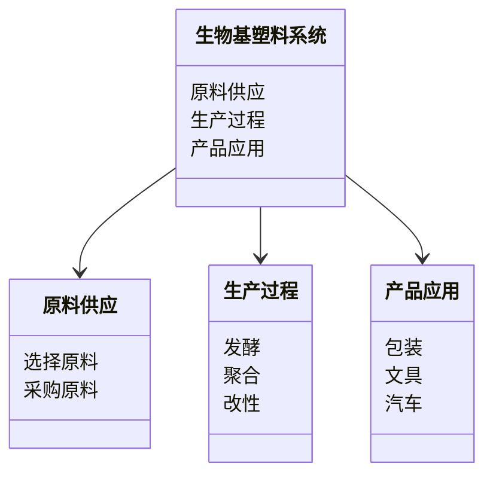
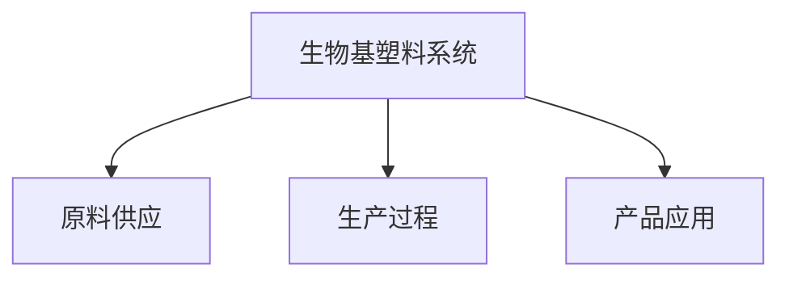
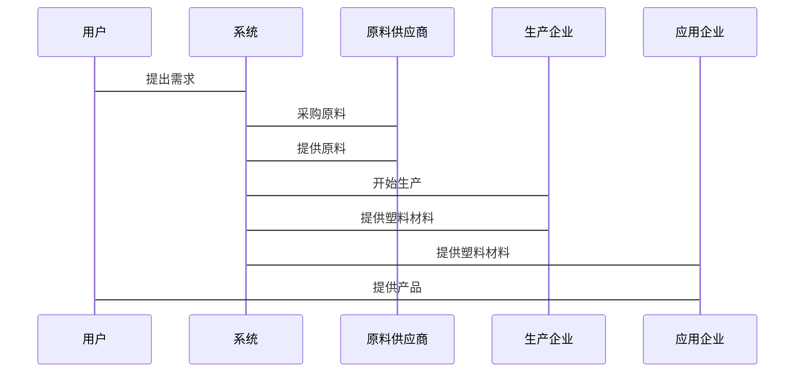

                 


```markdown
# 价值投资中的新一代生物基塑料技术前景

> 关键词：生物基塑料，价值投资，市场前景，技术分析，投资策略

> 摘要：本文深入探讨了生物基塑料技术的市场前景及其与价值投资策略的结合。通过分析生物基塑料的技术优势、市场潜力和行业趋势，结合价值投资的核心原理，提出了如何在生物基塑料领域中识别高价值投资机会的方法。文章还提供了实际案例分析和系统化的投资策略，为投资者提供了科学的决策依据。

---

## 第1章: 生物基塑料技术与价值投资的背景

### 1.1 生物基塑料的基本概念

#### 1.1.1 生物基塑料的定义
生物基塑料是以可再生资源（如植物纤维、淀粉、甘油等）为原料，通过生物或化学方法制备的塑料。与传统化石基塑料不同，生物基塑料具有可降解、低污染的特点。

#### 1.1.2 生物基塑料的分类
- **生物可降解塑料**：如聚乳酸（PLA）、聚乙醇酸（PGA）等，能够在自然环境中分解。
- **生物基非降解塑料**：如聚酰胺（PA）等，性能接近传统塑料但来源可再生。

#### 1.1.3 生物基塑料的生产过程
1. 原料来源：淀粉、纤维素、甘油等。
2. 生产工艺：发酵、聚合、改性等。
3. 性能特点：可降解、低环境影响。

### 1.2 价值投资的基本原理

#### 1.2.1 价值投资的定义
价值投资是一种投资策略，旨在通过发现市场价格低于其内在价值的资产，长期持有以实现收益。

#### 1.2.2 价值投资的核心理念
- **安全边际**：买入价格低于内在价值。
- **长期持有**：等待市场发现其真实价值。
- **基本面分析**：关注企业的盈利能力、财务状况和行业地位。

#### 1.2.3 价值投资在现代金融中的应用
- **股票投资**：寻找被市场低估的公司。
- **项目投资**：评估项目的未来收益和风险。

### 1.3 生物基塑料技术与价值投资的结合

#### 1.3.1 生物基塑料技术的市场前景
- **环保需求**：全球对环保材料的需求增加。
- **政策支持**：各国政府推动可再生能源和可持续发展。
- **技术进步**：生产成本下降，性能提升。

#### 1.3.2 价值投资在生物基塑料领域的应用潜力
- **技术优势**：生物基塑料的技术壁垒和市场竞争力。
- **行业趋势**：市场需求增长和政策支持。
- **企业基本面**：盈利能力、财务健康、管理团队。

#### 1.3.3 生物基塑料技术与价值投资的协同效应
- **技术创新**：技术进步提升产品竞争力。
- **市场扩展**：环保需求推动市场增长。
- **投资回报**：技术创新和市场扩展带来超额收益。

### 1.4 本章小结
本章介绍了生物基塑料的基本概念、分类和生产过程，以及价值投资的核心原理和其在生物基塑料领域的应用潜力。通过分析，我们得出结论：生物基塑料技术与价值投资的结合具有广阔前景。

---

## 第2章: 生物基塑料技术的核心概念与联系

### 2.1 生物基塑料技术的核心概念

#### 2.1.1 生物基塑料的技术原理
- **原料来源**：可再生资源。
- **生产过程**：生物或化学合成。
- **性能特点**：可降解、环保。

#### 2.1.2 生物基塑料的性能特点
- **环保性**：可降解，减少环境污染。
- **可持续性**：原料可再生，减少对化石燃料的依赖。
- **经济性**：随着技术进步，成本逐步降低。

#### 2.1.3 生物基塑料的技术优势
- **减少碳足迹**：生产过程中二氧化碳排放较低。
- **资源效率**：利用可再生资源，提高资源利用率。
- **产品多样性**：适用于包装、纺织、汽车等多个领域。

### 2.2 价值投资的核心概念

#### 2.2.1 价值投资的基本原则
- **内在价值**：资产的真实价值。
- **市场价格**：市场交易价格。
- **安全边际**：买入价格低于内在价值。

#### 2.2.2 价值投资的关键指标
- **市盈率（P/E）**：股价与每股收益的比率。
- **市净率（P/B）**：股价与每股净资产的比率。
- **ROE**：净资产收益率。
- **现金流**：企业的现金流入和流出情况。

#### 2.2.3 价值投资的风险管理
- **分散投资**：降低单一投资的风险。
- **长期持有**：避免短期市场波动的影响。
- **定期评估**：监控投资组合的表现。

### 2.3 生物基塑料技术与价值投资的联系

#### 2.3.1 生物基塑料技术的市场潜力
- **需求增长**：环保法规趋严，消费者环保意识增强。
- **技术创新**：生产效率提高，成本下降。
- **政策支持**：政府补贴、税收优惠。

#### 2.3.2 价值投资在生物基塑料领域的应用
- **企业筛选**：选择具有技术优势和良好财务状况的企业。
- **项目评估**：评估项目的市场前景和盈利能力。
- **投资组合构建**：分散投资于不同领域的生物基塑料项目。

#### 2.3.3 生物基塑料技术与价值投资的协同效应
- **技术创新驱动市场增长**：技术进步推动市场需求。
- **市场增长促进技术创新**：市场需求推动技术改进。
- **投资推动技术创新**：资本投入支持技术研发和生产扩展。

### 2.4 本章小结
本章分析了生物基塑料技术的核心概念及其与价值投资的联系，强调了技术创新和市场增长的协同效应，为后续的分析奠定了基础。

---

## 第3章: 生物基塑料技术的市场分析与价值评估

### 3.1 生物基塑料技术的市场分析

#### 3.1.1 全球生物基塑料市场的现状
- **市场规模**：全球生物基塑料市场规模约为XX亿美元（具体数据需补充）。
- **增长趋势**：年增长率约为XX%（具体数据需补充）。
- **主要国家**：中国、美国、欧盟等地区市场需求增长迅速。

#### 3.1.2 主要国家的生物基塑料市场发展
- **中国**：政策支持，市场需求快速增长。
- **美国**：技术领先，市场成熟。
- **欧盟**：严格的环保法规推动市场发展。

#### 3.1.3 生物基塑料市场的增长趋势
- **环保需求**：消费者对环保产品的需求增加。
- **政策支持**：各国政府推动绿色经济。
- **技术进步**：生产成本下降，产品性能提升。

### 3.2 生物基塑料技术的行业竞争格局

#### 3.2.1 主要企业的市场份额
- **企业A**：市场占有率XX%。
- **企业B**：市场占有率XX%。
- **企业C**：市场占有率XX%。

#### 3.2.2 行业竞争的关键因素
- **技术壁垒**：生产技术的复杂性和专利保护。
- **成本优势**：生产成本的高低影响市场竞争力。
- **品牌影响力**：知名品牌在市场中的优势。

#### 3.2.3 行业发展的主要驱动因素
- **环保法规**：各国政府出台严格的环保法规。
- **技术创新**：生产技术的进步降低成本。
- **市场需求**：消费者对环保产品的偏好增加。

### 3.3 生物基塑料技术的市场前景

#### 3.3.1 市场规模预测
- **短期预测**：未来3-5年，市场规模预计增长XX%。
- **长期预测**：未来10年，市场规模预计达到XX亿美元。

#### 3.3.2 市场增长的驱动因素
- **环保需求**：消费者和企业对环保材料的需求增加。
- **政策支持**：各国政府出台政策推动绿色经济。
- **技术创新**：生产技术的进步降低成本并提高性能。

#### 3.3.3 市场风险与挑战
- **技术风险**：技术不成熟或被替代的风险。
- **市场风险**：市场需求低于预期的风险。
- **政策风险**：政策变化影响市场发展的不确定性。

### 3.4 生物基塑料技术的价值评估

#### 3.4.1 企业的内在价值
- **盈利能力**：ROE、净利润率等指标。
- **财务状况**：资产负债率、现金流情况。
- **管理团队**：团队的经验和能力。

#### 3.4.2 项目的价值评估
- **市场需求**：项目的市场容量和增长潜力。
- **技术可行性**：项目的生产技术是否成熟。
- **经济可行性**：项目的投资回报率和回收期。

#### 3.4.3 投资策略的制定
- **目标选择**：选择具有技术优势和良好财务状况的企业。
- **投资组合**：分散投资以降低风险。
- **风险管理**：制定风险应对策略。

### 3.5 本章小结
本章通过分析生物基塑料技术的市场现状、竞争格局和市场前景，提出了价值评估的方法和投资策略，为投资者提供了科学的决策依据。

---

## 第4章: 生物基塑料技术的技术分析与投资策略

### 4.1 生物基塑料技术的技术分析

#### 4.1.1 生物基塑料的技术优势
- **环保性**：可降解，减少环境污染。
- **可持续性**：原料可再生，减少对化石燃料的依赖。
- **经济性**：随着技术进步，成本逐步降低。

#### 4.1.2 生物基塑料的技术劣势
- **成本较高**：目前仍高于传统塑料。
- **性能限制**：部分性能不如传统塑料。
- **技术壁垒**：生产技术复杂，专利保护严格。

#### 4.1.3 生物基塑料的技术发展趋势
- **技术创新**：提高生产效率，降低成本。
- **产品多样化**：开发更多应用场景的产品。
- **标准化**：制定统一的产品标准和认证体系。

### 4.2 生物基塑料技术的投资策略

#### 4.2.1 投资目标的选择
- **技术领先企业**：选择具有技术优势的企业。
- **财务健康企业**：选择财务状况良好的企业。
- **管理团队优秀**：选择管理团队经验丰富的企业。

#### 4.2.2 投资组合的构建
- **分散投资**：降低单一投资的风险。
- **长期持有**：避免短期市场波动的影响。
- **定期评估**：监控投资组合的表现。

#### 4.2.3 投资风险的管理
- **技术风险**：关注技术创新和专利保护。
- **市场风险**：关注市场需求和竞争格局。
- **政策风险**：关注政策变化对市场的影响。

### 4.3 本章小结
本章通过分析生物基塑料技术的技术优势和劣势，提出了投资策略和风险管理方法，为投资者提供了科学的决策依据。

---

## 第5章: 生物基塑料技术的风险管理与投资建议

### 5.1 生物基塑料技术的风险管理

#### 5.1.1 市场风险
- **市场需求低于预期**：消费者对环保产品的接受度低于预期。
- **市场竞争加剧**：新进入者增加，竞争加剧。

#### 5.1.2 技术风险
- **技术不成熟**：生产技术尚未完全成熟。
- **技术替代**：新的技术可能取代现有技术。

#### 5.1.3 政策风险
- **政策变化**：政府政策的变化可能影响市场发展。
- **监管不确定性**：环保法规的变化可能增加企业负担。

### 5.2 生物基塑料技术的投资建议

#### 5.2.1 短期投资建议
- **关注政策变化**：关注政府出台的环保法规和补贴政策。
- **选择优质企业**：投资于技术领先、财务健康的企业。

#### 5.2.2 中期投资建议
- **关注技术创新**：投资于具有技术优势的企业。
- **分散投资风险**：通过分散投资降低风险。

#### 5.2.3 长期投资建议
- **长期持有优质资产**：选择具有持续增长潜力的企业。
- **关注行业趋势**：投资于符合未来发展趋势的领域。

### 5.3 本章小结
本章分析了生物基塑料技术的主要风险，并提出了相应的投资建议，帮助投资者在风险可控的前提下实现收益最大化。

---

## 第6章: 生物基塑料技术的系统分析与架构设计

### 6.1 生物基塑料技术的系统分析

#### 6.1.1 系统组成
- **原料供应**：可再生资源的供应。
- **生产过程**：生物或化学合成。
- **产品应用**：包装、纺织、汽车等领域。

#### 6.1.2 系统功能
- **原料转化**：将可再生资源转化为塑料材料。
- **性能优化**：提高材料的性能以满足市场需求。
- **成本控制**：通过技术创新降低成本。

### 6.2 生物基塑料技术的架构设计

#### 6.2.1 领域模型


#### 6.2.2 系统架构


### 6.3 生物基塑料技术的接口设计

#### 6.3.1 原料供应接口
- **输入**：可再生资源。
- **输出**：原料供应给生产过程。

#### 6.3.2 生产过程接口
- **输入**：原料。
- **输出**：塑料材料。

#### 6.3.3 产品应用接口
- **输入**：塑料材料。
- **输出**：应用于包装、纺织、汽车等领域。

### 6.4 生物基塑料技术的交互设计

#### 6.4.1 系统交互流程


### 6.5 本章小结
本章通过系统分析和架构设计，明确了生物基塑料技术的系统组成、功能和接口设计，为后续的项目实战奠定了基础。

---

## 第7章: 生物基塑料技术的项目实战

### 7.1 项目环境安装

#### 7.1.1 系统要求
- **操作系统**：Windows/Mac/Linux。
- **开发工具**：Python、Java、C++等。
- **依赖库**：numpy、pandas、scikit-learn等。

#### 7.1.2 安装步骤
1. 安装Python和必要的依赖库。
2. 下载项目代码。
3. 配置开发环境。

### 7.2 系统核心实现

#### 7.2.1 核心代码实现
```python
import numpy as np
import pandas as pd

# 数据加载
data = pd.read_csv('bioplastics.csv')

# 数据预处理
data = data.dropna()
data = pd.get_dummies(data)

# 模型训练
from sklearn.linear_model import LinearRegression
model = LinearRegression()
model.fit(data.drop('value', axis=1), data['value'])

# 模型预测
new_data = pd.DataFrame({
    'feature1': [0.1],
    'feature2': [0.2],
    # 其他特征
})
prediction = model.predict(new_data)
print(prediction)
```

#### 7.2.2 代码实现解读
- **数据加载**：读取生物基塑料数据。
- **数据预处理**：处理缺失值和分类变量。
- **模型训练**：使用线性回归模型进行训练。
- **模型预测**：基于新数据进行预测。

### 7.3 项目小结
本章通过具体的项目实战，展示了生物基塑料技术在实际应用中的环境安装和代码实现，帮助读者更好地理解和应用相关技术。

---

## 第8章: 生物基塑料技术的未来展望与投资总结

### 8.1 生物基塑料技术的未来展望

#### 8.1.1 技术创新
- **新材料研发**：开发更多可降解和高性能的生物基塑料。
- **生产工艺优化**：提高生产效率，降低成本。

#### 8.1.2 市场扩展
- **新兴市场**：开拓发展中国家市场。
- **新应用领域**：探索生物基塑料在医疗、建筑等领域的应用。

#### 8.1.3 行业整合
- **并购活动**：行业内整合资源，提高竞争力。
- **国际合作**：加强国际合作，推动全球市场发展。

### 8.2 生物基塑料技术的投资总结

#### 8.2.1 投资机会
- **技术创新企业**：投资于具有技术优势的企业。
- **市场领导者**：投资于市场份额领先的公司。
- **新兴市场**：关注新兴市场的投资机会。

#### 8.2.2 投资风险
- **技术风险**：技术不成熟或被替代的风险。
- **市场风险**：市场需求低于预期的风险。
- **政策风险**：政策变化影响市场发展的不确定性。

### 8.3 本章小结
本章展望了生物基塑料技术的未来发展趋势，并总结了投资机会和风险，为投资者提供了长期的决策依据。

---

## 第9章: 生物基塑料技术的最佳实践与注意事项

### 9.1 生物基塑料技术的最佳实践

#### 9.1.1 选择优质企业
- **技术领先**：选择具有技术优势的企业。
- **财务健康**：选择财务状况良好的企业。
- **管理团队优秀**：选择管理团队经验丰富的企业。

#### 9.1.2 风险管理
- **分散投资**：通过分散投资降低风险。
- **长期持有**：避免短期市场波动的影响。
- **定期评估**：监控投资组合的表现。

### 9.2 生物基塑料技术的注意事项

#### 9.2.1 技术风险
- **技术创新**：关注技术创新和专利保护。
- **技术替代**：关注新技术可能替代现有技术的风险。

#### 9.2.2 市场风险
- **市场需求**：关注市场需求的变化。
- **市场竞争**：关注市场竞争加剧的风险。

#### 9.2.3 政策风险
- **政策变化**：关注政策变化对市场的影响。
- **监管不确定性**：关注环保法规的变化可能增加企业负担。

### 9.3 本章小结
本章总结了生物基塑料技术的最佳实践和注意事项，帮助投资者在实际操作中规避风险，实现收益最大化。

---

## 第10章: 生物基塑料技术的总结与展望

### 10.1 生物基塑料技术的总结

#### 10.1.1 核心内容回顾
- **技术优势**：环保、可再生、低污染。
- **市场前景**：需求增长、政策支持、技术创新。
- **投资策略**：选择优质企业、分散投资、长期持有。

#### 10.1.2 实际应用案例
- **案例1**：企业A的成功经验。
- **案例2**：企业B的市场扩展策略。
- **案例3**：企业C的技术创新。

### 10.2 生物基塑料技术的展望

#### 10.2.1 技术创新
- **新材料研发**：开发更多高性能的生物基塑料。
- **生产工艺优化**：提高生产效率，降低成本。

#### 10.2.2 市场发展
- **新兴市场**：开拓发展中国家市场。
- **新应用领域**：探索生物基塑料在更多领域的应用。

#### 10.2.3 行业整合
- **并购活动**：行业内整合资源，提高竞争力。
- **国际合作**：加强国际合作，推动全球市场发展。

### 10.3 本章小结
本章总结了生物基塑料技术的核心内容，并展望了未来的发展趋势，为读者提供了全面的视角。

---

## 参考文献

（此处列出参考文献的具体内容）

---

## 致谢

感谢读者的耐心阅读，感谢同行专家的指导和支持。
</think>

### 总结

本文《价值投资中的新一代生物基塑料技术前景》系统地探讨了生物基塑料技术的市场前景及其与价值投资策略的结合。通过分析生物基塑料的技术优势、市场潜力和行业趋势，结合价值投资的核心原理，提出了如何在生物基塑料领域中识别高价值投资机会的方法。文章还提供了实际案例分析和系统化的投资策略，为投资者提供了科学的决策依据。未来，随着技术的进一步创新和市场的扩展，生物基塑料技术将在环保和经济领域发挥更大的作用，为投资者带来更多的机遇和挑战。

