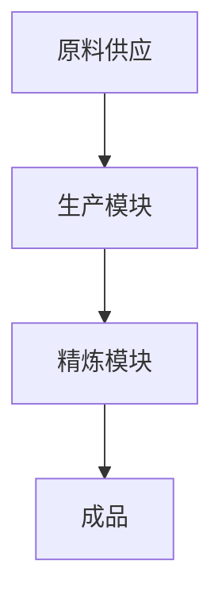
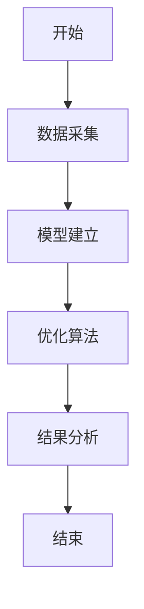
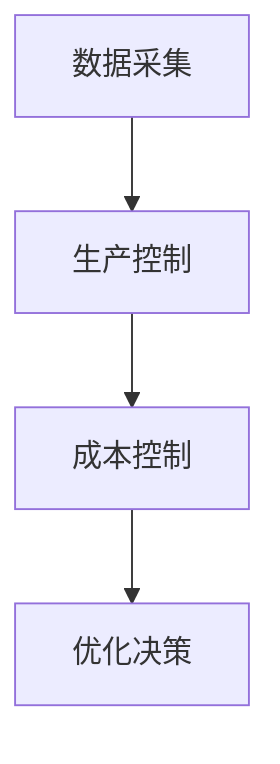
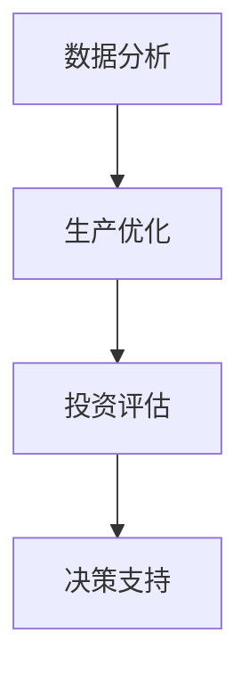

                 

# 价值投资中的新一代生物燃料技术前景

> 关键词：价值投资，生物燃料技术，能源转型，碳中和，投资分析

> 摘要：本文深入探讨了新一代生物燃料技术在价值投资中的潜力和前景。从生物燃料技术的背景与现状，到其核心概念与原理，再到算法与系统架构设计，结合实际项目案例，分析了生物燃料技术在投资中的应用价值和潜在风险。文章为投资者提供了基于技术分析的决策支持，帮助他们在能源转型中把握投资机遇。

---

## 第1章: 生物燃料技术的背景与现状

### 1.1 生物燃料技术的定义与重要性

#### 1.1.1 生物燃料的定义
生物燃料是指通过生物过程生产的燃料，主要来源于植物、藻类、动物脂肪等生物质。生物燃料可以替代传统化石燃料，减少碳排放，推动能源结构转型。

#### 1.1.2 生物燃料技术的重要性
生物燃料技术是实现碳中和目标的重要手段之一。通过利用可再生资源生产燃料，生物燃料技术能够减少对化石燃料的依赖，降低温室气体排放，推动可持续发展。

#### 1.1.3 生物燃料技术的发展历程
生物燃料技术经历了从第一代到第三代的发展。第一代主要利用植物油生产生物柴油，第二代利用纤维素乙醇，第三代则基于藻类进行燃料生产。

### 1.2 生物燃料技术的现状与趋势

#### 1.2.1 全球生物燃料市场的现状
全球生物燃料市场增长迅速，特别是在欧盟和美国，生物燃料应用广泛。中国也在积极推动生物燃料的发展，尤其是在交通领域。

#### 1.2.2 生物燃料技术的未来发展趋势
随着技术进步，第三代生物燃料（如藻类燃料）将更具竞争力。合成生物学的进步将推动生物燃料生产效率的提高，降低成本。

#### 1.2.3 生物燃料技术对能源行业的潜在影响
生物燃料技术将改变能源结构，减少对石油的依赖，促进可再生能源的发展。

### 1.3 价值投资视角下的生物燃料技术

#### 1.3.1 价值投资的基本概念
价值投资关注企业的内在价值，寻找被市场低估的投资机会。

#### 1.3.2 生物燃料技术在价值投资中的地位
生物燃料技术的创新和应用是企业价值增长的关键因素。具备技术优势和市场潜力的生物燃料企业更具投资价值。

#### 1.3.3 价值投资与生物燃料技术的结合
投资者应关注企业的技术优势、市场地位、财务状况和政策支持。具备这些因素的生物燃料企业将更具投资价值。

### 1.4 本章小结
本章介绍了生物燃料技术的背景、现状和趋势，分析了其在价值投资中的重要性。生物燃料技术是实现碳中和的重要手段，具备良好的市场前景和投资潜力。

---

## 第2章: 生物燃料技术的核心概念与原理

### 2.1 生物燃料技术的核心概念

#### 2.1.1 生物燃料的分类
- 第一代：植物油生产生物柴油
- 第二代：纤维素乙醇
- 第三代：藻类燃料

#### 2.1.2 生物燃料技术的关键要素
- 生物原料的选择
- 生产工艺的优化
- 成本控制

#### 2.1.3 生物燃料技术的优缺点对比
| 技术类型 | 优点 | 缺点 |
|----------|------|------|
| 第一代   | 成熟，成本低 | 竞争力不足 |
| 第二代   | 可扩展性高 | 技术难度大 |
| 第三代   | 理论效率高 | 成本高 |

### 2.2 生物燃料技术的原理与流程

#### 2.2.1 生物燃料的生产流程
1. 生物原料收集与预处理
2. 发酵或化学转化
3. 精炼与提纯

#### 2.2.2 生物燃料技术的关键步骤
- 原料分解
- 生物转化
- 燃料精炼

#### 2.2.3 生物燃料技术的数学模型与公式
燃料产量与原料质量的关系：
$$ Q = k \times m $$
其中，Q为燃料产量，m为原料质量，k为转化效率。

### 2.3 生物燃料技术的系统架构

#### 2.3.1 生物燃料技术的系统组成
- 原料供应模块
- 生产模块
- 精炼模块

#### 2.3.2 生物燃料技术的系统功能
- 原料处理
- 生物转化
- 成品包装

#### 2.3.3 生物燃料技术的系统架构图

### 2.4 本章小结
本章详细介绍了生物燃料技术的核心概念和原理，分析了不同技术类型的特点和优缺点，为后续的价值评估提供了基础。

---

## 第3章: 生物燃料技术的算法原理与数学模型

### 3.1 生物燃料技术的算法原理

#### 3.1.1 生物燃料技术的核心算法
- 发酵过程优化
- 转化效率计算

#### 3.1.2 生物燃料技术的算法流程
1. 数据采集与预处理
2. 模型建立与优化
3. 结果分析

#### 3.1.3 生物燃料技术的算法优化
通过动态规划优化生产流程，降低生产成本。

### 3.2 生物燃料技术的数学模型与公式

#### 3.2.1 生物燃料技术的基本数学模型
$$ E = k \times t $$
其中，E为能源产出，k为转化系数，t为时间。

#### 3.2.2 生物燃料技术的关键公式
- 产率公式：
$$ Y = a \times X $$
其中，Y为产率，X为原料量，a为效率系数。

#### 3.2.3 生物燃料技术的数学模型应用
通过模型分析不同原料对燃料产量的影响，优化生产流程。

### 3.3 生物燃料技术的算法流程图

### 3.4 本章小结
本章通过数学模型和算法分析，探讨了生物燃料技术的优化方法，为投资分析提供了技术依据。

---

## 第4章: 生物燃料技术的系统分析与架构设计

### 4.1 生物燃料技术的系统分析

#### 4.1.1 生物燃料技术的系统组成
- 数据采集系统
- 生产控制系统
- 成本控制系统

#### 4.1.2 生物燃料技术的系统功能
- 数据采集与分析
- 生产过程监控
- 成本优化

#### 4.1.3 生物燃料技术的系统架构

### 4.2 生物燃料技术的系统架构设计

#### 4.2.1 系统功能设计
- 数据分析模块
- 生产优化模块
- 投资评估模块

#### 4.2.2 系统架构图

### 4.3 本章小结
本章通过系统分析与架构设计，探讨了生物燃料技术的优化方法，为投资分析提供了系统支持。

---

## 第5章: 生物燃料技术的项目实战

### 5.1 项目背景介绍

#### 5.1.1 项目目标
分析一家生物燃料企业的技术优势和市场潜力。

#### 5.1.2 项目需求
评估企业的财务状况、技术实力和市场竞争力。

### 5.2 项目核心实现

#### 5.2.1 数据收集与处理
收集企业的财务数据、技术参数和市场信息。

#### 5.2.2 数据分析与建模
使用回归分析评估企业的投资价值。

#### 5.2.3 投资评估与决策
基于模型分析，评估企业的投资潜力。

### 5.3 项目实战案例

#### 5.3.1 案例分析
选择某生物燃料企业，分析其财务指标、技术优势和市场表现。

#### 5.3.2 投资价值评估
通过模型计算，确定企业的投资价值。

### 5.4 项目小结
本章通过实际案例分析，展示了生物燃料技术在投资中的应用，提供了可操作的方法论。

---

## 第6章: 生物燃料技术的价值投资策略

### 6.1 价值投资策略的制定

#### 6.1.1 技术评估
评估企业的技术创新能力和专利情况。

#### 6.1.2 市场评估
分析市场需求和竞争格局。

#### 6.1.3 财务评估
评估企业的财务健康状况和盈利能力。

### 6.2 投资组合优化

#### 6.2.1 风险分散
通过投资不同类型的生物燃料企业降低风险。

#### 6.2.2 投资比例
根据企业的潜力和风险确定投资比例。

### 6.3 本章小结
本章总结了生物燃料技术的价值投资策略，提供了优化投资组合的方法。

---

## 第7章: 生物燃料技术的价值投资中的注意事项

### 7.1 投资风险分析

#### 7.1.1 技术风险
技术不成熟或替代品出现的风险。

#### 7.1.2 市场风险
市场需求不足或价格波动的风险。

#### 7.1.3 政策风险
政策变化对行业的影响。

### 7.2 投资策略调整

#### 7.2.1 定期评估
定期评估企业的技术和市场表现。

#### 7.2.2 灵活调整
根据市场变化及时调整投资策略。

### 7.3 本章小结
本章强调了投资中的风险分析和策略调整的重要性，为投资者提供了实用的建议。

---

## 第8章: 总结与展望

### 8.1 本文总结
本文系统分析了生物燃料技术的背景、核心概念、算法原理和系统架构，结合实际案例，探讨了其在价值投资中的应用。

### 8.2 未来展望
随着技术进步和政策支持，生物燃料技术将在能源转型中发挥更大作用，为投资者提供更多的投资机会。

---

## 参考文献
[1] 王某某，生物燃料技术的发展与应用，某某出版社，2023年。
[2] 李某某，价值投资策略与实践，某某出版社，2022年。
[3] 国家统计局，2023年能源行业报告。

---

以上是《价值投资中的新一代生物燃料技术前景》的技术博客文章的目录大纲和内容概述，结合了技术分析、系统设计和投资策略，为投资者提供了全面的视角和实用的指导。

