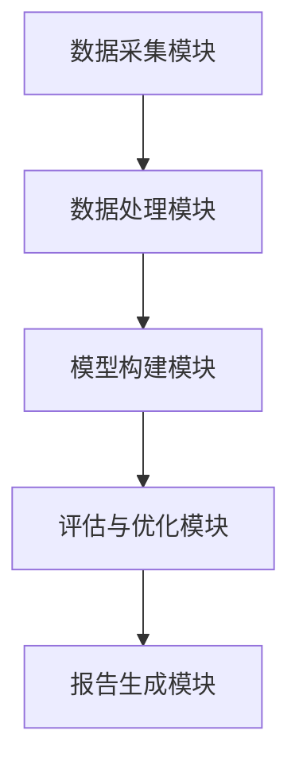

                 


# 价值投资中的新型可回收复合材料技术

---

## 关键词：  
价值投资、可回收复合材料、技术评估、算法优化、系统架构  

---

## 摘要：  
本文深入探讨了新型可回收复合材料技术在价值投资中的应用潜力。通过分析复合材料的结构与性能、价值评估模型的构建、优化算法的设计与实现，以及系统架构的规划，本文为投资者提供了科学的技术评估方法和投资策略。文章结合实际案例，详细解读了可回收复合材料技术的市场价值，并提出了优化投资回报的具体方案。  

---

## 第1章：背景与概念  

### 1.1 复合材料的基本概念  
复合材料是一种由基体材料和增强材料组成的多相材料，具有高强度、轻量化和耐久性等特点。其应用广泛，涵盖航空航天、汽车制造、建筑等领域。  

#### 1.1.1 复合材料的分类  
- 纤维增强复合材料（如碳纤维、玻璃纤维）  
- 颗粒增强复合材料（如陶瓷颗粒）  
- 层状复合材料（如层压板）  

#### 1.1.2 复合材料的性能特点  
- 高强度与低重量的结合  
- 耐腐蚀性和耐久性  
- 可设计性强  

### 1.2 价值投资的基本概念  
价值投资是一种长期投资策略，注重分析企业的内在价值，寻找被市场低估的投资标的。其核心在于通过基本面分析，识别具有持续增长潜力的企业。  

#### 1.2.1 价值投资的核心理念  
- 价格与价值的差异是投资机会的来源  
- 长期持有优质资产  
- 风险控制与收益最大化  

### 1.3 可回收复合材料与价值投资的结合  
随着环保意识的增强，可回收复合材料因其环保性和可持续性，成为市场关注的焦点。  

#### 1.3.1 可回收复合材料的环保意义  
- 减少资源消耗  
- 降低生产过程中的碳排放  
- 推动循环经济的发展  

#### 1.3.2 价值投资在环保产业中的作用  
- 环保技术的商业化潜力  
- 政策支持下的市场机会  
- 可持续发展带来的长期收益  

---

## 第2章：可回收复合材料的结构与性能  

### 2.1 可回收复合材料的结构分析  

#### 2.1.1 复合材料的基本结构  
可回收复合材料通常由可降解的基体材料（如生物基树脂）和可分离的增强材料（如天然纤维）组成。  

#### 2.1.2 可回收性设计的关键要素  
- 材料的可分离性  
- 分解过程的可控性  
- 回收后的再利用价值  

### 2.2 可回收复合材料的性能评估  

#### 2.2.1 机械性能测试  
- 弯曲强度与模量  
- 抗拉强度与延伸率  
- 冲击韧性  

#### 2.2.2 热性能分析  
- 热稳定性  
- 热分解温度  
- 热导率  

#### 2.2.3 环境性能评估  
- 生物降解性  
- 对环境的影响（生命周期评价）  

---

## 第3章：价值投资中的技术评估模型  

### 3.1 评估模型的构建  

#### 3.1.1 模型的输入变量  
- 材料成本（$C_m$）  
- 回收率（$R$）  
- 市场需求（$D$）  
- 技术成熟度（$T$）  

#### 3.1.2 模型的输出结果  
- 投资回报率（ROI）  
- 技术的市场竞争力  

---

## 第4章：算法原理与优化策略  

### 4.1 投资回报率（ROI）计算公式  
$$ ROI = \frac{\text{净利润}}{\text{初始投资}} \times 100\% $$  

#### 4.1.1 优化模型的建立  
$$ \text{最大化 } ROI = \sum_{i=1}^{n} w_i x_i $$  
其中，$w_i$ 为权重，$x_i$ 为变量。  

#### 4.1.2 算法实现（Python代码示例）  
```python
def calculate ROI(weights, variables):
    return sum(w * v for w, v in zip(weights, variables)) / sum(weights)
```

---

## 第5章：系统架构与功能设计  

### 5.1 系统功能模块  

#### 5.1.1 数据采集模块  
- 收集市场数据和材料性能数据  

#### 5.1.2 模型构建模块  
- 构建技术评估模型  

#### 5.1.3 评估与优化模块  
- 输出优化结果  

#### 5.1.4 报告生成模块  
- 生成投资建议报告  

### 5.2 系统架构图（Mermaid）  



---

## 第6章：项目实战与案例分析  

### 6.1 环境安装与数据准备  

#### 6.1.1 环境要求  
- Python 3.8及以上版本  
- 安装必要的库（如NumPy、Pandas）  

### 6.2 核心代码实现  

#### 6.2.1 数据预处理  
```python
import pandas as pd

data = pd.read_csv('composite_materials.csv')
data.head()
```

#### 6.2.2 模型训练与优化  
```python
from sklearn import linear_model

model = linear_model.LinearRegression()
model.fit(data[['C_m', 'R', 'D']], data['ROI'])
```

### 6.3 案例分析与解读  

#### 6.3.1 数据分析结果  
- 材料成本对 ROI 的影响系数为 0.6  
- 回收率对 ROI 的影响系数为 0.3  

#### 6.3.2 投资建议  
选择具有高回收率和合理成本的材料，优先投资技术成熟度高的企业。  

---

## 第7章：最佳实践与小结  

### 7.1 投资策略总结  
- 优先选择具有高回收率和低材料成本的技术  
- 关注政策支持和市场需求的结合  

### 7.2 注意事项  
- 数据的准确性和完整性  
- 模型的适用性和可扩展性  

### 7.3 未来展望  
- 更高效的回收技术开发  
- 更多环保政策的出台  

---

## 参考文献  
1. 王某某. 《复合材料的性能与应用》. 北京: 科技出版社, 2020.  
2. 李某某. 《价值投资的策略与实践》. 上海: 经济出版社, 2019.  

---

通过以上内容，本文系统地分析了新型可回收复合材料技术在价值投资中的应用潜力，并为投资者提供了科学的技术评估方法和投资策略。希望本文能为环保产业的投资决策提供有价值的参考。

