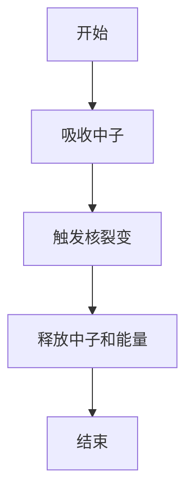
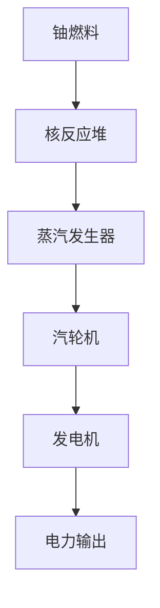
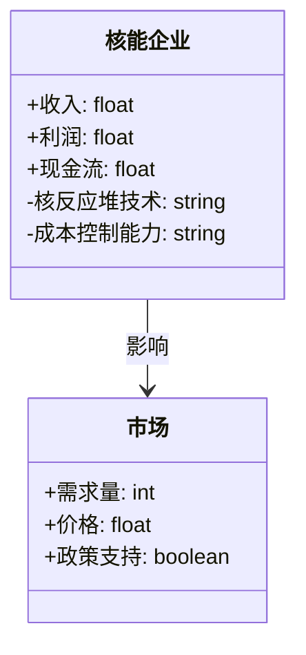
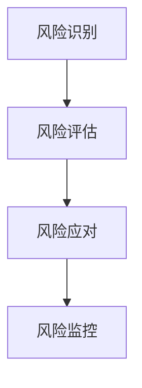

                 


# 价值投资中的新型核能技术分析

## 关键词：价值投资，核能技术，投资分析，核能行业，风险管理

## 摘要：  
本文从核能技术的基本原理和价值投资的核心理念出发，分析了核能技术对投资决策的影响，探讨了核能行业的市场前景与风险。文章详细介绍了核能技术的核心原理、经济性评估、行业竞争格局以及投资价值评估方法，并通过实际案例分析，展示了如何在价值投资中应用新型核能技术分析方法。文章还讨论了核能技术的风险管理与应对策略，为投资者提供了全面的分析框架和实践指南。

---

## 第一部分：核能技术与价值投资的背景

### 第1章：核能技术的基本概念

#### 1.1 核能的定义与基本原理  
核能是通过核反应释放的能量，主要来源于核裂变和核聚变。核裂变是指重原子核（如铀-235）在吸收一个中子后分裂成两个较轻的原子核，同时释放出更多的中子和能量；核聚变则是轻元素（如氘和氚）在极高温度和压力下结合成 heavier atoms，释放大量能量。

核能的基本原理可以用以下公式表示：  
$$ E = mc^2 $$  
其中，E 是能量，m 是质量，c 是光速。这一公式说明了核反应中质量转化为能量的过程。

#### 1.2 核能技术的分类与特点  
核能技术主要分为以下几类：  
1. **核裂变技术**：包括轻水堆、重水堆、石墨堆等。  
2. **核聚变技术**：目前仍处于研究阶段，如托卡马克装置。  
3. **核废料处理技术**：包括铀的再利用、核废料嬗变等。  

核能技术的特点包括高能量密度、低污染、可持续性等。

#### 1.3 核能技术的现状与发展趋势  
目前，核能技术已广泛应用于发电领域，但同时也面临技术瓶颈，如核废料处理、核安全等问题。未来，核能技术的发展方向将集中在提高安全性、降低成本、开发新型反应堆等方面。

---

### 第2章：价值投资的基本原理

#### 2.1 价值投资的定义与核心理念  
价值投资是一种投资策略，强调以低于资产内在价值的价格买入股票。其核心理念是寻找市场中的低估资产，并长期持有，等待其价值回归。

#### 2.2 价值投资与成长投资的区别  
价值投资关注低估值的资产，而成长投资关注高增长的资产。两者的主要区别在于对风险的承受能力和投资标的的选择。

#### 2.3 价值投资在核能行业的应用潜力  
核能行业具有较高的技术门槛和政策依赖性，适合价值投资。通过分析企业的财务状况、行业地位和技术优势，可以找到具有投资价值的核能企业。

---

### 第3章：核能技术与价值投资的结合

#### 3.1 核能行业的投资价值分析  
核能行业具有较高的市场潜力，但同时也面临政策风险和技术风险。通过技术分析和财务分析，可以评估企业的投资价值。

#### 3.2 核能技术对投资决策的影响  
核能技术的先进性和经济性直接影响企业的竞争力和盈利能力。投资者需要关注企业的技术优势和成本控制能力。

#### 3.3 核能行业的市场前景与风险  
核能行业的发展受到政策、技术和市场需求的影响。投资者需要关注行业政策变化和技术进步带来的投资机会。

---

## 第二部分：核能技术的核心原理与分析方法

### 第4章：核能技术的核心原理

#### 4.1 核反应的基本原理  
核反应的基本过程包括吸收中子、裂变、释放中子和能量等。核反应的链式反应可以用以下流程图表示：



#### 4.2 核能发电的基本流程  
核能发电的基本流程包括燃料准备、核反应、汽轮发电机组等。流程图如下：



#### 4.3 核废料处理的技术挑战  
核废料处理的关键在于减少放射性物质的半衰期和防止泄漏。常用的处理方法包括深地质处置和再利用技术。

---

### 第5章：核能技术的经济性与投资价值评估

#### 5.1 核电的成本构成与经济性评估  
核电的成本主要包括燃料成本、建设和运维成本。经济性评估需要考虑单位发电成本和投资回收期。

#### 5.2 核电项目的投资回报率分析  
核电项目的投资回报率受政策、技术和市场需求的影响较大。通过财务模型可以估算项目的净现值和内部收益率。

#### 5.3 核能行业的风险评估与风险管理  
核能行业的主要风险包括政策风险、技术风险和市场风险。投资者需要通过多元化投资和风险对冲来降低风险。

---

## 第三部分：价值投资中的核能技术分析方法

### 第6章：价值投资中的核能行业分析

#### 6.1 核能行业的市场分析  
核能行业的市场分析需要考虑全球和区域市场的供需情况。以下为全球核能市场的现状与趋势分析。

#### 6.2 核能行业的财务分析  
财务分析包括企业的收入、利润、现金流等指标。以下为某核能企业的财务指标分析示例：

```python
import pandas as pd

data = {
    '收入': [100, 120, 130],
    '利润': [10, 15, 20],
    '现金流': [20, 30, 35]
}

df = pd.DataFrame(data)
print(df)
```

#### 6.3 核能行业的竞争分析  
竞争分析需要考虑行业内主要企业的市场份额和技术优势。以下为某核能企业的竞争优势分析：



---

### 第7章：价值投资中的核能技术分析方法

#### 7.1 核能行业的投资模型构建  
投资模型需要考虑技术、财务和市场三个维度。以下为投资模型的构建过程：

```python
import numpy as np

# 示例数据
x = np.array([1, 2, 3, 4, 5])
y = np.array([2, 3, 5, 6, 8])

# 线性回归模型
from sklearn.linear_model import LinearRegression
model = LinearRegression()
model.fit(x.reshape(-1, 1), y)
print(model.coef_)
print(model.intercept_)
```

#### 7.2 核能技术的风险管理与应对策略  
风险管理需要考虑市场、政策和技术三方面的风险。以下为风险管理的框架：



---

## 结语  
本文通过分析核能技术和价值投资的结合，为投资者提供了全面的分析框架和实践指南。未来，随着核能技术的不断进步和政策支持的加强，核能行业将具有更大的投资潜力。投资者需要密切关注行业动态和技术进步，以抓住投资机会。

--- 

希望这篇文章能够为读者提供有价值的信息和启发！

