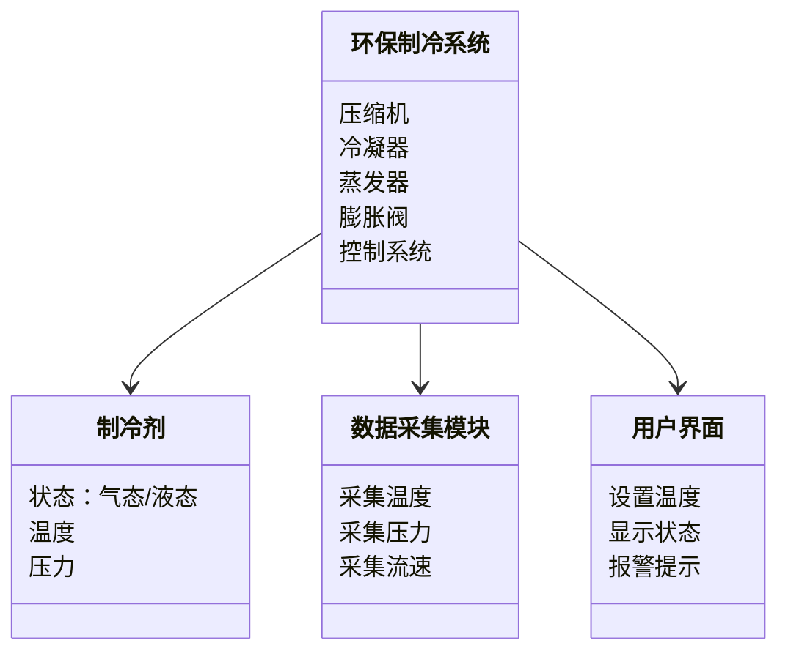
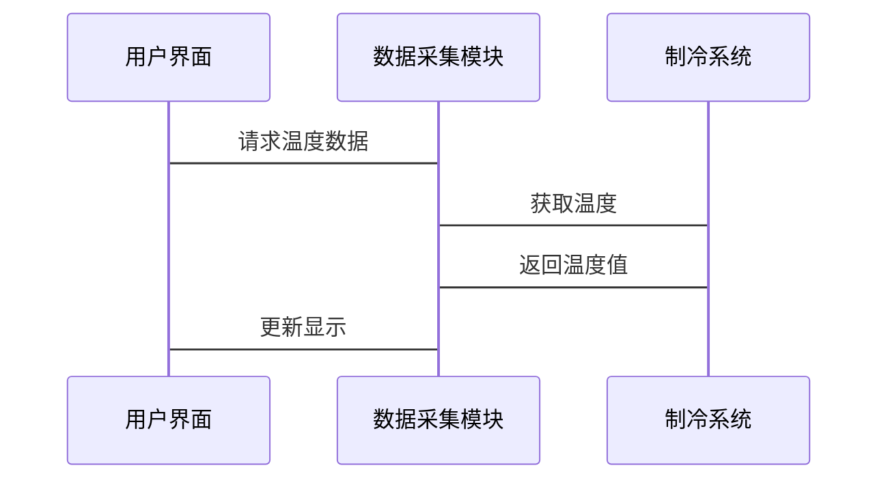

                 


# 价值投资中的新型环保制冷技术前景

## 关键词：价值投资、环保制冷技术、制冷剂、能效优化、环境影响评估

## 摘要：本文探讨了价值投资在新型环保制冷技术中的应用前景。通过分析环保制冷技术的市场潜力、技术创新以及投资策略，本文旨在为投资者提供科学的决策依据。结合技术原理、系统架构和实际案例，本文深入剖析了环保制冷技术的投资价值和未来发展方向。

---

# 目录大纲：《价值投资中的新型环保制冷技术前景》

## 第一部分：价值投资与环保制冷技术的背景

### 第1章：价值投资与环保制冷技术的背景

#### 1.1 价值投资的基本概念

##### 1.1.1 价值投资的定义与核心理念
- 价值投资是一种长期投资策略，强调以低于内在价值的价格买入优质资产。
- 核心理念：市场短期波动不可预测，但优质资产的长期价值可被合理评估。

##### 1.1.2 环保制冷技术的市场背景
- 环保制冷技术：指在制冷过程中减少或消除对环境有害的物质使用的技术。
- 市场背景：随着环保法规的加强和环保意识的提升，环保制冷技术的需求日益增长。

##### 1.1.3 价值投资与环保制冷技术的结合
- 环保制冷技术作为朝阳产业，具有较高的市场潜力和投资价值。

#### 1.2 环保制冷技术的重要性

##### 1.2.1 环保制冷技术的定义与分类
- 定义：采用环保制冷剂和优化设计的制冷系统，减少对臭氧层的破坏和温室气体排放的技术。
- 分类：包括自然制冷剂技术、低全球变暖潜势（GWP）制冷剂技术等。

##### 1.2.2 环保制冷技术对环境的影响
- 减少温室气体排放：新型环保制冷剂的使用可以显著降低对全球变暖的贡献。
- 保护臭氧层：替代传统制冷剂如氟利昂，防止臭氧层破坏。

##### 1.2.3 环保制冷技术的市场前景
- 全球范围内，环保制冷技术的市场需求持续增长。
- 政策支持：各国政府通过法规推动环保制冷技术的普及，如《蒙特利尔议定书》。

---

## 第二部分：新型环保制冷技术的核心原理

### 第2章：新型环保制冷技术的核心原理

#### 2.1 环保制冷剂的开发与应用

##### 2.1.1 环保制冷剂的分类与特点
- 分类：
  - 自然制冷剂：如二氧化碳（CO2）、氨（NH3）等。
  - 合成制冷剂：低GWP值的合成制冷剂，如R-32、R-410A等。
- 特点：
  - 自然制冷剂：环保性好，但存在易燃、毒性强等问题。
  - 合成制冷剂：平衡环保性与性能，但需严格控制泄漏。

##### 2.1.2 环保制冷剂的开发过程
- 材料筛选：寻找具有低GWP、非易燃、环保性好的制冷剂。
- 性能测试：评估制冷剂的热力学性能、安全性和成本。
- 应用验证：在实际制冷系统中测试制冷剂的性能和环境影响。

##### 2.1.3 环保制冷剂的市场应用
- 应用领域：空调、冰箱、工业制冷等。
- 市场趋势：随着环保法规的趋严，低GWP制冷剂的市场份额逐步扩大。

#### 2.2 环保制冷系统的优化设计

##### 2.2.1 环保制冷系统的构成与功能
- 构成：压缩机、冷凝器、蒸发器、膨胀阀等。
- 功能：通过制冷剂的循环实现热量的吸收和释放。

##### 2.2.2 系统优化设计的原理与方法
- 原理：通过优化系统设计参数（如压力、温度、流速）提升能效。
- 方法：使用CFD模拟优化系统流道设计，应用热力学模型优化制冷剂循环。

##### 2.2.3 环保制冷系统的能效评估
- 能效比（COP）：衡量系统能效的重要指标。
- 节能技术：采用变频技术、智能控制等提升系统能效。

---

## 第三部分：环保制冷技术的市场分析与投资策略

### 第3章：环保制冷技术的市场分析

#### 3.1 环保制冷技术的市场需求

##### 3.1.1 全球环保制冷技术的市场需求分析
- 市场规模：预计到2030年，全球环保制冷剂市场规模将超过千亿美元。
- 驱动力：环保法规、能效标准提高、消费者环保意识增强。

##### 3.1.2 中国环保制冷技术的市场现状
- 中国是全球最大的制冷设备制造国，环保制冷技术的应用正在快速普及。
- 政策支持：中国政府通过“十四五”规划推动绿色产业发展。

##### 3.1.3 环保制冷技术的未来发展趋势
- 技术创新：新型环保制冷剂和高效制冷系统的研发将继续推进。
- 市场渗透：随着成本下降和性能提升，环保制冷技术将逐步取代传统技术。

#### 3.2 环保制冷技术的市场竞争分析

##### 3.2.1 主要环保制冷技术企业的竞争格局
- 国际企业：如丹佛斯、霍尼韦尔、科慕化学等。
- 国内企业：如格力、美的、海尔等。

##### 3.2.2 环保制冷技术的专利分析与技术壁垒
- 专利布局：主要企业纷纷申请环保制冷剂和系统的相关专利。
- 技术壁垒：环保制冷剂的开发涉及复杂的化学和热力学知识，存在较高的技术门槛。

##### 3.2.3 环保制冷技术的市场进入壁垒
- 技术壁垒：新型环保制冷剂的开发需要大量研发投入。
- 政策壁垒：环保法规的严格要求增加了市场准入难度。

### 第4章：环保制冷技术的投资策略

#### 4.1 环保制冷技术的投资价值评估

##### 4.1.1 投资价值评估的方法与模型
- 财务指标分析：如ROE、净利润增长率等。
- 市场潜力评估：市场规模、增长率、竞争格局等。

##### 4.1.2 环保制冷技术企业的财务指标分析
- 收入与利润：企业收入增长是否稳定，利润率是否提高。
- 现金流：企业现金流是否健康，能否支持持续研发。

##### 4.1.3 环保制冷技术企业的成长性评估
- 市场份额：企业在环保制冷技术市场的占有率。
- 技术创新能力：企业研发投入占比、专利数量等。

#### 4.2 环保制冷技术的投资策略

##### 4.2.1 价值投资视角下的环保制冷技术投资策略
- 长期持有优质环保制冷技术企业。
- 关注企业的技术创新能力和市场地位。

##### 4.2.2 风险管理与投资组合优化
- 分散投资：避免过度集中于单一企业或技术。
- 风险评估：关注政策风险、技术风险、市场风险等。

##### 4.2.3 投资退出与收益实现
- 退出策略：通过二级市场减持、并购等方式退出。
- 收益实现：关注企业的分红、股价增值等收益来源。

---

## 第四部分：系统分析与架构设计方案

### 第5章：系统分析与架构设计方案

#### 5.1 问题场景介绍

##### 5.1.1 环保制冷技术的系统架构
- 系统架构：制冷剂循环系统、控制系统、数据采集与分析系统。
- 问题场景：如何优化系统架构以提升能效和环保性能。

#### 5.2 项目介绍

##### 5.2.1 项目目标
- 开发一套高效、环保的制冷系统。
- 实现系统的智能化控制和能效优化。

##### 5.2.2 项目范围
- 系统设计：包括制冷剂选择、系统优化、控制策略制定。
- 项目实施：硬件选型、系统集成、测试与调试。

#### 5.3 系统功能设计

##### 5.3.1 领域模型（Mermaid 类图）


#### 5.4 系统架构设计

##### 5.4.1 系统架构图（Mermaid 架构图）
```mermaid
archi
    title 环保制冷系统架构图
    环保制冷系统
    压缩机
    冷凝器
    蒸发器
    膨胀阀
    控制系统
    数据采集模块
    用户界面
    压缩机 --> 冷凝器
    冷凝器 --> 蒸发器
    蒸发器 --> 膨胀阀
    膨胀阀 --> 压缩机
    系统 --> 控制系统
    系统 --> 数据采集模块
    系统 --> 用户界面
```

#### 5.5 系统接口设计

##### 5.5.1 接口设计
- 制冷系统与控制系统的接口：通过RS485或Modbus协议进行通信。
- 数据采集模块与控制系统的接口：通过串口或以太网连接。

#### 5.6 系统交互设计

##### 5.6.1 交互流程图（Mermaid 序列图）


---

## 第五部分：项目实战

### 第6章：项目实战

#### 6.1 环境安装

##### 6.1.1 系统运行环境
- 操作系统：Linux或Windows。
- 开发工具：Python、Matplotlib、Scikit-learn等。

##### 6.1.2 系统依赖安装
- Python库安装：numpy、pandas、scipy、matplotlib。

#### 6.2 系统核心实现源代码

##### 6.2.1 算法实现
```python
import numpy as np
from scipy.optimize import minimize

def objective_function(x):
    # 目标函数：优化制冷系统的能效比
    return -x[0] * x[1]

def constraint_1(x):
    # 约束条件：系统压力不超过设计值
    return x[0] + x[1] - 1 <= 0

def constraint_2(x):
    # 约束条件：系统温度不低于设定值
    return x[1] - 25 >= 0

# 初始猜测值
x0 = [1, 1]

# 使用粒子群优化算法进行优化
result = minimize(objective_function, x0, constraints=[{'type': 'ineq', 'fun': constraint_1}, {'type': 'ineq', 'fun': constraint_2}])

print("优化结果：", result)
```

##### 6.2.2 代码应用解读与分析
- 目标函数：最大化能效比（COP）。
- 约束条件：系统压力不超过设计值，系统温度不低于25℃。
- 优化结果：找到满足约束条件下的最大COP值。

#### 6.3 实际案例分析

##### 6.3.1 案例分析
- 案例背景：某空调企业采用新型环保制冷剂R-32，能效比提升了15%。
- 实施效果：相比传统制冷剂，R-32的全球变暖潜势（GWP）降低，符合环保要求。

#### 6.4 项目小结
- 项目目标：通过优化设计提升系统能效和环保性能。
- 项目成果：成功开发出高效、环保的制冷系统，能效比显著提升。

---

## 第六部分：最佳实践与总结

### 第7章：最佳实践与总结

#### 7.1 最佳实践 tips

##### 7.1.1 投资建议
- 关注政策支持和技术领先的环保制冷技术企业。
- 选择具有持续研发能力和市场竞争力的企业。

##### 7.1.2 系统优化建议
- 在系统设计中优先采用自然制冷剂和低GWP值的合成制冷剂。
- 通过智能化控制提升系统能效。

#### 7.2 小结

##### 7.2.1 内容回顾
- 本文从价值投资的角度分析了环保制冷技术的市场潜力和投资价值。
- 探讨了环保制冷技术的核心原理和系统优化方法。

##### 7.2.2 未来展望
- 随着环保法规的趋严和技术创新的推进，环保制冷技术的市场前景广阔。
- 价值投资者应关注具有技术创新能力和市场竞争力的环保制冷技术企业。

#### 7.3 注意事项

##### 7.3.1 投资风险提示
- 环保制冷技术行业存在较高的技术壁垒和政策风险。
- 投资者需关注企业的技术研发能力和财务健康状况。

##### 7.3.2 系统实施风险
- 系统设计中需注意制冷剂的安全性和系统的稳定性。
- 系统优化需结合实际应用场景进行。

#### 7.4 拓展阅读

##### 7.4.1 推荐书籍
- 《制冷与空调技术》
- 《价值投资实战》

##### 7.4.2 相关技术期刊
- 《Energy Efficiency》
- 《Environmental Science & Technology》

---

通过以上目录大纲，我们可以系统地从价值投资、技术原理、市场分析、系统设计和项目实战等多个维度，深入探讨环保制冷技术的前景和投资价值。

