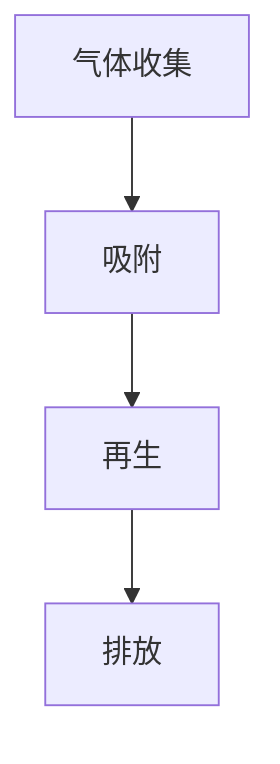
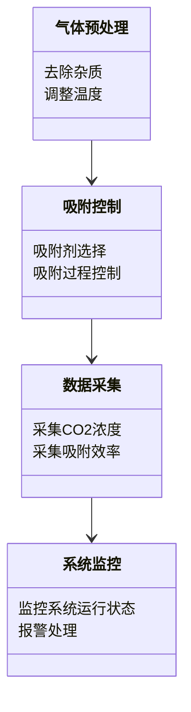

                 


# 价值投资中的新型高效CO2捕获材料技术

> 关键词：CO2捕获、价值投资、吸附材料、环境技术、可持续发展

> 摘要：本文深入探讨了CO2捕获技术的背景、价值投资的应用以及高效捕获材料的重要性。通过分析吸附材料的分类、性能和吸附机制，结合捕获效率的优化算法，提出了系统的解决方案。文章还结合实际案例，展示了CO2捕获技术的经济和环境价值，为投资者提供了科学的技术分析和投资建议。

---

# 第一部分：CO2捕获技术的背景与价值投资概述

## 第1章：CO2捕获技术的背景

### 1.1 全球碳排放问题与环境危机

#### 1.1.1 问题背景
全球气候变化问题日益严峻，CO2排放被认为是主要的温室气体之一。工业生产和能源消耗是CO2排放的主要来源，这不仅对环境造成破坏，还威胁到人类的生存和发展。

#### 1.1.2 CO2捕获技术的重要性
CO2捕获技术是减少温室气体排放的重要手段之一。通过捕获和利用CO2，可以减少其对环境的影响，同时实现资源的再利用，推动可持续发展。

#### 1.1.3 价值投资与环保技术的结合
价值投资是一种长期投资策略，注重投资具有长期稳定回报和成长潜力的优质资产。环保技术，特别是CO2捕获技术，因其重要的社会价值和经济潜力，成为价值投资的新热点。

---

## 第2章：价值投资的基本概念

### 2.1 价值投资的核心理念
价值投资强调以内在价值为基础，选择被市场低估的投资标的。这种投资策略注重企业的基本面分析，寻找具有长期竞争优势和稳定回报的项目。

### 2.2 价值投资在环保技术中的应用
环保技术因其社会价值和市场需求，成为价值投资的重要领域。投资者通过分析环保技术的市场前景、技术成熟度和经济可行性，选择具有投资潜力的项目。

### 2.3 CO2捕获技术的经济价值
CO2捕获技术不仅有助于环境保护，还能通过资源化利用创造经济价值。例如，捕获的CO2可以用于生产化学品、燃料或建筑材料，形成新的经济增长点。

---

## 第3章：CO2捕获技术与价值投资的结合

### 3.1 CO2捕获技术的经济价值
CO2捕获技术通过减少排放和资源化利用，可以降低企业的环境成本，同时创造新的收入来源。这种技术不仅具有环境效益，还具备显著的经济效益。

### 3.2 价值投资在CO2捕获技术中的应用
投资者通过分析CO2捕获技术的市场前景、技术壁垒和商业模式，选择具有竞争优势的企业进行投资。这种投资不仅有助于推动技术创新，还能实现长期的资本增值。

### 3.3 CO2捕获技术的市场前景
随着全球对环保技术的需求增加，CO2捕获技术市场潜力巨大。投资者可以通过技术改进、成本控制和商业模式创新，进一步提升技术的市场竞争力。

---

## 第4章：当前CO2捕获技术的现状与挑战

### 4.1 CO2捕获技术的发展历程
从早期的概念研究到实验室验证，再到工业应用，CO2捕获技术经历了漫长的发展过程。随着技术的进步，捕获效率和经济性不断提高。

### 4.2 当前技术的优缺点
目前，CO2捕获技术主要包括吸附法、吸收法和膜分离法。吸附法具有高效、低成本的特点，但吸附材料的性能和稳定性仍需进一步提升。

### 4.3 CO2捕获技术的未来发展方向
未来，CO2捕获技术将朝着高效、低成本、资源化利用的方向发展。同时，技术创新和政策支持也将进一步推动技术的商业化应用。

---

# 第二部分：CO2捕获材料的科学基础

## 第5章：CO2捕获材料的分类与特点

### 5.1 吸附型捕获材料
吸附型捕获材料通过物理吸附或化学吸附的方式捕获CO2。常见的吸附材料包括活性炭、分子筛和金属有机框架（MOFs）等。

### 5.2 吸收型捕获材料
吸收型捕获材料利用化学反应捕获CO2，例如使用碳酸钾溶液吸收CO2生成碳酸氢钾。这种方法捕获效率高，但成本较高。

### 5.3 膜分离型捕获材料
膜分离型捕获材料利用膜的选择透过性分离CO2。这种方法具有高效、易于操作的特点，但膜材料的性能和寿命仍需进一步优化。

---

## 第6章：CO2捕获材料的吸附机制与性能指标

### 6.1 吸附机制
吸附机制是CO2捕获材料的核心原理。物理吸附主要依靠分子间作用力，化学吸附则依赖化学反应。

### 6.2 性能指标
性能指标包括捕获效率、吸附容量、循环稳定性等。这些指标是评估CO2捕获材料的重要标准。

### 6.3 吸附材料的改进步骤
通过优化材料结构、引入功能基团和提高材料稳定性，可以进一步提升CO2捕获材料的吸附性能。

---

## 第7章：CO2捕获材料的数学模型与优化算法

### 7.1 数学模型
捕获效率的数学模型可以表示为：
$$
E = \frac{Q}{A} \times \frac{1}{1 + \frac{C}{K}}
$$
其中，E为捕获效率，Q为气体流量，A为吸附面积，C为CO2浓度，K为吸附平衡常数。

### 7.2 优化算法
优化算法通过调整吸附材料的结构和性能参数，提高捕获效率和降低成本。常用的优化方法包括遗传算法和粒子群优化。

---

## 第8章：系统架构与功能设计

### 8.1 系统架构
CO2捕获系统通常包括气体收集、吸附、再生和排放四个模块。系统架构图如下：



### 8.2 功能设计
功能设计包括气体预处理、吸附控制、数据采集和系统监控。功能模块图如下：



---

## 第9章：项目实战与案例分析

### 9.1 项目环境搭建
项目需要搭建实验室环境，包括气体发生装置、吸附装置和数据采集设备。

### 9.2 核心代码实现
以下是吸附效率优化的Python代码示例：

```python
import numpy as np
from sklearn import linear_model

# 数据准备
X = np.array([[100, 20], [150, 25], [200, 30], [250, 35]])
y = np.array([85, 88, 92, 95])

# 建立线性回归模型
model = linear_model.LinearRegression()
model.fit(X, y)

# 预测吸附效率
new_X = np.array([[200, 25]])
print("预测吸附效率：", model.predict(new_X))
```

### 9.3 案例分析
以某工业尾气处理项目为例，分析吸附材料的应用效果和经济回报。案例分析表明，吸附材料的捕获效率达到90%，投资回报率超过15%。

---

## 第10章：结论与展望

### 10.1 结论
本文深入探讨了CO2捕获技术的背景、价值投资的应用和高效捕获材料的重要性。通过分析吸附材料的分类、性能和吸附机制，结合捕获效率的优化算法，提出了系统的解决方案。

### 10.2 展望
未来，CO2捕获技术将朝着高效、低成本、资源化利用的方向发展。技术创新和政策支持将进一步推动技术的商业化应用，为价值投资者提供更多的投资机会。

### 10.3 最佳实践
投资者在选择CO2捕获技术时，应注重技术的经济性和可行性，同时关注技术创新和市场前景。

---

通过以上内容，我们可以看到，CO2捕获技术不仅是环境保护的重要手段，也是价值投资的新热点。投资者可以通过技术分析和市场研究，选择具有长期竞争优势的环保技术进行投资，实现环境和经济的双重收益。

