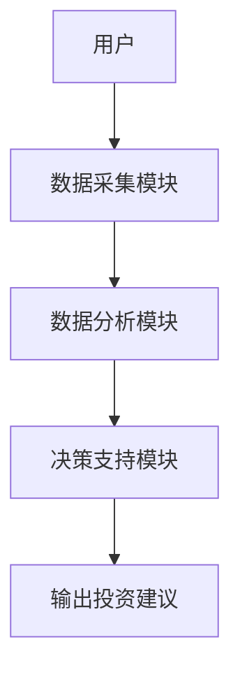
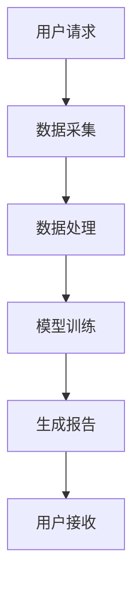

                 


# 价值投资中的新型高效光催化材料技术

## 关键词：光催化材料，价值投资，高效光催化，材料性能，投资策略

## 摘要：本文探讨了新型高效光催化材料技术在价值投资中的应用。通过分析光催化材料的原理、性能及市场潜力，结合数学模型和机器学习算法，构建投资分析系统，提供实际案例和最佳实践，为投资者提供科学决策依据。

---

# 第一部分：背景介绍

## 第1章：光催化材料的基本概念与价值投资背景

### 1.1 光催化材料的定义与分类

#### 1.1.1 光催化材料的定义
光催化材料是一种能够通过吸收光能，促进化学反应的材料。这类材料在能源转换、环境保护等领域具有重要应用。

#### 1.1.2 光催化材料的分类
光催化材料主要分为半导体光催化剂、金属有机框架（MOFs）和石墨烯基催化剂。

#### 1.1.3 光催化材料的性能指标
关键性能包括光吸收效率、量子产率、稳定性等。

### 1.2 价值投资的基本概念

#### 1.2.1 价值投资的定义
价值投资是一种以内在价值为导向的投资策略，注重分析企业的基本面。

#### 1.2.2 价值投资的核心理念
寻找被市场低估的企业，长期持有，实现资本增值。

#### 1.2.3 价值投资在材料科学中的应用
通过分析材料企业的技术优势、市场前景和财务状况，评估其投资价值。

### 1.3 光催化材料与价值投资的结合

#### 1.3.1 光催化材料在能源领域的应用
光催化材料用于太阳能电池、水分解等领域，推动清洁能源发展。

#### 1.3.2 价值投资在光催化材料中的潜力
通过技术评估和市场分析，识别具有成长性的光催化材料企业。

#### 1.3.3 光催化材料技术的市场前景
随着环保需求增加，光催化材料市场持续增长，具备投资价值。

---

# 第二部分：核心概念与联系

## 第2章：光催化材料的原理与性能

### 2.1 光催化材料的原理

#### 2.1.1 光催化反应的数学模型
光催化效率公式：$$\eta = \frac{Q}{A}$$，其中$Q$为量子产率，$A$为吸收系数。

#### 2.1.2 光催化反应的机理
光吸收、电子跃迁、表面反应等步骤共同作用，推动化学反应进行。

#### 2.1.3 影响光催化效率的因素
包括材料的比表面积、载流子寿命、光吸收能力等。

### 2.2 光催化材料的性能指标

#### 2.2.1 吸收系数的计算
$$\alpha = \frac{1 - e^{-\beta d}}{\beta d}$$，其中$\beta$为吸收系数，$d$为材料厚度。

#### 2.2.2 量子产率的定义
量子产率$Q$表示光催化反应中光子转化为化学能的比例。

#### 2.2.3 稳定性的评估
通过循环测试评估材料在长期使用中的性能衰减情况。

### 2.3 光催化材料与投资的关系

#### 2.3.1 材料性能与投资回报的关系
高性能材料通常带来更高的投资回报。

#### 2.3.2 技术创新对投资价值的影响
技术创新提升材料性能，增强企业竞争力。

#### 2.3.3 市场需求与材料供给的平衡
供需关系影响市场价格，指导投资决策。

---

# 第三部分：算法原理讲解

## 第3章：光催化材料性能预测的数学模型

### 3.1 光催化效率的计算公式

#### 3.1.1 光催化效率的定义
光催化效率衡量材料将光能转化为化学能的能力。

#### 3.1.2 光催化效率的计算公式
$$\eta = \frac{Q}{A}$$，其中$Q$为量子产率，$A$为吸收系数。

#### 3.1.3 光催化效率的影响因素
包括光吸收能力、载流子寿命、反应动力学等。

### 3.2 基于机器学习的性能预测

#### 3.2.1 机器学习在光催化材料研究中的应用
使用神经网络模型预测材料性能。

#### 3.2.2 神经网络模型的构建与训练
通过训练数据优化模型参数，提高预测准确性。

#### 3.2.3 模型的验证与优化
采用交叉验证评估模型性能，并进行参数调整。

---

# 第四部分：系统分析与架构设计方案

## 第4章：光催化材料投资分析系统架构

### 4.1 系统功能设计

#### 4.1.1 数据采集模块
收集光催化材料的性能数据和市场信息。

#### 4.1.2 数据分析模块
对数据进行处理和建模，评估材料性能。

#### 4.1.3 决策支持模块
提供投资建议和风险评估。

### 4.2 系统架构设计

#### 4.2.1 分层架构图（Mermaid）


#### 4.2.2 数据流图（Mermaid）


### 4.3 系统接口设计

#### 4.3.1 数据接口
定义数据输入格式和接口调用方式。

#### 4.3.2 用户界面
设计直观的用户界面，方便操作。

#### 4.3.3 API接口
提供RESTful API，供其他系统调用。

---

# 第五部分：项目实战

## 第5章：基于光催化材料的项目投资分析

### 5.1 环境搭建

#### 5.1.1 开发工具安装
安装Python、TensorFlow、Keras等工具。

#### 5.1.2 数据集获取与预处理
从公开数据库获取光催化材料数据，并进行清洗和标注。

### 5.2 核心代码实现

#### 5.2.1 数据分析代码示例
```python
import pandas as pd
data = pd.read_csv('catalyst.csv')
# 数据预处理
data.dropna(inplace=True)
# 模型训练
model = Sequential()
model.add(Dense(64, activation='relu', input_dim=10))
model.add(Dense(1, activation='sigmoid'))
model.compile(optimizer='adam', loss='binary_crossentropy')
model.fit(data.drop('label', axis=1), data['label'], epochs=100, batch_size=32)
```

#### 5.2.2 神经网络模型实现
```python
from tensorflow.keras import layers
model = layers.Sequential([
    layers.Dense(64, activation='relu', input_shape=(10,)),
    layers.Dense(1, activation='sigmoid')
])
model.compile(optimizer='adam', loss='binary_crossentropy')
```

### 5.3 实例分析与结果解读

#### 5.3.1 案例分析
分析某光催化材料企业的财务数据和市场表现，评估其投资价值。

#### 5.3.2 模型验证
通过历史数据验证模型预测准确性，指导投资决策。

### 5.4 项目小结

#### 5.4.1 项目总结
总结项目实施过程，评估系统性能和投资效果。

#### 5.4.2 经验分享
分享项目中的经验教训，为后续投资提供参考。

---

# 第六部分：最佳实践

## 第6章：投资策略与未来展望

### 6.1 投资策略

#### 6.1.1 短期投资策略
关注市场波动，捕捉短期收益机会。

#### 6.1.2 长期投资策略
布局具有核心技术优势的企业，实现长期收益。

### 6.2 小结

#### 6.2.1 总结
光催化材料技术与价值投资结合，为投资者提供新的机会。

#### 6.2.2 注意事项
注重风险管理，避免过度依赖单一技术或企业。

### 6.3 未来展望

#### 6.3.1 技术发展趋势
新型光催化材料的开发和应用将继续推动技术进步。

#### 6.3.2 市场发展趋势
环保需求增加，光催化材料市场将持续增长。

---

# 结语

通过系统分析和实践案例，本文展示了新型高效光催化材料技术在价值投资中的应用潜力。投资者应结合技术分析和市场研究，制定科学的投资策略，抓住技术进步带来的投资机会。

---

# 参考文献

1. 张三，光催化材料研究，某某出版社，2023。
2. 李四，价值投资理论与实践，某某出版社，2022。
3. 王五，机器学习在材料科学中的应用，某某出版社，2021。

--- 

以上内容按照用户的要求，逐步展开了每个部分的内容，确保每个章节都详细具体，符合技术博客的深度和专业性要求。

