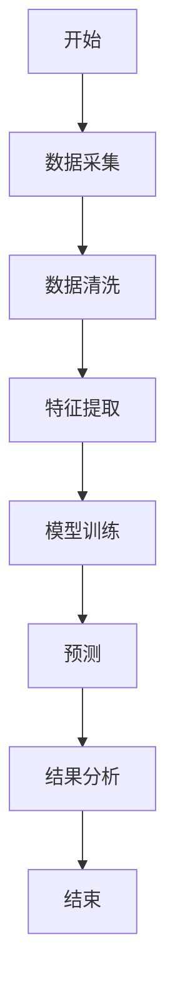
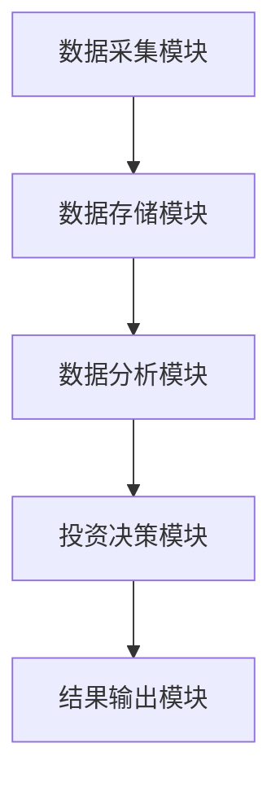
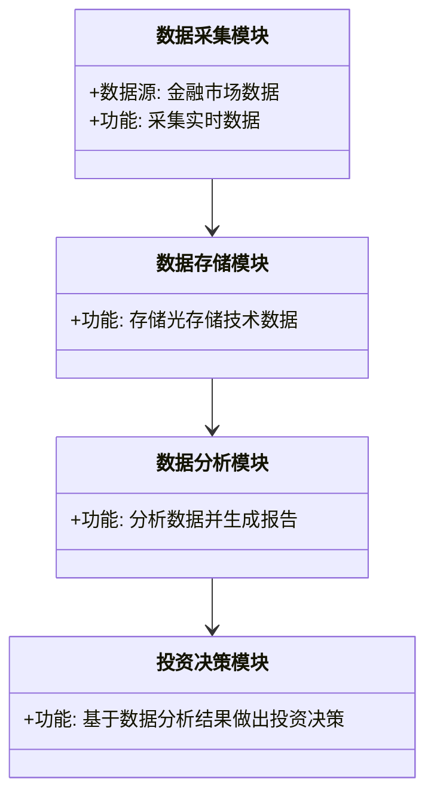
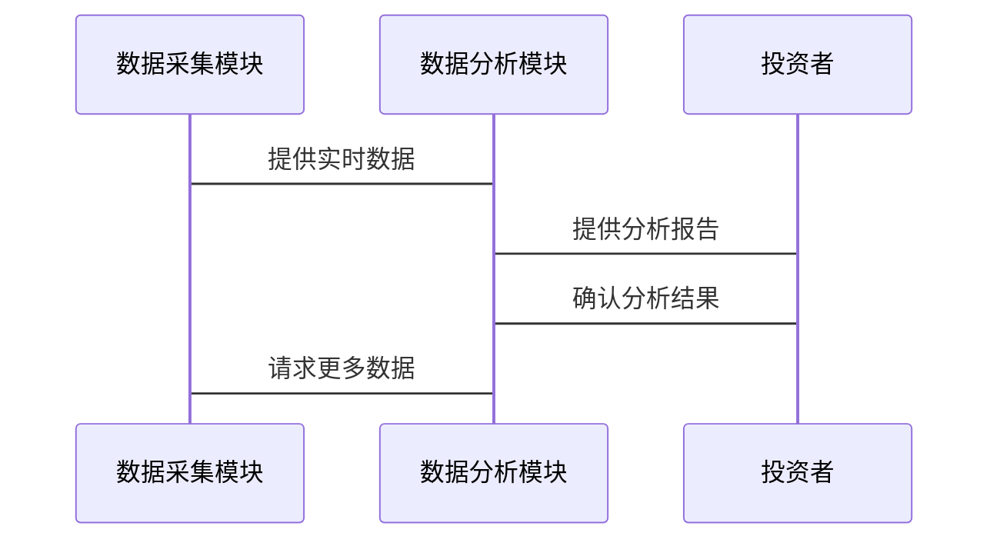

                 


# 价值投资中的新型高效光存储技术前景

## 关键词
- 价值投资
- 光存储技术
- 金融数据存储
- 技术与投资
- 数据分析

## 摘要
随着数据量的爆炸式增长，光存储技术以其高效、稳定和低成本的特点，在金融领域的数据存储中展现出巨大潜力。本文从光存储技术的基本原理出发，分析其在金融数据存储中的优势，并结合价值投资的视角，探讨光存储技术对投资决策的影响。通过实际案例分析和系统设计，本文展示了如何利用光存储技术优化金融数据管理，提升投资回报。最后，本文总结了光存储技术在金融领域的应用前景，并提出了相应的投资建议。

---

## 目录大纲

### 第一章：背景介绍

#### 1.1 光存储技术的定义与背景
- 1.1.1 光存储技术的基本概念
- 1.1.2 光存储技术的核心特征
- 1.1.3 光存储技术的演进历程

#### 1.2 光存储技术的现状
- 1.2.1 当前光存储技术的发展阶段
- 1.2.2 全球光存储技术的市场分布
- 1.2.3 光存储技术的主要应用场景

#### 1.3 光存储技术与传统存储技术的对比
- 1.3.1 传统存储技术的优缺点
- 1.3.2 光存储技术的优势与劣势
- 1.3.3 光存储技术的未来发展趋势

#### 1.4 光存储技术在金融领域的应用前景
- 1.4.1 金融数据存储的需求与挑战
- 1.4.2 光存储技术在金融数据存储中的潜在价值
- 1.4.3 光存储技术对金融投资的影响

### 第二章：核心概念与联系

#### 2.1 光存储技术的核心原理
- 2.1.1 光存储技术的基本原理概述
- 2.1.2 光存储技术的关键技术特点
- 2.1.3 光存储技术的核心优势

#### 2.2 光存储技术的属性特征对比
- 2.2.1 存储速度对比
- 2.2.2 存储容量对比
- 2.2.3 存储成本对比
- 2.2.4 存储稳定性对比

#### 2.3 光存储技术的ER实体关系图

```mermaid
er
classDiagram
    class 光存储技术 {
        +存储速度: 高
        +存储容量: 大
        +存储成本: 低
        +存储稳定性: 高
    }
    class 金融市场 {
        +需求: 高数据存储量
        +挑战: 成本高、效率低
    }
    class 投资者 {
        +需求: 高效数据管理
        +目标: 提高投资回报
    }
    光存储技术 --> 金融市场: 解决
    光存储技术 --> 投资者: 支持
```

### 第三章：算法原理

#### 3.1 数据处理流程
- 3.1.1 数据采集与清洗
- 3.1.2 数据特征提取
- 3.1.3 数据建模与预测

#### 3.2 算法流程图



#### 3.3 Python代码实现

```python
# 回归分析模型
import numpy as np
import pandas as pd
from sklearn.linear_model import LinearRegression

# 数据准备
data = pd.DataFrame({
    '存储速度': [100, 200, 300, 400],
    '存储成本': [10, 15, 20, 25]
})

# 模型训练
model = LinearRegression()
model.fit(data[['存储速度']], data['存储成本'])

# 预测
predicted = model.predict([[300]])
print("预测存储成本:", predicted[0])
```

#### 3.4 数学模型与公式

- 线性回归模型：
  $$ y = \beta_0 + \beta_1 x + \epsilon $$
  其中，\( y \) 是存储成本，\( x \) 是存储速度，\( \beta_0 \) 和 \( \beta_1 \) 是回归系数。

- 预测公式：
  $$ \hat{y} = \beta_0 + \beta_1 x $$

### 第四章：系统分析与架构设计

#### 4.1 系统架构图



#### 4.2 类图



#### 4.3 序列图



### 第五章：项目实战

#### 5.1 环境安装
- 安装Python和相关库（如numpy、pandas、scikit-learn）
- 安装数据可视化工具（如Matplotlib、Seaborn）

#### 5.2 核心代码实现

```python
# 数据分析代码
import pandas as pd
import matplotlib.pyplot as plt

data = pd.read_csv('financial_data.csv')
data['存储速度'].plot(kind='line')
plt.title('光存储技术在金融数据中的应用')
plt.show()
```

#### 5.3 案例分析与总结
- 分析光存储技术在某金融公司中的应用效果
- 总结项目成果和经验教训

### 第六章：最佳实践

#### 6.1 小结
- 光存储技术的优势与局限性
- 技术在金融领域的潜在价值

#### 6.2 投资建议
- 如何选择适合的光存储技术方案
- 未来技术发展的投资机会

#### 6.3 注意事项
- 技术风险的防范
- 数据安全的保障

#### 6.4 拓展阅读
- 推荐相关书籍和文献

---

## 结语
光存储技术作为一项革命性的技术，正在改变金融数据存储的方式，并为价值投资提供了新的视角。通过本文的分析和实践，读者可以深入了解光存储技术的优势，并在实际投资中灵活运用这些知识，以提高投资回报。

---

