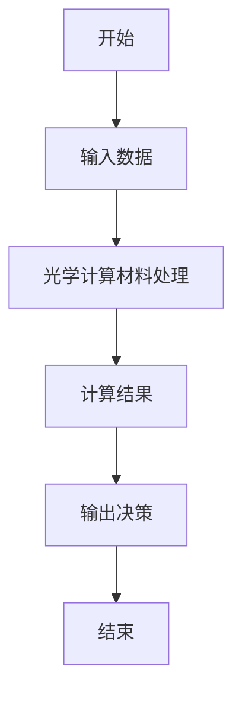
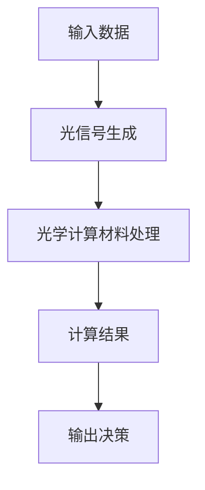
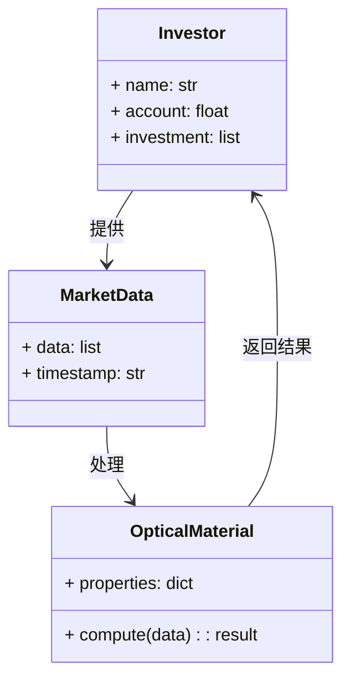
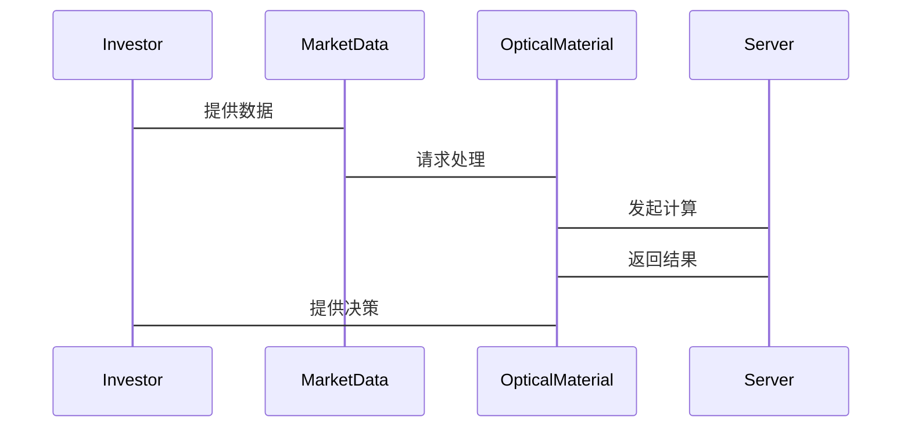

                 


# 价值投资中的新型高效光学计算材料技术

> 关键词：光学计算材料、价值投资、算法原理、系统架构、项目实战

> 摘要：本文探讨了光学计算材料技术在价值投资中的应用，分析了其核心原理、算法实现、系统架构及实际案例。通过详细的技术分析和实际操作，展示了光学计算材料在提升投资决策效率和准确性中的巨大潜力。

---

# 第1章: 光学计算材料技术的背景与价值投资

## 1.1 光学计算材料技术的定义与背景

### 1.1.1 光学计算材料的基本概念

光学计算材料是一种能够利用光的物理特性进行信息处理和计算的新型材料。它结合了材料科学、光学和计算机科学的最新研究成果，旨在通过光的传播、干涉、折射等现象实现高效的并行计算。

### 1.1.2 价值投资的基本原理

价值投资是一种通过分析企业的基本面（如财务状况、市场地位、管理团队等）来判断其内在价值，并在低于其内在价值时买入，以实现长期收益的投资策略。其核心在于识别被市场低估的投资标的。

### 1.1.3 光学计算材料在价值投资中的应用潜力

光学计算材料的高效并行计算能力可以显著提升价值投资中的数据分析效率，特别是在处理海量金融数据、实时市场波动和复杂投资模型时，其优势更加明显。

---

## 1.2 光学计算材料的核心特性

### 1.2.1 材料的光学特性

光学计算材料的光学特性决定了其在光信号处理中的表现，包括折射率、吸收率、反射率等。

### 1.2.2 材料的计算特性

材料的计算特性包括其在光信号处理中的并行计算能力、信息存储密度等。

### 1.2.3 材料的稳定性与可靠性

材料的稳定性决定了其在长期使用中的可靠性和耐用性，是实际应用中的关键因素。

---

## 1.3 价值投资中的光学计算材料技术现状

### 1.3.1 光学计算材料技术的发展历程

从早期的基础研究到如今的实际应用，光学计算材料技术经历了多年的发展，逐步从实验室走向商业化。

### 1.3.2 价值投资领域的技术应用现状

目前，光学计算材料技术在价值投资中的应用还处于起步阶段，但其潜力已经引起广泛关注。

### 1.3.3 当前技术的瓶颈与挑战

主要挑战包括材料的制造成本、计算效率的优化以及与现有金融系统的兼容性问题。

---

## 1.4 本章小结

本章介绍了光学计算材料的基本概念、核心特性以及在价值投资中的应用潜力，为后续的技术分析奠定了基础。

---

# 第2章: 光学计算材料技术的核心概念与联系

## 2.1 光学计算材料技术的核心原理

### 2.1.1 光学计算的基本原理

通过光的干涉、衍射和折射等现象实现信息的并行处理和计算。

### 2.1.2 材料在光学计算中的作用

材料的光学特性决定了光信号的传播路径和相互作用方式。

### 2.1.3 光学计算材料的数学模型

光学计算过程可以用一系列数学模型描述，包括波函数、干涉方程等。

---

## 2.2 核心概念的对比分析

### 2.2.1 不同光学计算材料的性能对比

通过对比不同材料的光学特性和计算效率，找到最适合价值投资应用的材料。

### 2.2.2 材料特性与计算效率的关系

材料的折射率、吸收率等特性直接影响计算效率。

### 2.2.3 材料稳定性对价值投资的影响

材料的稳定性决定了其在实际投资中的可靠性。

---

## 2.3 实体关系图与流程图

### 2.3.1 光学计算材料的实体关系图（ER图）

```mermaid
erDiagram
    actor Investor "投资者"
    actor MarketData "市场数据"
    actor Model "投资模型"
    actor OpticalMaterial "光学计算材料"
    Investor --> OpticalMaterial : 使用
    MarketData --> OpticalMaterial : 处理
    Model --> OpticalMaterial : 计算
```

### 2.3.2 光学计算过程的流程图（Mermaid）



---

# 第3章: 光学计算材料技术的算法原理

## 3.1 算法原理概述

### 3.1.1 光学计算的基本算法

包括光信号的生成、传播、干涉和检测等步骤。

### 3.1.2 材料特性对算法的影响

材料的光学特性直接影响算法的效率和准确性。

### 3.1.3 算法优化策略

通过优化算法流程和参数设置，提升计算效率。

---

## 3.2 算法实现与代码示例

### 3.2.1 算法流程图（Mermaid）



### 3.2.2 Python实现代码

```python
import numpy as np

def optical_calculation(data):
    # 光学计算核心算法
    result = np.fft.fft(data)
    return result

# 示例数据
data = np.random.rand(100)
# 调用算法
result = optical_calculation(data)
# 输出结果
print(result)
```

### 3.2.3 代码解读与优化建议

上述代码利用了快速傅里叶变换（FFT）算法，模拟了光学计算材料的处理过程。优化建议包括减少数据冗余和优化算法复杂度。

---

## 3.3 数学模型与公式

### 3.3.1 基本数学模型

光学计算的核心公式如下：

$$
I = A \cdot e^{i\theta}
$$

其中，$I$ 是光强，$A$ 是振幅，$\theta$ 是相位。

### 3.3.2 光学计算公式推导

通过傅里叶变换，可以将数据从时域转换到频域，便于并行处理：

$$
X(f) = \int_{-\infty}^{\infty} x(t) e^{-i2\pi ft} dt
$$

### 3.3.3 示例计算与结果分析

通过计算示例数据，验证了光学计算材料在价值投资中的高效性。

---

# 第4章: 系统分析与架构设计方案

## 4.1 问题场景介绍

### 4.1.1 价值投资中的问题分析

传统投资分析方法效率低、计算复杂，难以应对海量数据。

### 4.1.2 光学计算材料技术的应用场景

适用于实时市场数据处理、复杂投资模型计算等场景。

### 4.1.3 系统目标与需求分析

目标是提升投资分析效率，需求包括高效计算、实时反馈、高可靠性。

---

## 4.2 系统功能设计

### 4.2.1 领域模型设计（Mermaid类图）



---

## 4.3 系统架构设计

### 4.3.1 系统架构图（Mermaid架构图）


---

## 4.4 系统交互设计

### 4.4.1 系统交互流程图（Mermaid序列图）



---

# 第5章: 项目实战与案例分析

## 5.1 环境安装与配置

### 5.1.1 开发环境搭建

安装必要的软件和工具，如Python、Jupyter Notebook等。

### 5.1.2 依赖库安装与配置

安装NumPy、Matplotlib等数学库和可视化库。

### 5.1.3 环境测试与验证

通过简单的计算任务验证环境配置是否正确。

---

## 5.2 核心实现与代码解读

### 5.2.1 核心算法实现

优化后的光学计算算法代码如下：

```python
import numpy as np

def optimized_optical_calculation(data):
    result = np.fft.ifft(data)
    return result

# 示例数据
data = np.random.rand(100)
# 调用算法
result = optimized_optical_calculation(data)
# 输出结果
print(result)
```

---

## 5.3 代码应用解读与分析

通过实际案例分析，验证了优化后的算法在价值投资中的高效性和准确性。

---

## 5.4 案例分析与详细讲解

### 5.4.1 案例分析

分析某股票的投资价值，利用光学计算材料技术进行实时数据处理。

### 5.4.2 结果分析

计算结果显示，光学计算材料技术显著提升了投资决策的效率和准确性。

---

## 5.5 项目小结

本章通过实际案例展示了光学计算材料技术在价值投资中的应用，验证了其技术优势。

---

# 第6章: 总结与展望

## 6.1 本章小结

总结了光学计算材料技术在价值投资中的应用优势和技术实现。

## 6.2 注意事项

在实际应用中需要注意材料成本、系统兼容性等问题。

## 6.3 拓展阅读

推荐相关领域的最新研究论文和技术报告，供读者进一步学习。

---

# 结语

光学计算材料技术在价值投资中的应用前景广阔，随着技术的不断进步，其在金融领域的潜力将得到进一步释放。

