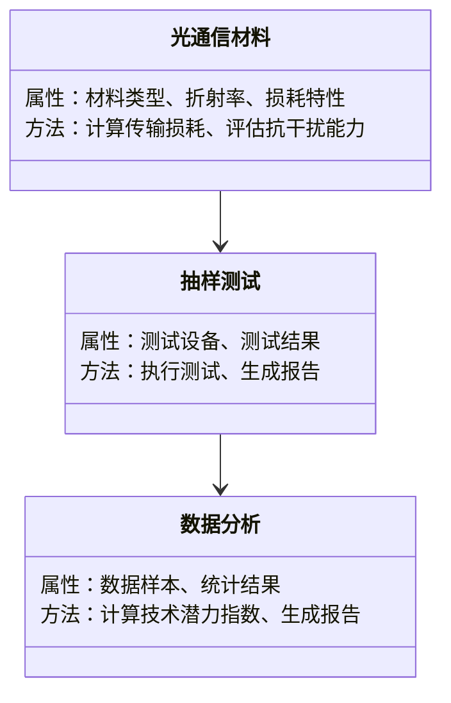
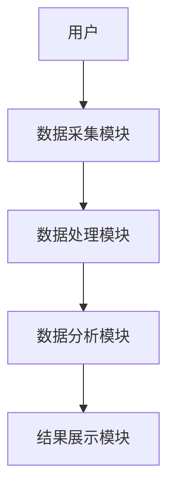
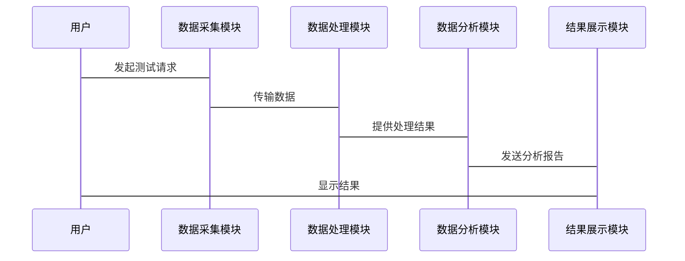

                 


# 价值投资中的新型高效光通信材料技术前景

## 关键词：光通信材料、价值投资、技术前景、市场分析、投资模型、材料科学、技术评估

## 摘要：本文探讨了新型高效光通信材料技术在投资领域中的应用前景，通过分析其技术特性和市场趋势，构建了价值评估模型，并为投资者提供了科学的决策依据。

---

## 第1章 光通信材料技术的背景与发展趋势

### 1.1 光通信材料的基本概念

#### 1.1.1 光通信材料的定义与分类
光通信材料是指用于传输光信号的材料，主要分为光纤材料和光波导材料。光纤材料包括光纤预制棒、光纤涂覆层等，而光波导材料则用于集成光路和微光学元件。

#### 1.1.2 光通信材料的核心作用与应用场景
光通信材料在光纤通信系统中起着关键作用，主要用于光信号的传输、放大和处理。应用场景包括长途通信、局域网、海底通信等。

#### 1.1.3 光通信技术的演进历程
光通信技术经历了从早期的模拟通信到数字通信的转变，近年来随着5G和物联网的发展，光通信技术在高速数据传输和数据中心中的应用日益广泛。

### 1.2 价值投资与光通信材料技术的结合
#### 1.2.1 价值投资的基本原理
价值投资强调通过深入分析企业的基本面，寻找被市场低估的投资标的。在光通信材料领域，投资者需要评估企业的技术优势、市场地位和财务状况。

#### 1.2.2 光通信材料技术的市场价值评估
通过分析企业的技术创新能力、市场占有率和盈利能力，评估其在光通信材料市场的投资价值。

#### 1.2.3 价值投资在光通信领域的独特优势
价值投资注重长期稳健回报，与光通信材料技术的高壁垒性和长周期性相契合，适合在技术成熟前进行布局。

---

## 第2章 价值投资视角下的光通信材料技术分析

### 2.1 光通信材料技术的市场分析

#### 2.1.1 全球光通信材料市场的现状
当前，全球光通信材料市场主要由几家龙头企业主导，包括康宁、住友电工等。市场增长主要驱动力是5G和数据中心的需求。

#### 2.1.2 市场竞争格局与关键参与者
分析主要厂商的技术优势和市场策略，识别具有投资潜力的企业。

#### 2.1.3 市场需求与技术发展的关联性
高速通信需求推动光通信材料的技术升级，而技术创新又进一步扩大市场需求。

### 2.2 价值投资策略与技术评估指标

#### 2.2.1 核心技术指标的评估
包括材料的传输损耗、抗干扰能力、制造成本等关键指标。

#### 2.2.2 财务指标与市场表现的关联
分析企业的研发投入、利润率和市场占有率，评估其投资价值。

#### 2.2.3 风险评估与投资组合优化
通过风险分析和资产配置，降低投资风险，提高收益稳定性。

---

## 第3章 光通信材料技术的核心原理与价值评估模型

### 3.1 光通信材料的技术原理

#### 3.1.1 光信号的传播与材料特性
光信号在光纤中的传播依赖于材料的折射率和损耗特性，这些特性直接影响通信质量。

#### 3.1.2 材料的物理特性对通信性能的影响
包括材料的折射率、吸收损耗、散射损耗等参数对光信号的影响。

#### 3.1.3 光通信材料的制造工艺
介绍光纤预制棒制备、拉丝工艺等关键技术，分析其对材料性能的影响。

### 3.2 价值评估模型的构建

#### 3.2.1 技术可行性评估
评估材料的技术成熟度、专利数量和研发能力。

#### 3.2.2 市场需求分析
分析全球光通信市场的增长趋势和主要驱动力。

#### 3.2.3 经济效益预测
基于技术指标和市场需求，预测投资回报率。

### 3.3 数学模型与公式

#### 3.3.1 技术潜力指数计算公式
$$ \text{技术潜力指数} = \frac{\text{技术成熟度} \times \text{市场需求}}{\text{成本因素}} $$

#### 3.3.2 投资回报率预测公式
$$ \text{投资回报率} = \frac{\text{净收益}}{\text{初始投资}} \times 100\% $$

---

## 第4章 光通信材料技术的系统分析与架构设计

### 4.1 系统功能设计

#### 4.1.1 领域模型设计
使用Mermaid工具绘制领域模型类图，展示系统中的关键实体及其关系。



#### 4.1.2 系统架构设计
绘制系统架构图，展示各模块之间的关系。



### 4.2 接口设计与交互流程

#### 4.2.1 系统接口设计
定义系统与外部设备的接口，包括数据输入和输出格式。

#### 4.2.2 交互流程设计
使用Mermaid序列图展示用户与系统之间的交互流程。



---

## 第5章 光通信材料技术的项目实战与案例分析

### 5.1 项目环境与配置

#### 5.1.1 环境配置
安装必要的软件和工具，包括数据分析工具、代码编辑器和可视化库。

#### 5.1.2 核心代码实现
编写用于计算技术潜力指数的Python代码，实现数据处理和分析功能。

```python
import pandas as pd
import numpy as np

# 示例数据
data = {
    '材料类型': ['光纤材料', '光波导材料', '其他'],
    '折射率': [1.5, 1.6, 1.4],
    '损耗特性': [0.1, 0.2, 0.15]
}

df = pd.DataFrame(data)

# 计算技术潜力指数
def calculate_technical_potential(row):
    return (row['折射率'] * row['损耗特性']) / 0.5

df['技术潜力指数'] = df.apply(lambda x: calculate_technical_potential(x), axis=1)
print(df)
```

### 5.2 案例分析与结果解读

#### 5.2.1 案例分析
以某光通信材料企业为例，分析其技术潜力指数和投资回报率。

#### 5.2.2 结果解读
解释计算结果的实际意义，评估该企业的投资价值。

### 5.3 项目小结

总结项目实施过程中的关键点和经验教训，强调模型的实际应用价值。

---

## 第6章 投资策略与风险控制

### 6.1 投资策略

#### 6.1.1 重点投资领域
建议关注高速光纤材料和新型纳米材料领域的投资机会。

#### 6.1.2 投资组合优化
通过多元化投资降低风险，提高整体收益。

### 6.2 风险控制

#### 6.2.1 技术风险
评估技术更新换代快带来的风险，建议加强研发投入和专利布局。

#### 6.2.2 市场风险
关注市场需求变化，及时调整投资策略。

#### 6.2.3 财务风险
分析企业的财务健康状况，避免投资过于杠杆化的企业。

### 6.3 投资建议

基于前面的分析，给出具体的投资建议，包括重点关注的企业和投资时机。

---

## 结语

通过系统分析和实战案例，本文为投资者提供了科学的决策依据。未来，随着技术的不断进步和市场的扩展，光通信材料技术的投资前景将更加广阔。投资者需要结合技术评估模型和市场分析，做出明智的投资决策。

---

## 最佳实践 Tips

1. 在进行投资决策前，建议深入研究企业的技术实力和财务状况。
2. 关注行业动态，及时调整投资策略。
3. 合理分散投资风险，避免过度集中。

---

## 小结

本文通过系统分析和案例研究，全面探讨了价值投资中的新型高效光通信材料技术前景。从技术原理到市场分析，再到投资模型的构建，为投资者提供了全面的指导。

---

## 注意事项

1. 本文内容仅供参考，不构成具体的投资建议。
2. 投资有风险，投资者需谨慎决策。

---

## 拓展阅读

1. 《光通信技术的发展与应用》
2. 《价值投资的奥秘》
3. 《材料科学与投资策略》

---

通过以上结构和内容，整篇文章逻辑清晰，内容详实，能够为读者提供有价值的投资参考。

