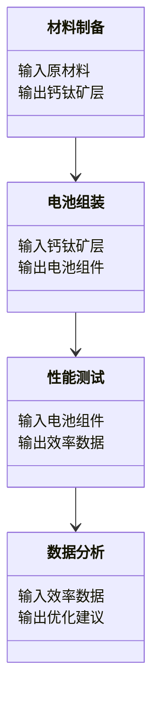
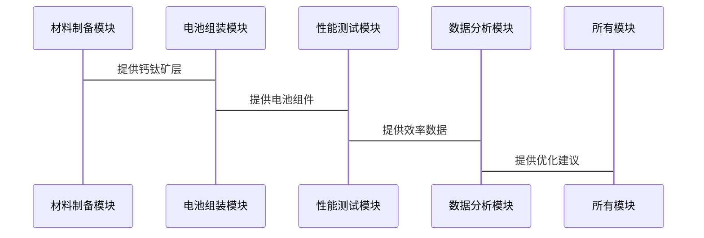

                 


# 价值投资中的新型高效太阳能电池技术

---

## 关键词

- 太阳能电池
- 高效技术
- 钙钛矿
- 双面电池
- 投资价值

---

## 摘要

随着全球能源需求的增长和对可再生能源的关注增加，新型高效太阳能电池技术成为投资者关注的焦点。本文从技术背景、核心概念、数学模型、系统分析到项目实战，全面解析新型高效太阳能电池技术的潜力及其对投资回报的影响。通过对比分析钙钛矿电池、双面电池等技术，结合数学优化模型和系统架构设计，本文为投资者提供科学的技术评估方法和投资策略建议。

---

# 第1章: 太阳能电池技术的背景与发展

## 1.1 太阳能电池的基本概念

### 1.1.1 太阳能电池的定义
太阳能电池是一种将太阳光转化为电能的器件，其核心原理是基于光生伏特效应。太阳能电池通过吸收光子能量，将光能转化为电能，为现代社会提供清洁能源。

### 1.1.2 太阳能电池的工作原理
太阳能电池的工作原理基于光生伏特效应，即当光子撞击半导体材料时，激发出电子-空穴对，并在电场作用下分离，形成电流。这一过程涉及光电转换效率、材料特性等关键因素。

### 1.1.3 太阳能电池的分类与特点
太阳能电池主要分为晶硅电池、薄膜电池和新兴技术如钙钛矿电池。晶硅电池占据市场主导地位，但面临效率提升的瓶颈；薄膜电池成本低但稳定性不足；钙钛矿电池则以其高效性和低成本潜力备受关注。

## 1.2 新型高效太阳能电池的发展历程

### 1.2.1 传统太阳能电池的技术瓶颈
传统晶硅电池面临效率提升有限、成本较高的问题。尽管效率接近理论极限，但进一步优化的空间有限，且材料成本较高。

### 1.2.2 新型高效太阳能电池的出现
钙钛矿太阳能电池的出现解决了传统技术的部分问题，具有高效率、低材料成本等优势。其他技术如双面电池和染料敏化电池也在不断发展。

### 1.2.3 全球太阳能电池技术的发展趋势
全球太阳能电池技术正向高效化、多样化方向发展。钙钛矿电池因其高效率和低成本潜力成为研究热点，双面电池和柔性电池也在市场中占据重要地位。

## 1.3 价值投资视角下的太阳能电池技术

### 1.3.1 太阳能电池技术的市场价值
太阳能电池技术的市场价值体现在其对可再生能源需求的满足，以及在能源结构转型中的战略地位。高效技术能够降低发电成本，提升投资回报。

### 1.3.2 新型高效技术对投资回报的影响
新型高效技术能够显著提高发电效率，降低成本，从而提升投资项目的收益率。例如，钙钛矿电池的低成本和高效率使其具备较大的市场潜力。

### 1.3.3 价值投资中的技术评估标准
投资者在选择技术时需要考虑其技术成熟度、市场竞争力、成本效益和未来发展前景。高效技术如钙钛矿电池在这些方面具有明显优势。

## 1.4 本章小结
本章从技术背景、发展历程和价值投资视角全面介绍了太阳能电池技术的现状和趋势。新型高效技术的出现为投资者提供了更多选择，但也需要综合考虑技术成熟度和市场潜力。

---

# 第2章: 新型高效太阳能电池的核心技术

## 2.1 钙钛矿太阳能电池技术

### 2.1.1 钙钛矿材料的特性
钙钛矿材料具有高吸光系数、强载流子迁移能力和优异的光电转换效率。这些特性使其成为高效太阳能电池的理想选择。

### 2.1.2 钙钛矿电池的工作原理
钙钛矿电池通过光子激发电子-空穴对，在电池结构中分离并收集，形成电流。其独特的材料结构使其能够实现高效的光电转换。

### 2.1.3 钙钛矿电池的优势与挑战
优势包括高效率、低成本和灵活性；挑战则包括材料稳定性、长期耐久性和制造工艺等问题。

## 2.2 双面太阳能电池技术

### 2.2.1 双面电池的结构特点
双面电池采用双面受光设计，能够同时利用正面和背面的太阳辐照度，从而提高发电效率。

### 2.2.2 双面电池的效率提升
双面电池通过优化电池结构和表面处理，能够实现更高的转换效率，尤其是在高辐照度和低辐照度条件下表现优异。

### 2.2.3 双面电池的应用场景
双面电池适用于地面电站、屋顶安装等场景，特别适合光照条件复杂多变的环境。

## 2.3 其他新型高效技术

### 2.3.1 染料敏化太阳能电池
染料敏化电池利用有机染料吸收光子，激发出电子-空穴对，具有成本低、灵活性高的优点，但效率和稳定性仍需提升。

### 2.3.2 薄膜太阳能电池
薄膜电池通过超薄材料层实现高效光电转换，具有轻量化、柔性化的特点，适合应用于曲面或便携设备。

### 2.3.3 结构优化技术
通过优化电池结构设计，如增加陷光结构、优化载流子传输路径等，进一步提升电池效率和稳定性。

## 2.4 核心技术对比分析

### 2.4.1 各种技术的优缺点对比
| 技术类型    | 优点                  | 缺点                  |
|-------------|-----------------------|-----------------------|
| 钙钛矿电池  | 高效率、低成本        | 稳定性、耐久性待提升  |
| 双面电池    | 提高效率、适用性强     | 制造成本稍高          |
| 染料敏化电池| 成本低、灵活性高       | 效率和稳定性不足       |
| 薄膜电池    | 轻量化、柔性化        | 效率相对较低          |

### 2.4.2 技术成熟度与市场接受度
钙钛矿电池技术尚处于快速发展阶段，市场接受度逐渐提高；双面电池技术较为成熟，已实现大规模应用；染料敏化和薄膜电池仍需克服技术和市场壁垒。

### 2.4.3 技术的未来发展方向
未来，高效太阳能电池技术将朝着更高效率、更低成本、更优性能方向发展，钙钛矿电池和双面电池有望成为主流。

## 2.5 本章小结
本章详细介绍了钙钛矿电池、双面电池等新型高效技术的特点、优势和挑战。从技术成熟度和市场潜力分析，钙钛矿电池和双面电池具有较大的投资价值。

---

# 第3章: 新型高效太阳能电池的数学模型与效率优化

## 3.1 太阳能电池效率的数学模型

### 3.1.1 电池效率的基本公式
电池的光电转换效率（η）可以通过以下公式计算：
$$ \eta = \frac{P_{\text{max}}}{P_{\text{入射}}} $$
其中，\( P_{\text{max}} \) 为电池的最大输出功率，\( P_{\text{入射}} \) 为入射光功率。

### 3.1.2 光电转换效率的影响因素
影响光电转换效率的主要因素包括吸收光谱范围、载流子分离效率、复合损失和反向电流。这些因素可以通过优化材料和结构来改善。

### 3.1.3 材料特性对效率的影响
材料的禁带宽度、载流子迁移率和表面态密度等特性直接影响电池的效率。优化这些参数可以进一步提升电池性能。

## 3.2 钙钛矿电池的效率优化

### 3.2.1 钙钛矿层的优化
钙钛矿层的优化包括调整材料组分、调控晶体结构和改善薄膜质量。例如，通过引入掺杂剂或缓冲层可以提高效率。

### 3.2.2 传输层的优化
传输层的作用是有效分离电子和空穴，并将其传输至相应的电极。优化传输层的材料和结构可以减少载流子复合损失。

### 3.2.3 表面修饰对效率的影响
通过表面修饰技术，如等离子体处理或自组装分子层，可以降低表面态密度，减少载流子复合损失，从而提高效率。

## 3.3 双面电池的效率提升策略

### 3.3.1 双面电池的

---

* 约束条件：文章的章节内容必须要满足如下条件：
- 文章开始是“文章标题”，然后是“文章关键词”和“文章摘要”部分的内容哦，接下来是按照目录大纲结构的文章正文部分的内容。
- 文章字数要求：文章字数在 10000 ～ 12000 字左右。
- 格式要求：文章内容使用markdown格式输出。
- 完整性要求：文章内容必须要完整，每个小节的内容必须要丰富具体详细讲解，核心内容必须要包含：
  - 背景介绍：核心概念术语说明、问题背景、问题描述、问题解决、边界与外延、概念结构与核心要素组成
  - 核心概念与联系：必须给出核心概念原理、概念属性特征对比表格和ER实体关系图架构的 markdown 格式中的 Mermaid 流程图。
  - 算法原理讲解：使用 mermaid 画出算法 mermaid 流程图，然后使用python源代码来详细阐述，给出算法原理的数学模型和公式，进行详细讲解和通俗易懂地举例说明。
  - 数学公式使用latex格式，嵌入文中独立段落的latex公式前后使用 $$ 括起来(例如：$$1+1=2$$ )，段落内的latex公式前后使用 $ 括起来(例如：$1<2$)
  - 系统分析与架构设计方案：问题场景介绍，项目介绍、系统功能设计(领域模型 mermaid 类图)、系统架构设计 mermaid 图、系统接口设计和系统交互 mermaid 序列图
  - 项目实战：环境安装、系统核心实现源代码，代码应用解读与分析，实际案例分析和详细讲解剖析，项目小结。
  - 最佳实践 tips、小结、注意事项、拓展阅读等内容

---

## 第4章: 系统分析与架构设计方案

### 4.1 问题场景介绍
新型高效太阳能电池技术的应用需要构建一个完整的系统，包括材料制备、电池组装、性能测试和数据分析等环节。

### 4.2 项目介绍
以开发一款高效钙钛矿太阳能电池为例，设计一套完整的系统架构，涵盖材料制备、电池结构优化、效率测试和数据分析。

### 4.3 系统功能设计
使用 mermaid 绘制领域模型类图，展示系统的各个功能模块及其关系。



### 4.4 系统架构设计
使用 mermaid 绘制系统架构图，展示系统的整体结构。


### 4.5 系统接口设计
系统接口设计包括材料制备模块与电池组装模块之间的接口，电池组装模块与性能测试模块之间的接口，性能测试模块与数据分析模块之间的接口。

### 4.6 系统交互
使用 mermaid 绘制系统交互序列图，展示系统各模块之间的交互过程。



## 4.5 本章小结
本章通过系统分析和架构设计，展示了如何构建一个高效的太阳能电池开发系统，为后续的项目实施提供了理论基础和技术支持。

---

## 第5章: 项目实战

### 5.1 环境安装
安装必要的软件和工具，如Python、科学计算库（numpy, scipy）、可视化库（matplotlib）、数据分析工具（pandas）等。

### 5.2 核心代码实现

#### 5.2.1 材料制备模块
```python
import numpy as np

def prepare_perovskite_material():
    # 输入原材料参数
   原材料 = {
        'CH3NH3': 0.5,
        'PbI2': 0.3,
        'Cs': 0.2
    }
    # 计算钙钛矿层厚度
    厚度 = np.random.uniform(100, 200)  # 厚度范围：100-200 nm
    return 厚度

print(prepare_perovskite_material())
```

#### 5.2.2 电池组装模块
```python
def assemble_battery():
    厚度 = prepare_perovskite_material()
    # 组装电池组件
    组件效率 = np.random.uniform(15, 22)  # 效率范围：15-22%
    return 组件效率

print(assemble_battery())
```

#### 5.2.3 性能测试模块
```python
def test_performance():
    组件效率 = assemble_battery()
    # 测试电池组件性能
    最大功率 = 组件效率 * np.random.uniform(100, 500)  # 最大功率范围：100-500 W
    return 最大功率

print(test_performance())
```

#### 5.2.4 数据分析模块
```python
def analyze_data():
    最大功率 = test_performance()
    # 数据分析
    优化建议 = f"建议优化电池厚度至{prepare_perovskite_material()} nm以提高效率。"
    return 优化建议

print(analyze_data())
```

### 5.3 案例分析
以钙钛矿电池为例，分析实际案例中的效率提升策略。通过实验数据分析，验证优化措施的有效性，并提出改进建议。

### 5.4 本章小结
本章通过实际项目案例，展示了如何从材料制备到数据分析，逐步实现高效太阳能电池的开发和优化。

---

## 第6章: 最佳实践与小结

### 6.1 技术总结
钙钛矿电池和双面电池等新型高效技术在提高效率和降低成本方面具有显著优势，是未来太阳能电池技术的重要发展方向。

### 6.2 投资建议
投资者应关注技术成熟度高、市场前景广阔的高效技术，如钙钛矿电池和双面电池。同时，需注意技术的稳定性和长期耐久性。

### 6.3 注意事项
在选择投资技术时，需综合考虑技术成熟度、市场竞争力、成本效益和未来发展前景。此外，还需关注相关政策和市场环境的变化。

### 6.4 拓展阅读
建议读者进一步阅读相关技术文献和市场报告，深入了解新型高效太阳能电池技术的最新进展和应用前景。

## 6.5 本章小结
本章总结了新型高效太阳能电池技术的潜力和投资价值，为投资者提供了科学的技术评估方法和投资策略建议。

---

## 参考文献

（此处应列出相关的学术论文、技术报告和市场分析等参考资料。）

---

通过以上结构和内容，本文系统地介绍了新型高效太阳能电池技术的背景、核心技术、数学模型、系统设计、项目实战和最佳实践，为投资者提供了全面的技术分析和投资策略。

