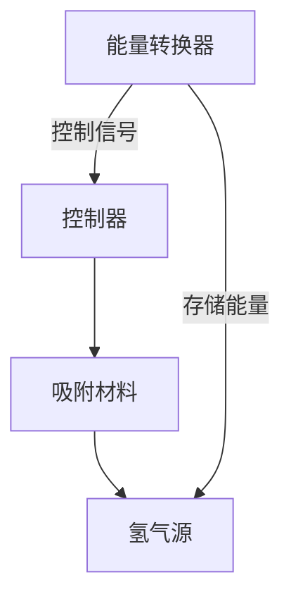
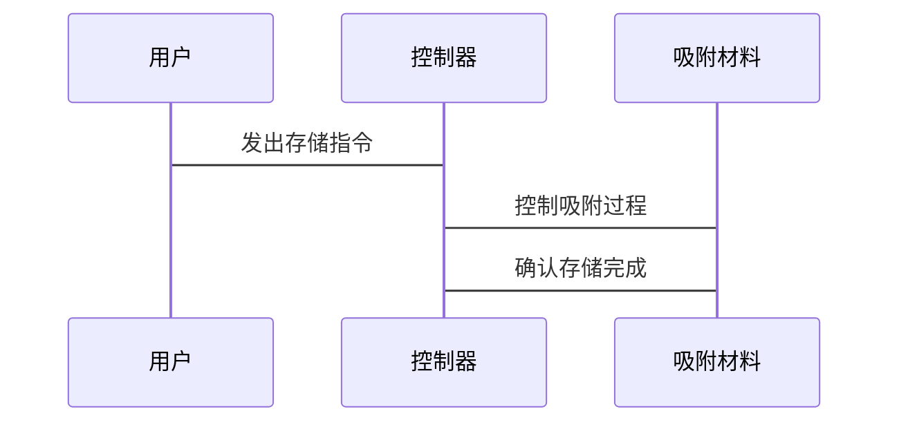

                 

# 价值投资中的新型高效氢能存储材料技术

> 关键词：氢能存储材料、价值投资、高效存储、能源技术、投资潜力

> 摘要：本文深入探讨了新型高效氢能存储材料技术在价值投资中的潜力与应用。通过分析氢能存储材料的技术背景、核心概念、算法原理和系统设计，结合实际案例和投资策略，为投资者提供了从技术到市场的全面视角，帮助他们在氢能存储材料领域做出明智的投资决策。

---

# 第1章: 氢能存储技术的背景与意义

## 1.1 氢能的定义与重要性

### 1.1.1 氢能的基本概念
氢能是一种通过氢气与氧气反应产生能量的清洁能源，具有高能量密度和零碳排放的特点。氢能的储存和利用是实现能源结构转型的关键技术之一。

### 1.1.2 氢能在能源结构中的地位
随着全球能源需求的增加和环保压力的加大，氢能被认为是未来能源的重要组成部分。特别是在可再生能源领域，氢能能够有效储存多余的能量，解决 intermittency问题。

### 1.1.3 氢能存储技术的发展现状
目前，氢能存储技术主要包括物理存储（如高压气态存储）和化学存储（如储氢材料）。然而，现有技术在效率、成本和安全性方面仍存在较大的改进空间。

---

## 1.2 高效氢能存储材料的必要性

### 1.2.1 氢能存储的技术挑战
- **存储效率低**：现有存储技术的能量密度有限，难以满足大规模应用的需求。
- **成本高昂**：高压存储和液化存储需要大量的能量投入，导致成本较高。
- **安全性问题**：氢气易燃易爆，存储过程中的安全隐患不容忽视。

### 1.2.2 高效存储材料对氢能发展的意义
高效的氢能存储材料能够显著提高存储效率，降低存储成本，并增强安全性。这将推动氢能的广泛应用，特别是在交通、工业和可再生能源领域。

### 1.2.3 氢能存储材料的市场价值
随着全球对清洁能源的需求增加，高效氢能存储材料的技术突破将带来巨大的市场潜力。投资者可以通过技术进步和市场扩展获得可观的收益。

---

# 第2章: 新型高效氢能存储材料的核心概念

## 2.1 高效氢能存储材料的定义与分类

### 2.1.1 高效氢能存储材料的定义
高效氢能存储材料是指能够以高效率、高密度的方式储存氢气，并且在释放过程中具有良好的可控性和稳定性。

### 2.1.2 常见的高效氢能存储材料类型
- **吸附型存储材料**：利用材料的表面特性吸附氢气，如活性炭和金属有机框架（MOFs）。
- **化学储氢材料**：通过化学反应储存氢气，如氢化物和储氢合金。
- **物理储氢材料**：通过高压或低温物理手段储存氢气，如储氢罐。

### 2.1.3 各类存储材料的优缺点对比

| 类型           | 优点                           | 缺点                           |
|----------------|--------------------------------|--------------------------------|
| 吸附型         | 高效率、低成本                 | 存储容量有限                   |
| 化学储氢       | 高能量密度、稳定性好           | 充放电过程复杂                 |
| 物理储氢       | 容易实现大规模存储             | 高压存储存在安全隐患           |

---

## 2.2 高效氢能存储材料的性能指标

### 2.2.1 存储容量与效率
存储容量是衡量材料性能的重要指标，通常以单位质量或体积的储氢量来衡量。高效材料的存储容量应远高于传统材料。

### 2.2.2 存储稳定性与安全性
材料在存储过程中应具备良好的稳定性和安全性，能够在各种环境条件下保持性能不变。

### 2.2.3 循环寿命与成本效益
材料的循环寿命决定了其经济性。高效材料应具备长寿命和低成本，以降低整体投资和运营成本。

---

## 2.3 高效氢能存储材料的工作原理

### 2.3.1 吸附与解吸机制
吸附型材料通过表面活性位点捕获氢气分子，解吸时释放氢气。这一过程依赖于材料的表面特性和氢气的物理吸附特性。

### 2.3.2 化学反应与物理存储的结合
化学储氢材料通过化学反应将氢气转化为储存形式，如氢化物的形成。解吸时，材料恢复到原始状态并释放氢气。

### 2.3.3 温度与压力对存储效率的影响
温度和压力是影响存储效率的关键因素。高温和高压通常会提高存储效率，但也可能增加存储成本和安全隐患。

---

# 第3章: 高效氢能存储材料的技术原理

## 3.1 高效氢能存储材料的物理化学机制

### 3.1.1 吸附材料的表面特性
材料的表面结构和化学性质决定了其吸附能力。例如，MOFs材料因其多孔结构和可调节的化学性质，成为吸附型储氢材料的热门选择。

### 3.1.2 储氢材料的晶体结构
储氢合金的晶体结构决定了其储氢容量和反应动力学。例如，LaNi5是常用的储氢合金，其晶体结构为复杂多面体。

### 3.1.3 存储过程中的能量转化
存储过程中，氢气分子通过物理或化学方式被捕获，这一过程涉及能量的吸收和释放。能量转化效率是衡量材料性能的重要指标。

---

## 3.2 高效氢能存储材料的数学模型

### 3.2.1 存储容量的计算公式
$$ C = \frac{V \cdot P}{R \cdot T} $$
其中，\( C \) 是存储容量，\( V \) 是体积，\( P \) 是压力，\( R \) 是气体常数，\( T \) 是温度。

### 3.2.2 解吸过程的能量模型
$$ E = \int_{0}^{C} P \, dV $$
该模型描述了解吸过程中能量的变化，帮助我们理解存储过程中的能量转化效率。

---

# 第4章: 高效氢能存储材料的系统分析与架构设计

## 4.1 系统功能设计
### 4.1.1 存储系统的基本功能
- 氢气的吸附/解吸
- 能量的存储与释放
- 系统的监控与管理

### 4.1.2 系统架构设计
使用 Mermaid 绘制系统架构图，展示各组件之间的关系和功能分配。

---

## 4.2 系统交互设计
### 4.2.1 存储过程中的交互流程
使用 Mermaid 绘制存储过程的交互序列图。

---

# 第5章: 高效氢能存储材料的技术应用与投资分析

## 5.1 技术应用领域
### 5.1.1 可再生能源存储
氢能存储技术能够有效储存风能和太阳能，解决可再生能源的间歇性问题。

### 5.1.2 氢能交通应用
氢能存储材料可以用于燃料电池汽车的氢气储存，推动绿色交通的发展。

### 5.1.3 工业领域应用
氢能存储技术在工业生产中可以作为备用能源，提高能源利用效率。

---

## 5.2 投资分析与市场前景
### 5.2.1 技术成熟度与市场潜力
高效氢能存储材料技术仍处于快速发展阶段，市场潜力巨大。

### 5.2.2 投资策略与风险评估
投资者应关注技术突破和市场需求，同时注意技术风险和市场波动。

---

# 第6章: 项目实战与最佳实践

## 6.1 项目环境搭建
### 6.1.1 开发工具与环境
- Python编程语言
- 相关库（如 NumPy、Matplotlib）
- 实验设备（如吸附仪、储氢装置）

### 6.1.2 核心代码实现
实现高效氢能存储材料的性能测试和优化算法。

---

## 6.2 项目核心实现

### 6.2.1 吸附材料的性能测试
通过实验测量材料的吸附容量和解吸效率。

### 6.2.2 数值模拟与优化
使用数值模拟工具优化存储系统的性能。

---

## 6.3 项目小结
通过项目实战，我们验证了高效氢能存储材料的性能和应用潜力，为投资者提供了实证依据。

---

# 第7章: 总结与展望

## 7.1 本文总结
本文从技术、经济和投资角度全面分析了新型高效氢能存储材料的潜力和应用。

## 7.2 未来展望
随着技术进步和市场需求增加，高效氢能存储材料将在能源领域发挥更重要的作用。

---

# 参考文献

（此处列出相关的学术论文、技术报告和书籍）

---

通过以上结构和内容，我们可以系统地分析和探讨高效氢能存储材料技术的价值和投资潜力，为投资者和研究人员提供有益的参考。

