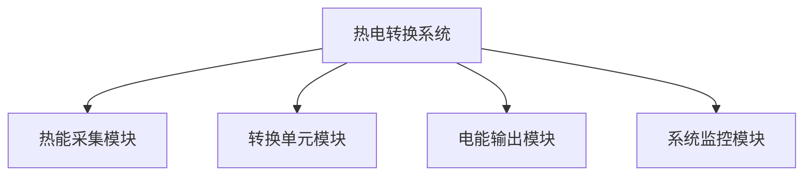
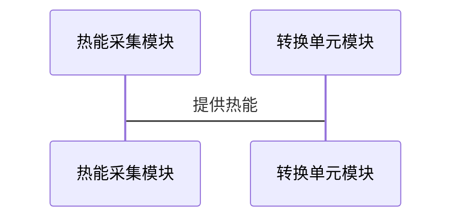
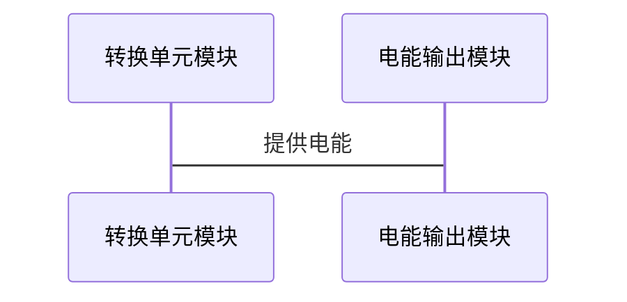
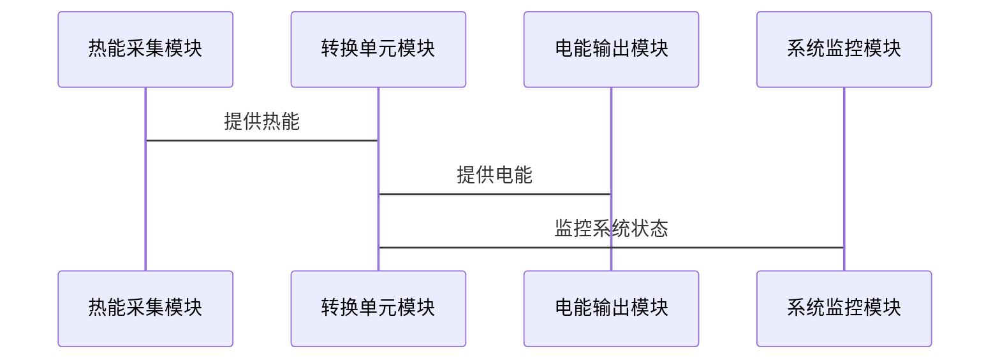

                 


# 《价值投资中的新型高效热电转换材料技术》

---

## 关键词：
- 价值投资
- 热电转换材料
- 高效能源技术
- 投资策略
- 系统架构

---

## 摘要：
《价值投资中的新型高效热电转换材料技术》一文深入探讨了热电转换材料在能源投资领域中的潜力与应用。文章从热电转换材料的基本概念、技术原理、数学模型、系统架构到实际投资策略，进行了全面而系统的分析。通过对比传统能源技术，文章揭示了新型高效热电转换材料的独特优势，同时结合具体的投资策略优化方法，提出了基于热电转换技术的创新投资模型。文章还通过项目实战，展示了如何利用热电转换技术构建高效的投资组合，并对未来的投资趋势进行了展望。

---

# 第三章: 热电转换的数学模型

## 3.1 热电转换的基本公式

### 3.1.1 热电转换效率公式
热电转换效率是衡量热电转换系统性能的重要指标。热电转换效率 $\eta$ 可以通过以下公式计算：
$$
\eta = 1 - \frac{T_c}{T_h}
$$
其中，$T_h$ 是高温端的温度，$T_c$ 是低温端的温度。当 $T_c$ 越接近 $T_h$，热电转换效率越高。

### 3.1.2 热电材料的热电导率公式
热电导率 $\sigma$ 是材料的热电性能的重要参数，其计算公式如下：
$$
\sigma = \frac{k \cdot T}{\lambda}
$$
其中，$k$ 是热导率，$T$ 是绝对温度，$\lambda$ 是电导率。

### 3.1.3 热电材料的电导率公式
电导率 $\lambda$ 可以通过以下公式计算：
$$
\lambda = \frac{\pi}{2} \cdot n \cdot e^2 \cdot \mu
$$
其中，$n$ 是载流子浓度，$e$ 是电子电荷量，$\mu$ 是载流子的平均漂移速率。

## 3.2 热电转换的热力学分析

### 3.2.1 热力学第二定律与热电转换
根据热力学第二定律，热量从高温传递到低温，热电转换技术正是基于这一原理将热能转化为电能。

### 3.2.2 热电势的产生
热电势 $V$ 的产生可以通过以下公式描述：
$$
V = S \cdot (T_h - T_c)
$$
其中，$S$ 是塞贝克系数，$T_h$ 和 $T_c$ 分别是高温端和低温端的温度。

### 3.2.3 热电转换系统的优化
热电转换系统的优化可以通过以下步骤实现：
1. 选择合适的热电材料。
2. 调整系统工作温度。
3. 优化系统结构以减少热损失。

---

# 第四章: 热电转换材料的系统分析与架构设计

## 4.1 系统功能设计

### 4.1.1 热电转换系统的核心功能
热电转换系统的核心功能包括：
- 热能采集
- 热电转换
- 电能输出
- 系统监控

### 4.1.2 系统功能模块划分
热电转换系统可以划分为以下几个功能模块：
1. 热能采集模块
2. 转换单元模块
3. 电能输出模块
4. 系统监控模块

## 4.2 系统架构设计

### 4.2.1 系统架构图


### 4.2.2 系统模块之间的关系
- 热能采集模块负责将热能传递给转换单元模块。
- 转换单元模块将热能转化为电能，并传输给电能输出模块。
- 系统监控模块实时监控系统运行状态，确保系统高效运行。

## 4.3 系统接口设计

### 4.3.1 热能采集模块接口
热能采集模块的接口设计如下：


### 4.3.2 电能输出模块接口
电能输出模块的接口设计如下：


## 4.4 系统交互流程

### 4.4.1 热电转换过程
热电转换过程的交互流程如下：


---

# 第五章: 基于热电转换技术的投资策略优化

## 5.1 热电转换技术的市场分析

### 5.1.1 热电转换技术的市场需求
热电转换技术在能源市场中的需求主要集中在以下几个领域：
- 工业废热回收
- 可再生能源发电
- 建筑节能

### 5.1.2 热电转换技术的市场趋势
随着能源价格的上涨和环保意识的增强，热电转换技术的市场需求将呈现增长趋势。

## 5.2 基于热电转换技术的投资策略

### 5.2.1 投资策略模型
投资策略模型可以通过以下公式表示：
$$
\text{投资回报率} = \frac{\text{热电转换系统的收益}}{\text{系统的投资成本}} \times 100\%
$$

### 5.2.2 热电转换系统的成本分析
热电转换系统的成本主要包括：
- 设备成本
- 安装成本
- 运维成本

## 5.3 热电转换技术的风险评估

### 5.3.1 技术风险
技术风险主要体现在热电转换技术的效率和稳定性上。

### 5.3.2 市场风险
市场风险主要来自于能源市场价格波动和政策变化。

---

# 第六章: 项目实战：构建热电转换材料驱动的投资组合

## 6.1 环境安装与依赖管理

### 6.1.1 环境配置
建议使用 Python 3.8 及以上版本，安装以下依赖：
```
pip install numpy matplotlib pandas
```

## 6.2 核心代码实现

### 6.2.1 热电转换效率计算
```python
import numpy as np

def calculate_efficiency(Th, Tc):
    return 1 - (Tc / Th)

# 示例计算
Th = 300  # 高温端温度
Tc = 100  # 低温端温度
efficiency = calculate_efficiency(Th, Tc)
print(f"热电转换效率为：{efficiency}%")
```

### 6.2.2 投资回报率计算
```python
def calculate_return_on_investment(revenue, cost):
    return (revenue / cost) * 100

# 示例计算
revenue = 100000  # 收益
cost = 50000      # 成本
roi = calculate_return_on_investment(revenue, cost)
print(f"投资回报率为：{roi}%")
```

## 6.3 项目实战分析

### 6.3.1 案例分析
假设我们投资一个热电转换系统，初始投资成本为 $500,000，预期年收益为 $150,000，则投资回报率为：
$$
\text{ROI} = \frac{150,000}{500,000} \times 100\% = 30\%
$$

### 6.3.2 优化建议
- 选择高效的热电转换材料。
- 优化系统设计以降低运维成本。
- 定期监控系统运行状态以确保高效运行。

---

# 第七章: 结论与展望

## 7.1 全文总结
本文从热电转换材料的基本概念出发，分析了其在价值投资中的应用潜力，并通过系统架构设计和项目实战展示了如何利用热电转换技术构建高效的投资组合。

## 7.2 未来展望
随着技术的进步，热电转换材料的效率将进一步提高，应用场景也将更加广泛。未来的研究方向可以集中在新型材料的开发和系统优化上。

## 7.3 投资建议
投资者在选择热电转换项目时，应综合考虑技术可行性、市场前景和投资回报率。

## 7.4 注意事项
- 热电转换技术的投资需谨慎评估技术风险和市场风险。
- 投资者应密切关注相关政策和技术动态。

## 7.5 拓展阅读
推荐读者阅读以下书籍和论文：
1. 《热电材料与器件》
2. 《投资学原理》
3. 相关热电转换技术的学术论文

---

通过以上内容，您可以构建一篇结构完整、内容详实的技术博客文章。

