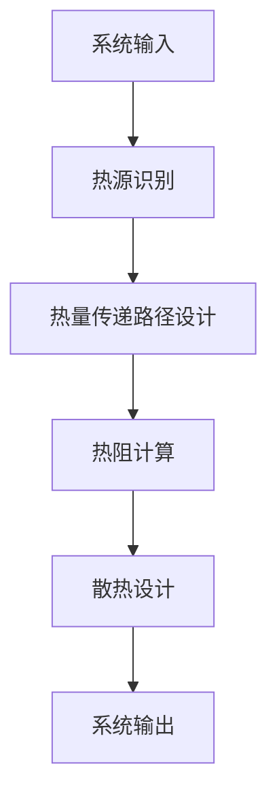

                 

# 价值投资中的新型高效热管理材料技术前景

> 关键词：热管理材料、价值投资、技术创新、市场分析、投资策略

> 摘要：本文从热管理材料的技术原理、市场价值和投资潜力三个方面，系统分析了新型高效热管理材料在价值投资中的前景。通过结合热管理材料的技术特点与价值投资的核心理念，探讨了热管理材料技术的创新趋势、市场需求和经济价值，为投资者提供了基于技术分析的投资策略和决策支持。

---

## 第一部分: 价值投资中的新型高效热管理材料技术背景

### 第1章: 热管理材料的基本概念与价值投资背景

#### 1.1 热管理材料的基本概念
热管理材料是一种用于控制和优化热量传递的材料，其核心作用是通过高效的热传导、热散失或热隔离，确保电子设备、新能源装置等在工作过程中保持适宜的温度环境。热管理材料的关键属性包括热导率、热阻、导电性、耐高温性、机械强度和稳定性等。

热管理材料广泛应用于以下几个领域：
1. **半导体行业**：芯片制造和封装中的散热材料。
2. **新能源领域**：电动汽车电池、光伏组件的热管理。
3. **智能设备**：智能手机、笔记本电脑等电子设备的散热解决方案。

#### 1.2 价值投资的基本概念
价值投资是一种以基本面分析为基础的投资策略，强调以低于市场价值的价格买入具有长期竞争优势的资产。其核心理念包括：
1. **安全边际**：买入价格低于内在价值。
2. **长期视角**：关注企业的长期盈利能力。
3. **竞争优势**：选择具有技术壁垒和市场领导地位的企业。

#### 1.3 热管理材料与价值投资的结合
热管理材料技术的进步为多个高增长行业提供了关键支持，例如半导体、新能源和智能设备等。这些行业的快速发展为热管理材料供应商带来了巨大的市场机会。从价值投资的角度来看，具有技术创新能力和市场领导地位的热管理材料企业，往往具备较高的投资价值。

---

### 第2章: 新型高效热管理材料技术的背景与现状

#### 2.1 热管理材料技术的发展历程
传统的热管理材料（如金属和陶瓷）在热导率和热阻方面存在局限性，难以满足现代高科技设备对高效散热的需求。近年来，新型热管理材料（如碳纳米管、石墨烯、氮化铝等）的出现，显著提升了热管理效率，并拓展了应用领域。

#### 2.2 热管理材料技术在科技中的应用现状
1. **半导体行业**：芯片制程的不断缩小导致散热需求急剧增加，新型热管理材料成为解决芯片散热问题的关键。
2. **新能源领域**：电动汽车电池的热管理对电池性能和安全性至关重要。
3. **智能设备**：高功耗电子设备的散热需求推动了新型热管理材料的应用。

#### 2.3 热管理材料技术的未来发展趋势
1. **材料创新**：开发更高热导率、更低热阻的新型材料。
2. **技术整合**：将热管理技术与人工智能、物联网等技术结合，实现智能化热管理。
3. **市场扩展**：随着5G、人工智能和新能源技术的普及，热管理材料的需求将进一步增长。

---

## 第二部分: 热管理材料技术的核心概念与价值分析

### 第3章: 热管理材料技术的核心原理与数学模型

#### 3.1 热传导机制
热传导是热量从高温区域向低温区域传递的过程。热管理材料通过优化材料结构和成分，降低热阻并提高热导率。以下是热传导的关键公式：

1. **傅里叶定律**：描述热量传递速率：
   $$ q = -k A \frac{dT}{dx} $$
   其中，$q$ 是热流，$k$ 是热导率，$A$ 是面积，$\frac{dT}{dx}$ 是温度梯度。

2. **热阻公式**：描述材料对热量传递的阻碍作用：
   $$ R = \frac{L}{k A} $$
   其中，$R$ 是热阻，$L$ 是材料厚度，$k$ 是热导率，$A$ 是面积。

#### 3.2 热管理技术的数学模型
热管理系统的数学模型通常包括热流方程、热传导方程和多物理场耦合方程。以下是一个简化的热传导模型：
$$ \frac{\partial T}{\partial t} = \alpha \nabla^2 T + Q $$
其中，$\alpha$ 是热扩散系数，$Q$ 是热源项。

---

### 第4章: 价值投资中的热管理材料技术评估模型

#### 4.1 技术性能评估指标
1. **热导率**：材料的热导率越高，散热性能越好。
2. **热阻**：热阻越低，热量传递效率越高。
3. **稳定性**：材料在高温或复杂环境下的性能稳定性。

#### 4.2 市场需求评估指标
1. **市场规模**：热管理材料在目标市场的容量和增长潜力。
2. **竞争格局**：现有企业的市场占有率和技术优势。
3. **政策支持**：政府对新材料产业的政策支持力度。

#### 4.3 经济效益评估指标
1. **成本结构**：材料的生产成本和研发投入。
2. **利润率**：企业的盈利能力和发展潜力。
3. **投资回报周期**：投资的回收期和潜在收益。

---

### 第5章: 热管理材料技术与价值投资的协同效应

#### 5.1 技术创新对投资价值的影响
1. **技术创新提升市场竞争力**：新型热管理材料的技术创新可以显著提升企业的市场地位。
2. **技术壁垒降低投资风险**：高技术壁垒的企业通常具有较高的护城河，投资风险较低。
3. **技术创新推动市场增长**：技术创新可以拓展新的市场空间，带来更高的投资回报。

#### 5.2 价值投资对技术创新的推动作用
1. **资金支持**：价值投资者的资金支持可以为企业技术创新提供充足的研发投入。
2. **战略支持**：投资者的长期视角和战略规划可以为企业技术创新提供方向性支持。
3. **资源整合**：投资者的资源网络可以帮助企业获取技术、人才和市场资源。

---

## 第三部分: 热管理材料技术的系统分析与投资策略

### 第6章: 热管理材料技术的系统架构设计

#### 6.1 热管理系统的功能模块划分
热管理系统通常包括以下几个功能模块：
1. **热源识别**：识别系统中的主要热源。
2. **热量传递路径设计**：优化热量传递路径，降低热阻。
3. **热散失设计**：通过散热器、冷却系统等实现热量的有效散失。

#### 6.2 热管理系统的架构设计
以下是热管理系统的架构设计图：

---

### 第7章: 价值投资中的热管理技术评估流程

#### 7.1 项目背景分析与需求识别
1. **行业背景分析**：分析热管理材料在目标行业的应用前景。
2. **技术需求识别**：明确项目的技术痛点和需求。
3. **市场潜力评估**：评估项目的市场容量和增长潜力。

#### 7.2 技术可行性评估与风险分析
1. **技术成熟度评估**：评估技术的成熟度和可行性。
2. **技术壁垒分析**：分析技术的专利情况和竞争壁垒。
3. **技术风险评估**：评估技术在实际应用中的潜在风险。

#### 7.3 投资收益预测与决策支持
1. **收益预测模型**：基于技术评估和市场分析，建立收益预测模型。
2. **投资回报分析**：分析投资的回报周期和潜在收益。
3. **决策支持**：结合技术评估和市场分析，提供投资决策支持。

---

## 第8章: 项目实战与投资策略

### 8.1 实战案例分析
以某新能源汽车电池热管理项目为例，分析热管理材料的技术选择和投资价值。

#### 8.1.1 项目背景
新能源汽车电池的热管理对电池性能和安全性至关重要。高温会导致电池寿命下降，甚至引发安全问题。

#### 8.1.2 技术选择
选择新型热管理材料（如石墨烯复合材料）作为电池散热解决方案。

#### 8.1.3 投资分析
1. **市场规模**：新能源汽车市场快速增长，电池热管理需求旺盛。
2. **技术优势**：石墨烯复合材料具有高热导率和良好的稳定性。
3. **投资回报**：预计投资回报周期为3-5年，具有较高的投资价值。

---

### 8.2 投资策略总结

1. **关注技术创新**：优先选择具有技术创新能力的企业。
2. **评估市场潜力**：分析目标市场的容量和增长潜力。
3. **控制投资风险**：通过技术壁垒和竞争分析，降低投资风险。

---

## 第9章: 最佳实践与投资建议

### 9.1 最佳实践
1. **长期视角**：关注企业的长期发展潜力。
2. **技术驱动**：选择以技术创新为核心的热管理材料企业。
3. **风险管理**：建立完善的风险评估和控制机制。

### 9.2 投资建议
1. **配置优质标的**：将热管理材料领域的优质企业纳入投资组合。
2. **关注政策支持**：关注政府对新材料产业的政策支持。
3. **分散投资风险**：通过多元化投资降低风险。

---

## 第10章: 结语

热管理材料技术作为现代科技的重要组成部分，其发展和应用对多个行业具有深远影响。从价值投资的角度来看，具有技术创新能力和市场领导地位的热管理材料企业，往往具备较高的投资价值。投资者应结合技术评估和市场分析，制定科学的投资策略，抓住热管理材料技术带来的投资机遇。

---

通过以上章节的分析，我们可以清晰地看到热管理材料技术在价值投资中的重要性。技术的进步和市场的扩展为投资者提供了丰富的投资机会，而价值投资的长期视角和基本面分析方法，也为热管理材料技术的应用和发展提供了有力支持。

